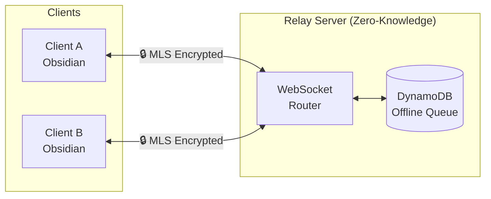
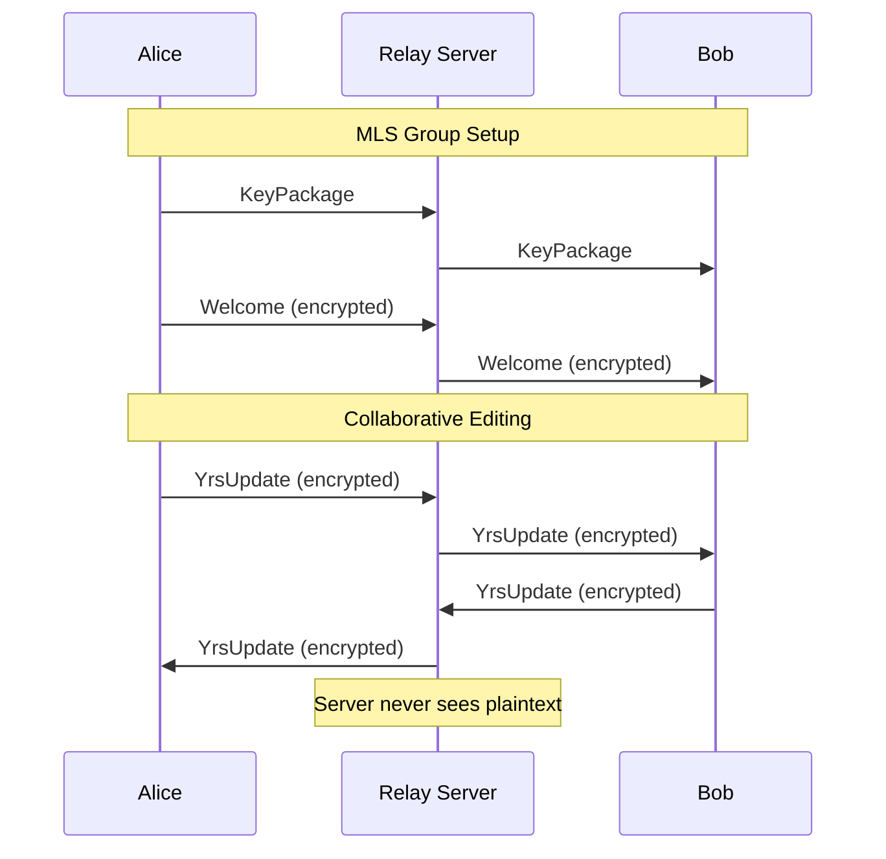

# Obsidian E2E

End-to-end encrypted collaborative document editing using Yrs CRDT and MLS.

## Overview

Obsidian E2E enables real-time collaborative editing with true end-to-end encryption. The relay server never has access to plaintext content - it only routes encrypted messages between clients.

### Key Features

- **Zero-Knowledge Architecture**: Server cannot decrypt content
- **Real-time Collaboration**: CRDT-based conflict-free synchronization
- **Forward Secrecy**: MLS protocol ensures past messages remain secure
- **Offline Support**: Message queuing for disconnected clients

## Architecture





| Component | Description |
|-----------|-------------|
| **Yrs CRDT** | Conflict-free replicated data types for concurrent editing |
| **MLS (RFC 9420)** | End-to-end encryption with forward secrecy |
| **WebSocket Relay** | Routes encrypted messages (zero-knowledge) |
| **DynamoDB** | Persistent storage for offline message queuing |

## Getting Started

### Prerequisites

- Rust 1.75+
- Docker & Docker Compose
- (Optional) AWS CLI for deployment

### Installation

```bash
git clone https://github.com/cajias/obsidian-ee.git
cd obsidian-ee
cargo build --workspace
```

## Usage

### Development Commands

```bash
# Build all crates
cargo build --workspace

# Run unit tests
cargo test --workspace

# Run linters (clippy, fmt, code analysis)
cargo lint

# Format code
cargo fmt --all
```

### E2E Testing

```bash
# Start Docker environment and run E2E tests
cargo xtask e2e

# Or manually:
cargo xtask up       # Start Docker services
cargo xtask down     # Stop Docker services
```

### CLI Client

```bash
# Connect to a relay server
cargo run -p collab-cli -- connect ws://localhost:8080

# With a specific user ID
cargo run -p collab-cli -- connect ws://localhost:8080 --user alice
```

## Project Structure

```
obsidian-ee/
├── crates/
│   ├── collab-core/     # Yrs CRDT + MLS encryption
│   ├── collab-relay/    # WebSocket relay server
│   ├── collab-cli/      # CLI client
│   └── collab-proto/    # Protocol message types
├── docker/              # Docker Compose for local dev
├── tests/e2e-tests/     # End-to-end tests
├── xtask/               # Development task runner
└── infra/               # AWS CDK infrastructure
```

### Crates

| Crate | Description |
|-------|-------------|
| `collab-core` | Core encryption (MLS) and CRDT (Yrs) integration |
| `collab-relay` | WebSocket server for message routing |
| `collab-cli` | Command-line client for testing |
| `collab-proto` | Shared protocol message definitions |

## Development

### TDD Workflow

This project follows strict Test-Driven Development:

1. **RED**: Write a failing test first
2. **GREEN**: Write minimal code to pass
3. **REFACTOR**: Clean up while keeping tests green

### Code Quality

Strict linting thresholds are enforced:

- Function length: max 50 lines
- Nesting depth: max 3 levels
- Cognitive complexity: max 25

Run `cargo lint` before committing.

## Security

### Threat Model

- **Relay server is untrusted**: All content is encrypted client-side
- **Forward secrecy**: Compromised keys don't expose past messages
- **Group membership**: MLS handles secure key distribution

### What's Protected

- Document content (encrypted with MLS)
- Edit operations (encrypted CRDT updates)

### What's NOT Protected

- Metadata: document IDs, user IDs, timestamps
- Traffic analysis: message sizes and timing

## License

[Add license here]

## Contributing

[Add contributing guidelines here]
