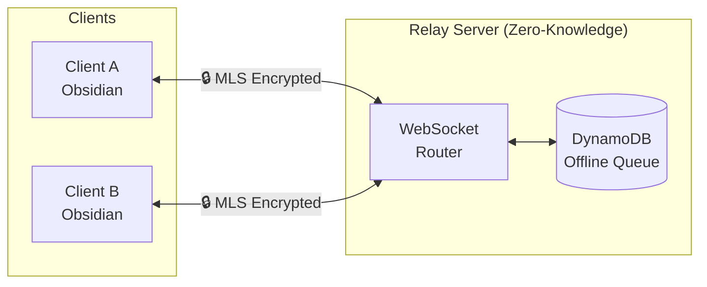
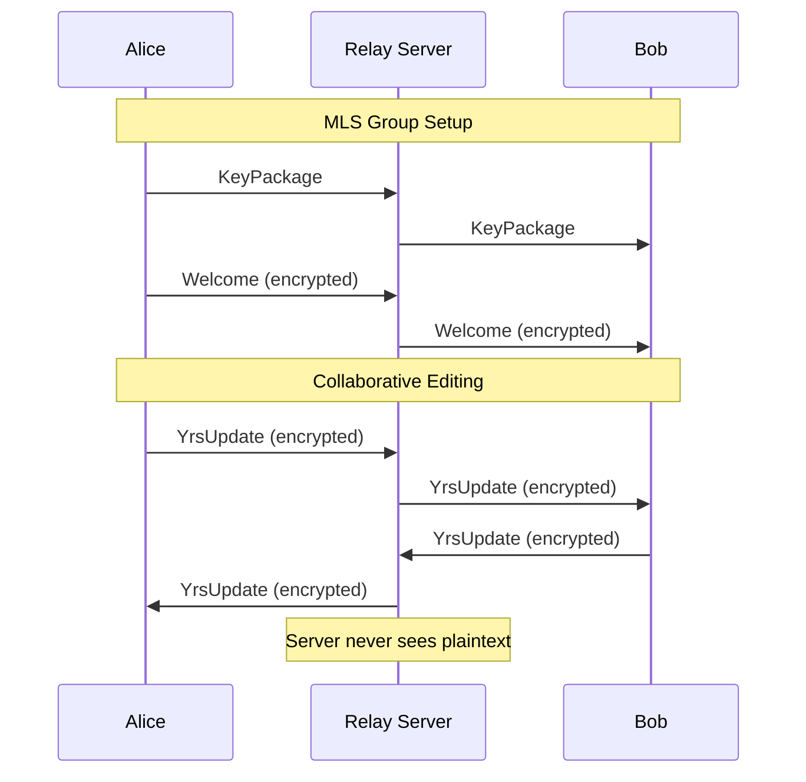

```
 ██████╗ ██████╗ ███████╗██╗██████╗ ██╗ █████╗ ███╗   ██╗      ███████╗███████╗
██╔═══██╗██╔══██╗██╔════╝██║██╔══██╗██║██╔══██╗████╗  ██║      ██╔════╝██╔════╝
██║   ██║██████╔╝███████╗██║██║  ██║██║███████║██╔██╗ ██║█████╗█████╗  █████╗
██║   ██║██╔══██╗╚════██║██║██║  ██║██║██╔══██║██║╚██╗██║╚════╝██╔══╝  ██╔══╝
╚██████╔╝██████╔╝███████║██║██████╔╝██║██║  ██║██║ ╚████║      ███████╗███████╗
 ╚═════╝ ╚═════╝ ╚══════╝╚═╝╚═════╝ ╚═╝╚═╝  ╚═╝╚═╝  ╚═══╝      ╚══════╝╚══════╝
```

<p align="center"><em>End-to-end encrypted collaborative editing with Yrs CRDT and MLS</em></p>

<p align="center">
  
  <a href="https://github.com/cajias/obsidian-ee/actions"></a>
  <a href="https://github.com/cajias/obsidian-ee/stargazers"></a>
  
</p>

**obsidian-ee is end-to-end encrypted, real-time collaborative document editing where the server never sees your plaintext.** It pairs [Yrs](https://github.com/y-crdt/y-crdt) conflict-free replicated data types (CRDTs) for concurrent editing with [MLS](https://www.rfc-editor.org/rfc/rfc9420) (RFC 9420) for forward-secret group encryption. The relay server is a dumb, zero-knowledge router: it shuttles ciphertext between clients and queues messages for the offline, and nothing more.

<table>
<tr><td><b>Zero-knowledge relay</b></td><td>The WebSocket relay routes encrypted payloads only — it can never decrypt document content or edit operations.</td></tr>
<tr><td><b>CRDT sync (Yrs)</b></td><td>Conflict-free replicated data types merge concurrent edits from every peer without a central authority or merge conflicts.</td></tr>
<tr><td><b>MLS group encryption</b></td><td>RFC 9420 Messaging Layer Security provides forward secrecy and secure group-membership changes via key packages, invites, and welcomes.</td></tr>
<tr><td><b>Offline queueing</b></td><td>DynamoDB-backed message queue holds encrypted updates for disconnected clients until they reconnect.</td></tr>
<tr><td><b>CLI workflow</b></td><td><code>collab-cli</code> drives the full keygen → invite → join → edit lifecycle, plus a self-contained <code>demo</code> of the encryption flow.</td></tr>
<tr><td><b>WASM-ready core</b></td><td>The crypto/CRDT core compiles to <code>wasm32-unknown-unknown</code> for in-browser and Obsidian-plugin clients.</td></tr>
</table>

## Installation

obsidian-ee is a Rust workspace built from source (not published to crates.io). You need **Rust 1.75+** and, for end-to-end testing, **Docker & Docker Compose**.

```bash
git clone https://github.com/cajias/obsidian-ee.git
cd obsidian-ee
cargo build --workspace
```

Install just the CLI binary onto your `PATH`:

```bash
cargo install --path crates/collab-cli
```

## Usage

The `collab-cli` client implements the full encrypted-collaboration lifecycle. Every command prints structured JSON to stdout.

```bash
# Run the self-contained demo of the full E2E encryption flow
cargo run -p collab-cli -- demo

# 1. Owner initializes a document
cargo run -p collab-cli -- init my-doc --user alice

# 2. A new member generates a key package
cargo run -p collab-cli -- keygen --user bob --output bob.json

# 3. Owner creates an invite from that key package
cargo run -p collab-cli -- invite my-doc --user alice --keypackage bob.json --output invite.json

# 4. The member joins using the invite
cargo run -p collab-cli -- join invite.json --user bob
```

Command shape:

```text
$ collab-cli --help
CLI for collaborative document editing with E2E encryption

Usage: collab-cli <COMMAND>

Commands:
  init     Initialize a new collaborative document as the owner
  keygen   Generate a key package for joining a document
  invite   Create an invite for a new member (run by document owner)
  join     Join an existing collaborative document
  connect  Connect to a relay and collaborate (not yet implemented)
  demo     Run a demo showing the full E2E encryption flow
```

> Note: the `connect` subcommand (live relay collaboration) is scaffolded but **not yet implemented**.

_Demo: run `vhs docs/demo.tape` after install to regenerate the terminal cast._

## Configuration

Logging is controlled via the standard `RUST_LOG` environment variable (parsed by `tracing-subscriber`'s `EnvFilter`):

```bash
RUST_LOG=debug cargo run -p collab-cli -- demo
```

The relay's offline queue uses the AWS SDK and resolves credentials from the standard AWS environment (`AWS_REGION`, `AWS_ACCESS_KEY_ID`, etc.) or your `~/.aws` config.

## How it works





The workspace is organized as focused crates:

```
obsidian-ee/
├── crates/
│   ├── collab-core/      # Yrs CRDT + MLS encryption, document management
│   ├── collab-relay/     # Zero-knowledge WebSocket relay server
│   ├── collab-cli/       # Command-line client (keygen/invite/join/demo)
│   ├── collab-proto/     # Shared protocol message types
│   ├── collab-wasm/      # WASM bindings for browser/Obsidian clients
│   └── collab-watcher/   # Filesystem watcher for local document sync
├── docker/               # Docker Compose for local dev
├── plugins/obsidian-ee/  # Obsidian plugin
├── tests/e2e-tests/      # End-to-end tests
└── xtask/                # Development task runner (cargo xtask ...)
```

| Crate | Description |
|-------|-------------|
| `collab-core` | Core MLS encryption, Yrs CRDT, and document registry/state management |
| `collab-relay` | WebSocket server that routes encrypted messages (zero-knowledge) |
| `collab-cli` | Command-line client for the encrypted-collaboration lifecycle |
| `collab-proto` | Shared protocol message definitions |
| `collab-wasm` | `wasm32` bindings exposing the core to JS/browser clients |
| `collab-watcher` | Filesystem watcher for syncing local document changes |

### What's protected vs. what's not

- **Protected:** document content and edit operations — encrypted client-side with MLS; the relay is untrusted.
- **Forward secrecy:** compromised keys do not expose past messages.
- **Not protected:** metadata (document IDs, user IDs, timestamps) and traffic analysis (message sizes, timing).

## Development

```bash
# Build all crates
cargo build --workspace

# Run unit tests
cargo test --workspace

# Lint (alias for `cargo xtask lint` — clippy + fmt + code analysis)
cargo lint

# Format
cargo fmt --all
```

End-to-end testing spins up the Docker environment via the `xtask` runner:

```bash
cargo xtask e2e     # Start Docker services and run the E2E suite
cargo xtask up      # Start Docker services only
cargo xtask down    # Stop Docker services
```

The project follows strict TDD (RED → GREEN → REFACTOR) with enforced complexity limits: functions ≤ 50 lines, nesting ≤ 3 levels. `unsafe_code` is denied workspace-wide. Run `cargo lint` before committing.

## License

No `LICENSE` file is present in this repository. The workspace `Cargo.toml` declares `license = "MIT"`, but until a `LICENSE` file is added the licensing terms are not formally established — treat usage rights as undetermined and check with the maintainers.
