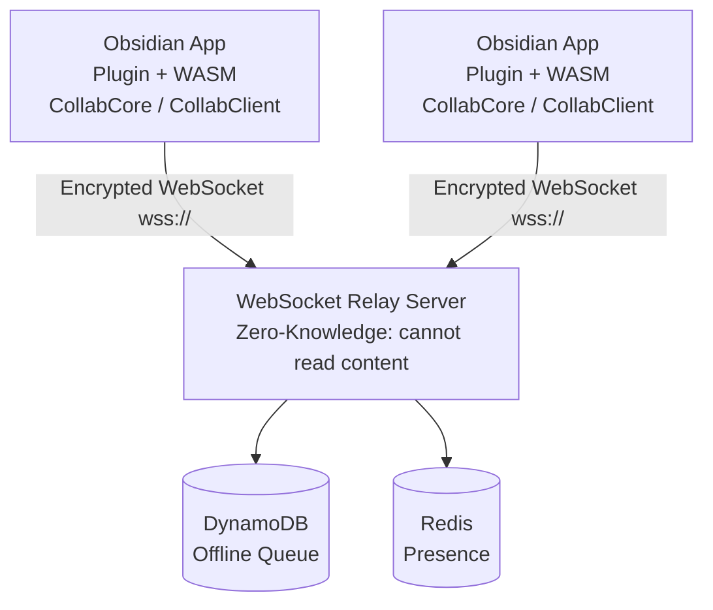
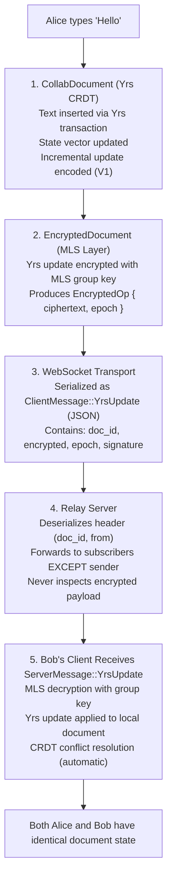
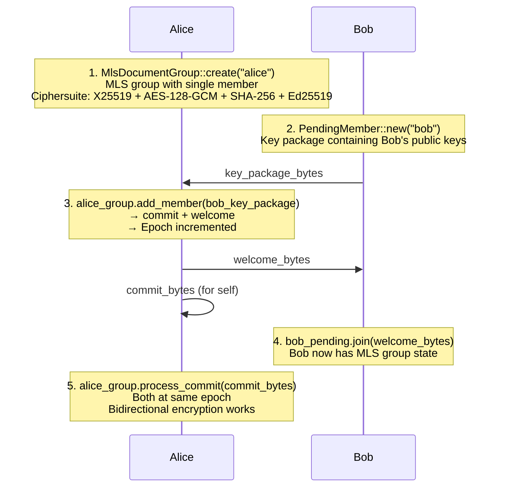
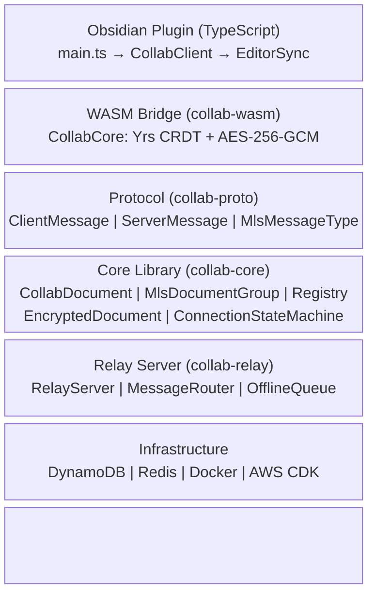
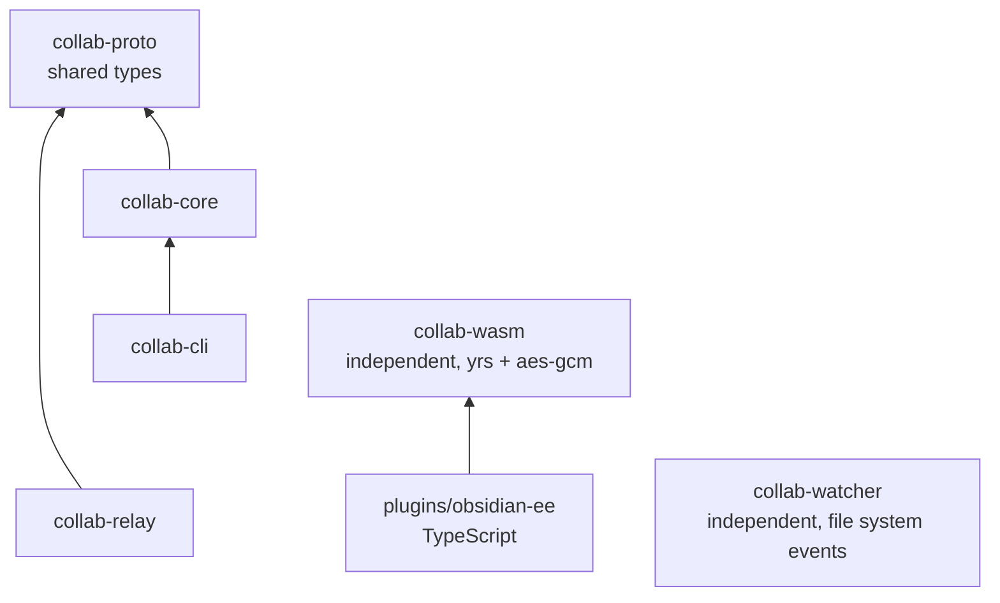
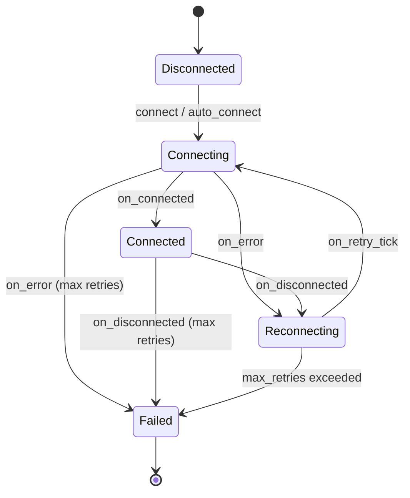
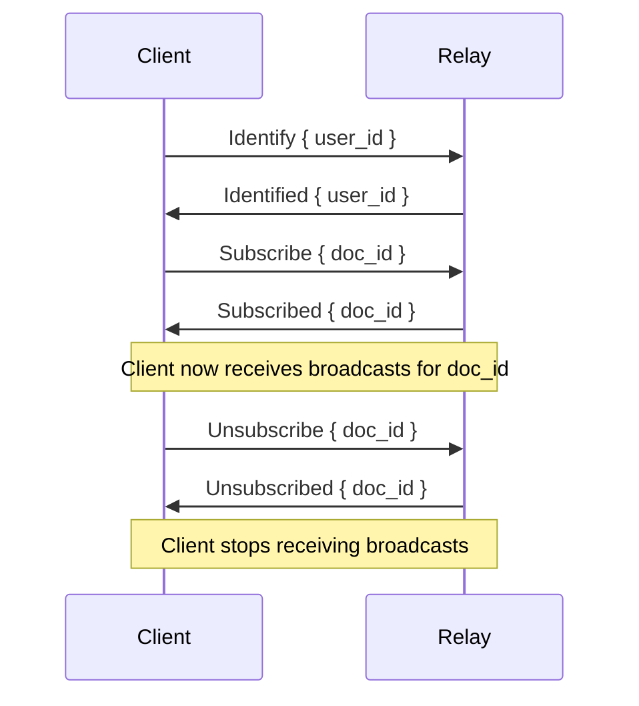

# Architecture Overview

Obsidian E2E is an end-to-end encrypted collaborative document editing system. It combines **Yrs CRDT** for conflict-free real-time editing with **MLS (RFC 9420)** for group encryption, routed through a **zero-knowledge WebSocket relay**.

## System Context



## Core Principles

1. **Zero-Knowledge Relay**: The relay server routes encrypted messages without access to plaintext content, encryption keys, or document state.
2. **CRDT Convergence**: All replicas eventually converge to identical content regardless of message ordering, using Yrs conflict-free replicated data types.
3. **Forward Secrecy**: MLS epoch-based key ratcheting ensures past messages remain secure even if current keys are compromised.
4. **Minimal Trust**: Clients perform all encryption/decryption locally. The server is untrusted infrastructure.

## Workspace Crates

| Crate | Role | Key Dependencies |
|-------|------|-----------------|
| `collab-core` | CRDT engine + MLS encryption | `yrs`, `openmls` |
| `collab-relay` | WebSocket relay server | `tokio`, `tokio-tungstenite` |
| `collab-proto` | Protocol message types | `serde`, `serde_json` |
| `collab-cli` | Reference CLI client | `clap`, `collab-core` |
| `collab-wasm` | WASM bindings for browser | `wasm-bindgen`, `yrs`, `aes-gcm` |
| `collab-watcher` | File system watcher | `notify`, `tokio` |
| `e2e-tests` | Integration test suite | All crates |

Additionally:
- `xtask` - Development task runner (`cargo xtask lint`, `cargo xtask e2e`)
- `plugins/obsidian-ee` - TypeScript Obsidian plugin

## Data Flow

### Collaborative Edit (Happy Path)



### MLS Group Formation



## Layer Architecture



## Module Dependency Graph



Key design decisions:
- `collab-proto` has zero business logic; it's a pure type definition crate
- `collab-core` and `collab-relay` depend on `collab-proto` but not on each other
- `collab-wasm` uses a simplified encryption model (AES-256-GCM) as an MVP, with MLS planned for future integration
- `collab-watcher` is fully independent and communicates via async channels

## Connection State Machine

The `ConnectionStateMachine` in `collab-core` manages WebSocket lifecycle:



Retry policy: exponential backoff (1s, 2s, 4s, 8s, 16s) with 25% jitter, capped at 30s, max 5 retries.

The state machine is **synchronous and runtime-agnostic** - it emits `ConnectionAction` values that the caller executes, making it testable and portable across async runtimes.

## Relay Broadcast Behavior

The relay server acts as a **zero-knowledge message broker**, forwarding encrypted payloads between clients subscribed to the same document. It never inspects message content.

### Subscription Lifecycle



- A client must `Identify` before subscribing. Attempts to subscribe or send messages without identification receive an `Error { code: NotIdentified }` response.
- A client can subscribe to multiple documents simultaneously.
- On disconnect, the relay automatically unregisters the client and removes it from all subscriptions.

### Fan-Out Semantics

When the relay receives a `YrsUpdate` or `MlsHandshake` message for a document:

1. **Sender exclusion**: The message is routed to all subscribers of that document **except the sender**. This prevents echo effects where a client receives its own edits back.
2. **Message cloning**: Each recipient gets a clone of the `ServerMessage`. This is necessary because the relay uses per-client unbounded channels for delivery.
3. **Best-effort delivery**: If sending to a particular client fails (e.g., channel closed due to disconnect), the failure is logged as a warning but does **not** block delivery to other clients.
4. **Delivery count**: `route_message()` returns the number of clients that were successfully sent the message, which can be used for observability.

### Document Isolation

Messages are scoped to their document ID. Subscribers to `doc-A` never receive messages sent to `doc-B`, even if the same users are subscribed to both. The `MessageRouter` maintains a `HashMap<DocumentId, HashSet<UserId>>` to enforce this isolation.

### Message Flow

```
Client A (sender)
  │
  ├─ ClientMessage::YrsUpdate { doc_id, encrypted, epoch, signature }
  │
  ▼
RelayServer::handle_yrs_update()
  │
  ├─ Wraps as ServerMessage::YrsUpdate { doc_id, from, encrypted, epoch, signature }
  │
  ▼
MessageRouter::route_message(doc_id, from_user, message)
  │
  ├─ Reads subscribers for doc_id
  ├─ Filters out sender (from_user)
  ├─ For each remaining subscriber:
  │   ├─ Looks up ClientHandle (mpsc::UnboundedSender)
  │   ├─ Clones the message
  │   └─ Sends via channel (or logs warning on failure)
  │
  ▼
Client B, C, ... (receivers)
  └─ Receive ServerMessage::YrsUpdate via their WebSocket
```

The same flow applies to `MlsHandshake` messages used during MLS group formation and key exchange.

## Document Registry

The `DocumentRegistry` manages multiple concurrent documents:

```rust
DocumentRegistry
└── documents: HashMap<DocumentId, DocumentEntry>
    └── DocumentEntry { CollabDocument, DocumentMetadata }
        └── DocumentMetadata { created_at, last_modified, custom: HashMap }
```

The registry manages `CollabDocument` instances with metadata tracking (creation time, last-modified time, custom key-value pairs). It supports create, get, close, and open (restore from serialized state) operations. Encrypted document support via `EncryptedDocument` integration is planned.
