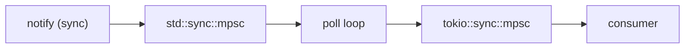

# Crate Guide

Detailed documentation for each crate in the obsidian-ee workspace.

---

## collab-core

The foundation crate providing CRDT collaborative editing and MLS encryption.

### Modules

#### `document.rs` - Yrs CRDT Wrapper

Wraps the Yrs library to provide a document editing interface.

```rust
pub struct CollabDocument {
    id: DocumentId,
    doc: Doc,              // Yrs document (CRDT engine)
    text: TextRef,         // Reference to "content" text container
    state_vector: Vec<u8>, // Tracks sync state for incremental updates
}
```

**Key operations:**
- `new(id)` - Create empty document
- `insert(index, text)` / `delete(index, len)` - Edit operations
- `get_content()` - Read current text
- `encode_state()` - Serialize full document state (for persistence)
- `encode_update()` - Get incremental changes since last call (for sync)
- `apply_update(bytes)` - Merge remote changes via CRDT

The state vector enables efficient incremental sync: rather than sending the entire document on every edit, only the delta since the last known state is transmitted.

#### `mls.rs` - MLS Group Management

Manages MLS (RFC 9420) encryption groups for document-level E2E encryption.

**Types:**

```rust
pub struct MlsDocumentGroup {
    user_id: String,
    group: MlsGroup,
    crypto: OpenMlsRustCrypto,
    signature_keys: SignatureKeyPair,
    credential_with_key: CredentialWithKey,
}

pub struct PendingMember {
    user_id: String,
    crypto: OpenMlsRustCrypto,
    signature_keys: SignatureKeyPair,
    credential_with_key: CredentialWithKey,
    key_package_bytes: Vec<u8>,
}
```

**Group lifecycle:**
1. `MlsDocumentGroup::create(user_id)` - Create group (returns group + key package)
2. `PendingMember::new(user_id)` - Generate join request
3. `group.add_member(key_package)` - Owner adds member (returns commit + welcome)
4. `pending.join(welcome)` - Joiner processes welcome message
5. `group.process_commit(commit)` - Existing members process commit
6. `group.encrypt(data)` / `group.decrypt(data)` - Symmetric encryption within group

#### `encryption.rs` - Encrypted Document

Combines `CollabDocument` and `MlsDocumentGroup` into a single abstraction.

```rust
pub struct EncryptedDocument {
    doc: CollabDocument,
    mls: MlsDocumentGroup,
}

pub struct EncryptedOp {
    pub ciphertext: Vec<u8>,
    pub epoch: u64,
}

pub struct Invite {
    pub doc_id: DocumentId,
    pub welcome: Vec<u8>,
    pub commit: Vec<u8>,
    pub epoch: u64,
    pub relay_url: String,
}
```

This is the primary type for encrypted collaborative editing. It exposes the same editing API as `CollabDocument` but wraps updates in MLS encryption.

#### `registry.rs` - Multi-Document Management

Manages multiple documents (both plain and encrypted) with metadata tracking.

```rust
pub struct DocumentRegistry {
    documents: HashMap<DocumentId, DocumentEntry>,
}

pub struct DocumentEntry {
    document: CollabDocument,
    metadata: DocumentMetadata,
}

pub struct DocumentMetadata {
    created_at: SystemTime,
    last_modified: SystemTime,
    custom: HashMap<String, String>,
}
```

The registry manages `CollabDocument` instances with associated metadata. It supports create, get, close, and open (restore from state) operations, along with custom metadata and timestamp tracking.

#### `connection.rs` - Connection State Machine

A synchronous, runtime-agnostic state machine for WebSocket connection management.

```rust
pub enum ConnectionState {
    Disconnected, Connecting, Connected,
    Reconnecting { attempt: u32 }, Failed { reason: String },
}

pub enum ConnectionAction {
    Connect { relay_url: String },
    WaitAndRetry { delay: Duration, attempt: u32 },
    IdentifyAndSubscribe { user_id: UserId, doc_id: DocumentId },
    GiveUp { reason: String },
    DoNothing,
}
```

The state machine emits actions; the caller decides how to execute them. This design makes it portable across tokio, async-std, or synchronous contexts, and trivially testable.

### Dependencies

```toml
yrs = "0.21"
openmls = { version = "0.7", default-features = false }
openmls_rust_crypto = "0.4"
openmls_basic_credential = "0.4"
serde = "1.0"
bincode = "1.3"
thiserror = "2.0"
tracing = "0.1"
```

---

## collab-relay

Zero-knowledge WebSocket relay server.

### Modules

#### `relay.rs` - Server Core

```rust
pub struct RelayServer {
    clients: Arc<RwLock<HashMap<String, ClientHandle>>>,
    router: Arc<MessageRouter>,
    shutdown_tx: broadcast::Sender<()>,
}

pub struct ClientHandle {
    tx: UnboundedSender<ServerMessage>,
}
```

Each client connection runs in its own tokio task. The connection handler:
1. Upgrades TCP to WebSocket via `tokio_tungstenite::accept_async()`
2. Creates an MPSC channel for outbound messages
3. Spawns a writer task to forward channel messages to WebSocket
4. Enters a `tokio::select!` loop handling incoming messages and shutdown signals

#### `routing.rs` - Message Router

```rust
pub struct MessageRouter {
    subscriptions: Arc<RwLock<HashMap<DocumentId, HashSet<UserId>>>>,
    clients: Arc<RwLock<HashMap<UserId, ClientHandle>>>,
}
```

Document-based pub/sub routing. When a message arrives for a document, the router:
1. Looks up all users subscribed to that document
2. Excludes the sender (echo prevention)
3. Sends to each subscriber's channel
4. Returns the count of successful deliveries

#### `storage.rs` - Offline Queue

```rust
pub struct OfflineQueue {
    inner: Arc<RwLock<Inner>>,  // queues + insertion order
    max_per_user: usize,  // Default: 1000
    max_users: usize,     // Default: 10_000
}
```

In-memory FIFO queue per user. Memory is bounded on two axes: `max_per_user` caps the messages retained for a single user (oldest dropped first), and `max_users` caps the number of distinct users tracked (the least-recently-inserted user's queue is evicted when full). A DynamoDB-backed implementation is planned, behind a future Cargo feature; it is not wired up today.

### Configuration

| Env Variable | Default | Description |
|-------------|---------|-------------|
| `RELAY_ADDR` | `0.0.0.0:8080` | Listen address |
| `RELAY_AUTH_TOKEN` | - | Optional bearer token. If set, clients must present a matching `token` in their `Identify` message or the relay replies with an `Unauthorized` error. If unset, authentication is disabled. |
| `RELAY_MAX_CONNECTIONS` | `10000` | Global cap on concurrent connections |
| `RUST_LOG` | `collab_relay=debug` | Log level |

### Dependencies

```toml
tokio = "1.41" (full)
tokio-tungstenite = "0.24"
serde = "1.0"
serde_json = "1.0"
collab-proto = { path = "../collab-proto" }
tracing = "0.1"
```

The relay is a zero-knowledge, in-memory router with no AWS or Redis dependencies. Beyond the offline-queue bounds, it enforces connection-id-scoped sessions (a fresh `Identify` for the same `user_id` takes over and closes the prior session, while a stale connection cannot evict a newer one), bounded per-client channels (slow consumers are disconnected), a 1 MiB max WebSocket frame size, a global connection cap, and per-document / document-count subscription caps.

---

## collab-proto

Minimal protocol definition crate (120 lines). Contains only data types and serialization - zero business logic.

### Types

- `ClientMessage` - 5 variants (Identify, Subscribe, Unsubscribe, YrsUpdate, MlsHandshake). `Identify` carries an optional `token` field for relay authentication.
- `ServerMessage` - 6 variants (Identified, Subscribed, Unsubscribed, YrsUpdate, MlsHandshake, Error)
- `MlsMessageType` - 4 variants (KeyPackage, Welcome, Commit, Application)
- `ErrorCode` - includes `Unauthorized`, `LimitExceeded`, and `SessionReplaced`
- `Invite` - Out-of-band invitation structure (`doc_id`, `welcome`, `commit`, `epoch`, `relay_url`)
- `DocumentId` / `UserId` - Type aliases for `String`

All enums use `#[serde(tag = "type", rename_all = "snake_case")]` for JSON serialization.

### Dependencies

```toml
serde = "1.0"
serde_json = "1.0"
```

---

## collab-cli

Reference CLI client demonstrating collab-core usage.

### Commands

| Command | Description |
|---------|-------------|
| `init` | Create a new encrypted document as owner |
| `keygen` | Generate MLS key package for joining |
| `invite` | Create invitation for a new member |
| `join` | Join a document using an invitation |
| `connect` | Connect to relay server (basic implementation) |
| `demo` | Run in-memory E2E encryption demonstration |

### Demo Flow

The `demo` command runs a complete collaborative editing scenario in-memory:

```
Alice creates document "demo-doc"
  -> Bob generates key package
  -> Alice creates invite for Bob
  -> Bob joins with invite
  -> Alice inserts "Hello from Alice!"
  -> Bob receives encrypted update, decrypts
  -> Bob inserts " Hi from Bob!"
  -> Alice receives encrypted update, decrypts
  -> Final: "Hello from Alice! Hi from Bob!"
```

### Dependencies

```toml
collab-core, collab-proto (local)
tokio, tokio-tungstenite, futures
clap, serde, serde_json, anyhow, thiserror, tracing
```

---

## collab-wasm

WASM bindings for the Obsidian plugin. Exposes `collab-core`'s MLS engine to the browser as the sole crypto surface — there is no separate browser encryption path. The wrappers in `src/mls.rs` are thin owning wrappers over `collab-core` value types; no crypto lives in this crate.

### API (`#[wasm_bindgen]`)

Free function:

| Function | Description |
|----------|-------------|
| `generate_key_package(user_id)` | Generate a `WasmPendingMember` (key package) so an owner can invite this member. Returns `Result<WasmPendingMember, JsError>`. |

`WasmPendingMember` — a member awaiting a Welcome; consumed by value on `WasmEncryptedDocument.join` (single-use).

| Member | Description |
|--------|-------------|
| `key_package` (getter) | The key package bytes to send to the owner |

`WasmInvite` — the Welcome for a new member plus the commit for existing members.

| Member | Description |
|--------|-------------|
| `from_welcome(doc_id, welcome)` | Reconstruct an invite on the joiner's side from its LOCALLY-TRUSTED `doc_id` and the `welcome` bytes read off the wire. `doc_id` MUST be the joiner's own trusted value, never a field from the inbound frame. |
| `welcome` (getter) | Welcome message bytes |
| `commit` (getter) | Commit message bytes (for existing members) |
| `doc_id` (getter) | Document id |
| `epoch` (getter) | MLS epoch |

`WasmEncryptedOp` — an encrypted CRDT update to ship over the relay.

| Member | Description |
|--------|-------------|
| `ciphertext` (getter) | Encrypted update bytes |
| `epoch` (getter) | MLS epoch the ciphertext was produced under |

`WasmEncryptedDocument` — an end-to-end-encrypted collaborative document (Yrs CRDT + MLS).

| Method | Description |
|--------|-------------|
| `create(doc_id, user_id)` | Create a document and its MLS group as owner. Returns `Result<Self, JsError>`. |
| `join(invite, pending)` | Join via a Welcome; consumes `pending` by value (single-use). Returns `Result<Self, JsError>`. |
| `create_invite(key_package)` | Owner adds a member; returns a `WasmInvite` (welcome + commit) |
| `process_commit(commit)` | Existing members apply a commit to advance epoch |
| `insert(index, text)` | Insert text |
| `delete(index, len)` | Delete text range |
| `get_content()` | Read current text content |
| `get_encrypted_update()` | Encrypt pending CRDT changes; returns a `WasmEncryptedOp` |
| `apply_encrypted_update(ciphertext, epoch)` | Decrypt and apply a remote encrypted update |
| `epoch` (getter) | Current MLS epoch |

### Error Handling

WASM errors surface as real JavaScript `Error` objects (via `JsError`), carrying the underlying `collab-core` error message.

### Build

```bash
./scripts/build-wasm.sh
# Output: plugins/obsidian-ee/src/wasm/collab_wasm_bg.wasm
```

### Dependencies

```toml
collab-core = { path = "../collab-core" }
yrs = "0.21"
wasm-bindgen = "0.2"
```

On the `wasm32` target, `collab-core` is pulled in with its `wasm-clock` feature so MLS gets a browser-compatible clock source (see `docs/design/2026-07-29-issue-28-wasm-mls-surface.md`).

---

## collab-watcher

File system watcher for Obsidian vault directories.

### API

```rust
pub struct VaultWatcher { ... }

pub struct WatcherConfig {
    pub extensions: HashSet<String>,  // Default: ["md"]
    pub debounce: Duration,           // Default: 200ms
}

pub enum VaultEventKind { Created, Modified, Deleted }

pub struct VaultEvent {
    pub kind: VaultEventKind,
    pub path: PathBuf,  // Relative to vault root
}
```

### Architecture

Uses a bridge pattern to connect the synchronous `notify` crate to tokio:



The watcher:
1. Recursively scans the vault directory at startup to build a known-files set
2. Watches for filesystem events with debouncing (200ms default)
3. Classifies events as Created, Modified, or Deleted using the known-files set
4. Filters by file extension (default: `.md` only)
5. Reports paths relative to the vault root

### Dependencies

```toml
notify = "7.0"
notify-debouncer-mini = "0.5"
tokio = "1.41"
thiserror = "2.0"
tracing = "0.1"
```

---

## xtask

Development task runner invoked via `cargo xtask <command>`.

| Command | Description |
|---------|-------------|
| `lint` | Run `cargo fmt --check` + `cargo clippy` + optional complexity analysis |
| `e2e` | Start Docker Compose, run E2E tests, stop Docker |
| `docker-up` / `up` | Start local development environment |
| `docker-down` / `down` | Stop local development environment |

The `lint` command is aliased as `cargo lint` via `.cargo/config.toml`.
