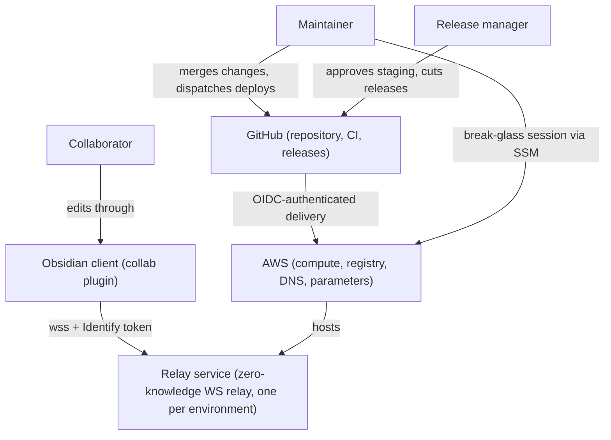
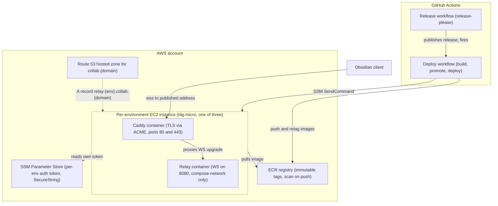
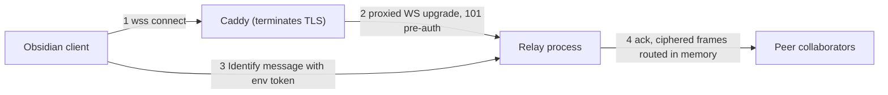

# 01 — Logic Design

This document gives the intent stated in 00 — Project Intent its logical shape: the actors, behaviors, domain rules, decisions, and architecture of the hosted relay service and its delivery path. Technology choices are named here; the concrete repository layout and build steps belong to the documents that follow, per the intent-versus-implementation split of [[hld-documents-separate-solution-intent-from-implementation-detail-via-a-fixed-7]].

## Context / problem

One component of the encrypted-collaboration system needs hosting: the **relay service**, a zero-knowledge WebSocket relay. It speaks raw WebSocket on a single port, carries no HTTP surface, performs no TLS in-process, and keeps all routing state in memory. That last property imposes a hard constraint every later choice must respect: **exactly one relay instance per environment**, because two instances would each hold half the sessions and never route between them.

A production-ready container image build for the relay already exists. Everything around it is missing:

- **A hosted home.** Today a collaboration session survives only as long as someone keeps a relay running by hand (see the "Why this matters" section of 00 — Project Intent). There is no environment, no stable address, no TLS endpoint a client can trust.
- **A safe release path.** The repository has no versioned releases, no tags, no deploy automation, and no infrastructure definition. There is no way to say "production runs v0.1.1", and no way to put v0.1.0 back when v0.1.1 misbehaves.

This document designs both: three hosted environments (dev, staging, prod) on AWS, and a promotion pipeline from GitHub that carries a change from merge to a running environment under the tenets of 00 — Project Intent.

## Goals

Every goal cites the tenet (T#) or success criterion (SC#) it serves, per the "Derivation & trace rule" section of 00 — Project Intent.

- **G1** — Every environment serves collaborators at a stable published `wss://` address, admitting sessions that present that environment's valid token and refusing all others (T1, SC1, SC2).
- **G2** — Every artifact running in a shared environment traces to a versioned build, and production runs only deliberately cut releases, promoted byte-identical (T2, SC3).
- **G3** — Promotion to prod happens only via a cut release; promotion to staging pauses for a named reviewer (T4, SC5).
- **G4** — The delivery path holds zero long-lived credentials: every credential it uses is issued per occasion via OIDC and expires on its own (T3, SC4).
- **G5** — A prior release restores to production in under fifteen minutes by re-deploying an existing image digest, with no rebuild (T5, SC6).
- **G6** — The maintainer has audited, on-demand emergency access to every instance while only the web ports stay open to the network (T5, T3).
- **G7** — Total running cost stays fixed and predictable at roughly thirty-two US dollars a month, under the forty-dollar ceiling (T6, SC7).

## Actors & use cases

The three human actors are defined in the "Who it's for" section of 00 — Project Intent and reused verbatim: the **maintainer**, the **collaborator**, and the **release manager**.

| Use case | Actor | Behavior |
|---|---|---|
| Collaborate through `relay-<env>` | collaborator | Connect an Obsidian client to `wss://relay-<env>.collab.<domain>/`, present the environment's token in the Identify message, and relay an encrypted editing session end to end (SC1). |
| Deploy dev on demand | maintainer | Dispatch the deploy workflow at the dev environment from any ref; it builds (if needed) and deploys with no approval gate. |
| Approve staging | release manager | A staging dispatch pauses at the environment's required reviewer; the named approval resumes the deploy (SC5). |
| Cut a release to reach prod | release manager | Merge the release PR that release-please maintains; the published release fires the prod deploy of that exact version (SC3, SC5). |
| Roll back | maintainer | Dispatch the deploy workflow at prod from a prior release tag; the existing image digest re-deploys with no rebuild (SC6). |
| Break-glass | maintainer | Open an interactive, IAM-audited SSM Session Manager session to an instance, with port 22 closed (T5, T3). |

## Capabilities / behavior

What the deployed system does:

- **Serves encrypted sessions.** Per environment, a Caddy reverse proxy terminates TLS with an auto-provisioned Let's Encrypt certificate and passes WebSocket upgrades to the relay process. The relay admits a session only after a valid Identify token and then routes ciphered frames among peers entirely in memory (T1).
- **Builds once, promotes by name.** Every merge can produce one immutable arm64 image tagged by commit. A release never rebuilds: it adds the version tag to the digest that already exists, so the bytes validated in dev and staging are the bytes prod runs (T2).
- **Promotes under graded gates.** Dev deploys on demand with no gate. Staging pauses until a named reviewer approves. Prod fires only on a published release: the release cut is the gate (T4). Rollback is the same machinery pointed at an existing release tag: the prior digest re-deploys with no rebuild (T5).
- **Deploys by command, not by login.** The deploy job assumes an environment-scoped OIDC role and issues a single SSM run-command to that environment's instance; the deploy script on the instance logs into the registry, fetches the environment's auth token, pulls the image, and restarts the compose unit (T3).
- **Proves itself after every change.** The pipeline verifies each deploy with a WebSocket-upgrade health check expecting HTTP 101, with a retry budget generous enough to cover first-deploy DNS propagation and certificate issuance (SC1).
- **Treats a deploy as a brief, honest interruption.** Stop-then-start on a singleton drops in-flight sessions and the in-memory offline queue; clients are expected to reconnect and re-sync. Session continuity across restarts is a named future direction in 00 — Project Intent.

## Domain model

| Noun | Meaning | Rules |
|---|---|---|
| **Environment** | dev, staging, or prod: one instance, one address, one token, one deploy role. | Environments share nothing at runtime; promotion is the only path between them. |
| **Release** | A deliberately cut version `vX.Y.Z` with a changelog, created by the release manager merging the release PR. | Prod runs only releases; a release maps one-to-one to a version tag. |
| **Image digest** | The content hash of a built relay image: the unit of identity for "what runs". | Promotion moves digests, never rebuilds them. |
| **Tag** | A human name (`sha-<commit>`, `vX.Y.Z`) pointing at a digest in the registry. | Tags are immutable: once pushed, a tag never re-points. |
| **Auth token** | The per-environment collaborator credential, stored as a SecureString parameter. | Each environment has its own; an instance can read only its own; clients present it in Identify. |
| **Deploy role** | The OIDC-assumed IAM role that may deploy one environment. | Scoped to its GitHub environment; may command only instances tagged for its environment. |
| **Instance** | The single EC2 machine hosting one environment's Caddy and relay containers. | Exactly one per environment; replaceable from scratch via the infra app plus one deploy. |

**Invariants** — every later document must preserve these:

1. **One relay instance per environment** (in-memory routing admits no peer).
2. **Immutable tags**: a pushed tag is permanent; re-deploying a tag always yields the same digest.
3. **Same-digest promotion**: `sha-<commit>` and `vX.Y.Z` for a released commit name the SAME digest (SC3).
4. **Per-environment token**: one token per environment, readable only by that environment's instance and holders of it (SC2).

## Key design decisions

Each decision names the alternative considered and why it lost, per the decision-ratification role of [[hld-documents-separate-solution-intent-from-implementation-detail-via-a-fixed-7]].

| # | Decision | Alternative considered | Why the alternative lost |
|---|---|---|---|
| D1 | **Caddy on the instance terminates TLS** with auto-provisioned Let's Encrypt certificates. | ALB or NLB with an ACM certificate. | A load balancer adds a per-environment monthly cost rivaling the instance itself (T6) and a second moving part, to front a service that is constitutionally single-instance. Caddy proxies WebSocket upgrades natively and manages certificates itself. |
| D2 | **One EC2 t4g.micro (arm64, AL2023) per environment** running containers under compose. | ECS/Fargate. | An orchestrator's scheduling and replacement machinery adds nothing to a hard singleton, and fights it: an orchestrator wants to run two during a rollover, which the in-memory design forbids. Plain EC2 is the cheapest fixed-cost home (T6, SC7). |
| D3 | **Deploys via SSM SendCommand**; break-glass via SSM Session Manager. | SSH with key pairs. | SSH means port 22 open and long-lived key material: a standing secret and a standing door (T3). SSM commands are IAM-scoped, short-lived, and audited, and Session Manager preserves emergency access with no listening port (T5). |
| D4 | **GitHub OIDC federation** — CI assumes short-lived AWS roles per job. | Stored AWS access keys in repository secrets. | Stored keys are exactly the long-lived credential T3 bans and SC4 audits for. OIDC issues a per-occasion token scoped to repo, ref, and environment. |
| D5 | **release-please drives releases, authenticated with a fine-grained PAT.** | The workflow's default installation token. | Releases created with the default token never fire release-triggered workflows — prod would silently never deploy. The PAT is scoped to this repository and two permissions, and is the one deliberate exception that makes the release event real (T4). |
| D6 | **Immutable registry tags plus retag-based promotion** (a release adds `vX.Y.Z` to the existing digest via a manifest-level retag). | Rebuild the image per environment or per release. | A rebuild yields a different digest, breaking byte-identity between what staging validated and what prod runs (T2, SC3). Retagging costs nothing and preserves the digest by construction. |
| D7 | **Simple release strategy: a version file, a changelog, and a tag.** | The Rust-aware release strategy that rewrites crate versions. | The workspace inherits its version centrally (the Rust strategy's weak spot), the crates are never published, and a release PR that touches the workspace manifest without its lockfile turns CI red under locked builds. The simple strategy keeps release PRs trivially green. |
| D8 | **A delegated Route 53 hosted zone for `collab.<domain>`**, with the apex domain staying at its registrar. | Managing relay DNS records at the registrar. | The delivery path needs to create per-environment records programmatically; registrar DNS has no place in the infra app. One one-time NS delegation gives automation a zone of its own without moving the apex (T5). |

## Architecture (C4)

Three levels, per [[c4-model-describes-systems-at-four-abstraction-levels-context-containers]]: context (where the system sits), containers (what actually runs), components (how the interesting containers are organized inside). Code-level detail is left to the structural design document.

### Level 1 — Context

### Level 2 — Containers

### Level 3 — Components (delivery pipeline and instance)

```mermaid
graph LR
    subgraph pipe["Delivery pipeline (GitHub Actions)"]
        rp["release-please (release PR, version, tag)"]
        meta["Meta step (resolve target env and tags)"]
        build["Build job (native arm64 image build)"]
        retag["Retag step (same-digest promotion to vX.Y.Z)"]
        dep["Deploy job (env-scoped OIDC role, SSM SendCommand, 101 verify)"]
    end
    subgraph host["Relay instance"]
        script["Deploy script (registry login, fetch token, write env file, compose up)"]
        comp["Compose unit (service definitions, restart policy)"]
        cad["Caddy reverse proxy (TLS, WS upgrade pass-through)"]
        rl["Relay process (Identify auth, in-memory routing)"]
    end

    rp -->|"release published"| meta
    meta --> build
    build --> retag
    retag --> dep
    dep -->|"runs"| script
    script --> comp
    comp -->|"starts"| cad
    comp -->|"starts"| rl
    cad -->|"proxies"| rl
```

## Runtime data-flow

The release-to-production lane, end to end:

```mermaid
graph LR
    fx["fix: commit merged to main"] --> rpr["Release PR (version file + changelog)"]
    rpr -->|"release manager merges"| tag["Release published, tag vX.Y.Z"]
    tag --> bld["Build or retag (existing digest gains vX.Y.Z)"]
    bld --> reg["ECR (both tags, one digest)"]
    reg --> cmd["Deploy job sends SSM run-command"]
    cmd --> pull["Instance pulls image, restarts compose unit"]
    pull --> ok["WS-upgrade health check returns 101"]
```

The collaborator session lane:

## Interfaces & data contracts

- **Endpoint scheme**: each environment publishes exactly one address: `wss://relay-<env>.collab.<domain>/`. Caddy owns 80/443; the relay listens only on the private compose network.
- **WebSocket handshake**: the upgrade completes with HTTP **101 before authentication**; admission happens in the **Identify** message after the handshake. Identify with the environment's token → ack and session admission; Identify without a token, or with an invalid one → rejection (SC2). This ordering is what makes an unauthenticated 101 a valid liveness probe without weakening admission.
- **Deploy workflow inputs**: `environment` (dev / staging / prod) and the git `ref` to run from. Dispatching prod at a prior release tag is the rollback path (SC6).
- **Token parameter**: `/relay/<env>/auth-token`, a SecureString in SSM Parameter Store, created at bootstrap by the maintainer and injected into the relay container by the deploy script at deploy time. The token never appears in an image, a workflow log, or a repository variable.
- **Image tag contract**: every built commit carries `sha-<commit>`; every release carries `vX.Y.Z`; for a released commit both tags name the **same digest** (SC3).
- **Environment variable constraint**: `RELAY_SUBSCRIBE_AUTHZ` stays off — pinned explicitly to `0`, not left unset, because the relay's default flips to on with #72. Turning the gate on is a deliberate later step that first requires verifying the deployed clients register a document anchor and present a capability. Admission control lives entirely in the Identify exchange.
- **Health contract**: after every deploy, a WebSocket-upgrade probe against the published address must return 101 within the retry budget; the deploy reports success only then (SC1).

## Runtime & permission model

**Who writes what, and when:**

- The **relay process** holds all session and routing state in memory and writes nothing durable; the zero-knowledge property has no storage to leak (T1).
- The **instance** is written at two moments: deploy time (the deploy script writes the environment file and pulls image layers) and certificate events (Caddy maintains its certificate volume). Between deploys it only reads.
- The **registry** is written only by the build job; immutable tags mean even the writer can never overwrite history (T2).
- The **parameter store** is written only by the maintainer at bootstrap or rotation; the delivery path and instances only read.

**Machine identities (all OIDC-assumed, all short-lived; G4):**

- One **ECR-push role**, deliberately trusted by all refs of the repository: dev builds run from arbitrary branches, and an immutable registry bounds the blast radius of a push. Environment protection lives one layer down, in the deploy roles.
- Three **env-scoped deploy roles**, each trusting only its GitHub environment. Each may send only the run-shell command, only to instances tagged for its environment, and read back the invocation result. The staging role therefore cannot exist in an unapproved run — assuming it requires passing the environment's reviewer gate (SC5).
- Each **instance role** carries SSM management, registry pull, and read access to exactly its own token parameter.

**Human gates:** staging promotion pauses for its named reviewer; production promotion requires the release manager's release cut (T4, SC5). The maintainer's break-glass path is an SSM Session Manager session — IAM-authenticated and logged, with the security group exposing only 80 and 443 (G6).

**Shutdown contract:** the relay handles SIGINT only, so the image declares SIGINT as its stop signal; a compose stop then lands as SIGINT and the process exits gracefully within the stop-grace period instead of being killed at the timeout.

## Open questions

| Question | Owner | Resolved by |
|---|---|---|
| Which apex domain hosts the delegated `collab.<domain>` zone? | maintainer | At bootstrap, before the shared infrastructure deploy; the domain constant is set once in the infra app. |
| How are collaborator tokens distributed to client devices? | maintainer | Before the first collaborator onboards to each environment; tokens exist at bootstrap, the handover channel does not yet. |
| Which AWS region hosts all three environments? | maintainer | At bootstrap, first step of the runbook; everything downstream inherits it. |

## Scope (v1) & future directions

**Scope (v1)** mirrors the "Scope (v1)" section of 00 — Project Intent, realized as: three environments on AWS, each one instance behind its own published address; a release-please-driven versioned release process; a build-once, retag-to-promote delivery path with graded gates; per-environment tokens in the parameter store; post-deploy verification (101 probe plus admit/refuse checks); and the bootstrap runbook, rollback drill, and break-glass procedure, all inside the ~$32/month envelope (SC7).

**Future directions**, each a deliberate v-next candidate:

- **WebSocket keepalive (ping/pong)**: keeping quiet collaborators connected through long pauses; today idle connections are reaped and clients reconnect.
- **Session continuity across deploys**: persisting the offline queue so a restart is invisible to collaborators.
- **Higher availability**: more than one relay instance per environment, once routing state can be shared.
- **Persisted certificate storage across instance replacement**: carrying Caddy's certificate volume forward so a rebuilt instance re-uses its certificate instead of re-issuing against Let's Encrypt duplicate-certificate limits.
- **HTTP/3**: opening UDP 443 alongside TCP once the proxy path warrants it.
- **A second approval gate for production**: a named-human approval on top of the release cut, one click away in the environment settings.
