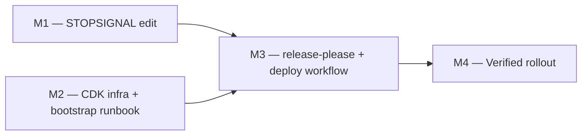

# 03 — Implementation Plan

## Overview

This plan carries the Sequencing line of `docs/aws-deployment-plan.md` — STOPSIGNAL edit first (independent), infra plus runbook, then release-please plus the deploy workflow, then first dev deploy, staging gate check, and canary release — into four milestones arranged per [[structure-implementation-plans-as-sequential-foundation-then-parallel-branches]]: two independent foundations (M1, the Dockerfile edit; M2, the CDK infrastructure and bootstrap runbook) run as parallel branches, converge into M3 (the delivery workflows, which need both the image contract and the provisioned environments), and finish with the sequential cutover M4 (the verified rollout). These are milestones, not tasks: each is a self-contained unit a fresh session executes end to end. The goals of `00 — Project Intent` and `01 — Logic Design` are immutable while this plan executes; every milestone is gated by a named behavior scenario in `04 — BDD Test Plan`, cross-referenced by scenario name.

## Milestone DAG

All four milestones are pending.



## M1 — STOPSIGNAL edit

**Depends on:** none.

**Exit criterion** — the behavior scenario `relay-container-stops-on-sigint` in `04 — BDD Test Plan` runs green. Gate command (Docker-requiring, so it is `#[ignore]`d by default and runs under `make test-e2e`):

```bash
cargo test -p e2e-tests --test relay_container_stop -- --ignored
```

The static `grep -q '^STOPSIGNAL SIGINT'` assertion the ratified gate opened with is unchanged — it is now the test's first assertion, ahead of the build and the stop, per Plan change 6 below.

**Context to load**

- `docs/design/aws-deploy/00-project-intent.md` — Tenets and Success criteria sections.
- `docs/design/aws-deploy/01-logic-design.md` — the Shutdown contract in the Runtime & permission model section (the relay handles SIGINT only).
- `docs/design/aws-deploy/02-structural-design.md` — the `docker/Dockerfile.relay` row of the Module boundaries table.
- `docs/design/aws-deploy/03-implementation-plan.md` (this document) and the `relay-container-stops-on-sigint` scenario in `04 — BDD Test Plan`.
- `docs/aws-deployment-plan.md` — Code-level constraints encoded, and item 3 of Files to create/edit.
- `docker/Dockerfile.relay` — the file to edit.
- `tests/e2e-tests/tests/relay_container_stop.rs` — the gate test: the STOPSIGNAL assertion, the image build, and the run-then-stop reading.

**Deliverable** — `docker/Dockerfile.relay` declares `STOPSIGNAL SIGINT` immediately after `USER appuser`, with a comment noting the relay handles only SIGINT while docker stop defaults to SIGTERM; the image still builds.

**Human-only halt steps** — none. This milestone is fully executable by the agent.

**Plan change (recorded during M1 execution)** — the build prompt's definition of done requires 04's Integration tier to run in CI, but this tree freezes `ci.yml`. Resolution: a new `.github/workflows/integration.yml` carries the tier, seeded with M1's image-build check; M2 and M3 append their synth-assertion and actionlint jobs. `tests/features/` (BDD feature files + step runners, assumed by the build prompt) is likewise new. `ci.yml` remains untouched.

## M2 — CDK infra + bootstrap runbook

**Depends on:** none.

**Exit criterion** — the behavior scenario `cdk-synth-emits-four-stacks` in `04 — BDD Test Plan` runs green. Gate command (it runs the infrastructure app's type check and its CDK assertion suite, which asserts the four stack names `RelayShared`, `Relay-dev`, `Relay-staging`, `Relay-prod` — the ones the deployment plan's Bootstrap runbook deploys — and one relay instance per environment stack):

```bash
make test
```

The earlier synth-then-`grep -c` pair is superseded rather than dropped: both of its readings are assertions inside `infra/test/shared-stack.test.ts` and `infra/test/relay-stack.test.ts`, which reach them from a synthesized template without spending an `npm ci` and a full CLI synth to assert less. See Plan change 6 below.

**Context to load**

- `docs/design/aws-deploy/00-project-intent.md` — Tenets (especially T3, T5, T6) and Success criteria.
- `docs/design/aws-deploy/01-logic-design.md` — Architecture (C4), Key design decisions, and Runtime & permission model sections.
- `docs/design/aws-deploy/02-structural-design.md` — the `infra/` portion of the canonical tree and its Module boundaries rows.
- `docs/design/aws-deploy/03-implementation-plan.md` (this document) and the `cdk-synth-emits-four-stacks` scenario in `04 — BDD Test Plan`.
- `docs/aws-deployment-plan.md` — Files to create/edit item 4, and the entire Bootstrap runbook section.
- `infra/package.json`, `infra/package-lock.json`, `infra/tsconfig.json`, `infra/cdk.json`, `infra/bin/app.ts`, `infra/lib/shared-stack.ts`, `infra/lib/relay-stack.ts`, `infra/assets/docker-compose.yml`, `infra/assets/Caddyfile.tpl` (the env-templated Caddy site block), `infra/assets/deploy.sh.tpl`, `infra/test/*.ts` (new — the specs plus the non-`.test.ts` support modules they import: the `helpers.ts` fixture and the `user-data-golden.ts` / `asset-goldens.ts` golden literals) — the files to create.
- `.github/workflows/integration.yml` (edit) — the M2 CDK-assertions job, per the M1 plan change below.

**Deliverable** — the complete `infra/` CDK TypeScript app: `RelayShared` (ECR, OIDC provider, hosted zone, ECR push role, three env-scoped deploy roles) plus the three `Relay-<env>` stacks (instance, security group, EIP, DNS record, user-data writing the compose unit, Caddy site block, and deploy script from the templated assets), synthesizing clean with explicit account and region.

**Human-only halt steps** — the agent stops and hands each of these to the maintainer (Bootstrap runbook items 1–7 of `docs/aws-deployment-plan.md`):

1. Runbook item 1 — prereqs: Node 20+, AWS CLI, `gh`; pick the region.
2. Runbook item 2 — `cd infra && npm install && npx cdk bootstrap aws://<ACCT>/<REGION>`.
3. Runbook item 3 — set the placeholder constants in `bin/app.ts`: domain, account, region, VPC id, and subnet id (via `aws ec2 describe-vpcs` / `describe-subnets`; availability zone derives from region). The subnet id chosen must live in availability zone `${REGION}a`, or the `AVAILABILITY_ZONE` constant must be set to that subnet's actual AZ. Then `npx cdk deploy RelayShared`; record NS records, ECR URI, role ARNs.
4. Runbook item 4 — at the registrar, add the NS records delegating `collab.<domain>`; verify with `dig NS collab.<domain> +short`.
5. Runbook item 5 — per env: `aws ssm put-parameter --name /relay/<env>/auth-token --type SecureString --value "$(openssl rand -base64 32)"`; save the values, clients need them.
6. Runbook item 6 — `npx cdk deploy Relay-dev Relay-staging Relay-prod`; record instance IDs and hostnames.
7. Runbook item 7 — `gh api` create the dev/staging/prod GitHub environments by the `PUT` that sets each one's deployment branch/tag policy (prod restricted to `v*` tags, staging and dev restricted to `main`) so the per-env deploy-role OIDC trust binds to the intended lane; the named required reviewer on staging only rides in that same `PUT` body, never as a separate later call — that `PUT` replaces the environment, so a body missing a rule clears it.

**Plan change (recorded during M2 execution)** — the ratified gate piped `cdk synth` stdout to `grep -c`, but with multiple stacks and no stack id the CDK CLI (verified on 2.1135.1) writes templates only to `cdk.out/` and prints nothing to stdout, so that pipeline structurally returns 0. The gate now greps the synthesized templates in `cdk.out/` after a `--quiet` synth. The assertion is unchanged: three `AWS::EC2::Instance` resources across the synthesized stack set, and the four stack names from `cdk list`.

**Plan change 2 (recorded during M2 execution)** — the single exit-criterion gate command above doesn't reach 04's Integration- and Unit-tier CDK-assertion rows (SG ports, deploy-role trust scoping, ECR immutability, instance-role token scope), which back R5's and R6's closing checks; M1's plan change already anticipated this ("M2 and M3 append their synth-assertion and actionlint jobs" to `integration.yml`). Scope addition: `infra/test/*.test.ts` (`node:test` + `aws-cdk-lib/assertions`, run via `npm test`) plus a `cdk-assertions` job appended to `.github/workflows/integration.yml`, both folded into the Context to load and files-to-create list above.

**Plan change 3 (recorded while closing #92)** — 01's ratified Environment variable constraint kept `RELAY_SUBSCRIBE_AUTHZ` off *because subscribe-time authorization deadlocks the MLS bootstrap handshake*, and `infra/assets/docker-compose.yml` implemented that by leaving the variable unset. Both halves were invalidated by #72 (PR #91): it moves the gate off `Subscribe` and onto `YrsUpdate` fan-out — a capability-less subscribe is now accepted as handshake-only, so a joiner still receives its Welcome and the deadlock is gone — and it flips the binary's default to **on**, so "unset" would start withholding content from every subscriber that presents no capability, in production, with no diff to this branch. The constraint is unchanged (the gate stays off) but is now expressed as an explicit `RELAY_SUBSCRIBE_AUTHZ=0`, which is off under either default, self-documenting and trivially reversible. Prod behaviour is deliberately unchanged: enabling the gate is a later step that first requires verifying the DEPLOYED clients register a document anchor and present a capability — that client support only landed in #91 and has never run against this environment. `docker/docker-compose.yml` pins the same value as a wire-test fixture rather than a deployment decision, so the compose header's sync note now says the two move independently. Files: `infra/assets/docker-compose.yml`, `docs/design/aws-deploy/01-logic-design.md` (the constraint's reason), `docs/aws-deployment-plan.md`, `docs/build-prompt.md`, and the goldens the asset is embedded in. The goldens caught the change on their own — 56 pass / 10 fail across all five embedding surfaces before regenerating (`npm run regen-goldens` rewrites `template-goldens.ts` and `asset-goldens.ts`; `user-data-golden.ts` is hand-maintained by design) — and the suite is 66/66 after.

## M3 — release-please + deploy workflow

**Depends on:** M1, M2.

**Exit criterion** — the behavior scenario `dev-deploys-without-gate` in `04 — BDD Test Plan` runs green: after the maintainer approves and runs the first dev dispatch (a human-only halt step below), the deployment plan's WS-upgrade check against `relay-dev` returns HTTP `101`. Gate command:

```bash
RELAY_CHECKS=probe RELAY_ENVS=dev RELAY_DOMAIN=<apex domain> bash tests/deployment-verify.sh
```

Expected: exit 0 and `OK (handshake-returns-101): dev answered 101` (the script retries within the ~2-minute budget the deploy workflow allows for first-deploy DNS propagation and certificate issuance). The two knobs are what make this M3's gate rather than M4's: `RELAY_ENVS=dev` probes the one environment that exists at this point in the sequence, and `RELAY_CHECKS=probe` stops after that reading rather than continuing into M4's same-digest, admission and rollback checks, which have no release to observe yet. Without `RELAY_DOMAIN` the script exits 2 BLOCKED, naming the outstanding human step — `<domain>` has no resolved value until the environments are bootstrapped. The probe's curl invocation, with the corrections recorded in the plan changes below, lives inside the script.

**Also unlocks:** `staging-waits-for-review` — gated in its own right since Plan change 7 below, which records the runner that closes it. Gate command:

```bash
RELAY_CHECKS=staging-gate RELAY_DOMAIN=<apex domain> bash tests/deployment-verify.sh
```

Expected: exit 0 and an `OK (staging-waits-for-review):` line. The scope covers all three of the scenario's Thens: staging's environment protection names a required reviewer, a real `deploy.yml` staging run was gated — read either as a run currently paused at that gate or as an approval record naming the environment — and the staging address answers the WS-upgrade probe with `101`. That third reading is why `RELAY_DOMAIN` is required rather than decorative: the scope calls the same `probe_envs` the dev gate uses, against `staging`, rather than re-deriving a curl whose `--http1.1` and `--max-time` flags are each the subject of a plan change below. It probes first, so an unresolvable staging address is a `FAIL` at exit 1 and needs no GitHub round trip to report. It takes no `RELAY_ENVS`: the scope is staging by definition, and at M3 time prod does not exist, so the default set would red a healthy staging. The GitHub readings come through `gh`; an absent or unauthenticated `gh` exits 2 BLOCKED naming that step. The check never dispatches — a staging dispatch is a real deploy, so issuing it stays the release manager's halt step, exactly as the prod rollback drill does in M4. `RELAY_CHECKS=staging-gate` selects this check alone; it also runs inside the default `all` scope, so M4's gate command carries it.

One limit the pass states for itself: GitHub's `can_admins_bypass` defaults to true, so a named, required reviewer still leaves an administrator able to deploy staging without one. The check warns rather than fails — turning that off is the maintainer's policy call, worth making at bootstrap — so the scenario's second Then is observed on real runs, not structurally guaranteed.

**Context to load**

- `docs/design/aws-deploy/00-project-intent.md` — Tenets (especially T2, T3, T4) and Success criteria.
- `docs/design/aws-deploy/01-logic-design.md` — Key design decisions (D4–D7), Interfaces & data contracts, and Runtime & permission model sections.
- `docs/design/aws-deploy/02-structural-design.md` — the release trio and workflow rows of the Module boundaries table.
- `docs/design/aws-deploy/03-implementation-plan.md` (this document) and the `dev-deploys-without-gate` and `staging-waits-for-review` scenarios in `04 — BDD Test Plan`.
- `docs/aws-deployment-plan.md` — Files to create/edit items 1–2, Architecture, and Image strategy.
- `version.txt`, `release-please-config.json`, `.release-please-manifest.json`, `.github/workflows/release.yml`, `.github/workflows/deploy.yml` — the files to create.
- `infra/lib/shared-stack.ts`, `infra/test/template-goldens.ts` (edit) — the `RepositoryName` CfnOutput and its regenerated golden, per Plan change 4 below.
- `tests/deployment-verify.sh` — the gate script; its header states which scenario each check carries and which human step each BLOCKED path is waiting on.

**Deliverable** — the versioned release process and the delivery lane: release-please with the `simple` strategy (version file, changelog, tag), `release.yml` on push to main authenticated with the `RELEASE_PLEASE_TOKEN` fine-grained PAT so published releases fire release-triggered workflows, and `deploy.yml` (meta, build with skip-if-exists and same-digest retag, deploy via env-scoped OIDC role and SSM run-command, 101 verify) — merged, with the first dev deploy green and a staging dispatch observed pausing at its required reviewer.

**Human-only halt steps** — the agent stops and hands each of these to the maintainer (Bootstrap runbook items 8–10 of `docs/aws-deployment-plan.md`):

1. Runbook item 9 — mint the fine-grained PAT (contents rw + pull-requests rw, this repo only); `gh secret set RELEASE_PLEASE_TOKEN`.
2. Runbook item 8 — `gh variable set` repo-level (`AWS_REGION`, `ECR_REPOSITORY`, `ECR_PUSH_ROLE_ARN`) and per-env (`AWS_DEPLOY_ROLE_ARN`, `RELAY_INSTANCE_ID`, `RELAY_HOSTNAME`).
3. Runbook item 10 — merge the repo changes; approve and run the first dev dispatch: `gh workflow run deploy.yml -f environment=dev`; then the gate command above verifies.

**Plan change (recorded during M3 execution)** — the ratified probe omitted `--http1.1`. curl defaults to HTTP/2 for `https://` (`CURL_HTTP_VERSION_2TLS`) and Caddy 2 negotiates h2 via ALPN, where `Connection:` and `Upgrade:` are forbidden connection-specific fields that curl silently drops — Caddy then sees a plain GET and the relay answers non-101, so the ratified command could never return `101` (verified against a real WS endpoint: `200 http/2` without the flag, `101 http/1.1` with it). The assertion is unchanged — an unauthenticated WS handshake returns `101` — the flag only pins the protocol version that handshake requires. The same correction applies to M4's per-env `for env in dev staging prod` probe loop below.

**Plan change 2 (recorded during M3 execution)** — `github.event.release.tag_name` reaches the SSM `AWS-RunShellScript` `commands` string, which the instance re-parses as a shell script as root, and prod carries no required reviewer; step-level `env:` does not survive that hop. The `meta` job now rejects any release tag outside `^v[0-9]+\.[0-9]+\.[0-9]+$` before it becomes an output (rollback dispatches are unaffected — they take the `workflow_dispatch` branch and deploy the `sha-` tag). `id-token: write` moved from workflow level to job-level `permissions` on `build` and `deploy` only, so `meta` — the job handling the untrusted tag — cannot mint an OIDC token. Scope addition: `tests/features/deploy-tag-guard.sh` (the negative-path regression test this repo's engineering rules require for a confirmed trust-boundary fix) plus a step running it in `.github/workflows/integration.yml`'s existing `workflow-lint` job. A second guard script joined the same job for a different failure class that bit M3 twice — a step whose ACTION DEFAULTS silently invalidate a later step's assumption (`setup-buildx-action` leaving a container-driver builder current under `docker build`; `imagetools` defaulting to `--prefer-index`). Scope addition: `tests/features/deploy-buildx-guard.sh` plus its step in the same `workflow-lint` job. Both scripts are registered in 04's Integration tier table.

**Plan change 3 (recorded during M3 execution)** — the probe's success path was unreachable even with `--http1.1`. curl enters its WebSocket 101 path only when curl itself drives a `ws://`|`wss://` URL (`upgr101 = UPGR101_WS` is set exclusively in `Curl_ws_request`); with an `https://` URL plus hand-written `Upgrade:` headers it takes the "not switching protocols" branch, accepts the 101 as the FINAL response and reads the BODY to EOF — but a 101 carries neither `Content-Length` nor chunked framing, so the body ends only when the peer closes. Against a relay that holds the connection open after the handshake (the normal case — it is waiting for the client's first frame) the probe hangs until an external timeout; against a peer that closes immediately, curl printed `101` but exited 52 and the old `|| CODE=000` error path then DESTROYED that captured reading, reporting `000` and burning every retry. Fix: `--max-time 5` per attempt (a handshake against a live relay settles in well under a second, so 5s is generous; a failed attempt now costs at most ~10s including the 5s sleep, so the deploy workflow's 24 attempts stay inside ~4 minutes against a ~2-minute nominal budget, hard-capped by the new `timeout-minutes: 15` on the deploy job), and substitute the `000` sentinel only when the capture is EMPTY — `-w` still emits the code on the timeout path, so a successful 101 survives curl's nonzero exit. The assertion is unchanged: an unauthenticated WS handshake returns `101`; the change only makes that reading observable and bounded. Verified against a local server that completes the RFC 6455 handshake: holding the connection open now yields `exit=28 CODE=101` in ~5s instead of hanging, and closing immediately after the 101 yields `exit=52 CODE=101` instead of `000`. The same correction applies to M4's per-env `for env in dev staging prod` probe loop below, and to `tests/features/run-m3.sh`.

**Plan change 5 (recorded during the pre-PR review)** — D6/SC3 says prod runs the byte-identical image staging validated, and the `imagetools` retag plus `deploy-buildx-guard.sh` enforce that from the build end. The registry end was open at both ends of its life. (a) `RelayShared`'s ECR lifecycle was a single `maxImageCount: 25` counting release images alongside dev/staging churn, so roughly 25 dispatches expired the `v0.1.0` image M4's rollback promotes; releases now hold a `v`-prefix rule with its own budget. (b) When an image is absent, `deploy.yml`'s build job rebuilds from source — for the M4 rollback dispatch that silently substitutes a never-validated digest, so a **prod `workflow_dispatch`** now refuses to build and says why. The guard is scoped to `workflow_dispatch` on purpose: a `release` run legitimately finds no image, because `deploy.yml` has no push trigger and `release.yml` only cuts the tag, so `github.sha` under `release: published` is a merge commit nothing has ever built. **The release path therefore BUILDS rather than promotes, which is a genuine D6/SC3 gap and remains open** — closing it means resolving the release's promotion target by digest (the release PR's parent, or the sha staging currently runs) and is a larger change than this review; failing the guard on releases would break every release cut without closing it. `tests/features/run-m4.sh`'s `*sha-*` assertion is vacuous for the same reason and is deferred with it. What closing it would take — the options weighed, the promotion target they resolve, the consequence for M4's rollback drill and the regression tests each would need — is specified in `docs/design/aws-deploy/release-promotion-gap.md`; closing it remains an open decision. Files: `infra/lib/shared-stack.ts`, its test literal and template golden, `.github/workflows/deploy.yml`.

**Plan change 4 (recorded during M3 execution)** — `deploy.yml` consumes `vars.ECR_REPOSITORY` as the bare repository name in two places (`aws ecr describe-images --repository-name` and the image path segment), but RelayShared exported only `EcrRepositoryUri` (the full registry URI) — pasting that value would break `describe-images` and produce a doubled-registry image reference, from which `deploy.sh.tpl`'s `${IMAGE%%/*}` derives the wrong login host. M3 consuming M2's exports is what revealed the missing export, so the `RepositoryName` output was added to the committed M2 stack (`infra/lib/shared-stack.ts`) and the whole-template golden (`infra/test/template-goldens.ts`) regenerated (`npm run regen-goldens`; the golden caught the change on its own — 65 pass / 1 fail before regenerating — and the suite is 66/66 after). Runbook item 8 also now names the literal value. Both files land in M3's commit.

## M4 — Verified rollout

**Depends on:** M3.

**Exit criterion** — the behavior scenario `prod-deploys-on-release-cut` in `04 — BDD Test Plan` runs green. Gate command — one script carrying all four of this milestone's scenarios, each check taken from the Verification section of `docs/aws-deployment-plan.md`:

```bash
# All three environments: WS-upgrade probe, same-digest promotion, Identify admission.
# Run it after each rollout step; it names the next outstanding step every time.
RELAY_DOMAIN=<apex domain> RELAY_TOKEN=<dev token> bash tests/deployment-verify.sh

# Final reading, once the maintainer has run the rollback dispatch (halt step 3):
M4_ROLLBACK_DRILL=done RELAY_DOMAIN=<apex domain> bash tests/deployment-verify.sh
```

Expected: exit 0 and `PASS: all four M4 scenarios verified`. Exit 2 is BLOCKED, not a failure — it names the human step still outstanding; exit 1 is a `FAIL:` line naming the assertion that broke. The script never issues the rollback dispatch: that is a real prod deploy and stays halt step 3 below, and the script only reads its outcome once the maintainer states it happened.

**Also unlocks:** `handshake-returns-101`, `unauthenticated-identify-rejected`, `rollback-redeploys-old-digest`.

**Context to load**

- Everything in M3's Context to load list, plus:
- `docs/design/aws-deploy/00-project-intent.md` — Success criteria SC1–SC7 (this milestone proves them).
- `docs/design/aws-deploy/01-logic-design.md` — Runtime data-flow and Interfaces & data contracts sections (the release lane and the Identify admission contract).
- `docs/design/aws-deploy/03-implementation-plan.md` (this document) and the `prod-deploys-on-release-cut`, `handshake-returns-101`, `unauthenticated-identify-rejected`, and `rollback-redeploys-old-digest` scenarios in `04 — BDD Test Plan`.
- `docs/aws-deployment-plan.md` — the Verification and Accepted tradeoffs sections in full.

**Deliverable** — the pipeline proven end to end: a canary `fix:` release reaches prod with `v0.1.1` and its commit tag on the same digest, the rollback drill restores `v0.1.0` from the existing digest with no rebuild, all three environments answer the WS-upgrade probe with 101, and the relay admits credentialed collaborators while refusing everyone else. The system is live and operated.

**Human-only halt steps** — the agent stops and hands each of these to the maintainer or release manager:

1. Approve the staging dispatch at its required-reviewer pause.
2. Merge the canary `fix:` commit, then merge the release PR release-please raises (the release cut that fires the prod deploy).
3. Run the rollback dispatch: `gh workflow run deploy.yml -f environment=prod --ref v0.1.0`.
4. Runbook item 11 — point the Obsidian plugin at `wss://relay-dev.collab.<domain>` with the dev token for the end-to-end collaborator check.

**M4 rollout runbook** — the ordered commands the maintainer runs, with what to
observe at each, live in the Rollout runbook (M4) section of
`docs/aws-deployment-plan.md`, alongside the Bootstrap runbook and Verification
sections that own the rest of this system's operational procedure. M1-M3 cite
that document's runbook items by number for the same reason: the design set
states what must hold, the deployment plan states how to make it hold.

## Residual ledger

The Accepted tradeoffs section of `docs/aws-deployment-plan.md` enumerates exactly **6 residuals** — consequences the design deliberately accepts. Each is claimed by exactly ONE milestone: the milestone whose deliverable makes the residual real and whose gate observes the system behaving acceptably despite it. The burn-down and traceability table for these residuals lives in the Residual burn-down section of `04 — BDD Test Plan`.

| ID | Residual (from Accepted tradeoffs) | Claimed by |
|----|-----|-----|
| R1 | Brief downtime and offline-queue loss per deploy; no HA (inherent to in-memory design) | M4 |
| R2 | Idle WebSocket connections reaped (no keepalive yet) | M4 |
| R3 | Instance replacement loses caddy_data; Let's Encrypt re-issues (5-duplicate-certs/week limit) | M2 |
| R4 | workflow_dispatch runs from the chosen ref, so tags predating the deploy workflow cannot be dispatched | M3 |
| R5 | The registry push role trusts all repo refs (deploy roles remain env-scoped) | M2 |
| R6 | No HTTP/3 (UDP 443 closed) | M2 |

Claims per milestone: M1=0, M2=3, M3=1, M4=2 → **6/6 claimed**.

## Plan change 6 — the test suite is organized by type, not by milestone

**Plan change 6 (recorded after M4's harness shipped, spanning all four milestones)** — the four `run-m<N>.sh` step runners and the `tests/features/` directory M1's plan change introduced named milestones in the source tree. Milestones are a planning artifact of this document: they order work for the sessions that execute it, and once executed they say nothing a reader of the tree needs. Worse, the name answers the wrong question — someone deciding what to run wants to know what a check *needs*, not which planning slot it was written under. `run-m1.sh` needed Docker; `run-m2.sh` needed nothing; `run-m3.sh` and `run-m4.sh` needed a deployed environment, and the naming hid that a developer with no AWS account could run half the suite. The suite is now cut along that line and invoked through two targets: `make test` for the checks that need nothing, `make test-e2e` for the ones that need Docker, with AWS optional.

**No assertion changed.** Every invariant checked before is still checked, by the same logic, in a different location. This note records where each one moved:

| Was | Is now | Why |
|---|---|---|
| `tests/features/run-m1.sh` | `tests/e2e-tests/tests/relay_container_stop.rs`, `#[ignore]`d | Needs Docker; the `#[ignore]` marks that and `make test-e2e` supplies it. The `^STOPSIGNAL SIGINT` line assertion is the test's first statement. |
| `tests/features/run-m2.sh` | deleted, no replacement | Fully redundant. `infra/test/shared-stack.test.ts` already asserted the four-stack set and `relay-stack.test.ts` one EC2 instance per environment stack, inside a 66-assertion suite that also pins whole-template goldens. The script spent an `npm ci` and a full CLI synth to assert a strict subset. Deleted rather than renamed: a check that asserts less than the suite beside it is not worth an entry point. |
| `tests/features/run-m3.sh`, `tests/features/run-m4.sh` | `tests/deployment-verify.sh`, scoped by `RELAY_CHECKS` and `RELAY_ENVS` | M3's probe was a strict subset of M4's — the same WS-upgrade reading against one environment instead of three. One script, one set of BLOCKED messages, same exit-code contract (0 pass, 1 FAIL, 2 BLOCKED). |
| `tests/features/design-integrity-guard.sh` | `xtask/tests/design_integrity.rs` (4 tests) | Runs in `cargo test` with no separate invocation. |
| `tests/features/deploy-tag-guard.sh`, `tests/features/deploy-buildx-guard.sh` | `xtask/tests/deploy_workflow_guards.rs` | Same: the release-tag injection cases and the buildx/imagetools invariants of Plan change 2 above, now a `cargo test` target. |
| `m1.feature`, `m2.feature`, `m3.feature`, `m4.feature` | `relay-container-shutdown.feature`, `infrastructure-synth.feature`, `promotion-gates.feature`, `verified-rollout.feature` | Content byte-identical — these are still the verbatim copies of `04 — BDD Test Plan`'s fenced blocks that `design_integrity.rs` enforces. Only the filenames changed, from the planning slot to the behavior described. |
| `cargo xtask gates` and its `GATES` const | `make test`, `make test-e2e`, `make lint` | `GATES` was a hand-maintained mirror of the CI steps, and a mirror only ever detects drift after it has happened. CI and developers now invoke the same make targets, so the Makefile *is* the shared implementation and the two cannot drift. |

One substantive point rode in with the merge rather than being a rename. Folding `run-m3.sh` into `run-m4.sh` collapsed two different verdicts into one exit code: a healthy dev environment answered `101` and the script then fell through to M4's AWS-credential prerequisites and exited 2, so M3 could never read green no matter how well dev behaved — an exit code meaning "your scenario passed, but something else is blocked". That is the failure this repo's Gate assertions rule names: a gate must give a positive reading of the scenario it names. `RELAY_CHECKS` restores it by making the scope explicit, so `probe` exits 0 on the reading M3 actually gates and never 2 for a credential it does not need. The assertion is unchanged; only its scoping is now stated rather than assumed.

The exit-criterion gate command of each milestone above is amended to the new invocation, per the rule that amending a ratified gate takes a numbered note with its justification. Files: `tests/deployment-verify.sh`, `tests/e2e-tests/tests/relay_container_stop.rs`, `xtask/tests/design_integrity.rs`, `xtask/tests/deploy_workflow_guards.rs`, the four renamed `tests/features/*.feature` files, `Makefile`, `xtask/src/main.rs`, `.github/workflows/integration.yml`, and this document with `04 — BDD Test Plan`. The plan change notes above are left as written: they record what was true when each was recorded, and the table here is the map from the paths they name to the code that carries those assertions today.

## Plan change 7 — the staging gate M3 always carried now has a runner

**Plan change 7 (recorded during the pre-rollout review, scoped to M3)** — `staging-waits-for-review` has gated M3 since the day this set was ratified: the SC traceability table of `04 — BDD Test Plan` names M3 as the milestone it gates, and M3's Deliverable requires *a staging dispatch observed pausing at its required reviewer*. It had no runner. 04's own sign-off rule signs a milestone off only once its behavior scenario runs green, and a scenario with no runner cannot satisfy that rule — so M3's definition of done contained an assertion verifiable only by eye, and its sign-off was weaker than this document claimed. **This closes a gap; it adds no requirement.** The assertion was always required by 04; only the mechanism was missing.

The runner is a third scope value on the `RELAY_CHECKS` knob of `tests/deployment-verify.sh` — accepted values become `all` (default), `probe` and `staging-gate` — making three positive readings. Staging's GitHub environment protection actually names a required reviewer, read from the environments API: an environment naming none is a FAIL, because that is an ungated lane wearing a gated lane's name. A real `deploy.yml` staging run was gated, evidenced positively — not by the absence of a bad thing, per this repo's Gate assertions rule — in either of two forms: a run standing paused at the gate, or an approval record naming the staging environment. Both are needed because neither covers the scenario's whole life: `pending_deployments` empties the moment a run is approved, and an approval record does not exist until someone approves. And the staging address answers the WS-upgrade probe with `101`, reusing the probe this milestone already owns rather than a second curl. The exit-code contract is unchanged: 0 pass, 1 FAIL, 2 BLOCKED, with an absent or unauthenticated `gh` taking the BLOCKED path.

**It never issues the dispatch.** Verifying an outcome and issuing a deploy are different acts, and this script only ever performs the former — the same line M4 draws around the prod rollback drill. Issuing the staging dispatch stays the maintainer's step, and approving it at the pause stays M4 halt step 1. The gate does not wait on that approval: a run standing paused is itself a reading, so M3's second scenario can go green inside M3, on the dispatch alone, and the same check keeps reading green from the approval record afterwards.

One consequence lands outside M3: because `staging-gate` runs inside the default `all` scope, M4's gate command above acquires a fifth reading and an authenticated `gh` as a prerequisite alongside its AWS credentials. M3's section above is amended to carry the second gate command, per the rule that amending a ratified gate takes a numbered note with its justification. Files: `tests/deployment-verify.sh`, this document, `04 — BDD Test Plan`, `CLAUDE.md`.


## Plan change 8 — the rollback drill's target is derived, not pinned

**Plan change 8 (recorded during the pre-rollout review, scoped to M4)** —
`tests/deployment-verify.sh` pinned `PRIOR_TAG=v0.1.0` as the rollback target, and
the rollout runbook told the operator to dispatch `--ref v0.1.0`. **No step in this
plan ever creates that tag.** The release-please manifest starts at `0.1.0` with no
matching tag (`git tag -l` is empty), so the first release cut publishes the *next*
version — the first tag that ever exists is `$RELEASE_TAG`, and `v0.1.0` is a
version the repository passed through before tagging began, not a release. The
dispatch could not resolve its ref, and the gate's own ECR read for that tag exited
**1 FAIL** — reporting a broken rollback where the truth was a rollback target that
never existed.

`RELEASE_TAG` stays pinned by the exit criterion. `PRIOR_TAG` is now **resolved from
the repository's actual releases** — the newest published, non-draft, non-prerelease
tag that is not `$RELEASE_TAG` — and the gate prints the target it chose so the
runbook can name it instead of hardcoding a version. Both remain overridable by
environment variable, so pinning a specific pair is still available.

Two reclassifications follow from it, both toward this script's existing idiom that
an unmet prerequisite exits **2 BLOCKED** naming the human step, while only a broken
assertion exits 1:

- **No release precedes `$RELEASE_TAG`** — after the canary cut there is exactly one
  release, so there is nothing to roll back *to*. That is an outstanding step (cut a
  second release), not a failure. The runbook's step 4 now says so; it previously
  implied a drill that could not be run in the sequence it prescribed.
- **The prior tag has no image** — the same shape as the missing release image at
  check (b), which already exited 2. Any other `describe-images` error still exits 1.

**This corrects a defect; it adds no requirement.** `rollback-redeploys-old-digest`
asserts exactly what `04` always specified — prod serves the digest the prior release
already named — against a target that can exist.

## Execution notes

- **Context is cleared between milestones.** Each milestone runs in a fresh session; that is why every Context to load list is self-contained — the executing agent reads those files first and needs nothing else from prior sessions.
- **Milestones are immutable during execution.** As with the tenets and goals of `00 — Project Intent`, changing a milestone's scope, exit criterion, or dependencies mid-build is a formal plan change with a written justification, never a silent edit.
- **The harness is the iterative-build-loop skill**: an outer loop over M1–M4 in DAG order (M1 and M2 in either order or in parallel sessions, then M3, then M4), and an inner loop per milestone that iterates until the milestone's behavior scenario in `04 — BDD Test Plan` runs green. Human-only halt steps are halt conditions: the agent stops, states exactly which step it needs, and resumes only after the maintainer confirms it done.
