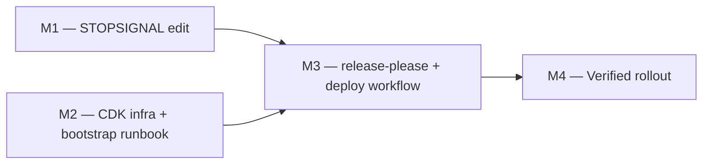

# 03 — Implementation Plan

## Overview

This plan carries the Sequencing line of `docs/aws-deployment-plan.md` — STOPSIGNAL edit first (independent), infra plus runbook, then release-please plus the deploy workflow, then first dev deploy, staging gate check, and canary release — into four milestones arranged per [[structure-implementation-plans-as-sequential-foundation-then-parallel-branches]]: two independent foundations (M1, the Dockerfile edit; M2, the CDK infrastructure and bootstrap runbook) run as parallel branches, converge into M3 (the delivery workflows, which need both the image contract and the provisioned environments), and finish with the sequential cutover M4 (the verified rollout). These are milestones, not tasks: each is a self-contained unit a fresh session executes end to end. The goals of `00 — Project Intent` and `01 — Logic Design` are immutable while this plan executes; every milestone is gated by a named behavior scenario in `04 — BDD Test Plan`, cross-referenced by scenario name.

## Milestone DAG

All four milestones are pending.



## M1 — STOPSIGNAL edit

**Depends on:** none.

**Exit criterion** — the behavior scenario `relay-container-stops-on-sigint` in `04 — BDD Test Plan` runs green. Gate command:

```bash
grep -q '^STOPSIGNAL SIGINT' docker/Dockerfile.relay && docker build -f docker/Dockerfile.relay -t relay-test .
```

**Context to load**

- `docs/design/aws-deploy/00-project-intent.md` — Tenets and Success criteria sections.
- `docs/design/aws-deploy/01-logic-design.md` — the Shutdown contract in the Runtime & permission model section (the relay handles SIGINT only).
- `docs/design/aws-deploy/02-structural-design.md` — the `docker/Dockerfile.relay` row of the Module boundaries table.
- `docs/design/aws-deploy/03-implementation-plan.md` (this document) and the `relay-container-stops-on-sigint` scenario in `04 — BDD Test Plan`.
- `docs/aws-deployment-plan.md` — Code-level constraints encoded, and item 3 of Files to create/edit.
- `docker/Dockerfile.relay` — the file to edit.

**Deliverable** — `docker/Dockerfile.relay` declares `STOPSIGNAL SIGINT` immediately after `USER appuser`, with a comment noting the relay handles only SIGINT while docker stop defaults to SIGTERM; the image still builds.

**Human-only halt steps** — none. This milestone is fully executable by the agent.

**Plan change (recorded during M1 execution)** — the build prompt's definition of done requires 04's Integration tier to run in CI, but this tree freezes `ci.yml`. Resolution: a new `.github/workflows/integration.yml` carries the tier, seeded with M1's image-build check; M2 and M3 append their synth-assertion and actionlint jobs. `tests/features/` (BDD feature files + step runners, assumed by the build prompt) is likewise new. `ci.yml` remains untouched.

## M2 — CDK infra + bootstrap runbook

**Depends on:** none.

**Exit criterion** — the behavior scenario `cdk-synth-emits-four-stacks` in `04 — BDD Test Plan` runs green. Gate commands (the first must print `3`; the second must list `RelayShared`, `Relay-dev`, `Relay-staging`, `Relay-prod` — the stack names the deployment plan's Bootstrap runbook deploys):

```bash
cd infra && npm ci && npx cdk synth --quiet && cat cdk.out/*.template.json | grep -c 'AWS::EC2::Instance'
npx cdk list
```

**Context to load**

- `docs/design/aws-deploy/00-project-intent.md` — Tenets (especially T3, T5, T6) and Success criteria.
- `docs/design/aws-deploy/01-logic-design.md` — Architecture (C4), Key design decisions, and Runtime & permission model sections.
- `docs/design/aws-deploy/02-structural-design.md` — the `infra/` portion of the canonical tree and its Module boundaries rows.
- `docs/design/aws-deploy/03-implementation-plan.md` (this document) and the `cdk-synth-emits-four-stacks` scenario in `04 — BDD Test Plan`.
- `docs/aws-deployment-plan.md` — Files to create/edit item 4, and the entire Bootstrap runbook section.
- `infra/package.json`, `infra/package-lock.json`, `infra/tsconfig.json`, `infra/cdk.json`, `infra/bin/app.ts`, `infra/lib/shared-stack.ts`, `infra/lib/relay-stack.ts`, `infra/assets/docker-compose.yml`, `infra/assets/Caddyfile.tpl` (the env-templated Caddy site block), `infra/assets/deploy.sh.tpl`, `infra/test/*.ts` (new — the specs plus the non-`.test.ts` support modules they import: the `helpers.ts` fixture and the `user-data-golden.ts` / `asset-goldens.ts` golden literals) — the files to create.
- `.github/workflows/integration.yml` (edit) — the M2 CDK-assertions job, per the M1 plan change below.

**Deliverable** — the complete `infra/` CDK TypeScript app: `RelayShared` (ECR, OIDC provider, hosted zone, ECR push role, three env-scoped deploy roles) plus the three `Relay-<env>` stacks (instance, security group, EIP, DNS record, user-data writing the compose unit, Caddy site block, and deploy script from the templated assets), synthesizing clean with explicit account and region.

**Human-only halt steps** — the agent stops and hands each of these to the maintainer (Bootstrap runbook items 1–7 of `docs/aws-deployment-plan.md`):

1. Runbook item 1 — prereqs: Node 20+, AWS CLI, `gh`; pick the region.
2. Runbook item 2 — `cd infra && npm install && npx cdk bootstrap aws://<ACCT>/<REGION>`.
3. Runbook item 3 — set the placeholder constants in `bin/app.ts`: domain, account, region, VPC id, and subnet id (via `aws ec2 describe-vpcs` / `describe-subnets`; availability zone derives from region). The subnet id chosen must live in availability zone `${REGION}a`, or the `AVAILABILITY_ZONE` constant must be set to that subnet's actual AZ. Then `npx cdk deploy RelayShared`; record NS records, ECR URI, role ARNs.
4. Runbook item 4 — at the registrar, add the NS records delegating `collab.<domain>`; verify with `dig NS collab.<domain> +short`.
5. Runbook item 5 — per env: `aws ssm put-parameter --name /relay/<env>/auth-token --type SecureString --value "$(openssl rand -base64 32)"`; save the values, clients need them.
6. Runbook item 6 — `npx cdk deploy Relay-dev Relay-staging Relay-prod`; record instance IDs and hostnames.
7. Runbook item 7 — `gh api` create the dev/staging/prod GitHub environments by the `PUT` that sets each one's deployment branch/tag policy (prod restricted to `v*` tags, staging and dev restricted to `main`) so the per-env deploy-role OIDC trust binds to the intended lane; the named required reviewer on staging only rides in that same `PUT` body, never as a separate later call — that `PUT` replaces the environment, so a body missing a rule clears it.

**Plan change (recorded during M2 execution)** — the ratified gate piped `cdk synth` stdout to `grep -c`, but with multiple stacks and no stack id the CDK CLI (verified on 2.1135.1) writes templates only to `cdk.out/` and prints nothing to stdout, so that pipeline structurally returns 0. The gate now greps the synthesized templates in `cdk.out/` after a `--quiet` synth. The assertion is unchanged: three `AWS::EC2::Instance` resources across the synthesized stack set, and the four stack names from `cdk list`.

**Plan change 2 (recorded during M2 execution)** — the single exit-criterion gate command above doesn't reach 04's Integration- and Unit-tier CDK-assertion rows (SG ports, deploy-role trust scoping, ECR immutability, instance-role token scope), which back R5's and R6's closing checks; M1's plan change already anticipated this ("M2 and M3 append their synth-assertion and actionlint jobs" to `integration.yml`). Scope addition: `infra/test/*.test.ts` (`node:test` + `aws-cdk-lib/assertions`, run via `npm test`) plus a `cdk-assertions` job appended to `.github/workflows/integration.yml`, both folded into the Context to load and files-to-create list above.

## M3 — release-please + deploy workflow

**Depends on:** M1, M2.

**Exit criterion** — the behavior scenario `dev-deploys-without-gate` in `04 — BDD Test Plan` runs green: after the maintainer approves and runs the first dev dispatch (a human-only halt step below), the deployment plan's WS-upgrade check against `relay-dev` returns HTTP `101`. Gate command:

```bash
CODE=$(curl -s -o /dev/null -w '%{http_code}' --max-time 5 --http1.1 \
  -H 'Connection: Upgrade' -H 'Upgrade: websocket' \
  -H 'Sec-WebSocket-Version: 13' -H 'Sec-WebSocket-Key: dGhlIHNhbXBsZSBub25jZQ==' \
  https://relay-dev.collab.<domain>/) || true
[ -z "$CODE" ] && CODE=000
echo "$CODE"
```

Expected output: `101` (retry within the ~2-minute budget the deploy workflow allows for first-deploy DNS propagation and certificate issuance).

**Also unlocks:** `staging-waits-for-review`.

**Context to load**

- `docs/design/aws-deploy/00-project-intent.md` — Tenets (especially T2, T3, T4) and Success criteria.
- `docs/design/aws-deploy/01-logic-design.md` — Key design decisions (D4–D7), Interfaces & data contracts, and Runtime & permission model sections.
- `docs/design/aws-deploy/02-structural-design.md` — the release trio and workflow rows of the Module boundaries table.
- `docs/design/aws-deploy/03-implementation-plan.md` (this document) and the `dev-deploys-without-gate` and `staging-waits-for-review` scenarios in `04 — BDD Test Plan`.
- `docs/aws-deployment-plan.md` — Files to create/edit items 1–2, Architecture, and Image strategy.
- `version.txt`, `release-please-config.json`, `.release-please-manifest.json`, `.github/workflows/release.yml`, `.github/workflows/deploy.yml` — the files to create.
- `infra/lib/shared-stack.ts`, `infra/test/template-goldens.ts` (edit) — the `RepositoryName` CfnOutput and its regenerated golden, per Plan change 4 below.

**Deliverable** — the versioned release process and the delivery lane: release-please with the `simple` strategy (version file, changelog, tag), `release.yml` on push to main authenticated with the `RELEASE_PLEASE_TOKEN` fine-grained PAT so published releases fire release-triggered workflows, and `deploy.yml` (meta, build with skip-if-exists and same-digest retag, deploy via env-scoped OIDC role and SSM run-command, 101 verify) — merged, with the first dev deploy green and a staging dispatch observed pausing at its required reviewer.

**Human-only halt steps** — the agent stops and hands each of these to the maintainer (Bootstrap runbook items 8–10 of `docs/aws-deployment-plan.md`):

1. Runbook item 9 — mint the fine-grained PAT (contents rw + pull-requests rw, this repo only); `gh secret set RELEASE_PLEASE_TOKEN`.
2. Runbook item 8 — `gh variable set` repo-level (`AWS_REGION`, `ECR_REPOSITORY`, `ECR_PUSH_ROLE_ARN`) and per-env (`AWS_DEPLOY_ROLE_ARN`, `RELAY_INSTANCE_ID`, `RELAY_HOSTNAME`).
3. Runbook item 10 — merge the repo changes; approve and run the first dev dispatch: `gh workflow run deploy.yml -f environment=dev`; then the gate command above verifies.

**Plan change (recorded during M3 execution)** — the ratified probe omitted `--http1.1`. curl defaults to HTTP/2 for `https://` (`CURL_HTTP_VERSION_2TLS`) and Caddy 2 negotiates h2 via ALPN, where `Connection:` and `Upgrade:` are forbidden connection-specific fields that curl silently drops — Caddy then sees a plain GET and the relay answers non-101, so the ratified command could never return `101` (verified against a real WS endpoint: `200 http/2` without the flag, `101 http/1.1` with it). The assertion is unchanged — an unauthenticated WS handshake returns `101` — the flag only pins the protocol version that handshake requires. The same correction applies to M4's per-env `for env in dev staging prod` probe loop below.

**Plan change 2 (recorded during M3 execution)** — `github.event.release.tag_name` reaches the SSM `AWS-RunShellScript` `commands` string, which the instance re-parses as a shell script as root, and prod carries no required reviewer; step-level `env:` does not survive that hop. The `meta` job now rejects any release tag outside `^v[0-9]+\.[0-9]+\.[0-9]+$` before it becomes an output (rollback dispatches are unaffected — they take the `workflow_dispatch` branch and deploy the `sha-` tag). `id-token: write` moved from workflow level to job-level `permissions` on `build` and `deploy` only, so `meta` — the job handling the untrusted tag — cannot mint an OIDC token. Scope addition: `tests/features/deploy-tag-guard.sh` (the negative-path regression test this repo's engineering rules require for a confirmed trust-boundary fix) plus a step running it in `.github/workflows/integration.yml`'s existing `workflow-lint` job. A second guard script joined the same job for a different failure class that bit M3 twice — a step whose ACTION DEFAULTS silently invalidate a later step's assumption (`setup-buildx-action` leaving a container-driver builder current under `docker build`; `imagetools` defaulting to `--prefer-index`). Scope addition: `tests/features/deploy-buildx-guard.sh` plus its step in the same `workflow-lint` job. Both scripts are registered in 04's Integration tier table.

**Plan change 3 (recorded during M3 execution)** — the probe's success path was unreachable even with `--http1.1`. curl enters its WebSocket 101 path only when curl itself drives a `ws://`|`wss://` URL (`upgr101 = UPGR101_WS` is set exclusively in `Curl_ws_request`); with an `https://` URL plus hand-written `Upgrade:` headers it takes the "not switching protocols" branch, accepts the 101 as the FINAL response and reads the BODY to EOF — but a 101 carries neither `Content-Length` nor chunked framing, so the body ends only when the peer closes. Against a relay that holds the connection open after the handshake (the normal case — it is waiting for the client's first frame) the probe hangs until an external timeout; against a peer that closes immediately, curl printed `101` but exited 52 and the old `|| CODE=000` error path then DESTROYED that captured reading, reporting `000` and burning every retry. Fix: `--max-time 5` per attempt (a handshake against a live relay settles in well under a second, so 5s is generous; a failed attempt now costs at most ~10s including the 5s sleep, so the deploy workflow's 24 attempts stay inside ~4 minutes against a ~2-minute nominal budget, hard-capped by the new `timeout-minutes: 15` on the deploy job), and substitute the `000` sentinel only when the capture is EMPTY — `-w` still emits the code on the timeout path, so a successful 101 survives curl's nonzero exit. The assertion is unchanged: an unauthenticated WS handshake returns `101`; the change only makes that reading observable and bounded. Verified against a local server that completes the RFC 6455 handshake: holding the connection open now yields `exit=28 CODE=101` in ~5s instead of hanging, and closing immediately after the 101 yields `exit=52 CODE=101` instead of `000`. The same correction applies to M4's per-env `for env in dev staging prod` probe loop below, and to `tests/features/run-m3.sh`.

**Plan change 4 (recorded during M3 execution)** — `deploy.yml` consumes `vars.ECR_REPOSITORY` as the bare repository name in two places (`aws ecr describe-images --repository-name` and the image path segment), but RelayShared exported only `EcrRepositoryUri` (the full registry URI) — pasting that value would break `describe-images` and produce a doubled-registry image reference, from which `deploy.sh.tpl`'s `${IMAGE%%/*}` derives the wrong login host. M3 consuming M2's exports is what revealed the missing export, so the `RepositoryName` output was added to the committed M2 stack (`infra/lib/shared-stack.ts`) and the whole-template golden (`infra/test/template-goldens.ts`) regenerated (`npm run regen-goldens`; the golden caught the change on its own — 65 pass / 1 fail before regenerating — and the suite is 66/66 after). Runbook item 8 also now names the literal value. Both files land in M3's commit.

## M4 — Verified rollout

**Depends on:** M3.

**Exit criterion** — the behavior scenario `prod-deploys-on-release-cut` in `04 — BDD Test Plan` runs green. Gate commands, taken from the Verification section of `docs/aws-deployment-plan.md`:

```bash
# Canary: merge a fix: commit -> release PR (only version.txt/CHANGELOG, CI stays
# green under --locked) -> merge -> v0.1.1 published -> prod deploy fires.
# Same-digest check: v0.1.1 and the canary's sha- tag must name ONE digest.
aws ecr describe-images --repository-name obsidian-ee/collab-relay \
  --query 'imageDetails[?contains(imageTags, `v0.1.1`)].[imageDigest,imageTags]' --output text

# Rollback drill: re-deploys the old digest, no rebuild
gh workflow run deploy.yml -f environment=prod --ref v0.1.0

# Per env: WS-upgrade probe returns 101
for env in dev staging prod; do
  OUT=$(curl -s -o /dev/null -w "%{http_code} relay-$env\n" --max-time 5 --http1.1 \
    -H 'Connection: Upgrade' -H 'Upgrade: websocket' \
    -H 'Sec-WebSocket-Version: 13' -H 'Sec-WebSocket-Key: dGhlIHNhbXBsZSBub25jZQ==' \
    "https://relay-$env.collab.<domain>/") || true
  [ -z "$OUT" ] && OUT="000 relay-$env"
  echo "$OUT"
done

# Admission proof: Identify with the env token -> ack; without a token -> rejection
websocat wss://relay-dev.collab.<domain>/
```

**Also unlocks:** `handshake-returns-101`, `unauthenticated-identify-rejected`, `rollback-redeploys-old-digest`.

**Context to load**

- Everything in M3's Context to load list, plus:
- `docs/design/aws-deploy/00-project-intent.md` — Success criteria SC1–SC7 (this milestone proves them).
- `docs/design/aws-deploy/01-logic-design.md` — Runtime data-flow and Interfaces & data contracts sections (the release lane and the Identify admission contract).
- `docs/design/aws-deploy/03-implementation-plan.md` (this document) and the `prod-deploys-on-release-cut`, `handshake-returns-101`, `unauthenticated-identify-rejected`, and `rollback-redeploys-old-digest` scenarios in `04 — BDD Test Plan`.
- `docs/aws-deployment-plan.md` — the Verification and Accepted tradeoffs sections in full.

**Deliverable** — the pipeline proven end to end: a canary `fix:` release reaches prod with `v0.1.1` and its commit tag on the same digest, the rollback drill restores `v0.1.0` from the existing digest with no rebuild, all three environments answer the WS-upgrade probe with 101, and the relay admits credentialed collaborators while refusing everyone else. The system is live and operated.

**Human-only halt steps** — the agent stops and hands each of these to the maintainer or release manager:

1. Approve the staging dispatch at its required-reviewer pause.
2. Merge the canary `fix:` commit, then merge the release PR release-please raises (the release cut that fires the prod deploy).
3. Run the rollback dispatch: `gh workflow run deploy.yml -f environment=prod --ref v0.1.0`.
4. Runbook item 11 — point the Obsidian plugin at `wss://relay-dev.collab.<domain>` with the dev token for the end-to-end collaborator check.

## Residual ledger

The Accepted tradeoffs section of `docs/aws-deployment-plan.md` enumerates exactly **6 residuals** — consequences the design deliberately accepts. Each is claimed by exactly ONE milestone: the milestone whose deliverable makes the residual real and whose gate observes the system behaving acceptably despite it. The burn-down and traceability table for these residuals lives in the Residual burn-down section of `04 — BDD Test Plan`.

| ID | Residual (from Accepted tradeoffs) | Claimed by |
|----|-----|-----|
| R1 | Brief downtime and offline-queue loss per deploy; no HA (inherent to in-memory design) | M4 |
| R2 | Idle WebSocket connections reaped (no keepalive yet) | M4 |
| R3 | Instance replacement loses caddy_data; Let's Encrypt re-issues (5-duplicate-certs/week limit) | M2 |
| R4 | workflow_dispatch runs from the chosen ref, so tags predating the deploy workflow cannot be dispatched | M3 |
| R5 | The registry push role trusts all repo refs (deploy roles remain env-scoped) | M2 |
| R6 | No HTTP/3 (UDP 443 closed) | M2 |

Claims per milestone: M1=0, M2=3, M3=1, M4=2 → **6/6 claimed**.

## Execution notes

- **Context is cleared between milestones.** Each milestone runs in a fresh session; that is why every Context to load list is self-contained — the executing agent reads those files first and needs nothing else from prior sessions.
- **Milestones are immutable during execution.** As with the tenets and goals of `00 — Project Intent`, changing a milestone's scope, exit criterion, or dependencies mid-build is a formal plan change with a written justification, never a silent edit.
- **The harness is the iterative-build-loop skill**: an outer loop over M1–M4 in DAG order (M1 and M2 in either order or in parallel sessions, then M3, then M4), and an inner loop per milestone that iterates until the milestone's behavior scenario in `04 — BDD Test Plan` runs green. Human-only halt steps are halt conditions: the agent stops, states exactly which step it needs, and resumes only after the maintainer confirms it done.
