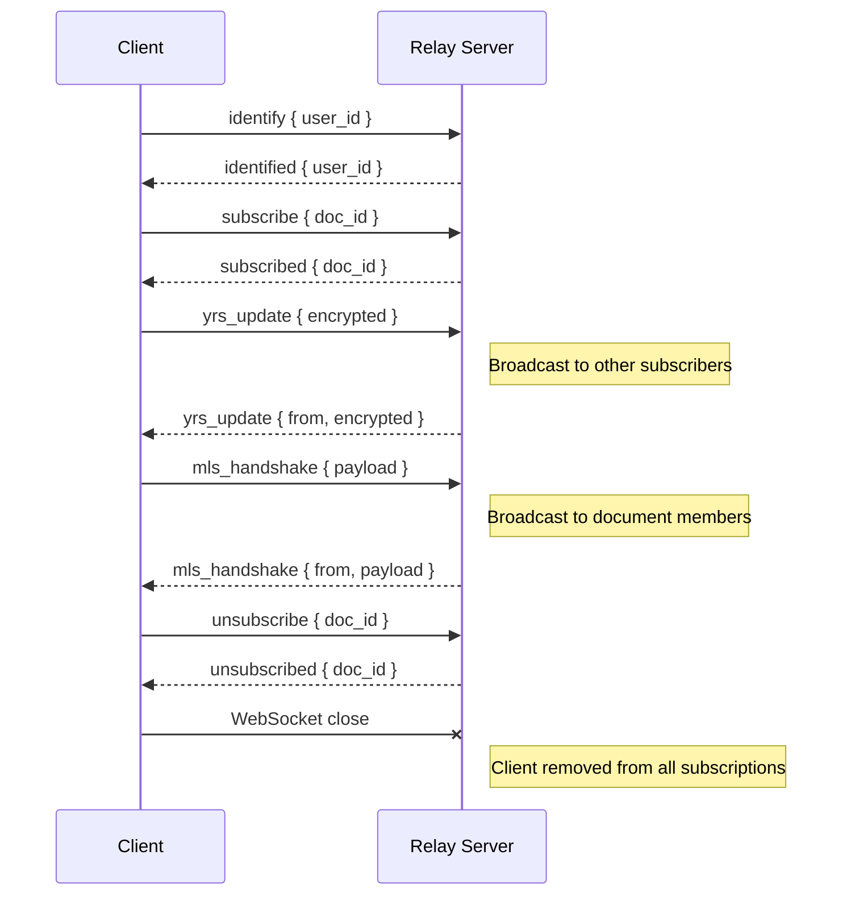
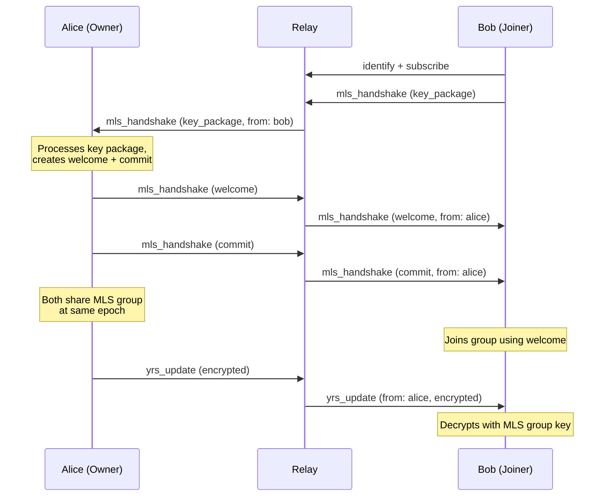

# Protocol Specification

The obsidian-ee protocol defines communication between clients and the relay server over WebSocket using JSON-serialized messages. Defined in the `collab-proto` crate.

## Transport

- **Protocol**: WebSocket (RFC 6455)
- **Serialization**: JSON (serde tagged enums with `#[serde(tag = "type")]`)
- **Encoding**: UTF-8 text frames
- **Security**: TLS (wss://) required in production; ws:// for local development only

## Message Types

### Client -> Server (`ClientMessage`)

#### `identify`
Authenticate and associate a user ID with the connection. Must be sent before any other operation.

```json
{
  "type": "identify",
  "user_id": "alice"
}
```

#### `subscribe`
Join a document channel to receive updates. Requires prior identification.

```json
{
  "type": "subscribe",
  "doc_id": "my-document"
}
```

#### `unsubscribe`
Leave a document channel.

```json
{
  "type": "unsubscribe",
  "doc_id": "my-document"
}
```

#### `yrs_update`
Send an encrypted CRDT update to all subscribers of a document.

```json
{
  "type": "yrs_update",
  "doc_id": "my-document",
  "encrypted": [72, 101, 108, ...],
  "epoch": 3,
  "signature": [45, 67, 89, ...]
}
```

| Field | Type | Description |
|-------|------|-------------|
| `doc_id` | string | Target document identifier |
| `encrypted` | byte array | MLS-encrypted Yrs update (opaque to relay) |
| `epoch` | u64 | MLS epoch when message was encrypted |
| `signature` | byte array | Cryptographic signature for authenticity |

#### `mls_handshake`
Exchange MLS protocol messages for group key management.

```json
{
  "type": "mls_handshake",
  "doc_id": "my-document",
  "payload": [12, 34, 56, ...],
  "message_type": "welcome"
}
```

| Field | Type | Values |
|-------|------|--------|
| `message_type` | enum | `key_package`, `welcome`, `commit`, `application` |
| `payload` | byte array | MLS protocol message (opaque to relay) |

### Server -> Client (`ServerMessage`)

#### `identified`
Acknowledgment of successful identification.

```json
{
  "type": "identified",
  "user_id": "alice"
}
```

#### `subscribed`
Acknowledgment of successful document subscription.

```json
{
  "type": "subscribed",
  "doc_id": "my-document"
}
```

#### `unsubscribed`
Acknowledgment of unsubscription.

```json
{
  "type": "unsubscribed",
  "doc_id": "my-document"
}
```

#### `yrs_update`
Forwarded encrypted CRDT update from another client.

```json
{
  "type": "yrs_update",
  "doc_id": "my-document",
  "from": "alice",
  "encrypted": [72, 101, 108, ...],
  "epoch": 3,
  "signature": [45, 67, 89, ...]
}
```

The `from` field identifies the sender. The `encrypted` and `signature` fields are passed through unchanged from the original client message.

#### `mls_handshake`
Forwarded MLS handshake message from another client.

```json
{
  "type": "mls_handshake",
  "doc_id": "my-document",
  "from": "alice",
  "payload": [12, 34, 56, ...],
  "message_type": "welcome"
}
```

#### `error`
Error response from the server.

```json
{
  "type": "error",
  "code": "not_identified",
  "message": "Must identify before subscribing"
}
```

| Error Code | Trigger |
|------------|---------|
| `not_identified` | Operation attempted before `identify` |
| `document_not_found` | Referenced document doesn't exist |
| `not_subscribed` | Update sent to unsubscribed document |
| `invalid_message` | Malformed JSON or unrecognized message |
| `internal_error` | Server-side failure |

## Session Lifecycle



## MLS Handshake Flow (Group Formation)



## Routing Rules

1. **Echo prevention**: A sender never receives their own messages back.
2. **Subscription-based delivery**: Only clients subscribed to a document receive its updates.
3. **Passthrough encryption**: The relay never inspects, decrypts, or modifies encrypted payloads.
4. **Multi-document support**: Clients can subscribe to multiple documents simultaneously.
5. **Cleanup on disconnect**: When a client disconnects, it is removed from all document subscriptions.

## Offline Message Queue

The relay includes an `OfflineQueue` for clients that temporarily disconnect:

- **Capacity**: 1,000 messages per user (configurable)
- **Eviction**: FIFO - oldest messages dropped when queue is full
- **Delivery**: All queued messages sent on reconnection
- **Storage**: Currently in-memory; DynamoDB persistence planned

## Type Aliases

```rust
pub type DocumentId = String;
pub type UserId = String;
```

## Invite Structures

There are two `Invite` types in different crates:

**`collab-proto::Invite`** - For out-of-band invitation exchange (used by CLI for file-based workflows):

```rust
pub struct Invite {
    pub doc_id: DocumentId,
    pub key_package: Vec<u8>,
    pub relay_url: String,
}
```

**`collab_core::Invite`** - For MLS group membership (contains the cryptographic welcome/commit messages):

```rust
pub struct Invite {
    pub doc_id: DocumentId,
    pub welcome: Vec<u8>,
    pub commit: Vec<u8>,
}
```
