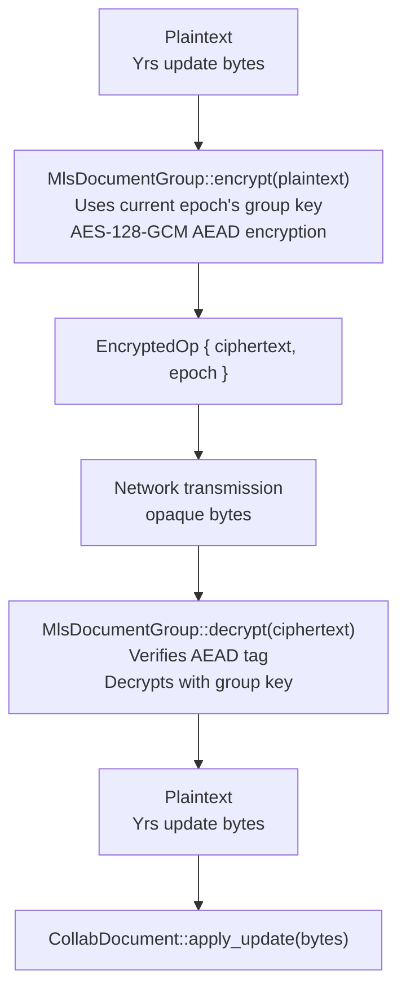
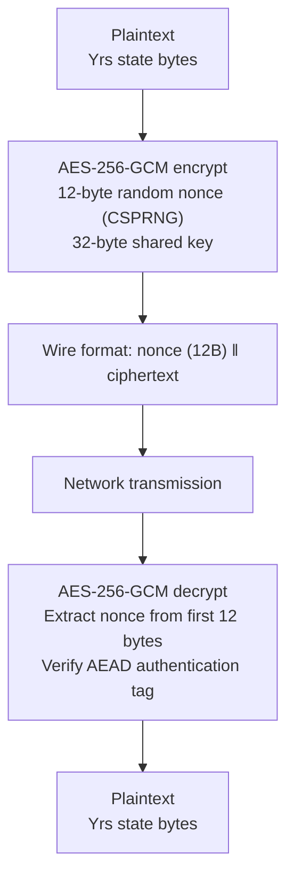

# Security Model

This document describes the encryption architecture, threat model, and security properties of the obsidian-ee system.

## Cryptographic Primitives

### MLS (RFC 9420) - collab-core

Used for group key management in the native Rust crates.

| Parameter | Value |
|-----------|-------|
| Ciphersuite | `MLS_128_DHKEMX25519_AES128GCM_SHA256_Ed25519` |
| Key Exchange | X25519 (Curve25519 ECDH) |
| Symmetric Encryption | AES-128-GCM (AEAD) |
| Hash | SHA-256 |
| Signatures | Ed25519 |
| Implementation | `openmls 0.7` |

### AES-256-GCM - collab-wasm (MVP)

The WASM module uses a simplified encryption scheme as a stepping stone toward full MLS integration in the browser.

| Parameter | Value |
|-----------|-------|
| Algorithm | AES-256-GCM (AEAD) |
| Key Size | 256 bits (32 bytes) |
| Nonce Size | 96 bits (12 bytes) |
| Nonce Generation | `getrandom` (OS CSPRNG) |
| Wire Format | `nonce (12B) || ciphertext` |
| Implementation | `aes-gcm` crate via `wasm-bindgen` |

## Threat Model

### What We Protect Against

| Threat | Mitigation |
|--------|------------|
| **Relay server compromise** | E2E encryption; relay never has keys |
| **Network eavesdropping** | MLS encryption + TLS transport |
| **Message tampering** | AEAD authentication (AES-GCM) |
| **Replay attacks** | MLS epoch tracking |
| **Forward secrecy violation** | MLS key ratcheting per epoch |
| **Post-compromise recovery** | MLS epoch advancement on membership changes |
| **Impersonation** | Ed25519 signature verification |
| **Concurrent edit conflicts** | Yrs CRDT deterministic resolution |
| **Non-member access** | MLS group membership enforcement |

### What We Do NOT Protect Against

| Threat | Status |
|--------|--------|
| **Metadata analysis** | Document IDs, user IDs, message sizes, and timing are visible to the relay |
| **Compromised client device** | If a client is compromised, its current session keys are exposed |
| **Denial of service** | No rate limiting on the relay server currently |
| **Document access control** | Subscription-based only; no cryptographic access control beyond MLS group membership |
| **User authentication** | User IDs are self-asserted; no identity verification system |

## Zero-Knowledge Relay Design

The relay server is designed to have zero knowledge of document contents:

### What the Relay Sees
- User identifiers (self-asserted strings)
- Document identifiers
- Message routing metadata (from, doc_id, epoch)
- MLS message types (Welcome, Commit, KeyPackage, Application)
- Message sizes and timing

### What the Relay Cannot See
- Document plaintext content
- Encryption keys or secrets
- CRDT operation details
- Collaboration history or edits

### Implementation Guarantees

```rust
// In collab-relay: encrypted field is Vec<u8> treated as opaque
YrsUpdate {
    doc_id: String,         // Relay reads this for routing
    from: String,           // Relay reads this for routing
    encrypted: Vec<u8>,     // Relay passes through unchanged
    epoch: u64,             // Relay passes through unchanged
}
```

The relay deserializes only the JSON message envelope for routing. The `encrypted` and MLS `payload` fields are never inspected. Message authenticity and replay protection live inside the MLS application message itself (signed by the sender's credential; replay-protected by secret-tree generation counters), not in a separate transport field.

## MLS Group Lifecycle

### Group Creation

```
Alice calls MlsDocumentGroup::create("alice")
  1. Generate Ed25519 signature key pair
  2. Create BasicCredential with user_id
  3. Initialize MLS group at epoch 0
  4. Alice is the sole member
```

### Member Addition

```
Bob wants to join:
  1. Bob creates PendingMember::new("bob")
     - Generates key pair and key package
  2. Alice calls add_member(bob_key_package)
     - MLS produces: commit + welcome
     - Epoch increments to N+1
  3. Bob calls pending.join(welcome_bytes)
     - Bob joins group at epoch N+1
  4. Existing members call process_commit(commit_bytes)
     - All members synchronized at epoch N+1
```

### Epoch Advancement

Each membership change (add/remove) creates a new epoch. Forward secrecy is maintained because:
- Each epoch derives new encryption keys
- Previous epoch keys are discarded
- Past messages cannot be decrypted even with current keys

## Encryption Flow

### Native (collab-core)



### WASM (collab-wasm, MVP)



## Security Properties by Layer

| Layer | Property | Mechanism |
|-------|----------|-----------|
| **Transport** | Confidentiality | TLS (wss://) |
| **Application** | E2E Encryption | MLS / AES-GCM |
| **Application** | Authentication | AEAD tag verification |
| **Application** | Integrity | AEAD tag verification |
| **MLS** | Forward Secrecy | Epoch-based key ratcheting |
| **MLS** | Post-Compromise Security | Key rotation on membership changes |
| **MLS** | Group Authentication | Ed25519 signatures |
| **CRDT** | Consistency | Yrs conflict-free convergence |
| **CRDT** | Availability | Offline-first with update queuing |

## Known Limitations and Future Work

### Current MVP Limitations

1. **WASM uses static shared key**: The Obsidian plugin currently uses AES-256-GCM with a pre-shared key. MLS integration in WASM is planned.
2. **Placeholder encryption key**: The plugin default uses an all-zeros key for development. Production must use `crypto.getRandomValues()` for key generation.
3. **BasicCredential only**: MLS uses simple string-based credentials. X.509 certificate support would provide stronger identity guarantees.
4. **No key persistence**: MLS group state is in-memory only. Restarting a client requires re-joining the group.
5. **No revocation**: Member removal and key revocation are not yet implemented.

### Production Requirements

- [ ] Replace placeholder encryption key with secure key exchange
- [ ] Implement MLS in WASM (via `openmls` compiled to WASM or a JS MLS library)
- [ ] Add user identity verification (e.g., Obsidian account integration)
- [ ] Implement rate limiting on the relay server
- [ ] Add TLS termination at the infrastructure level
- [ ] Persist MLS group state for session resumption
- [ ] Implement member removal and key revocation
- [ ] Add audit logging for security events

## Verified Security Properties (E2E Tests)

The following properties are verified by automated tests in `tests/e2e-tests/`:

1. **Semantic Security (IND-CPA)**: Encrypting the same plaintext twice produces different ciphertext (verified by `test_semantic_security`)
2. **Zero-Knowledge Relay**: Relay cannot decrypt intercepted messages; plaintext does not leak in ciphertext (verified by `test_relay_cannot_decrypt`)
3. **AEAD Authentication**: Decryption with wrong key fails explicitly (verified by `test_wrong_key_decryption_fails`)
4. **CRDT Convergence**: Out-of-order messages converge to identical state (verified by `test_concurrent_edits_converge`)
5. **Bidirectional MLS**: Both directions of MLS group encryption work (verified by `test_bidirectional_encrypted_sync`)
6. **Multi-Party MLS**: Three-user group collaboration with epoch synchronization (verified by `test_three_user_collaboration`)
