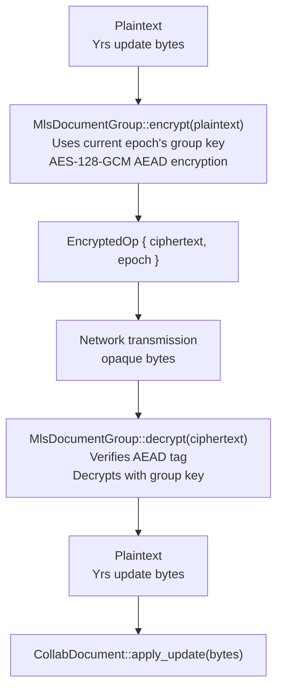

# Security Model

This document describes the encryption architecture, threat model, and security properties of the obsidian-ee system.

## Cryptographic Primitives

### MLS (RFC 9420)

Used for group key management across all crates: the native Rust crates (`collab-core`) and the WASM/browser client (`collab-wasm`, which wraps `collab-core`'s MLS engine — there is no separate browser crypto path).

| Parameter | Value |
|-----------|-------|
| Ciphersuite | `MLS_128_DHKEMX25519_AES128GCM_SHA256_Ed25519` |
| Key Exchange | X25519 (Curve25519 ECDH) |
| Symmetric Encryption | AES-128-GCM (AEAD) |
| Hash | SHA-256 |
| Signatures | Ed25519 |
| Implementation | `openmls 0.7` |

The AES-128-GCM AEAD in the ciphersuite is internal to MLS; there is no standalone pre-shared-key encryption path. The WASM/browser client reaches this same MLS engine via `collab-wasm`.

## Threat Model

### What We Protect Against

| Threat | Mitigation |
|--------|------------|
| **Relay server compromise** | E2E encryption; relay never has keys |
| **Network eavesdropping** | MLS encryption + TLS transport |
| **Message tampering** | MLS authenticated encryption (AEAD) |
| **Replay attacks** | MLS epoch tracking |
| **Forward secrecy violation** | MLS key ratcheting per epoch |
| **Post-compromise recovery** | MLS epoch advancement on membership changes |
| **Impersonation** | Ed25519 signature verification |
| **Concurrent edit conflicts** | Yrs CRDT deterministic resolution |
| **Non-member access** | MLS group membership enforcement |

### What We Do NOT Protect Against

| Threat | Status |
|--------|--------|
| **Metadata analysis** | Document IDs, user IDs, message sizes, and timing are visible to the relay |
| **Compromised client device** | If a client is compromised, its current session keys are exposed |
| **Denial of service** | No rate limiting on the relay server currently |
| **Document access control** | MLS group membership gates *decryption* always. *Content* (`YrsUpdate`) fan-out is gated by per-document subscribe authorization (issue #29), **on by default** since #72 and disabled with `RELAY_SUBSCRIBE_AUTHZ=0`. *Subscription* itself stays open so the MLS join can bootstrap, so metadata remains visible to any identified client; see [Per-Document Subscribe Authorization](#per-document-subscribe-authorization-issue-29) |
| **User authentication** | User IDs are self-asserted; no identity verification system. A subscribe capability binds a `user_id`, but that is the same self-asserted relay identity — it stops replay-as-another-subscriber, not impersonation of a fabricated identity |
| **Group admission control** | The owner auto-invites ANY key package arriving on the document channel; see below |

#### Open admission (current model)

In the plugin client (`plugins/obsidian-ee/src/collab-client.ts`, `handleMlsHandshake`),
an owner with an established group answers every `key_package` message received on its
document channel with a Welcome. There is no allowlist, invitation token, or user
confirmation step: anyone who can reach the relay and send a key package on a known
`doc_id` is admitted to the MLS group and can decrypt all subsequent updates.
Relay-reachability therefore equals admission today. MLS still guarantees everything
above (the relay itself learns nothing, non-members who were never welcomed cannot
decrypt), but the decision of WHO becomes a member is unguarded. An explicit admission
gate (owner approval / pre-shared invite verification before `create_invite`) is
deliberately deferred and tracked in a follow-up issue.

## Zero-Knowledge Relay Design

The relay server is designed to have zero knowledge of document contents:

### What the Relay Sees
- User identifiers (self-asserted strings)
- Document identifiers
- Message routing metadata (from, doc_id, epoch)
- MLS message types (Welcome, Commit, KeyPackage, Application)
- Message sizes and timing

### What the Relay Cannot See
- Document plaintext content
- Encryption keys or secrets
- CRDT operation details
- Collaboration history or edits

### Implementation Guarantees

```rust
// In collab-relay: encrypted field is Vec<u8> treated as opaque
YrsUpdate {
    doc_id: String,         // Relay reads this for routing
    from: String,           // Relay reads this for routing
    encrypted: Vec<u8>,     // Relay passes through unchanged
    epoch: u64,             // Relay passes through unchanged
}
```

The relay deserializes only the JSON message envelope for routing. The `encrypted` and MLS `payload` fields are never inspected. Message authenticity and replay protection live inside the MLS application message itself (signed by the sender's credential; replay-protected by secret-tree generation counters), not in a separate transport field.

## MLS Group Lifecycle

### Group Creation

```
Alice calls MlsDocumentGroup::create("alice")
  1. Generate Ed25519 signature key pair
  2. Create BasicCredential with user_id
  3. Initialize MLS group at epoch 0
  4. Alice is the sole member
```

### Member Addition

```
Bob wants to join:
  1. Bob creates PendingMember::new("bob")
     - Generates key pair and key package
  2. Alice calls add_member(bob_key_package)
     - MLS produces: commit + welcome
     - Epoch increments to N+1
  3. Bob calls pending.join(welcome_bytes)
     - Bob joins group at epoch N+1
  4. Existing members call process_commit(commit_bytes)
     - All members synchronized at epoch N+1
```

### Member Removal (issue #31)

```
Alice (owner) removes Carol:
  1. Alice calls remove_member("carol")
     - MLS produces a Remove commit; epoch increments to N+1
     - Alice rekeys; Carol is evicted from the ratchet tree
  2. Remaining members call process_commit(commit_bytes)
     - All remaining members synchronized at epoch N+1
  3. Carol calls process_commit(commit_bytes) on her own removal
     - Her group becomes inactive; she can no longer decrypt subsequent
       messages (surfaced as an error, never a panic)
```

**Who-may-remove-whom policy.** The group creator (owner) may remove any member;
a non-owner may remove no one. Enforced at two layers:

- **Mint side:** `remove_member` guards `is_owner()` — a non-owner's client
  cannot mint a removal commit.
- **Receive side (the enforceable half):** `process_commit` inspects every commit
  for Remove proposals; a removal commit whose committer is not the owner is
  **rejected, not merged**. MLS does not enforce authorization itself, so this
  receive-side check is the durable guard and does not rely on a well-behaved
  client.

"Owner" is the `user_id` that created the group. A joiner learns it at `join` from
the member at leaf index 0 (openmls always assigns the creator leaf 0), so no
extra field is threaded through the Welcome/Invite. Self-leave (a member removing
themselves) and owner succession / owner-removes-owner are **future work**.

A removed member's issue-#29 subscribe capability also stops working: removal
advances the epoch, rotating the exporter secret and therefore the per-epoch
subscribe key. After the owner re-registers the doc anchor at the new epoch, the
removed member's stale-epoch capability no longer verifies.

### Epoch Advancement

Each membership change (add/remove) creates a new epoch. Forward secrecy is maintained because:
- Each epoch derives new encryption keys
- Previous epoch keys are discarded
- Past messages cannot be decrypted even with current keys

## Encryption Flow

### Native (collab-core)


```mermaid
flowchart TD
    A[Plaintext<br/>Yrs update bytes] --> B["MlsDocumentGroup::encrypt(plaintext)<br/>Uses current epoch's group key<br/>AES-128-GCM AEAD encryption"]
    B --> C["EncryptedOp { ciphertext, epoch }"]
    C --> D[Network transmission<br/>opaque bytes]
    D --> E["MlsDocumentGroup::decrypt(ciphertext)<br/>Verifies AEAD tag<br/>Decrypts with group key"]
    E --> F[Plaintext<br/>Yrs update bytes]
    F --> G["CollabDocument::apply_update(bytes)"]
```

The WASM/browser client (`collab-wasm`) uses this same MLS flow: it wraps `collab-core`'s `EncryptedDocument`, so encryption and decryption go through `MlsDocumentGroup` exactly as above.

## Security Properties by Layer

| Layer | Property | Mechanism |
|-------|----------|-----------|
| **Transport** | Confidentiality | TLS (wss://) |
| **Application** | E2E Encryption | MLS |
| **Application** | Authentication | AEAD tag verification |
| **Application** | Integrity | AEAD tag verification |
| **MLS** | Forward Secrecy | Epoch-based key ratcheting |
| **MLS** | Post-Compromise Security | Key rotation on membership changes |
| **MLS** | Group Authentication | Ed25519 signatures |
| **CRDT** | Consistency | Yrs conflict-free convergence |
| **CRDT** | Availability | Offline-first with update queuing |

## Per-Document Subscribe Authorization (issue #29)

By default any identified client may `Subscribe` to any `doc_id`. The payload
stays MLS-encrypted, but a non-member still observes metadata (epochs, sender
ids, message sizes, timing). Issue #29 adds a gate that requires a subscriber to
prove current-epoch group membership; issue #72 then moved that gate off
`Subscribe` itself and onto `YrsUpdate` fan-out, so the MLS join can still
bootstrap over the relay (see "Content gating" below), and turned it **on by
default**.

### How it works

- Every current member derives the same per-epoch `Ed25519` keypair from the MLS
  exporter secret (RFC 9420 §8.5). A non-member cannot derive it; the secret
  rotates every epoch.
- A member registers the doc's **public** verifying key as a relay *anchor*
  (`RegisterDocKey`), and mints a short-lived **capability** (`SubscribeCapability`,
  TTL 300s) that the relay verifies with `Ed25519` alone. The relay never holds a
  group secret — it stores a public key + an epoch counter (zero-knowledge
  preserved).
- The capability's signed bytes bind `user_id || doc_id || epoch || expiry`. The
  relay verifies against the **presenting connection's** identified `user_id`, the
  subscribe-target `doc_id`, and the **locally-stored** anchor epoch/key — never a
  value taken from the inbound frame. Binding `user_id` means a capability minted
  for one member cannot be replayed by another subscriber within its TTL.

### The default, and turning it off (`RELAY_SUBSCRIBE_AUTHZ`)

Subscribe authorization is **on by default**. `RELAY_SUBSCRIBE_AUTHZ` is a
two-way override of that default, not an enable switch:

| Value | Result |
|-------|--------|
| unset | **on** |
| `0`, `false`, `no`, `off` (case-insensitive, trimmed) | off |
| anything else, including set-but-empty | **on** |

An unrecognised value lands on rather than off. Authz on is the more restrictive
state, so a typo fails closed instead of silently opening content fan-out. The
relay logs which state it started in.

Both shipped clients mint and present a capability whenever they hold an MLS
group for the document, so the ordinary flows work with the default on:
`collab-cli session-check` (covered by
`tests/e2e-tests/tests/cli_subscribe_authz.rs`), and the plugin's owner and
joiner sessions including the same-instance `disconnect()` → `connect()`
reconnect cycle, which re-presents the capability at the current epoch.

**Three paths still subscribe capability-less**, and they share one root cause —
**no client persists MLS group state**, so any code path that does not already
hold a live group in memory has nothing to mint from:

- **`collab-cli connect`** (the read-only listener) subscribes handshake-only and
  receives no `YrsUpdate`. It holds no group, and `keygen` persists none — see the
  comment at `crates/collab-cli/src/commands.rs` in `run_ws_session`.
- **The plugin's manifest-discovered paths** (`handleManifestUpdate` in
  `plugins/obsidian-ee/src/collab-client.ts`) subscribe with `capability: None`: a
  path that has only just been announced has no group on this client yet.
- **The plugin's user-facing restart** (`stopSession()` then `startSession()`)
  constructs a *new* `CollabClient`, which builds a fresh epoch-0 group. Its
  `RegisterDocKey` is refused by TOFU against a document that is already anchored,
  so it never becomes content-authorized. Only the same-instance
  `disconnect()`/`connect()` cycle resumes correctly.

Each is a loss of *content delivery on that path*, never a loss of
confidentiality: a capability-less subscriber sees handshake metadata and no
plaintext. Persisting MLS group state closes all three at once and is tracked as
#72 follow-up work.

**Migration.** Set `RELAY_SUBSCRIBE_AUTHZ=0` (or `false`/`no`/`off`) to restore
the previous behavior. Off, every identified subscriber receives every
`YrsUpdate` for any `doc_id` it names — payloads stay MLS-encrypted, so a
non-member still cannot decrypt, but ciphertext, sizes, and timing all flow to
it, and a removed member keeps receiving content after a rekey. On, content
reaches only subscribers authorized at the document's current anchor epoch, a
rekey revokes stale authorizations for free, and the three paths above go quiet.

`docker/docker-compose.yml` sets `RELAY_SUBSCRIBE_AUTHZ=0` explicitly. It is a
test fixture: the Docker-gated wire tests subscribe capability-less, and
`fail_closed.rs` specifically needs the relay to fan out to an unauthorized
subscriber so it can prove MLS fail-closed independently of this gate. That file
is not a deployment template.

### Content gating: subscribe is open, content is not (issue #72)

Gating the *subscribe* itself deadlocked the join: the MLS handshake runs over
the relay, so a joiner must `Subscribe` to *receive* its `Welcome`, but it can
only mint a capability *after* joining. #72 moved the gate off `Subscribe` and
onto fan-out:

- A `Subscribe` carrying **no capability** succeeds as **handshake-only**. It is
  the join bootstrap, and the relay cannot distinguish a real joiner from any
  other capability-less client.
- A `Subscribe` carrying a capability that **fails to verify** is still rejected
  (`Unauthorized`, no subscription). The allowance is for an *absent* capability
  only; a bad one is an attack signal and rejecting it cannot reintroduce the
  deadlock, since a joiner presents none at all.
- `YrsUpdate` fan-out requires the subscriber to have been authorized at the
  doc's **current** anchor epoch. Comparing against the current anchor is what
  makes a rekey revoke: a subscription stored at epoch `N` stops matching after a
  rotation to `N+1`, with no extra bookkeeping. **No anchor means nobody is
  content-authorized** — it fails closed.
- The check runs *before* fan-out, so an unauthorized subscriber is excluded from
  the offline queue too and cannot accumulate content for later hand-over.

Content gating was the first half of the "MLS hardening" item; the default flip
above is the second, and both have now landed.

### Documented residuals

- **Anchor trust is TOFU.** The first `RegisterDocKey` for a `doc_id` wins, like
  first-Identify-wins for `user_id`. The self-proof proves only *possession of the
  epoch keypair being registered* — the zero-knowledge relay has no group state
  and no identity system, so it **cannot verify group membership**. An attacker
  who races the real owner to register a doc's anchor could grant subscribe
  (metadata) access to holders of a key they chose — but still **cannot decrypt**
  (MLS gates that). This is a metadata escalation requiring a race, inherent to a
  zero-knowledge relay.
- **Where #31 (removal) bites:** the *subscribe* path, not the register path.
  After a rekey a removed member's stale-epoch capability no longer matches the
  rotated anchor, so it stops verifying. The relay cannot prevent a non-member
  from registering an anchor for a doc no one has claimed yet.
- **A live subscription survives a rotation; its content authorization does not.**
  A removed member keeps its subscription until it disconnects, but its stored
  epoch stops matching the rotated anchor, so `YrsUpdate` stops reaching it. What
  still flows is `MlsHandshake` traffic. Dropping the subscription itself on
  anchor rotation is #31 scope.
- **Capability TTL (300s)** bounds replay of a captured capability within an
  epoch; `wss://` protects it in transit.

### Content-gating residuals (issue #72)

- **Capability-less subscribers receive `MlsHandshake` traffic.** Deliberate and
  required for bootstrap — the joiner's `Welcome` arrives that way. Payloads are
  group-encrypted, so what this exposes is metadata (who joins, when, how the
  epoch progresses), not content.
- **Availability delta.** With authz on — the default — capability-less subscribes still consume
  `max_subscribers_per_doc` (1000). Subscriptions survive disconnect, and a
  subscriber that never gets enqueued is never reached by `drop_subscriptions`, so
  repeated connect/`Identify`/`Subscribe`/disconnect cycles can wedge a document's
  subscriber cap. Byte-boundedness still holds (the count cap times `MAX_ID_LEN`;
  the offline queue is byte-capped separately). This is availability, not
  confidentiality, and the bearer token (`RELAY_AUTH_TOKEN`) is the outer gate.
- **Offline content queued at epoch `N` is still delivered after a rotation to
  `N+1`** — `drain_offline` is unconditional. Not a confidentiality leak: the
  recipient was a member at epoch `N` and holds that epoch's key, so this is
  content it was already entitled to.
- **`MlsMessageType::Application` would ride the ungated handshake path.** No
  sender uses that variant anywhere today. If one is added it must be gated like
  `YrsUpdate`.

## Known Limitations and Future Work

### Current MVP Limitations

1. **BasicCredential only**: MLS uses simple string-based credentials. X.509 certificate support would provide stronger identity guarantees.
2. **Encrypted-at-rest group state (session resumption)**: MLS group state is persisted encrypted at rest with AES-256-GCM (`snapshot_encrypted` / `restore_encrypted` in `collab-core`) and resumed on restart without re-joining, preserving the epoch. The at-rest key's provenance (OS keychain / passphrase) is the client's responsibility — `collab-core` takes a caller-supplied 32-byte key and rejects an all-zeros key (fail-closed). A snapshot whose epoch predates a known rotation (`epoch < min_epoch`) falls back to a clean re-join rather than resuming stale state. Wiring the Obsidian plugin / CLI data-dir storage that calls this surface is follow-up work.
3. **Member removal is owner-only**: Removal is implemented via MLS Remove (epoch advance + rekey), enforced by an owner-only mint guard and a receive-side owner check (see [Member Removal](#member-removal-issue-31)). Self-leave and owner succession are not yet implemented.

### Production Requirements

- [x] Replace placeholder encryption key with secure key exchange (MLS key exchange; no pre-shared key)
- [x] Implement MLS in WASM (`collab-wasm` wraps `collab-core`'s MLS engine)
- [ ] Add user identity verification (e.g., Obsidian account integration)
- [ ] Implement rate limiting on the relay server
- [ ] Add TLS termination at the infrastructure level
- [x] Persist MLS group state for session resumption (encrypted-at-rest via `collab-core::snapshot_encrypted`/`restore_encrypted`; plugin/CLI data-dir wiring is follow-up)
- [x] Implement member removal and key revocation (owner-removes-member; issue #31)
- [ ] Implement self-leave and owner succession (issue #31 follow-up)
- [ ] Add audit logging for security events

## Verified Security Properties (E2E Tests)

The following properties are verified by automated tests in `tests/e2e-tests/`:

1. **Semantic Security (IND-CPA)**: Encrypting the same plaintext twice produces different ciphertext (verified by `test_semantic_security`)
2. **Zero-Knowledge Relay**: Relay cannot decrypt intercepted messages; plaintext does not leak in ciphertext (verified by `test_relay_cannot_decrypt`)
3. **AEAD Authentication**: Decryption with wrong key fails explicitly (verified by `test_wrong_key_decryption_fails`)
4. **CRDT Convergence**: Out-of-order messages converge to identical state (verified by `test_concurrent_edits_converge`)
5. **Bidirectional MLS**: Both directions of MLS group encryption work (verified by `test_bidirectional_encrypted_sync`)
6. **Multi-Party MLS**: Three-user group collaboration with epoch synchronization (verified by `test_three_user_collaboration`)
