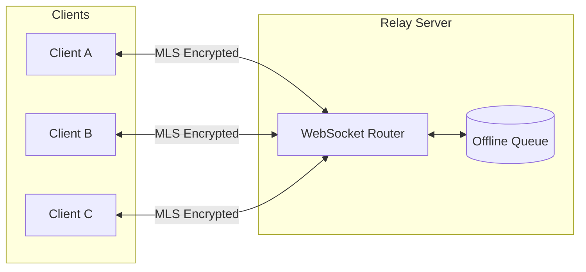
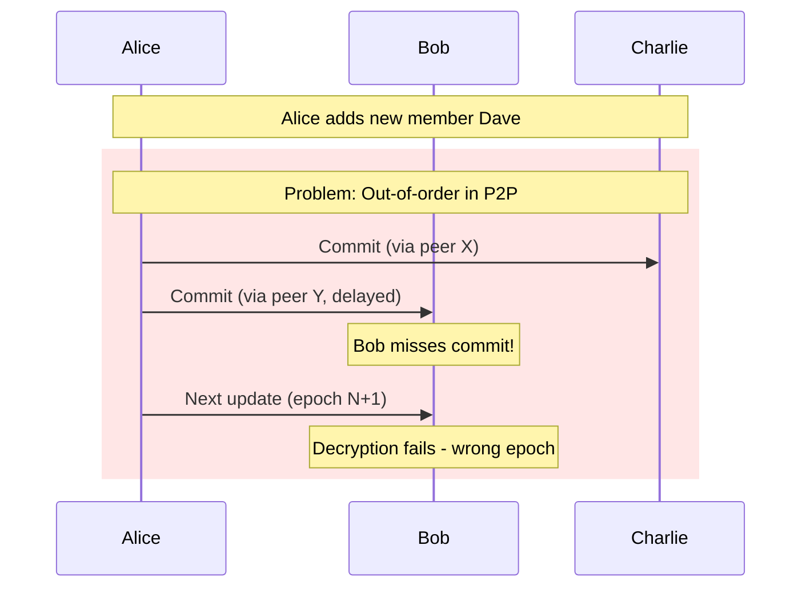
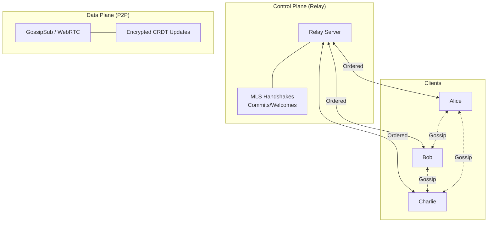

# P2P Architecture Analysis

This document analyzes peer-to-peer transport options for obsidian-ee v2, evaluating compatibility with our MLS-based encryption model.

## Current Architecture (v1)



**Properties:**
- Zero-knowledge relay (server cannot decrypt)
- Ordered, reliable message delivery
- Central point for MLS handshakes (commits, welcomes)
- Single point of failure

## P2P Library Options

### y-webrtc

WebRTC-based mesh network for Yjs synchronization.

| Aspect | Details |
|--------|---------|
| **Transport** | WebRTC DataChannels |
| **Topology** | Full mesh (N² connections) |
| **Discovery** | Signaling server required |
| **NAT Traversal** | STUN/TURN servers |
| **Scalability** | Limited (~20-50 peers) |

**Pros:**
- Battle-tested WebRTC stack
- Works in browsers
- Low latency for small groups

**Cons:**
- Mesh doesn't scale
- Requires signaling infrastructure
- IP address exposure without TURN

### y-libp2p + GossipSub

libp2p-based gossip protocol (used by Ethereum 2.0, IPFS).

| Aspect | Details |
|--------|---------|
| **Transport** | TCP, QUIC, WebSocket, WebRTC |
| **Topology** | Gossip mesh (configurable degree) |
| **Discovery** | DHT, mDNS, bootstrap nodes |
| **NAT Traversal** | Hole punching, relay nodes |
| **Scalability** | Excellent (1000s of peers) |

**Pros:**
- True gossip semantics
- Logarithmic message propagation
- Robust peer scoring
- Transport agnostic

**Cons:**
- More complex setup
- Experimental Yjs integration
- Requires bootstrap infrastructure

### y-sweet

Centralized sync server from Jamsocket.

| Aspect | Details |
|--------|---------|
| **Transport** | WebSocket to central server |
| **Topology** | Star (hub and spoke) |
| **Discovery** | N/A (central server) |
| **Scalability** | Good (server handles fan-out) |

**Pros:**
- Production ready
- Simple deployment
- Handles offline sync well

**Cons:**
- Not P2P (central server)
- Single point of failure
- Similar to current architecture

## MLS Compatibility Analysis

### Current MLS Assumptions

Our MLS implementation relies on:

1. **Ordered delivery** for commits (epoch changes)
2. **Reliable delivery** for Welcome messages
3. **Coordinated membership changes**

### P2P Challenges



### Risk Matrix

| Risk | y-webrtc | y-libp2p | Severity |
|------|----------|----------|----------|
| MLS epoch desync | High | High | **Critical** |
| Welcome message loss | Medium | Medium | High |
| Split-brain groups | Medium | Low | High |
| IP address leakage | High | Medium | Medium |
| Eclipse attacks | Low | Medium | High |
| Sybil attacks | Low | High | High |

## Recommended Architecture: Hybrid Model

Use P2P for data plane, relay for control plane.



### Why Hybrid Works

| Message Type | Delivery Requirement | Transport |
|--------------|---------------------|-----------|
| MLS Welcome | Reliable, ordered | Relay |
| MLS Commit | Reliable, ordered | Relay |
| YrsUpdate | Best-effort (CRDT handles conflicts) | P2P |

**Key insight:** CRDTs are designed for out-of-order, unreliable delivery. MLS handshakes are not.

## Implementation Plan

### Phase 1: Transport Abstraction

```rust
/// Transport for encrypted CRDT updates
#[async_trait]
pub trait UpdateTransport: Send + Sync {
    /// Broadcast an encrypted update to document subscribers
    async fn broadcast(&self, doc_id: &str, update: EncryptedOp) -> Result<()>;

    /// Subscribe to updates for a document
    async fn subscribe(&self, doc_id: &str) -> Result<UpdateStream>;
}

/// Transport for MLS control messages (always relay)
#[async_trait]
pub trait ControlTransport: Send + Sync {
    /// Send MLS handshake (commit, welcome)
    async fn send_handshake(&self, doc_id: &str, msg: MlsHandshake) -> Result<()>;

    /// Receive MLS handshakes
    async fn receive_handshakes(&self, doc_id: &str) -> Result<HandshakeStream>;
}
```

### Phase 2: P2P Transport Implementation

```rust
pub struct WebRtcTransport {
    signaling_url: String,
    provider: y_webrtc::Provider,
}

impl UpdateTransport for WebRtcTransport {
    // ... mesh-based broadcast
}

pub struct LibP2PTransport {
    swarm: libp2p::Swarm<GossipsubBehaviour>,
    bootstrap_peers: Vec<Multiaddr>,
}

impl UpdateTransport for LibP2PTransport {
    // ... gossip-based broadcast
}
```

### Phase 3: Hybrid Client

```rust
pub struct HybridClient {
    /// P2P for CRDT updates
    data_transport: Box<dyn UpdateTransport>,

    /// Relay for MLS handshakes
    control_transport: Box<dyn ControlTransport>,

    /// Encrypted document (Yrs + MLS)
    document: EncryptedDocument,
}
```

## Security Considerations

### Mitigations Required

| Risk | Mitigation |
|------|------------|
| IP leakage (WebRTC) | Mandatory TURN relay mode |
| Eclipse attacks (libp2p) | Trusted bootstrap nodes, peer scoring |
| Sybil attacks (libp2p) | Invite-only groups, rate limiting |
| Metadata analysis | Padding, traffic shaping (future) |

### What MLS Already Protects

- **Content confidentiality** - All updates encrypted
- **Sender authentication** - MLS signatures
- **Forward secrecy** - Key ratcheting
- **Post-compromise security** - Epoch rotation

### What P2P Exposes

- **Network topology** - Who connects to whom
- **Timing metadata** - When updates are sent
- **Group membership** - Visible to peers (not content)

## Decision Matrix

| Approach | Complexity | Security | Scalability | Offline |
|----------|------------|----------|-------------|---------|
| Relay only (v1) | Low | High | Medium | Good |
| Pure P2P | High | Medium | High | Poor |
| **Hybrid** | Medium | High | High | Good |

**Recommendation:** Hybrid architecture with y-libp2p for data plane.

## Open Questions

1. **Bootstrap infrastructure** - Self-hosted or use existing (IPFS)?
2. **Peer discovery** - DHT vs invite links vs mDNS?
3. **Mobile support** - libp2p on iOS/Android?
4. **Browser support** - WebRTC transport for web clients?

## References

- [MLS RFC 9420](https://datatracker.ietf.org/doc/rfc9420/)
- [libp2p GossipSub Spec](https://github.com/libp2p/specs/tree/master/pubsub/gossipsub)
- [y-webrtc](https://github.com/yjs/y-webrtc)
- [Yjs CRDT](https://docs.yjs.dev/)
