# Signal Protocol Evaluation for obsidian-ee v2

This document provides a comprehensive evaluation of the Signal Protocol as a potential encryption layer for obsidian-ee v2, comparing it against our current MLS (RFC 9420) implementation.

## Table of Contents

1. [Overview](#overview)
2. [Technical Architecture](#technical-architecture)
3. [Encryption Model](#encryption-model)
4. [Signal Protocol vs MLS Comparison](#signal-protocol-vs-mls-comparison)
5. [Compatibility with obsidian-ee](#compatibility-with-obsidian-ee)
6. [Pros and Cons for Our Use Case](#pros-and-cons-for-our-use-case)
7. [Risk Analysis](#risk-analysis)
8. [Recommendation](#recommendation)
9. [References](#references)

---

## Overview

### What is the Signal Protocol?

The Signal Protocol is a cryptographic protocol that provides end-to-end encryption for instant messaging. It was developed by Open Whisper Systems (founded by Moxie Marlinspike and Stuart Anderson) and is now maintained by the Signal Foundation.

### History

| Year | Event |
|------|-------|
| 2013 | TextSecure Protocol v1 released by Open Whisper Systems |
| 2014 | TextSecure Protocol v2 introduces Axolotl Ratchet (now Double Ratchet) |
| 2016 | WhatsApp adopts Signal Protocol for 1+ billion users |
| 2016 | Facebook Messenger adds "Secret Conversations" using Signal Protocol |
| 2016 | Google Allo (deprecated) integrates Signal Protocol |
| 2018 | Signal Foundation established as 501(c)(3) nonprofit |
| 2020 | Skype adds "Private Conversations" using Signal Protocol |

### Adoption Scale

The Signal Protocol is deployed at massive scale:

- **WhatsApp**: 2+ billion users
- **Signal**: 40+ million users
- **Facebook Messenger**: 1+ billion users (Secret Conversations)
- **Google Messages**: RCS encryption

This deployment scale represents the most battle-tested E2E encryption protocol in production.

---

## Technical Architecture

### Core Components

The Signal Protocol combines several cryptographic primitives:

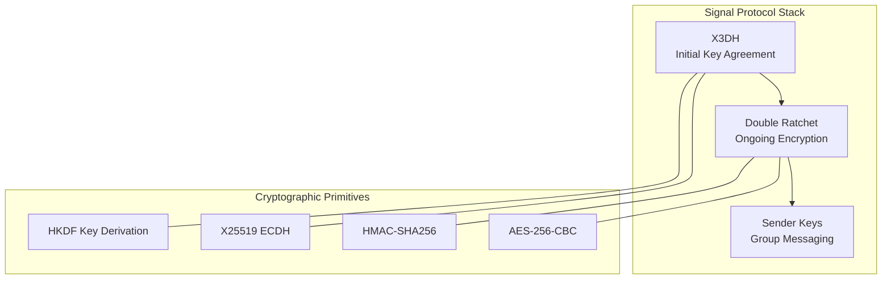
```mermaid
flowchart TB
    subgraph "Signal Protocol Stack"
        direction TB
        X3DH["X3DH<br/>Initial Key Agreement"]
        DR["Double Ratchet<br/>Ongoing Encryption"]
        SK["Sender Keys<br/>Group Messaging"]

        X3DH --> DR
        DR --> SK
    end

    subgraph "Cryptographic Primitives"
        direction TB
        ECDH["X25519 ECDH"]
        AES["AES-256-CBC"]
        HMAC["HMAC-SHA256"]
        HKDF["HKDF Key Derivation"]
    end

    X3DH --- ECDH
    DR --- AES
    DR --- HMAC
    X3DH --- HKDF
```

### X3DH (Extended Triple Diffie-Hellman)

X3DH provides the initial key agreement between two parties, even when one party is offline.

#### Key Types

| Key Type | Lifespan | Purpose |
|----------|----------|---------|
| **Identity Key (IK)** | Long-term | Persistent identity verification |
| **Signed Prekey (SPK)** | Medium-term (weekly rotation) | Signed by IK, provides authentication |
| **One-Time Prekey (OPK)** | Single use | Provides forward secrecy for initial messages |
| **Ephemeral Key (EK)** | Single use | Generated per session by initiator |

#### X3DH Key Agreement Flow

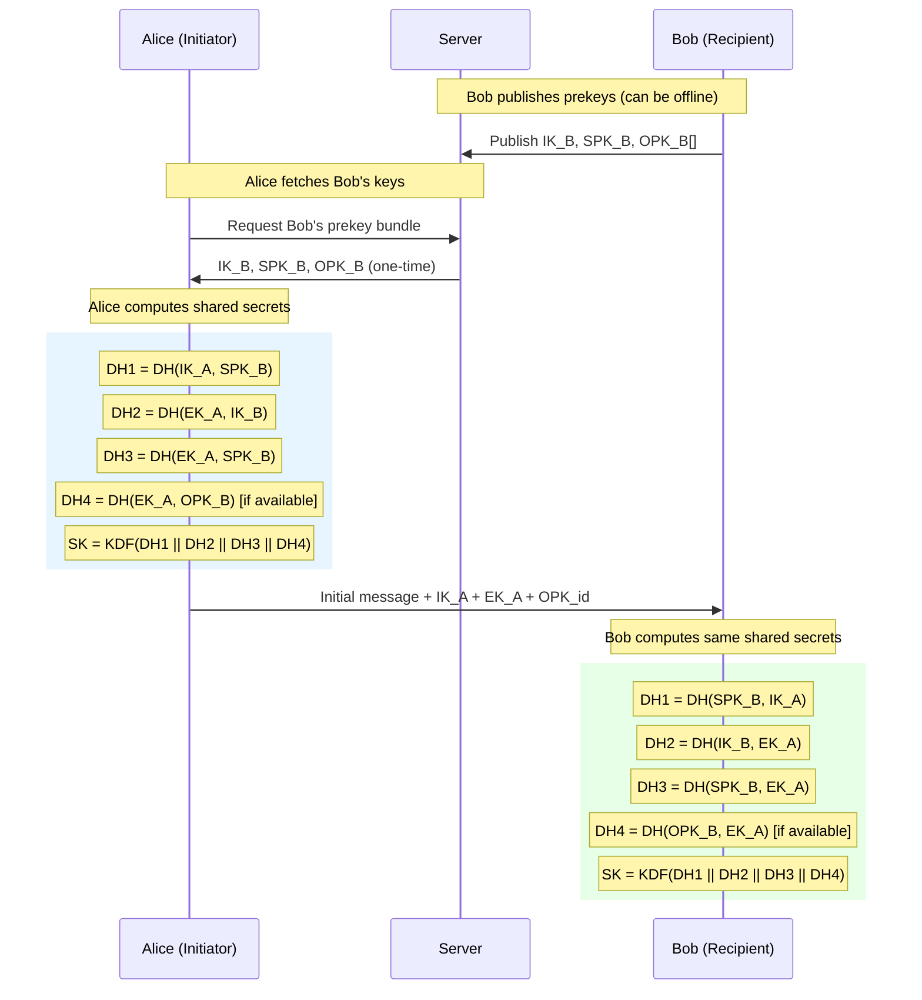
```mermaid
sequenceDiagram
    participant A as Alice (Initiator)
    participant S as Server
    participant B as Bob (Recipient)

    Note over B,S: Bob publishes prekeys (can be offline)
    B->>S: Publish IK_B, SPK_B, OPK_B[]

    Note over A,S: Alice fetches Bob's keys
    A->>S: Request Bob's prekey bundle
    S->>A: IK_B, SPK_B, OPK_B (one-time)

    Note over A: Alice computes shared secrets
    rect rgb(230, 245, 255)
        Note over A: DH1 = DH(IK_A, SPK_B)
        Note over A: DH2 = DH(EK_A, IK_B)
        Note over A: DH3 = DH(EK_A, SPK_B)
        Note over A: DH4 = DH(EK_A, OPK_B) [if available]
        Note over A: SK = KDF(DH1 || DH2 || DH3 || DH4)
    end

    A->>B: Initial message + IK_A + EK_A + OPK_id

    Note over B: Bob computes same shared secrets
    rect rgb(230, 255, 230)
        Note over B: DH1 = DH(SPK_B, IK_A)
        Note over B: DH2 = DH(IK_B, EK_A)
        Note over B: DH3 = DH(SPK_B, EK_A)
        Note over B: DH4 = DH(OPK_B, EK_A) [if available]
        Note over B: SK = KDF(DH1 || DH2 || DH3 || DH4)
    end
```

#### Security Properties of X3DH

| Property | Mechanism |
|----------|-----------|
| **Mutual Authentication** | Both parties' identity keys are involved |
| **Forward Secrecy** | One-time prekeys ensure past sessions are protected |
| **Deniability** | No digital signatures on messages |
| **Asynchronous** | Works even when recipient is offline |

### Double Ratchet Algorithm

The Double Ratchet provides ongoing forward secrecy and break-in recovery through continuous key evolution.

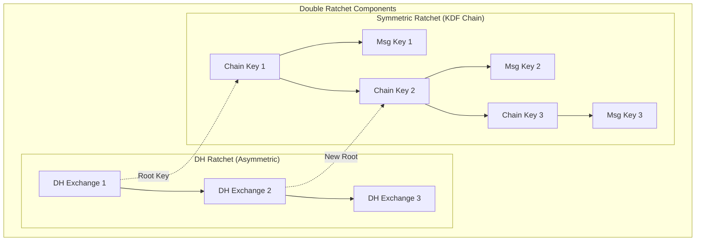
```mermaid
flowchart TB
    subgraph "Double Ratchet Components"
        direction LR

        subgraph "DH Ratchet (Asymmetric)"
            DH1["DH Exchange 1"]
            DH2["DH Exchange 2"]
            DH3["DH Exchange 3"]
            DH1 --> DH2 --> DH3
        end

        subgraph "Symmetric Ratchet (KDF Chain)"
            CK1["Chain Key 1"]
            CK2["Chain Key 2"]
            CK3["Chain Key 3"]
            MK1["Msg Key 1"]
            MK2["Msg Key 2"]
            MK3["Msg Key 3"]

            CK1 --> CK2 --> CK3
            CK1 --> MK1
            CK2 --> MK2
            CK3 --> MK3
        end

        DH1 -.->|"Root Key"| CK1
        DH2 -.->|"New Root"| CK2
    end
```

#### Double Ratchet Operation

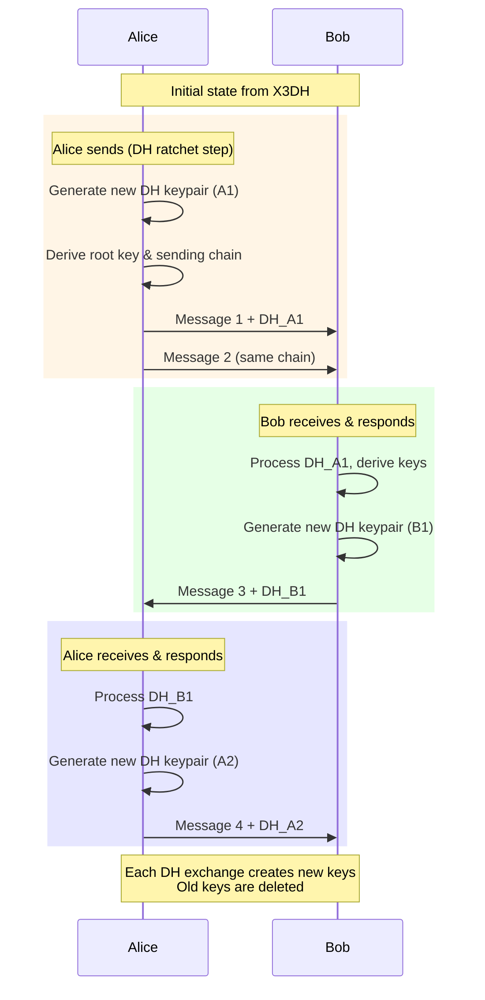
```mermaid
sequenceDiagram
    participant A as Alice
    participant B as Bob

    Note over A,B: Initial state from X3DH

    rect rgb(255, 245, 230)
        Note over A: Alice sends (DH ratchet step)
        A->>A: Generate new DH keypair (A1)
        A->>A: Derive root key & sending chain
        A->>B: Message 1 + DH_A1
        A->>B: Message 2 (same chain)
    end

    rect rgb(230, 255, 230)
        Note over B: Bob receives & responds
        B->>B: Process DH_A1, derive keys
        B->>B: Generate new DH keypair (B1)
        B->>A: Message 3 + DH_B1
    end

    rect rgb(230, 230, 255)
        Note over A: Alice receives & responds
        A->>A: Process DH_B1
        A->>A: Generate new DH keypair (A2)
        A->>B: Message 4 + DH_A2
    end

    Note over A,B: Each DH exchange creates new keys<br/>Old keys are deleted
```

#### Key Derivation in Double Ratchet

```
// DH Ratchet Step
dh_output = DH(my_private, their_public)
(root_key, chain_key) = KDF(root_key, dh_output)

// Symmetric Ratchet Step (per message)
(chain_key, message_key) = KDF(chain_key)
```

### Prekeys and One-Time Prekeys

The prekey system enables asynchronous key agreement:

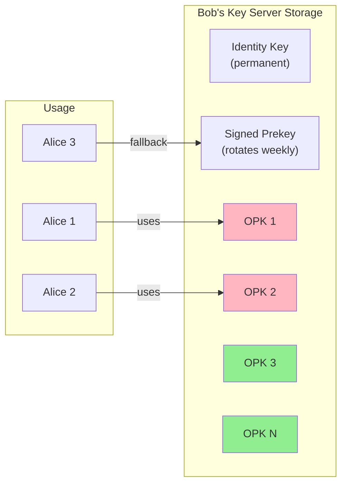
```mermaid
flowchart LR
    subgraph "Bob's Key Server Storage"
        IK["Identity Key<br/>(permanent)"]
        SPK["Signed Prekey<br/>(rotates weekly)"]
        OPK1["OPK 1"]
        OPK2["OPK 2"]
        OPK3["OPK 3"]
        OPKN["OPK N"]
    end

    subgraph "Usage"
        A1["Alice 1"] -->|uses| OPK1
        A2["Alice 2"] -->|uses| OPK2
        A3["Alice 3"] -->|fallback| SPK
    end

    style OPK1 fill:#FFB6C1
    style OPK2 fill:#FFB6C1
    style OPK3 fill:#90EE90
    style OPKN fill:#90EE90
```

**One-time prekey exhaustion**: When all OPKs are consumed, X3DH falls back to using only the signed prekey, which provides weaker forward secrecy for the initial message.

### Session Management

Signal Protocol maintains separate sessions per device:

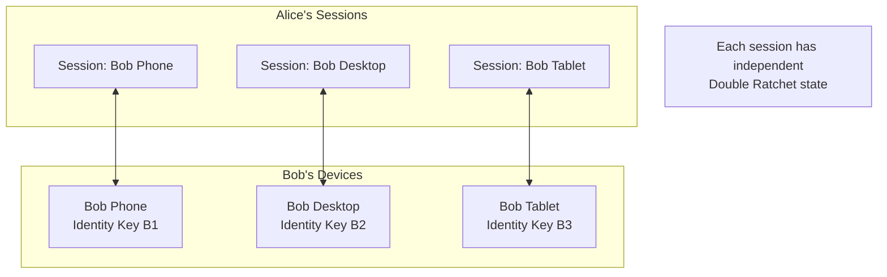
```mermaid
flowchart TB
    subgraph "Alice's Sessions"
        AS1["Session: Bob Phone"]
        AS2["Session: Bob Desktop"]
        AS3["Session: Bob Tablet"]
    end

    subgraph "Bob's Devices"
        BP["Bob Phone<br/>Identity Key B1"]
        BD["Bob Desktop<br/>Identity Key B2"]
        BT["Bob Tablet<br/>Identity Key B3"]
    end

    AS1 <--> BP
    AS2 <--> BD
    AS3 <--> BT

    Note1["Each session has independent<br/>Double Ratchet state"]
```

---

## Encryption Model

### Pairwise vs Group Encryption

Signal Protocol was originally designed for **pairwise (1:1) encryption**. Group messaging was added later using Sender Keys.

#### Pairwise Encryption Flow

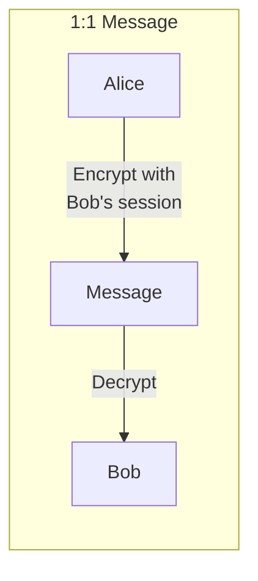
```mermaid
flowchart LR
    subgraph "1:1 Message"
        A["Alice"] -->|"Encrypt with<br/>Bob's session"| M["Message"]
        M -->|"Decrypt"| B["Bob"]
    end
```

- Each pair maintains independent Double Ratchet state
- True forward secrecy per message
- O(1) encryption/decryption per message

#### Group Encryption with Sender Keys

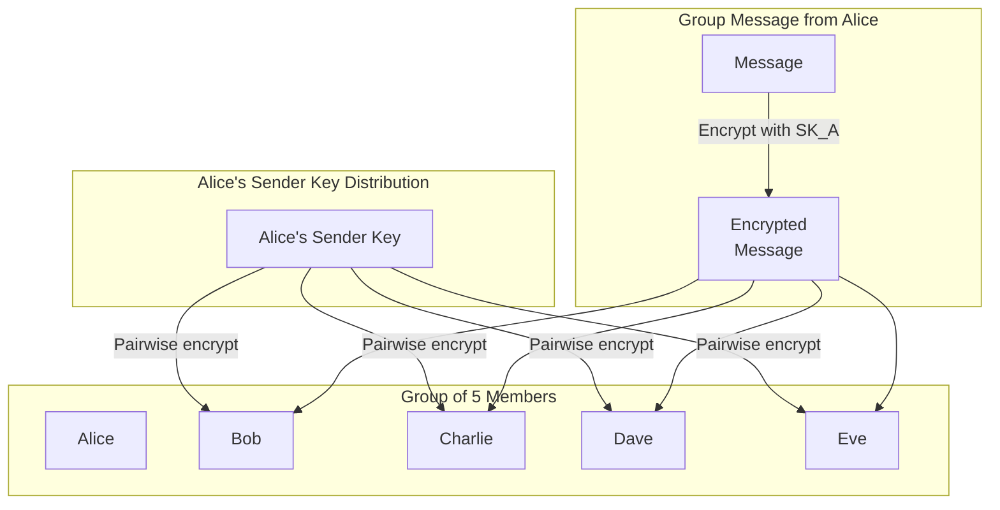
```mermaid
flowchart TB
    subgraph "Group of 5 Members"
        A["Alice"]
        B["Bob"]
        C["Charlie"]
        D["Dave"]
        E["Eve"]
    end

    subgraph "Alice's Sender Key Distribution"
        SK_A["Alice's Sender Key"]
        SK_A -->|"Pairwise encrypt"| B
        SK_A -->|"Pairwise encrypt"| C
        SK_A -->|"Pairwise encrypt"| D
        SK_A -->|"Pairwise encrypt"| E
    end

    subgraph "Group Message from Alice"
        MSG["Message"]
        MSG -->|"Encrypt with SK_A"| EMSG["Encrypted<br/>Message"]
        EMSG --> B
        EMSG --> C
        EMSG --> D
        EMSG --> E
    end
```

**Sender Keys approach:**
1. Each member generates a Sender Key (symmetric)
2. Distributes Sender Key to all other members via pairwise channels
3. Encrypts group messages with their Sender Key
4. All members can decrypt using the sender's key

### Forward Secrecy Mechanism

| Level | Mechanism | Granularity |
|-------|-----------|-------------|
| **Session** | X3DH with OPK | Per conversation initiation |
| **Message (1:1)** | Double Ratchet | Per message exchange |
| **Group** | Sender Key ratchet | Per sender message |

#### Forward Secrecy Comparison

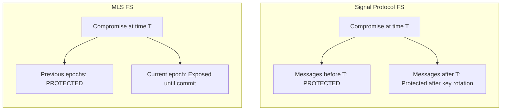
```mermaid
flowchart TB
    subgraph "Signal Protocol FS"
        direction TB
        S1["Compromise at time T"]
        S2["Messages before T: PROTECTED"]
        S3["Messages after T: Protected after key rotation"]
        S1 --> S2
        S1 --> S3
    end

    subgraph "MLS FS"
        direction TB
        M1["Compromise at time T"]
        M2["Previous epochs: PROTECTED"]
        M3["Current epoch: Exposed until commit"]
        M1 --> M2
        M1 --> M3
    end
```

### Post-Compromise Security (PCS)

Post-compromise security ensures that after a key compromise, security is restored once new keys are established.

**Signal Protocol PCS:**
- **1:1 chats**: Achieved after one round-trip (DH ratchet step)
- **Groups**: Achieved when sender rotates their Sender Key

**Limitation**: In groups, a compromised Sender Key remains valid until that specific member sends a message with a new key.

### Group Messaging Deep Dive

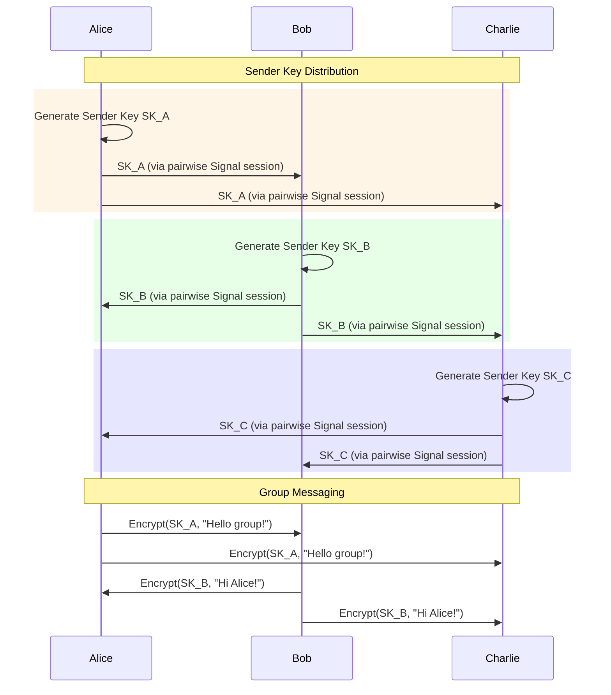
```mermaid
sequenceDiagram
    participant A as Alice
    participant B as Bob
    participant C as Charlie

    Note over A,C: Sender Key Distribution

    rect rgb(255, 245, 230)
        A->>A: Generate Sender Key SK_A
        A->>B: SK_A (via pairwise Signal session)
        A->>C: SK_A (via pairwise Signal session)
    end

    rect rgb(230, 255, 230)
        B->>B: Generate Sender Key SK_B
        B->>A: SK_B (via pairwise Signal session)
        B->>C: SK_B (via pairwise Signal session)
    end

    rect rgb(230, 230, 255)
        C->>C: Generate Sender Key SK_C
        C->>A: SK_C (via pairwise Signal session)
        C->>B: SK_C (via pairwise Signal session)
    end

    Note over A,C: Group Messaging

    A->>B: Encrypt(SK_A, "Hello group!")
    A->>C: Encrypt(SK_A, "Hello group!")

    B->>A: Encrypt(SK_B, "Hi Alice!")
    B->>C: Encrypt(SK_B, "Hi Alice!")
```

---

## Signal Protocol vs MLS Comparison

### Architectural Comparison

| Aspect | Signal Protocol | MLS (RFC 9420) |
|--------|-----------------|----------------|
| **Design Philosophy** | Pairwise-first, groups added later | Groups-first with tree structure |
| **Group Scaling** | O(n) messages per operation | O(log n) via TreeKEM |
| **State Size** | O(n) per member | O(log n) via tree |
| **Forward Secrecy** | Per-message (1:1), per-sender (group) | Per-epoch |
| **PCS Recovery** | After single message round-trip | After commit processed |
| **Key Agreement** | X3DH | TreeKEM |
| **Ratcheting** | Double Ratchet (continuous) | Epoch-based (discrete) |

### Scalability Analysis

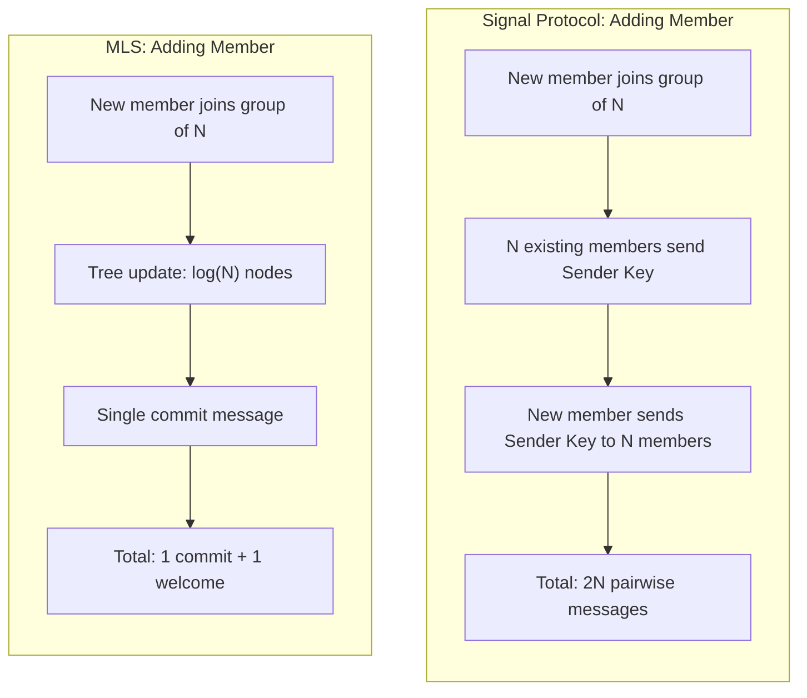
```mermaid
flowchart TB
    subgraph "Signal Protocol: Adding Member"
        direction TB
        SA1["New member joins group of N"]
        SA2["N existing members send Sender Key"]
        SA3["New member sends Sender Key to N members"]
        SA4["Total: 2N pairwise messages"]
        SA1 --> SA2 --> SA3 --> SA4
    end

    subgraph "MLS: Adding Member"
        direction TB
        MA1["New member joins group of N"]
        MA2["Tree update: log(N) nodes"]
        MA3["Single commit message"]
        MA4["Total: 1 commit + 1 welcome"]
        MA1 --> MA2 --> MA3 --> MA4
    end
```

### Performance Comparison

| Operation | Signal (n members) | MLS (n members) |
|-----------|-------------------|-----------------|
| Create group | O(n) | O(n) |
| Add member | O(n) messages | O(log n) tree update + O(1) commit |
| Remove member | O(n) messages | O(log n) tree update + O(1) commit |
| Send message | O(1) | O(1) |
| Receive message | O(1) | O(1) |
| Member update | O(n) messages | O(log n) commit |
| State storage | O(n) per member | O(log n) per member |

### Security Property Comparison

| Property | Signal Protocol | MLS |
|----------|-----------------|-----|
| **Confidentiality** | AES-256 | AEAD (configurable) |
| **Authentication** | Ed25519 signatures | Configurable (Ed25519, etc.) |
| **Forward Secrecy** | Strong (per-message for 1:1) | Per-epoch |
| **PCS** | Fast (next message) | Requires commit |
| **Deniability** | Strong (no signatures on content) | Weaker (signed commits) |
| **Metadata Protection** | Limited | Limited |
| **Transcript Consistency** | Not guaranteed | Guaranteed via tree |

### Group Membership Consistency

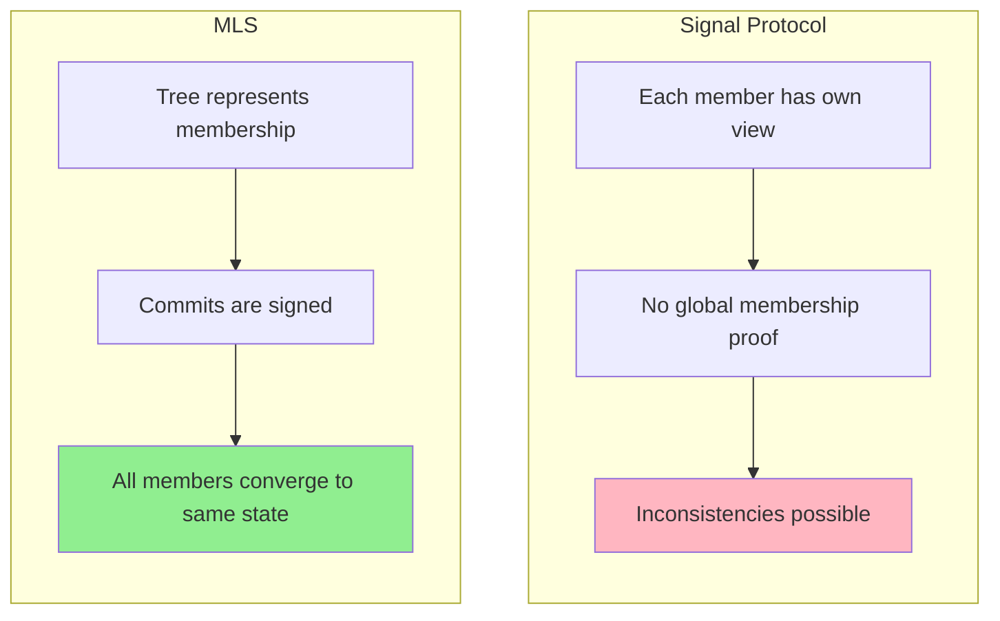
```mermaid
flowchart TB
    subgraph "Signal Protocol"
        direction TB
        SP1["Each member has own view"]
        SP2["No global membership proof"]
        SP3["Inconsistencies possible"]
        SP1 --> SP2 --> SP3
    end

    subgraph "MLS"
        direction TB
        MLS1["Tree represents membership"]
        MLS2["Commits are signed"]
        MLS3["All members converge to same state"]
        MLS1 --> MLS2 --> MLS3
    end

    style SP3 fill:#FFB6C1
    style MLS3 fill:#90EE90
```

---

## Compatibility with obsidian-ee

### Current Architecture Review

Our current architecture uses:
- **Yrs CRDT** for conflict-free document synchronization
- **MLS (RFC 9420)** for group key management
- **WebSocket Relay** for message routing

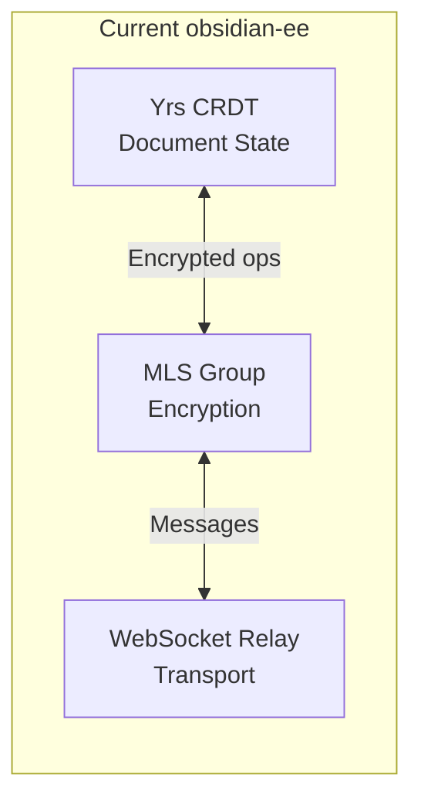
```mermaid
flowchart TB
    subgraph "Current obsidian-ee"
        direction TB
        YRS["Yrs CRDT<br/>Document State"]
        MLS["MLS Group<br/>Encryption"]
        WS["WebSocket Relay<br/>Transport"]

        YRS <-->|"Encrypted ops"| MLS
        MLS <-->|"Messages"| WS
    end
```

### Could Signal Protocol Replace MLS?

#### Technical Feasibility: YES, with caveats

Signal Protocol could theoretically replace MLS, but with significant architectural changes:

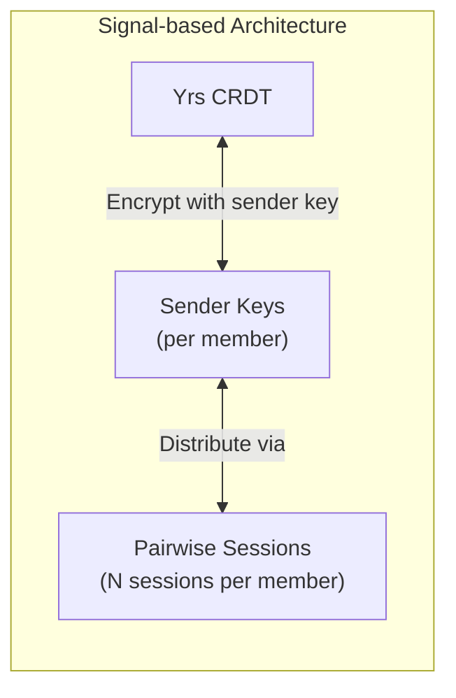
```mermaid
flowchart TB
    subgraph "Signal-based Architecture"
        direction TB
        YRS2["Yrs CRDT"]
        SK["Sender Keys<br/>(per member)"]
        PW["Pairwise Sessions<br/>(N sessions per member)"]

        YRS2 <-->|"Encrypt with sender key"| SK
        SK <-->|"Distribute via"| PW
    end
```

#### What Would Need to Change

| Component | Current (MLS) | Signal Protocol |
|-----------|---------------|-----------------|
| **Key Management** | TreeKEM group state | N pairwise sessions + Sender Keys |
| **Add Member** | Single commit + welcome | N pairwise key exchanges |
| **Remove Member** | Commit message | N Sender Key rotations |
| **Epoch/State** | Single epoch counter | No global state concept |
| **State Storage** | O(log n) tree | O(n) sessions |

### Integration with Yrs CRDT

**Challenge 1: Operation Ordering**

Yrs CRDT is designed for eventual consistency - operations can arrive out of order. Both protocols can work with this.

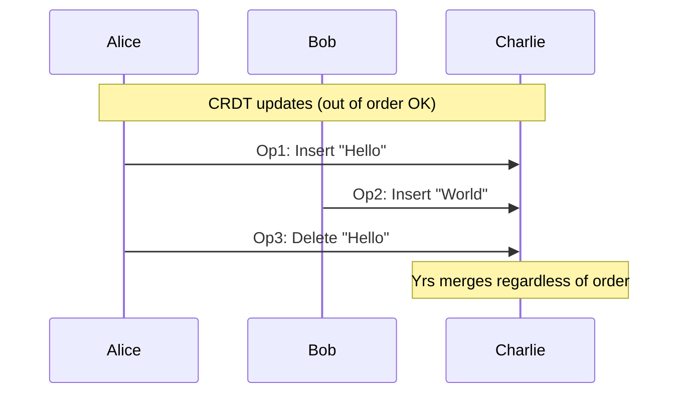
```mermaid
sequenceDiagram
    participant A as Alice
    participant B as Bob
    participant C as Charlie

    Note over A,C: CRDT updates (out of order OK)

    A->>C: Op1: Insert "Hello"
    B->>C: Op2: Insert "World"
    A->>C: Op3: Delete "Hello"

    Note over C: Yrs merges regardless of order
```

**Challenge 2: Group Membership Changes**

| Scenario | MLS | Signal Protocol |
|----------|-----|-----------------|
| Alice adds Bob | Commit to all, Welcome to Bob | Alice-Bob X3DH, then N Sender Key exchanges |
| Alice removes Bob | Commit to all | All members must rotate Sender Keys |
| Bob goes offline | Commit queued, applied on reconnect | Sender Keys must be resent when Bob reconnects |

**Challenge 3: Concurrent Operations**

MLS has explicit epochs; Signal Protocol does not have a global state concept.

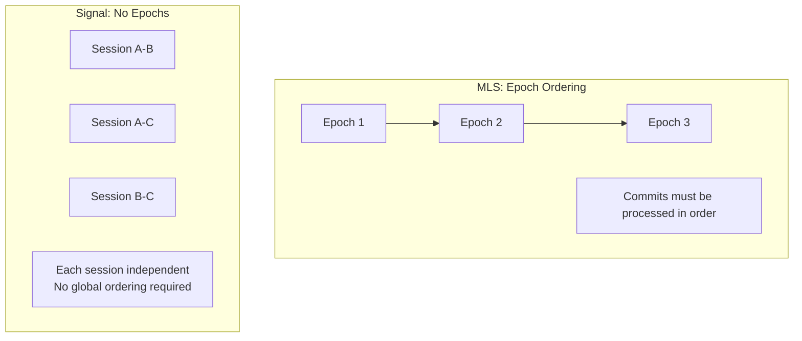
```mermaid
flowchart TB
    subgraph "MLS: Epoch Ordering"
        E1["Epoch 1"] --> E2["Epoch 2"] --> E3["Epoch 3"]
        Note1["Commits must be processed in order"]
    end

    subgraph "Signal: No Epochs"
        S1["Session A-B"]
        S2["Session A-C"]
        S3["Session B-C"]
        Note2["Each session independent<br/>No global ordering required"]
    end
```

### Hybrid Approaches

#### Option 1: Signal for 1:1, MLS for Groups

Use Signal Protocol for direct messages, MLS for document collaboration.

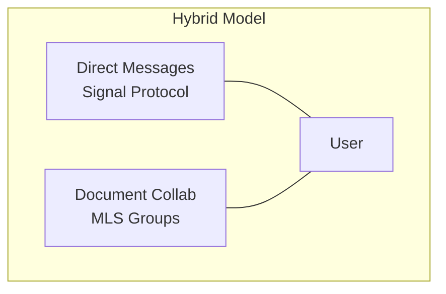
```mermaid
flowchart TB
    subgraph "Hybrid Model"
        DM["Direct Messages<br/>Signal Protocol"]
        DOC["Document Collab<br/>MLS Groups"]

        DM --- USER["User"]
        DOC --- USER
    end
```

**Pros**: Best of both worlds for different use cases
**Cons**: Two separate crypto stacks to maintain

#### Option 2: Signal-only with Custom Group Layer

Build a custom group layer on top of Signal's pairwise sessions.

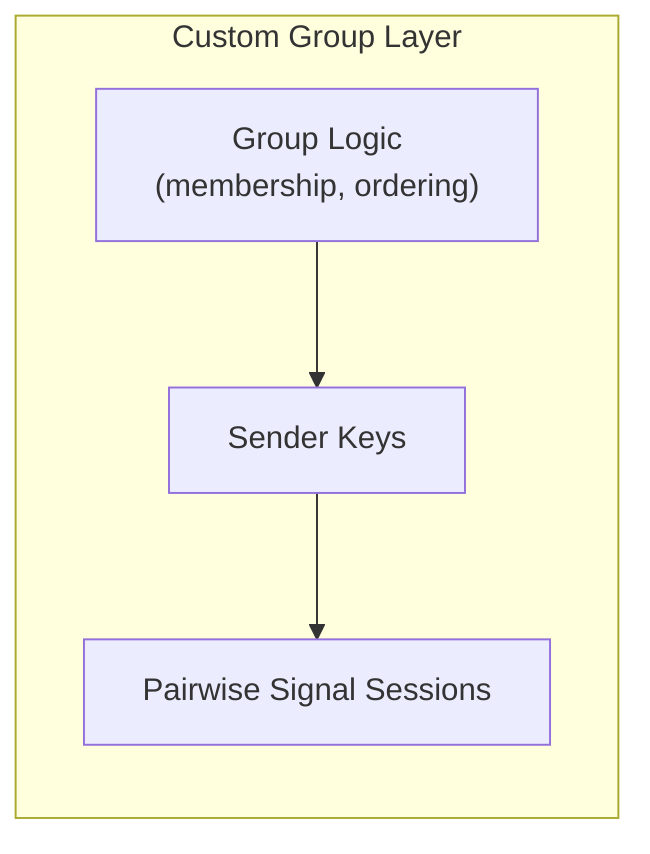
```mermaid
flowchart TB
    subgraph "Custom Group Layer"
        direction TB
        GL["Group Logic<br/>(membership, ordering)"]
        SK["Sender Keys"]
        PW["Pairwise Signal Sessions"]

        GL --> SK --> PW
    end
```

**Pros**: Leverages battle-tested Signal primitives
**Cons**: Reinventing what MLS already provides

#### Option 3: Dual-Protocol (Recommended for Evaluation)

Maintain both implementations with abstraction layer.

```rust
/// Unified encryption interface
#[async_trait]
pub trait GroupEncryption: Send + Sync {
    /// Add a member to the group
    async fn add_member(&mut self, identity: &Identity) -> Result<()>;

    /// Remove a member from the group
    async fn remove_member(&mut self, identity: &Identity) -> Result<()>;

    /// Encrypt a CRDT operation
    async fn encrypt(&mut self, operation: &[u8]) -> Result<Vec<u8>>;

    /// Decrypt a CRDT operation
    async fn decrypt(&mut self, ciphertext: &[u8]) -> Result<Vec<u8>>;
}

// Implementations
pub struct MlsEncryption { /* current implementation */ }
pub struct SignalEncryption { /* new implementation */ }
```

---

## Pros and Cons for Our Use Case

### Advantages of Signal Protocol

| Advantage | Relevance to obsidian-ee |
|-----------|-------------------------|
| **Battle-tested at scale** | WhatsApp, Signal prove it works for billions | High |
| **Library availability** | libsignal (Rust), libsignal-protocol-java | High |
| **Per-message forward secrecy (1:1)** | Stronger than MLS epoch-based FS | Medium |
| **Fast PCS recovery** | Next message restores security | Medium |
| **Deniability** | Users can deny sending messages | Low |
| **Simpler mental model** | Easier to explain to users | Low |

### Disadvantages of Signal Protocol

| Disadvantage | Impact on obsidian-ee |
|--------------|----------------------|
| **O(n) group operations** | Poor scalability for large documents | High |
| **No transcript consistency** | Members may have different views | High |
| **State explosion** | O(n) sessions per member | Medium |
| **No native group concept** | Sender Keys are an add-on | Medium |
| **Complex key distribution** | Managing prekeys at scale | Medium |
| **Weaker group FS** | Sender Key ratchet less frequent | Medium |

### Library Availability

#### libsignal (Rust)

```toml
# Cargo.toml
[dependencies]
libsignal-protocol = "0.1"
```

**Status**: Official Signal implementation, actively maintained
**Caveats**:
- Licensed under AGPL-3.0 (viral license)
- Primary focus is Signal app, not general use

#### signal-protocol (Rust, third-party)

```toml
[dependencies]
signal-protocol = "0.1"
```

**Status**: Community implementation
**Caveats**: Less tested, may lag behind spec

#### Comparison with OpenMLS

| Aspect | libsignal | OpenMLS (current) |
|--------|-----------|-------------------|
| **License** | AGPL-3.0 | MIT |
| **Maturity** | Production (Signal app) | Maturing |
| **Documentation** | Limited | Good |
| **Group support** | Sender Keys (add-on) | Native TreeKEM |
| **Maintenance** | Signal Foundation | OpenMLS community |

### Complexity Analysis

#### Implementation Complexity

| Task | Signal Protocol | MLS |
|------|-----------------|-----|
| Initial setup | Medium (X3DH + prekeys) | Medium (TreeKEM) |
| Add member | High (N pairwise exchanges) | Low (single commit) |
| Remove member | High (N key rotations) | Low (single commit) |
| Key server | Required (prekey storage) | Optional (can be stateless) |
| State management | Complex (N sessions) | Simpler (tree state) |

#### Operational Complexity

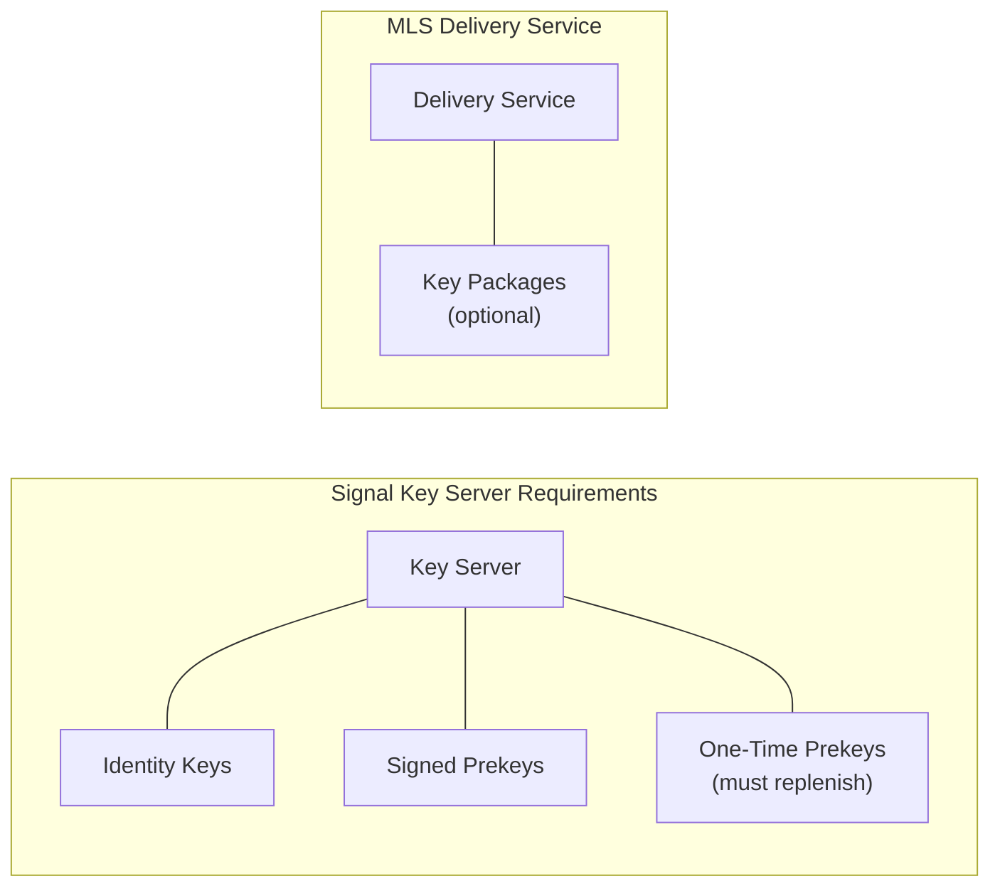
```mermaid
flowchart LR
    subgraph "Signal Key Server Requirements"
        KS["Key Server"]
        IK["Identity Keys"]
        SPK["Signed Prekeys"]
        OPK["One-Time Prekeys<br/>(must replenish)"]

        KS --- IK
        KS --- SPK
        KS --- OPK
    end

    subgraph "MLS Delivery Service"
        DS["Delivery Service"]
        KP["Key Packages<br/>(optional)"]

        DS --- KP
    end
```

### Group Message Efficiency

For a group of N members:

| Operation | Signal Protocol | MLS |
|-----------|-----------------|-----|
| Send message | 1 encryption | 1 encryption |
| Receive message | 1 decryption | 1 decryption |
| Add member | N key exchanges | 1 commit + 1 welcome |
| State update | N messages | 1 commit |

**For obsidian-ee typical use case (5-20 collaborators):**
- Signal Protocol: Manageable but not optimal
- MLS: Well-suited

**For large groups (50+ collaborators):**
- Signal Protocol: Significant overhead
- MLS: Scales efficiently

---

## Risk Analysis

### How Signal Protocol Handles Our Risk Matrix

Reference: [P2P Architecture Risk Matrix](/docs/v2/p2p-architecture.md)

| Risk | Signal Protocol Handling | Comparison to MLS |
|------|-------------------------|-------------------|
| **MLS epoch desync** | N/A - no epochs | Eliminates this specific issue |
| **Welcome message loss** | Similar - X3DH requires delivery | Same risk profile |
| **Split-brain groups** | Higher risk - no global state | MLS tree provides consistency |
| **IP address leakage** | Same - transport layer issue | No difference |
| **Eclipse attacks** | Same - transport layer issue | No difference |
| **Sybil attacks** | Slightly better - pairwise auth | MLS also authenticates members |

### Epoch Desync Equivalent Issues

Signal Protocol doesn't have "epochs," but it has equivalent synchronization challenges:

#### Sender Key Distribution Failure

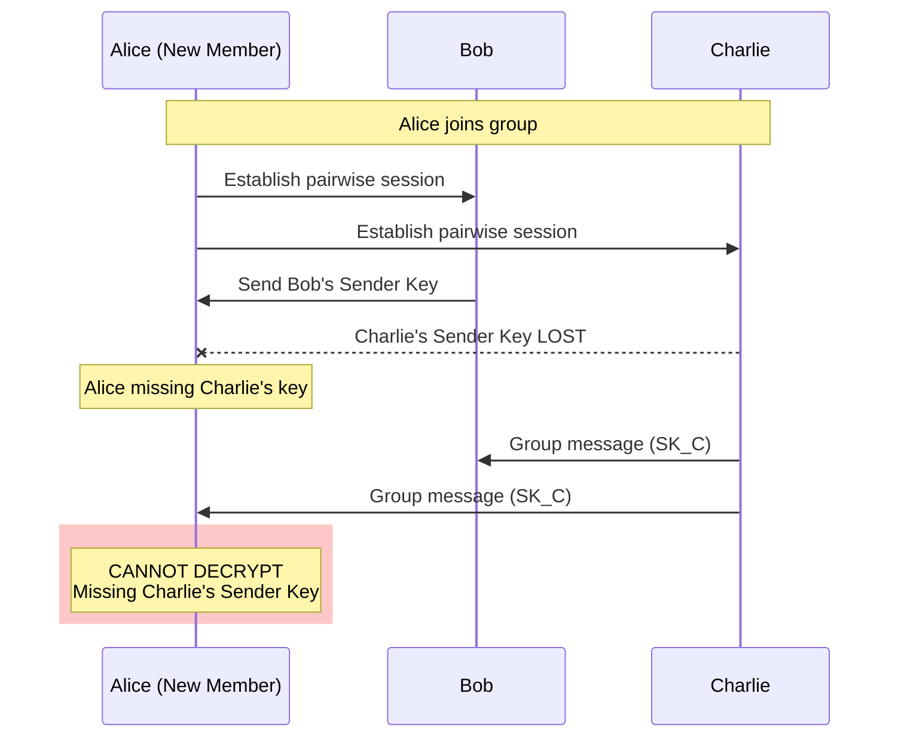
```mermaid
sequenceDiagram
    participant A as Alice (New Member)
    participant B as Bob
    participant C as Charlie

    Note over A,C: Alice joins group

    A->>B: Establish pairwise session
    A->>C: Establish pairwise session

    B->>A: Send Bob's Sender Key
    C--xA: Charlie's Sender Key LOST

    Note over A: Alice missing Charlie's key

    C->>B: Group message (SK_C)
    C->>A: Group message (SK_C)

    rect rgb(255, 200, 200)
        Note over A: CANNOT DECRYPT<br/>Missing Charlie's Sender Key
    end
```

**Impact**: Same as MLS epoch desync - member cannot decrypt messages from specific senders.

#### Session State Divergence

In Signal Protocol, session state can diverge if messages are lost:

```mermaid
sequenceDiagram
    participant A as Alice
    participant B as Bob

    Note over A,B: Double Ratchet in progress

    A->>B: Message 1 (DH_A1)
    B->>A: Message 2 (DH_B1)
    A--xB: Message 3 (DH_A2) LOST
    A->>B: Message 4 (DH_A2 chain)

    rect rgb(255, 200, 200)
        Note over B: Message 4 uses unknown DH key<br/>Decryption fails
    end

    Note over A,B: Must re-establish session
```

### Key Distribution Challenges

Signal Protocol requires more infrastructure for key distribution:

```mermaid
flowchart TB
    subgraph "Key Distribution Infrastructure"
        KS["Key Server"]

        subgraph "Per User Storage"
            IK["Identity Key"]
            SPK["Signed Prekey<br/>(rotate weekly)"]
            OPK["One-Time Prekeys<br/>(100+ recommended)"]
        end

        KS --> IK
        KS --> SPK
        KS --> OPK
    end

    subgraph "Operational Concerns"
        R1["OPK Replenishment"]
        R2["SPK Rotation"]
        R3["Multi-device Sync"]
    end

    OPK -.->|"Must monitor"| R1
    SPK -.->|"Must schedule"| R2
    IK -.->|"Must coordinate"| R3
```

**Challenges for obsidian-ee:**
1. Need to run a key server (or use existing infrastructure)
2. Clients must proactively replenish one-time prekeys
3. Multi-device scenarios require identity key management

### Comparison: Risk Profiles

| Risk Category | Signal Protocol | MLS | Winner |
|---------------|-----------------|-----|--------|
| **Scalability** | O(n) operations | O(log n) operations | MLS |
| **Consistency** | No guarantees | Tree consistency | MLS |
| **Forward Secrecy** | Per-message (1:1) | Per-epoch | Signal (1:1), MLS (groups) |
| **PCS** | Fast recovery | Requires commit | Signal |
| **Operational** | Key server required | Simpler | MLS |
| **Library Maturity** | Production (Signal) | Maturing | Signal |
| **License** | AGPL-3.0 | MIT (OpenMLS) | MLS |

---

## Recommendation

### Summary

After comprehensive evaluation, **we recommend continuing with MLS (RFC 9420)** for obsidian-ee v2, with the following reasoning:

### Decision Matrix

| Factor | Weight | Signal Protocol | MLS | Notes |
|--------|--------|-----------------|-----|-------|
| **Group scalability** | High | 2/5 | 5/5 | MLS O(log n) vs Signal O(n) |
| **Library availability** | High | 4/5 | 4/5 | Both have Rust implementations |
| **License compatibility** | High | 2/5 | 5/5 | AGPL vs MIT |
| **Group consistency** | High | 2/5 | 5/5 | MLS tree provides guarantees |
| **Forward secrecy** | Medium | 5/5 | 4/5 | Signal stronger for 1:1 |
| **Operational complexity** | Medium | 2/5 | 4/5 | Signal needs key server |
| **Battle-tested** | Medium | 5/5 | 3/5 | Signal deployed at scale |
| **CRDT compatibility** | Medium | 4/5 | 4/5 | Both work with Yrs |
| **Weighted Score** | - | **2.9/5** | **4.4/5** | MLS preferred |

### Rationale

1. **Group-first design**: obsidian-ee is fundamentally about collaborative (group) document editing. MLS was designed for groups; Signal Protocol added groups as an afterthought.

2. **Scalability**: Document collaboration can involve many participants. MLS's O(log n) scaling is significantly better than Signal's O(n).

3. **Consistency guarantees**: MLS's tree structure provides transcript consistency. This aligns with CRDT's consistency goals.

4. **License**: OpenMLS's MIT license is more compatible with various deployment scenarios than libsignal's AGPL-3.0.

5. **Operational simplicity**: MLS doesn't require a dedicated key server for prekey management.

### When Signal Protocol Would Be Preferred

Signal Protocol would be the better choice if:
- Primary use case is 1:1 messaging (not our case)
- Maximum per-message forward secrecy is critical
- Deniability is a key requirement
- Groups are small and fixed (< 10 members)

### Future Considerations

1. **Monitor MLS ecosystem maturity**: As OpenMLS matures, we gain more confidence.

2. **Consider Signal for direct messaging**: If we add 1:1 chat features, Signal Protocol could complement MLS.

3. **Watch for Signal group improvements**: Signal Foundation may improve group scalability.

4. **Evaluate hybrid approaches**: For specific use cases, combining protocols might be beneficial.

### Migration Path (If Needed)

If future requirements change, migration from MLS to Signal Protocol would involve:

```mermaid
flowchart TB
    subgraph "Phase 1: Abstraction"
        A1["Create GroupEncryption trait"]
        A2["Wrap MlsDocumentGroup"]
    end

    subgraph "Phase 2: Implementation"
        B1["Implement SignalEncryption"]
        B2["Add key server support"]
        B3["Implement Sender Keys"]
    end

    subgraph "Phase 3: Migration"
        C1["Support both protocols"]
        C2["Gradual migration"]
        C3["Deprecate MLS (if needed)"]
    end

    A1 --> A2 --> B1 --> B2 --> B3 --> C1 --> C2 --> C3
```

---

## References

### Signal Protocol Specifications

- [Signal Protocol Technical Documentation](https://signal.org/docs/)
- [X3DH Specification](https://signal.org/docs/specifications/x3dh/)
- [Double Ratchet Specification](https://signal.org/docs/specifications/doubleratchet/)
- [Sesame: Managing Sessions](https://signal.org/docs/specifications/sesame/)

### MLS Specifications

- [RFC 9420: The Messaging Layer Security (MLS) Protocol](https://datatracker.ietf.org/doc/rfc9420/)
- [OpenMLS Documentation](https://openmls.tech/book/)

### Academic Papers

- Cohn-Gordon, K., et al. "A Formal Security Analysis of the Signal Messaging Protocol." IEEE EuroS&P 2017.
- Alwen, J., et al. "Modular Design of Secure Group Messaging Protocols and the Security of MLS." ACM CCS 2021.
- Marlinspike, M., Perrin, T. "The Double Ratchet Algorithm." 2016.

### Implementation Resources

- [libsignal (Rust)](https://github.com/signalapp/libsignal)
- [OpenMLS (Rust)](https://github.com/openmls/openmls)
- [Signal Protocol Wikipedia](https://en.wikipedia.org/wiki/Signal_Protocol)

### Related obsidian-ee Documentation

- [P2P Architecture Analysis](/docs/v2/p2p-architecture.md)
- [MLS Epoch Desync Analysis](/docs/v2/sota/mls-epoch-desync.md)
- [MLS Implementation](/crates/collab-core/src/mls.rs)
