# Eclipse Attacks in P2P Networks

This document provides a comprehensive analysis of eclipse attacks in peer-to-peer networks, with specific focus on their implications for collaborative editing systems like obsidian-ee.

## Overview

### What is an Eclipse Attack?

An **eclipse attack** is a network-level attack where an adversary monopolizes all incoming and outgoing connections of a victim node, effectively isolating it from the legitimate network. The attacker "eclipses" the victim's view of the network, controlling all information the victim receives and sends.

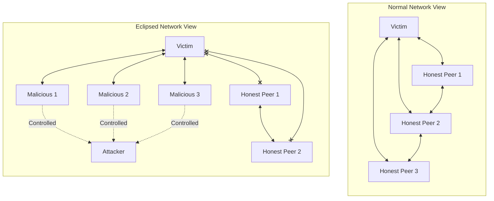

### Why Eclipse Attacks Matter for P2P

In decentralized systems, eclipse attacks undermine fundamental security assumptions:

| Assumption | Reality Under Eclipse |
|------------|----------------------|
| Peers provide diverse, honest views | All views controlled by attacker |
| Gossip reaches all network participants | Messages censored or delayed |
| Consensus reflects network majority | Victim sees attacker's "consensus" |
| Updates propagate reliably | Selective message filtering |

For collaborative editing systems, eclipse attacks can cause:
- **Document divergence** - Victim's edits never reach other collaborators
- **Stale state attacks** - Victim works on outdated document versions
- **Partition manipulation** - Artificial network splits for conflict exploitation

## Technical Background

### Peer Discovery Mechanisms

P2P networks rely on various discovery mechanisms, each with different vulnerability profiles:

#### Distributed Hash Table (DHT)

DHTs like Kademlia map peer IDs and content to locations in a virtual address space using XOR distance metrics.

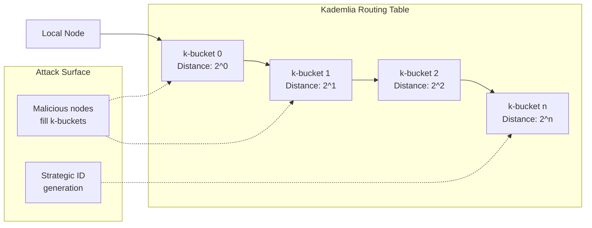

**Vulnerability:** Attackers can generate node IDs strategically placed near target keys, polluting the victim's routing table.

#### Bootstrap Nodes

Initial network entry relies on well-known bootstrap nodes:

```
1. New node contacts bootstrap node
2. Bootstrap provides initial peer list
3. Node populates routing table from these peers
4. DHT queries expand network knowledge
```

**Vulnerability:** Compromised or malicious bootstrap nodes can provide exclusively attacker-controlled peers.

#### mDNS (Multicast DNS)

Local network discovery via multicast announcements.

**Vulnerability:** Attackers on the same LAN can flood mDNS responses, appearing as multiple legitimate peers.

### Routing Tables and Neighbor Selection

#### Connection Limits

Most P2P implementations impose connection limits:

```rust
// Typical libp2p configuration
struct ConnectionLimits {
    max_established_incoming: u32,  // e.g., 128
    max_established_outgoing: u32,  // e.g., 128
    max_pending_incoming: u32,      // e.g., 32
    max_pending_outgoing: u32,      // e.g., 32
}
```

**Attack implication:** Finite connection slots mean attackers only need to fill these slots to achieve eclipse.

#### Peer Selection Algorithms

Networks use various strategies to select which peers to maintain connections with:

| Strategy | Description | Eclipse Resistance |
|----------|-------------|-------------------|
| Random | Uniform random selection | Low - predictable |
| Closest (DHT) | XOR distance to local ID | Medium - ID manipulation |
| Reputation-based | Historical behavior scoring | High - requires track record |
| Diverse | Geographic/topological diversity | High - harder to simulate |

### GossipSub Mesh Construction

GossipSub (used in Ethereum 2.0, IPFS, and libp2p) maintains topic-specific mesh overlays:

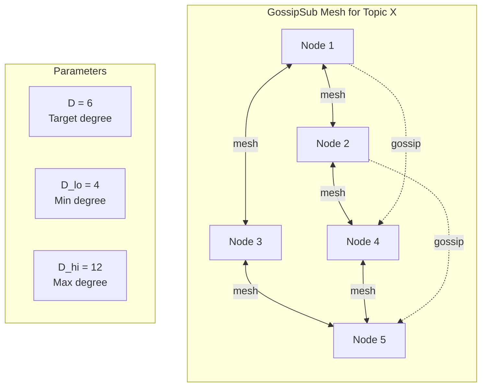

**Mesh parameters:**
- **D (degree):** Target number of mesh peers (default: 6)
- **D_lo:** Minimum mesh peers before GRAFT requests (default: 4)
- **D_hi:** Maximum mesh peers before PRUNE (default: 12)
- **D_lazy:** Gossip-only peers for redundancy (default: 6)

## Risk Assessment by Library

### y-webrtc: LOW Risk

y-webrtc uses WebRTC for peer-to-peer connections with a centralized signaling server.

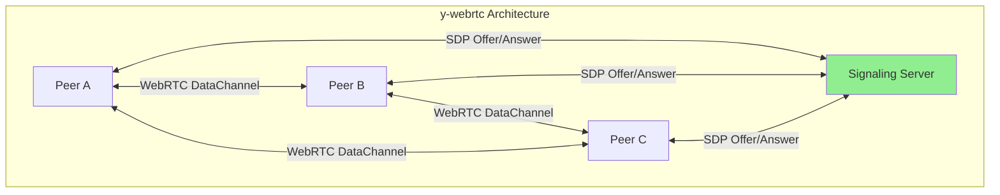

**Risk Factors:**

| Factor | Assessment | Notes |
|--------|------------|-------|
| Peer Discovery | Centralized (signaling) | Server controls peer introduction |
| Connection Topology | Full mesh | Limited scalability reduces attack surface |
| Bootstrap Trust | Single server | Server compromise = network compromise |
| ID Generation | Server-controlled | Cannot manipulate peer IDs |

**Why Lower Risk:**
1. Signaling server acts as trusted introducer
2. Room-based isolation limits peer visibility
3. Small group sizes (10-50 peers) make full mesh feasible
4. No DHT means no routing table poisoning

**Residual Risks:**
- Signaling server compromise provides full eclipse capability
- STUN/TURN server manipulation can affect connectivity
- Same-room attackers can still flood connections

### y-libp2p / GossipSub: MEDIUM-HIGH Risk

libp2p provides a full P2P stack with DHT-based discovery and gossip-based message propagation.

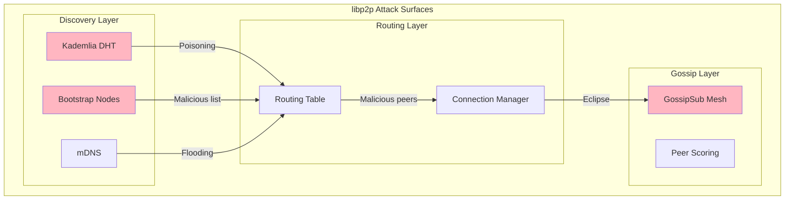

**Risk Factors:**

| Factor | Assessment | Notes |
|--------|------------|-------|
| Peer Discovery | Decentralized (DHT) | Vulnerable to poisoning |
| Connection Topology | Sparse mesh | Fewer connections = easier eclipse |
| Bootstrap Trust | Multiple nodes | Diversity helps, but all could be compromised |
| ID Generation | Self-generated | Strategic ID placement possible |
| Routing | Distance-based | Predictable neighbor selection |

**Attack Vectors:**

1. **DHT Poisoning:** Flood DHT with malicious peer records for target keys
2. **Sybil Amplification:** Generate many node IDs near victim's ID
3. **Bootstrap Compromise:** Control initial peer list provided to new nodes
4. **Connection Exhaustion:** Fill victim's connection slots before honest peers
5. **Strategic Positioning:** Place malicious nodes along routing paths

## Attack Scenario: Isolating a Victim Node

The following diagram illustrates a complete eclipse attack against a node using libp2p:

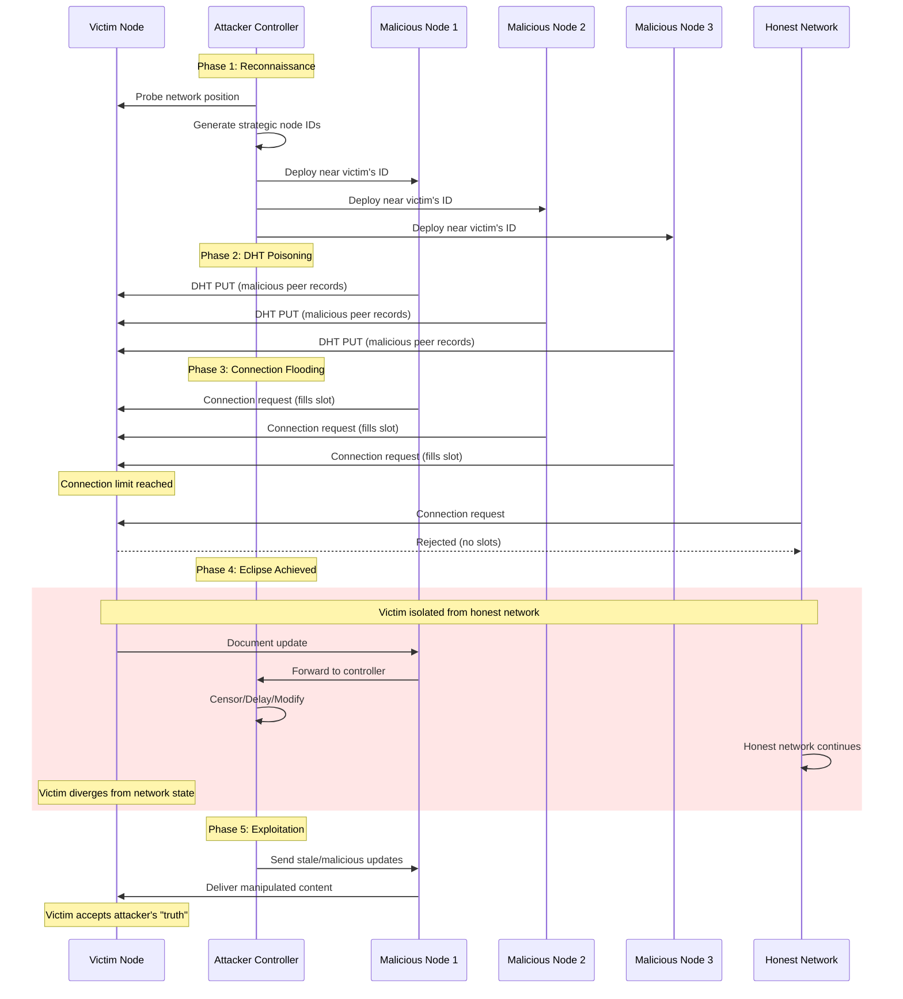

### Attack Timeline

```mermaid
gantt
    title Eclipse Attack Progression
    dateFormat X
    axisFormat %s

    section Preparation
    Reconnaissance           :a1, 0, 10
    ID Generation            :a2, 5, 15
    Node Deployment          :a3, 15, 25

    section Execution
    DHT Poisoning           :b1, 25, 40
    Connection Flooding      :b2, 35, 50
    Table Eviction          :b3, 45, 60

    section Eclipse
    Full Isolation          :crit, c1, 60, 100

    section Exploitation
    Message Censorship      :c2, 65, 100
    State Manipulation      :c3, 70, 100
```

### Technical Requirements for Attack

To successfully eclipse a victim, an attacker typically needs:

| Requirement | Typical Value | Notes |
|-------------|---------------|-------|
| Malicious nodes | 8-20 | Depends on k-bucket size |
| Strategic IDs | 50-100 | For DHT proximity |
| Time to execute | 10-60 minutes | Depends on routing table refresh |
| Bandwidth | Moderate | DHT operations are lightweight |
| Victim online time | Continuous | Easier if victim restarts |

## Impact Analysis

### Message Censorship

The attacker can selectively filter messages:

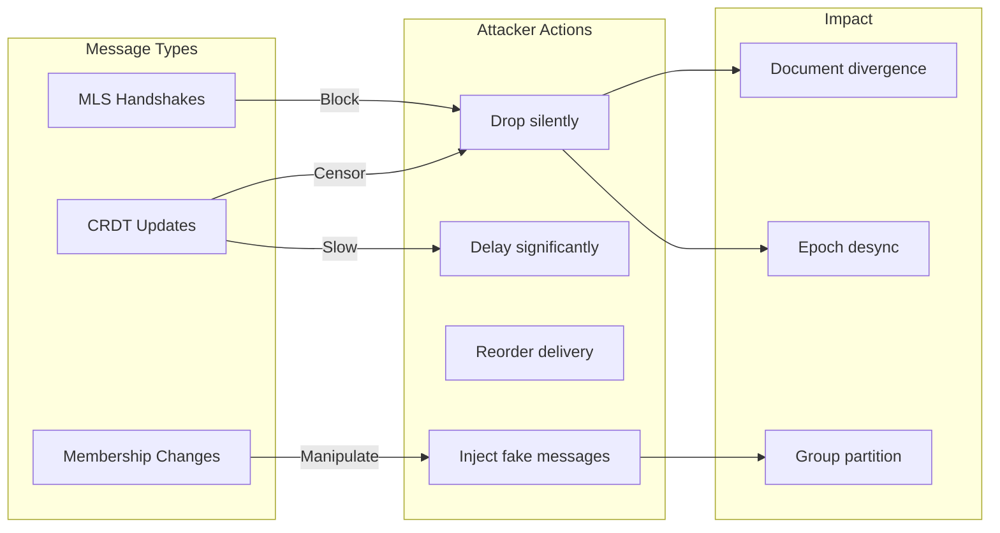

### Delayed Updates

| Delay Duration | Impact on Collaborative Editing |
|----------------|--------------------------------|
| < 1 second | Unnoticeable |
| 1-10 seconds | Degraded real-time experience |
| 10-60 seconds | Visible lag, conflict likelihood increases |
| > 60 seconds | Effective partition, major divergence |

### Partition from Honest Peers

Consequences of network partition:

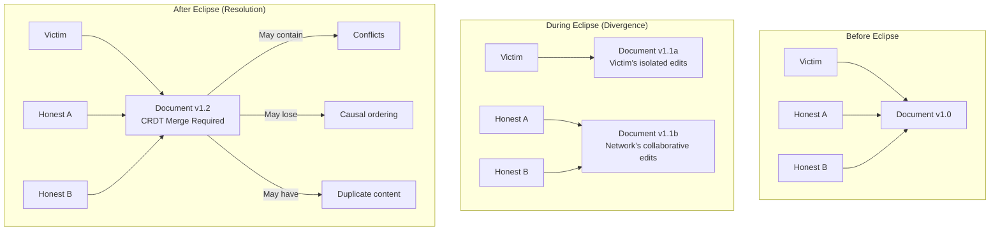

### Impact on MLS Groups

Eclipse attacks have severe implications for MLS-based encryption:

| MLS Operation | Eclipse Impact | Severity |
|---------------|----------------|----------|
| Commit (epoch advance) | Victim misses epoch, cannot decrypt | **Critical** |
| Welcome (new member) | New member unreachable | High |
| Update (key rotation) | Forward secrecy compromised | High |
| Remove (member eviction) | Victim unaware of removal | Medium |
| Application message | Content censorship | Medium |

## Mitigations

### 1. Peer Scoring

GossipSub v1.1 introduced peer scoring to resist eclipse and Sybil attacks:

```rust
// GossipSub peer scoring configuration
pub struct PeerScoreParams {
    /// Score thresholds
    pub gossip_threshold: f64,      // Below this: no gossip
    pub publish_threshold: f64,     // Below this: no publish
    pub graylist_threshold: f64,    // Below this: ignore
    pub accept_px_threshold: f64,   // Above this: accept peer exchange
    pub opportunistic_graft_threshold: f64,

    /// Decay parameters
    pub decay_interval: Duration,
    pub decay_to_zero: f64,
    pub retain_score: Duration,

    /// Topic-specific scoring
    pub topics: HashMap<TopicHash, TopicScoreParams>,

    /// IP colocation penalty
    pub ip_colocation_factor_weight: f64,
    pub ip_colocation_factor_threshold: usize,
}

pub struct TopicScoreParams {
    pub topic_weight: f64,

    /// P1: Time in mesh
    pub time_in_mesh_weight: f64,
    pub time_in_mesh_quantum: Duration,
    pub time_in_mesh_cap: f64,

    /// P2: First message deliveries
    pub first_message_deliveries_weight: f64,
    pub first_message_deliveries_decay: f64,
    pub first_message_deliveries_cap: f64,

    /// P3: Mesh message delivery rate
    pub mesh_message_deliveries_weight: f64,
    pub mesh_message_deliveries_decay: f64,
    pub mesh_message_deliveries_threshold: f64,

    /// P3b: Mesh failure penalty
    pub mesh_failure_penalty_weight: f64,
    pub mesh_failure_penalty_decay: f64,

    /// P4: Invalid messages
    pub invalid_message_deliveries_weight: f64,
    pub invalid_message_deliveries_decay: f64,
}
```

**Scoring factors:**

| Factor | Weight | Description |
|--------|--------|-------------|
| Time in mesh (P1) | Positive | Rewards long-term peers |
| First deliveries (P2) | Positive | Rewards message originators |
| Mesh delivery (P3) | Positive | Rewards reliable delivery |
| Mesh failures (P3b) | Negative | Penalizes delivery failures |
| Invalid messages (P4) | Negative | Penalizes protocol violations |
| IP colocation | Negative | Penalizes many peers from same IP |

### 2. Diverse Bootstrap Nodes

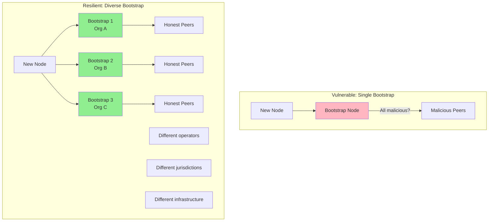

**Bootstrap diversity requirements:**

| Diversity Axis | Rationale |
|----------------|-----------|
| Organizational | Different operators less likely to collude |
| Geographic | Jurisdiction diversity, latency diversity |
| Infrastructure | Different cloud providers, different failure modes |
| Protocol | Mix of DHT, mDNS, hardcoded improves resilience |

### 3. Connection Limits and Slot Reservation

```rust
// Connection management for eclipse resistance
pub struct EclipseResistantConnectionManager {
    /// Total connection limits
    max_connections: usize,

    /// Reserved slots for different peer classes
    reserved_bootstrap: usize,    // Always maintain bootstrap connections
    reserved_long_term: usize,    // Slots for established peers
    reserved_diverse: usize,      // Slots for topologically diverse peers

    /// Churn protection
    min_connection_duration: Duration,
    reconnection_backoff: ExponentialBackoff,

    /// Diversity requirements
    max_per_subnet: usize,        // /24 subnet limit
    max_per_asn: usize,           // AS number limit
}

impl EclipseResistantConnectionManager {
    pub fn should_accept(&self, peer: &PeerId, addr: &Multiaddr) -> bool {
        // Check connection limits
        if self.current_connections() >= self.max_connections {
            return false;
        }

        // Check subnet diversity
        if self.peers_in_subnet(addr) >= self.max_per_subnet {
            return false;
        }

        // Check ASN diversity
        if self.peers_in_asn(addr) >= self.max_per_asn {
            return false;
        }

        // Prefer peers with good scores
        if self.has_low_score(peer) {
            return false;
        }

        true
    }
}
```

### 4. Reputation Systems

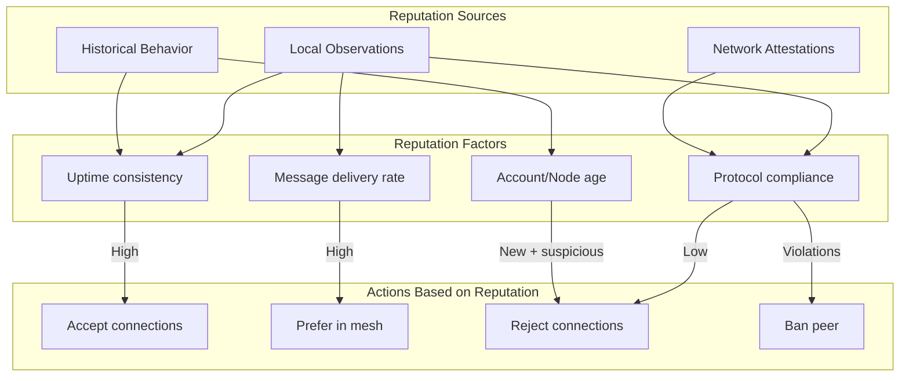

### 5. Additional Mitigations

| Mitigation | Implementation | Effectiveness |
|------------|----------------|---------------|
| **Random peer selection** | Uniform random from candidate set | Prevents targeted filling |
| **Slot aging** | Older connections harder to evict | Protects established peers |
| **Proof-of-work for IDs** | Computational cost for node IDs | Limits Sybil creation rate |
| **Trusted peer lists** | Out-of-band peer exchange | Bypass attacker-controlled discovery |
| **Network monitoring** | Detect anomalous connection patterns | Early warning system |
| **Routing table persistence** | Survive restarts with known-good peers | Prevent fresh-start attacks |

### Mitigation Comparison Matrix

| Mitigation | Eclipse Resistance | Sybil Resistance | Complexity | Performance Impact |
|------------|-------------------|------------------|------------|-------------------|
| Peer scoring | High | High | Medium | Low |
| Diverse bootstrap | High | Medium | Low | None |
| Connection limits | Medium | Medium | Low | None |
| Slot reservation | Medium | Low | Low | None |
| Reputation system | High | High | High | Medium |
| PoW for IDs | Medium | High | Medium | High (creation only) |

## Recommendations for obsidian-ee

Based on this analysis, we recommend the following for obsidian-ee's P2P implementation:

### Short-term (v2)

1. **Maintain hybrid architecture** - Use relay for MLS, P2P only for CRDT updates
2. **Enable GossipSub peer scoring** - Use recommended parameters from Ethereum research
3. **Operate diverse bootstrap nodes** - Minimum 3 nodes across different infrastructure

### Medium-term (v2.x)

1. **Implement connection diversity** - Subnet and ASN limits
2. **Add reputation persistence** - Survive restarts with peer scores
3. **Monitor for eclipse indicators** - Sudden peer churn, delivery failures

### Long-term (v3)

1. **Consider trusted peer exchange** - Out-of-band sharing of known-good peers
2. **Evaluate stake-based identity** - If applicable to use case
3. **Research mixing networks** - For metadata protection

## References

### Academic Papers

1. Heilman, E., Kendler, A., Zohar, A., & Goldberg, S. (2015). **Eclipse Attacks on Bitcoin's Peer-to-Peer Network**. USENIX Security Symposium. [Link](https://www.usenix.org/conference/usenixsecurity15/technical-sessions/presentation/heilman)

2. Marcus, Y., Heilman, E., & Goldberg, S. (2018). **Low-Resource Eclipse Attacks on Ethereum's Peer-to-Peer Network**. IACR Cryptology ePrint Archive. [Link](https://eprint.iacr.org/2018/236)

3. Xu, G., Guo, B., Su, C., et al. (2020). **Am I Eclipsed? A Smart Detector of Eclipse Attacks for Ethereum**. Computers & Security.

4. Douceur, J. R. (2002). **The Sybil Attack**. IPTPS. [Link](https://www.microsoft.com/en-us/research/publication/the-sybil-attack/)

### Protocol Specifications

5. libp2p GossipSub Specification v1.1. [GitHub](https://github.com/libp2p/specs/blob/master/pubsub/gossipsub/gossipsub-v1.1.md)

6. Ethereum Consensus Layer Networking Specification. [GitHub](https://github.com/ethereum/consensus-specs/blob/dev/specs/phase0/p2p-interface.md)

7. Kademlia: A Peer-to-peer Information System Based on the XOR Metric. [Paper](https://pdos.csail.mit.edu/~petar/papers/maymounkov-kademlia-lncs.pdf)

### Implementation Resources

8. rust-libp2p Documentation. [Docs.rs](https://docs.rs/libp2p/latest/libp2p/)

9. go-libp2p-pubsub Peer Scoring. [GitHub](https://github.com/libp2p/go-libp2p-pubsub/blob/master/score.go)

10. Ethereum P2P Network Security Analysis. [Ethereum Research](https://ethresear.ch/)

---

*Last updated: 2024*
*Applies to: obsidian-ee v2.x P2P architecture*
