# IP Address Leakage in P2P Systems

## Overview

IP address exposure represents one of the most significant privacy and security vulnerabilities in peer-to-peer collaborative editing systems. When participants in a P2P network expose their real IP addresses, they become vulnerable to:

- **Identity Correlation**: Linking pseudonymous document collaborators to real-world identities
- **Targeted Attacks**: Enabling DDoS attacks, port scanning, or exploitation attempts against specific users
- **Geolocation Tracking**: Determining physical locations through IP geolocation databases
- **Legal/Regulatory Exposure**: Creating audit trails that may be compelled through legal process
- **Surveillance**: Enabling network-level monitoring by ISPs, governments, or malicious actors

In collaborative editing contexts, IP leakage is particularly concerning because it creates a persistent association between a user's network identity and their document activity, enabling long-term tracking of editing patterns and social graphs.

---

## Technical Background

### How P2P Connections Expose IP Addresses

Peer-to-peer systems fundamentally require participants to establish direct network connections. Unlike client-server architectures where the server acts as an intermediary, P2P protocols necessitate that peers discover and connect to each other directly, inherently exposing network-layer information.

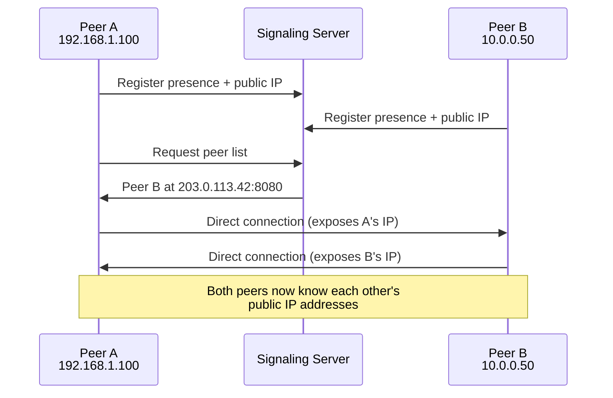

### WebRTC ICE Candidate Gathering

WebRTC-based P2P systems (like y-webrtc) use Interactive Connectivity Establishment (ICE) to traverse NATs and firewalls. This process systematically discovers and exposes all network interfaces:

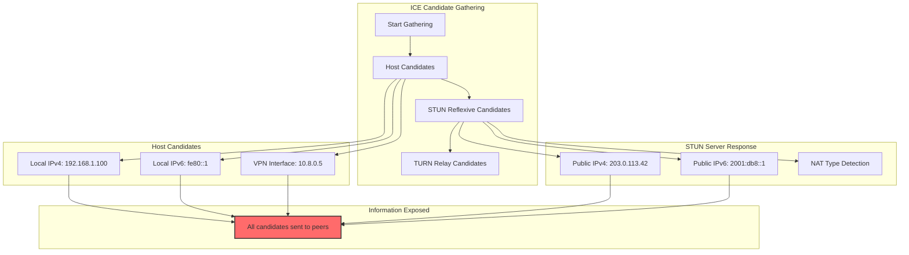

#### ICE Candidate Types

| Candidate Type | Source | Information Leaked |
|---------------|--------|-------------------|
| `host` | Local interfaces | Private IPs, all network interfaces, VPN presence |
| `srflx` (Server Reflexive) | STUN server | Public IP, NAT type, port allocation pattern |
| `prflx` (Peer Reflexive) | Peer connection | Public IP as seen by peer |
| `relay` | TURN server | Only TURN server IP (privacy-preserving) |

### Session Description Protocol (SDP) Exposure

WebRTC connections exchange SDP offers/answers containing sensitive network information:

```
v=0
o=- 4611731400430051336 2 IN IP4 127.0.0.1
s=-
t=0 0
a=group:BUNDLE 0
a=msid-semantic: WMS
m=application 9 UDP/DTLS/SCTP webrtc-datachannel
c=IN IP4 0.0.0.0
a=candidate:1 1 UDP 2122252543 192.168.1.100 49170 typ host
a=candidate:2 1 UDP 1686052863 203.0.113.42 49170 typ srflx raddr 192.168.1.100 rport 49170
a=candidate:3 1 UDP 41885439 198.51.100.1 52739 typ relay raddr 203.0.113.42 rport 49170
a=ice-ufrag:EsAw
a=ice-pwd:P2uYro0UCOQ4zxjKXaWCBui1
a=fingerprint:sha-256 D2:B9:31:...
```

The SDP above reveals:
- Private IP: `192.168.1.100`
- Public IP: `203.0.113.42`
- NAT mapping: private:49170 → public:49170
- TURN relay: `198.51.100.1`

---

## Risk by Library

### y-webrtc: HIGH Risk

y-webrtc implements WebRTC data channels for Yjs synchronization, inheriting all WebRTC privacy concerns.

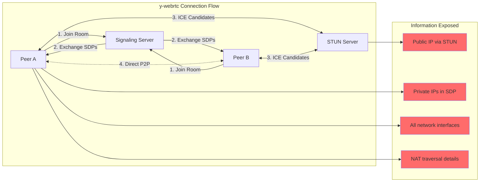

#### Specific Vulnerabilities

1. **Default STUN Servers**: y-webrtc defaults to Google's public STUN servers (`stun:stun.l.google.com:19302`), which:
   - Log connection metadata
   - Reveal user's public IP to Google
   - Create correlation opportunities

2. **Signaling Server Exposure**: The signaling server sees:
   - All peer IP addresses
   - Room membership (document access patterns)
   - Connection timing metadata

3. **Peer-to-Peer SDP Exchange**: Every peer receives full ICE candidate lists from every other peer, meaning:
   - Any malicious peer can harvest all participants' IPs
   - No authentication required to receive SDP information
   - Historical SDPs may be logged by signaling infrastructure

4. **No Built-in Relay Mode**: y-webrtc has no configuration to force TURN-only connections, making IP exposure unavoidable without significant modification.

#### Code-Level Exposure Points

```typescript
// y-webrtc creates connections that expose IPs
const provider = new WebrtcProvider('document-room', ydoc, {
  signaling: ['wss://signaling.example.com'],
  // No option to disable host candidates
  // No option to force TURN-only
})

// ICE candidates automatically shared with all peers
peerConnection.onicecandidate = (event) => {
  if (event.candidate) {
    // This candidate contains IP information
    signalingChannel.send({
      type: 'candidate',
      candidate: event.candidate // Includes host/srflx candidates
    })
  }
}
```

### y-libp2p: MEDIUM Risk

libp2p-based implementations have different exposure characteristics due to the protocol's architecture.

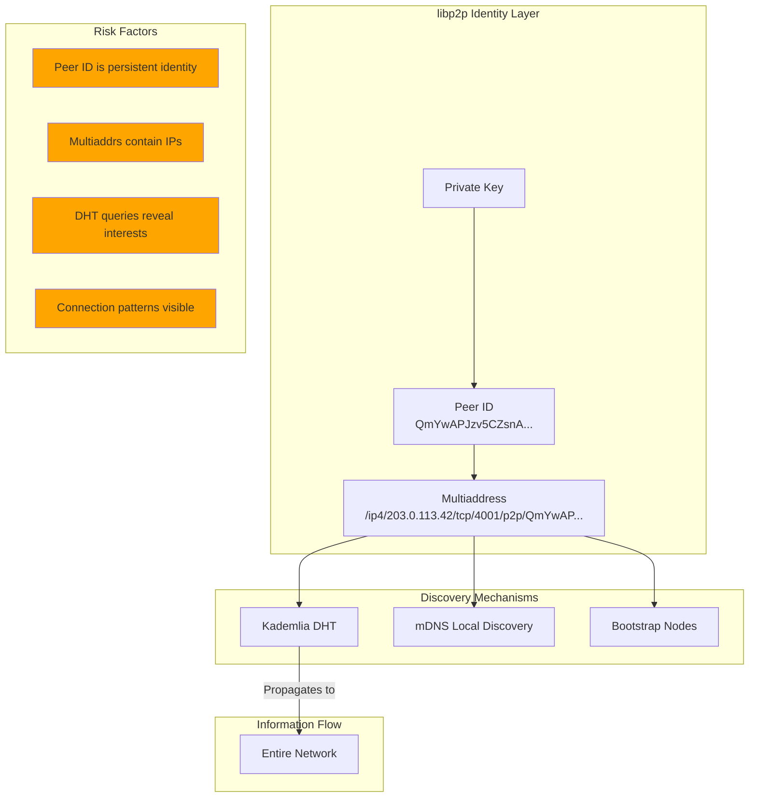

#### Specific Vulnerabilities

1. **Persistent Peer IDs**: Unlike ephemeral WebRTC connections, libp2p Peer IDs are typically long-lived, creating a stable identifier that can be correlated across sessions.

2. **Multiaddress Advertisement**: Peers announce their multiaddresses to the network:
   ```
   /ip4/203.0.113.42/tcp/4001/p2p/QmYwAPJzv5CZsnA625s3Xf2nemtYgPpHdWEz79ojWnPbdG
   /ip6/2001:db8::1/tcp/4001/p2p/QmYwAPJzv5CZsnA625s3Xf2nemtYgPpHdWEz79ojWnPbdG
   ```

3. **DHT Participation**: Joining the Kademlia DHT for peer discovery means:
   - Publishing your addresses to routing tables
   - Queries reveal which content/peers you're seeking
   - Sybil attacks can target specific peer ranges

4. **mDNS Local Discovery**: Local network discovery broadcasts peer presence to all devices on the LAN.

#### Mitigating Factors (vs WebRTC)

| Factor | y-webrtc | y-libp2p |
|--------|----------|----------|
| Relay Support | Limited | Native circuit relay |
| Transport Flexibility | WebRTC only | TCP, QUIC, WebSocket, Tor |
| Identity Management | Ephemeral per-connection | Configurable persistence |
| NAT Traversal | Requires STUN/TURN | Multiple strategies |

---

## Attack Scenarios

### Scenario 1: Malicious Peer IP Harvesting

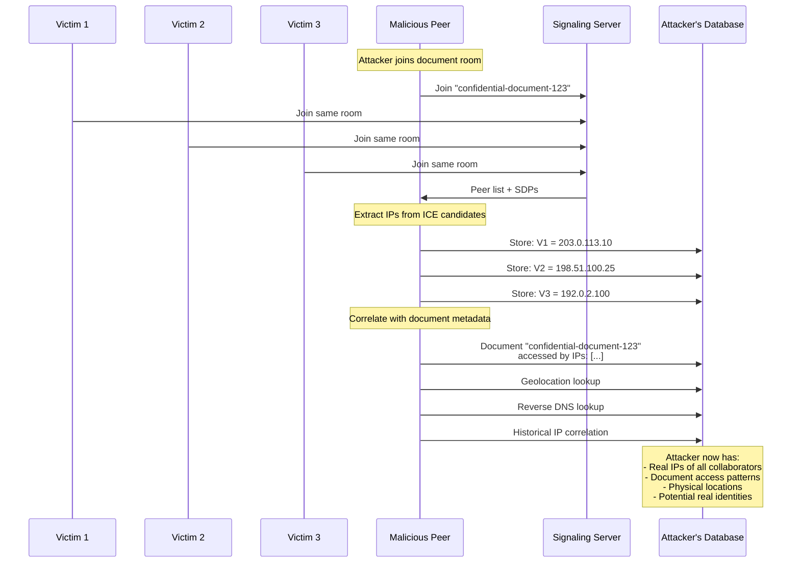

### Scenario 2: Passive Network Observer

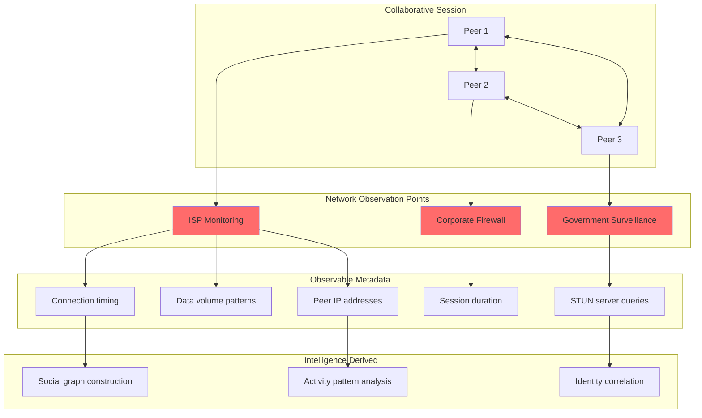

### Scenario 3: Targeted Attack Chain

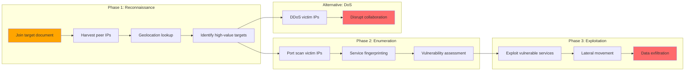

---

## Impact Assessment

### Privacy Impacts

| Impact Category | Severity | Description |
|----------------|----------|-------------|
| **Deanonymization** | Critical | Pseudonymous collaborators can be linked to real identities through IP geolocation, ISP records, or correlation with other services |
| **Location Tracking** | High | IP addresses reveal approximate physical location (city-level typically, sometimes more precise) |
| **Activity Correlation** | High | Cross-session tracking enables building comprehensive user profiles |
| **Social Graph Exposure** | Medium | Document co-authorship reveals professional and personal relationships |

### Security Impacts

| Impact Category | Severity | Description |
|----------------|----------|-------------|
| **Targeted Attacks** | Critical | Exposed IPs enable direct attacks against specific collaborators |
| **DDoS Vulnerability** | High | Any peer can be targeted for denial of service |
| **Network Reconnaissance** | Medium | IP addresses provide entry point for further enumeration |
| **Lateral Movement** | Medium | Compromising one peer may reveal paths to others via IP knowledge |

### Regulatory/Legal Impacts

| Impact Category | Severity | Description |
|----------------|----------|-------------|
| **GDPR Compliance** | High | IP addresses are personal data under GDPR; exposure may violate data protection requirements |
| **Subpoena Risk** | Medium | IP logs at signaling/STUN servers can be legally compelled |
| **Jurisdictional Issues** | Medium | Cross-border IP exposure may implicate multiple legal regimes |

---

## Mitigations

### 1. TURN Relay-Only Mode

Force all connections through TURN relays, hiding peer IP addresses from each other.

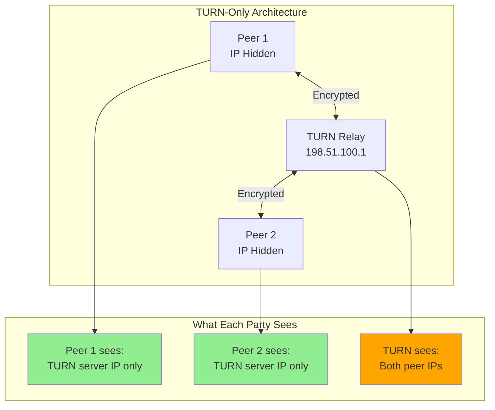

**Implementation:**
```typescript
const peerConnection = new RTCPeerConnection({
  iceServers: [{
    urls: 'turn:turn.example.com:443',
    username: 'user',
    credential: 'pass'
  }],
  iceTransportPolicy: 'relay' // Force TURN-only
})
```

**Tradeoffs:**
- (+) Peers cannot see each other's IPs
- (+) Works reliably through restrictive NATs
- (-) TURN server sees all peer IPs
- (-) Increased latency (all traffic relayed)
- (-) Higher infrastructure costs

### 2. Tor/I2P Transport Layer

Route all P2P traffic through anonymity networks.

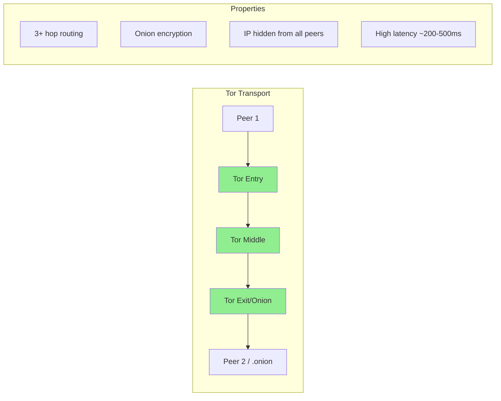

**libp2p Tor Configuration:**
```rust
// Using arti (Tor implementation in Rust)
let transport = TorTransport::new()
    .with_onion_service(onion_config)
    .boxed();

let swarm = SwarmBuilder::new()
    .with_transport(transport)
    .build();
```

**Tradeoffs:**
- (+) Strong anonymity (no single point sees full path)
- (+) Resistant to traffic analysis
- (-) High latency (unsuitable for real-time collaboration)
- (-) Complex deployment
- (-) Exit node risks for clearnet destinations

### 3. VPN-Based Protection

Require VPN usage to mask real IP addresses.

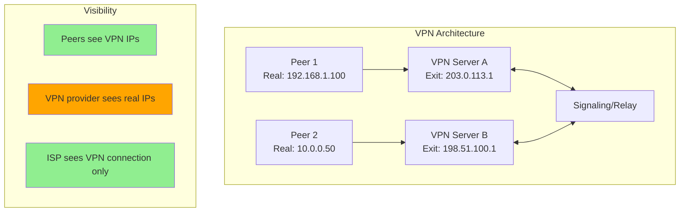

**Tradeoffs:**
- (+) Easy to deploy (user responsibility)
- (+) Works with existing P2P protocols
- (-) VPN provider becomes trusted party
- (-) VPN exit IPs can still be correlated
- (-) Not enforced at protocol level

### 4. Relay-Only Architecture (Recommended)

Eliminate P2P connections entirely by routing all traffic through encrypted relays.

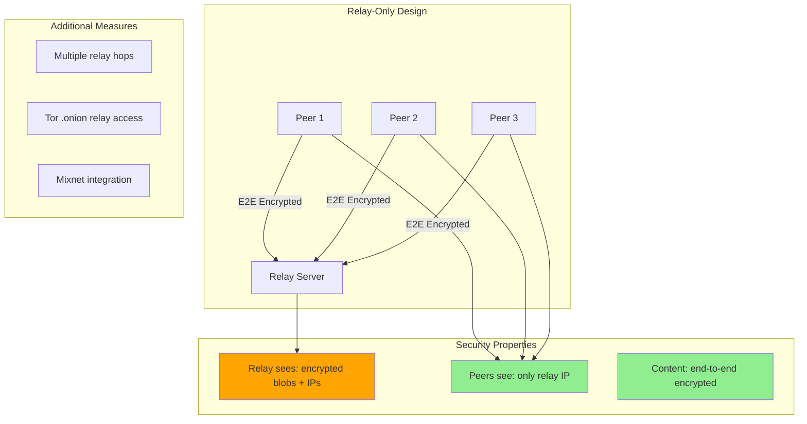

**This is the architecture adopted by obsidian-ee:**
- All synchronization traffic routes through the relay server
- MLS provides end-to-end encryption (relay cannot read content)
- Peers never establish direct connections
- Relay sees client IPs but not document contents

**Additional hardening:**
```rust
// Relay can be accessed via Tor
let relay_addr = "ws://relay.onion:80";

// Or through authenticated TURN
let turn_config = TurnConfig {
    server: "turn:turn.example.com:443",
    transport_policy: TransportPolicy::RelayOnly,
};
```

### 5. Signaling Server Privacy

Minimize metadata exposure at the signaling layer.

| Technique | Description | Effectiveness |
|-----------|-------------|---------------|
| **Ephemeral Room IDs** | Random, single-use room identifiers | Prevents room correlation |
| **Authenticated Access** | Require tokens to join rooms | Prevents open harvesting |
| **Rate Limiting** | Limit peer list requests | Slows bulk harvesting |
| **SDP Filtering** | Remove host candidates before relay | Reduces IP exposure |
| **No Logging** | Don't persist connection metadata | Limits legal exposure |

---

## Comparison Matrix

| Solution | IP Hidden from Peers | IP Hidden from Relay | Latency Impact | Deployment Complexity |
|----------|---------------------|---------------------|----------------|----------------------|
| Direct P2P | No | N/A | Lowest | Low |
| TURN-Only | Yes | No | Medium | Medium |
| VPN | Partially | Partially | Low-Medium | Low (user-managed) |
| Tor/I2P | Yes | Yes | High | High |
| Relay-Only + E2E | Yes | No | Medium | Medium |
| Relay + Tor | Yes | Yes | High | High |

---

## References

### Standards and Specifications

1. **RFC 8445** - Interactive Connectivity Establishment (ICE)
   - https://datatracker.ietf.org/doc/html/rfc8445

2. **RFC 8656** - Traversal Using Relays around NAT (TURN)
   - https://datatracker.ietf.org/doc/html/rfc8656

3. **RFC 7064** - URI Scheme for STUN
   - https://datatracker.ietf.org/doc/html/rfc7064

4. **WebRTC Security Architecture** - W3C
   - https://www.w3.org/TR/webrtc-security/

### Research Papers

5. **"WebRTC IP Address Leakage"** - Security analysis of WebRTC IP handling

6. **"Deanonymizing BitTorrent Users"** - Techniques applicable to P2P CRDT systems

7. **"Kademlia DHT Security Analysis"** - Relevant to libp2p-based systems

### Library Documentation

8. **y-webrtc** - https://github.com/yjs/y-webrtc

9. **libp2p Specifications** - https://github.com/libp2p/specs

10. **rust-libp2p** - https://github.com/libp2p/rust-libp2p

### Privacy Tools

11. **Tor Project** - https://www.torproject.org/

12. **I2P** - https://geti2p.net/

13. **Arti (Tor in Rust)** - https://gitlab.torproject.org/tpo/core/arti
