# MLS Epoch Desync Attacks in P2P Collaborative Editing

This document provides a deep technical analysis of epoch desynchronization attacks against MLS (Messaging Layer Security) when deployed in peer-to-peer collaborative editing systems. Understanding these attacks is critical for building secure, real-time collaborative applications.

## Table of Contents

1. [Overview](#overview)
2. [Technical Background](#technical-background)
3. [Risk by Library](#risk-by-library)
4. [Attack Scenario](#attack-scenario)
5. [Impact](#impact)
6. [Mitigations](#mitigations)
7. [References](#references)

---

## Overview

### What is MLS Epoch Desync?

MLS Epoch Desync occurs when group members have inconsistent views of the current cryptographic epoch due to out-of-order or missing commit messages. In MLS, an **epoch** represents a distinct cryptographic state of the group, with its own set of keys derived from the group's key schedule.

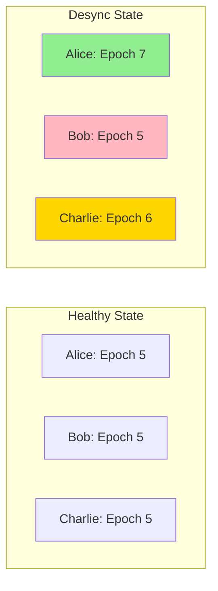

### Why It Matters for P2P

In centralized architectures, a relay server can enforce **total ordering** of MLS commits, ensuring all members process epoch transitions in the same sequence. P2P networks, by design, lack this central ordering authority:

| Architecture | Message Ordering | Epoch Consistency |
|--------------|------------------|-------------------|
| Centralized Relay | Total ordering guaranteed | Strong consistency |
| WebRTC Mesh | No ordering guarantees | Eventual (may diverge) |
| GossipSub | Probabilistic ordering | Eventual (may diverge) |
| Hybrid | Control plane ordered | Strong for MLS, eventual for data |

**The fundamental tension:** CRDTs (like Yrs) are designed for convergence under arbitrary message ordering. MLS commits are **not**---they must be processed in strict causal order.

---

## Technical Background

### MLS Epoch Lifecycle

An MLS epoch is advanced whenever a **commit** is processed. Commits are generated for:

- **Add**: New member joins the group
- **Remove**: Member is removed from the group
- **Update**: Member rotates their leaf key
- **PSK**: Pre-shared key injection
- **ReInit**: Group re-initialization

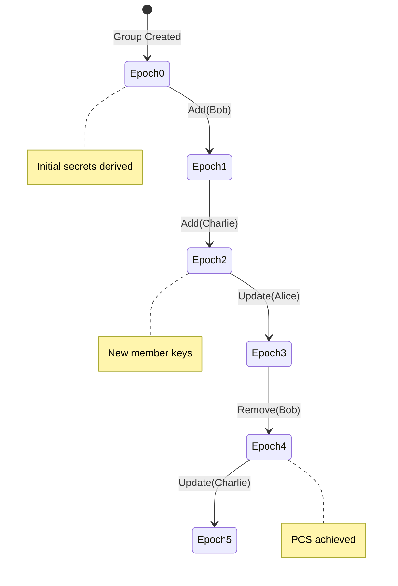

### Key Schedule and Epoch Secrets

Each epoch `N` derives its secrets from the previous epoch `N-1`:

```
epoch_secret[N] = KDF(
    init_secret[N],
    commit_secret,
    psk_secret,
    context
)

application_secret = KDF(epoch_secret, "app", context)
encryption_key = KDF(application_secret, "key", context)
```

**Critical property:** Without `epoch_secret[N-1]`, you cannot derive `epoch_secret[N]`. Missing a single commit breaks the entire key chain.

### MLS Message Types and Epoch Binding

Every MLS message is bound to a specific epoch:

```rust
// From RFC 9420 Section 6
struct MLSMessage {
    version: ProtocolVersion,
    wire_format: WireFormat,
    // All messages include epoch in their authenticated data
    content: MLSMessageContent,
}

enum MLSMessageContent {
    PublicMessage {
        group_id: GroupId,
        epoch: u64,           // <-- Epoch binding
        authenticated_data: Vec<u8>,
        content: FramedContent,
        // ...
    },
    PrivateMessage {
        group_id: GroupId,
        epoch: u64,           // <-- Epoch binding
        content_type: ContentType,
        ciphertext: Vec<u8>,
        // ...
    },
}
```

If a receiver's current epoch does not match the message's epoch:
- **Future epoch**: Message cannot be decrypted (keys not yet derived)
- **Past epoch**: Message may be rejected or require epoch rollback (if supported)

### Commit Processing Requirements

RFC 9420 Section 12.4 specifies commit processing:

1. Verify the commit is from the expected sender
2. Verify the commit references the correct epoch
3. Apply proposals in the commit
4. Derive new epoch secrets
5. Update group state atomically

**Failure at any step** should result in commit rejection, but the group state remains at the old epoch---causing desync with members who successfully processed the commit.

---

## Risk by Library

### y-webrtc: WebRTC Mesh Topology

y-webrtc creates a **full mesh** topology where each peer maintains direct WebRTC DataChannel connections to all other peers.

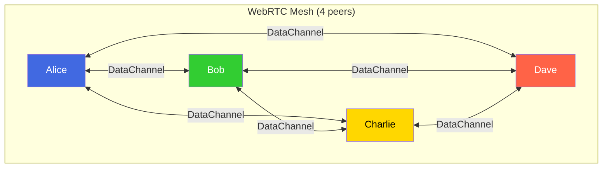

#### Epoch Ordering Risks

| Risk Factor | Description | Severity |
|-------------|-------------|----------|
| **Race conditions** | Two commits generated simultaneously arrive in different order at different peers | Critical |
| **Connection failures** | Commit reaches some peers but not others before sender disconnects | High |
| **Network partitions** | Temporary partition causes independent epoch advances | Critical |
| **Message reordering** | DataChannel SCTP may reorder across channels | High |

#### Specific Failure Modes

**1. Simultaneous Commit Race**

When two members issue commits "simultaneously" (within the network RTT):

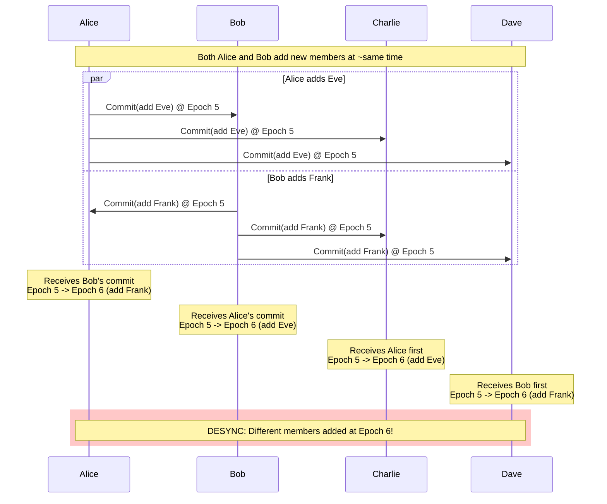

**2. Partial Delivery Failure**

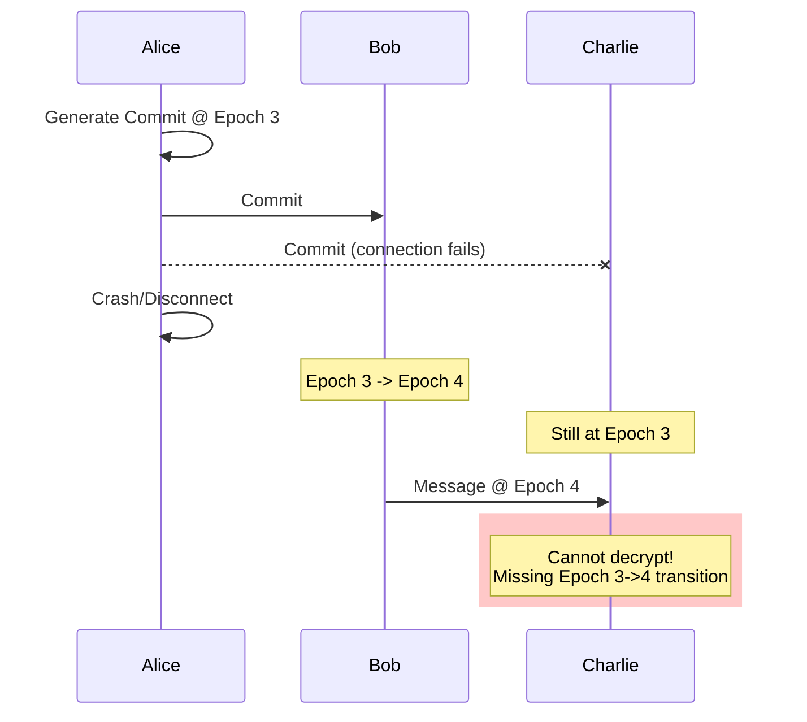

#### y-webrtc Specific Code Paths

```javascript
// y-webrtc message broadcasting (simplified)
const broadcast = (message) => {
  // No ordering guarantees across peers
  for (const peer of peers) {
    peer.channel.send(message)  // Fire and forget
  }
}

// Each peer receives independently
peer.channel.onmessage = (event) => {
  // Messages may arrive in any order
  processMessage(event.data)
}
```

The lack of acknowledgment or ordering protocol means:
- Commits may arrive before their dependent proposals
- Multiple commits may arrive simultaneously with no tie-breaker
- Network jitter can invert message order between fast/slow paths

---

### y-libp2p/GossipSub: Gossip Propagation Effects

GossipSub (used by Ethereum 2.0, IPFS) provides **probabilistic** message propagation through a gossip mesh.

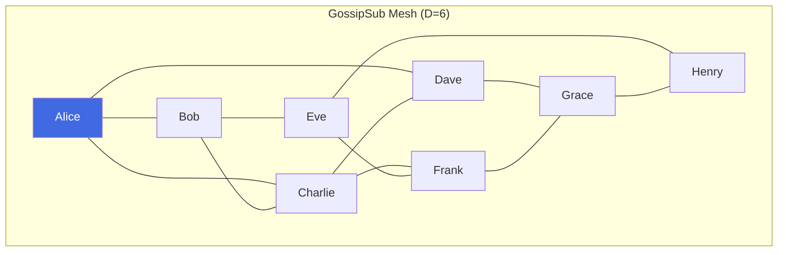

#### GossipSub Message Flow

Messages propagate through the mesh with **logarithmic latency** but **no global ordering**:

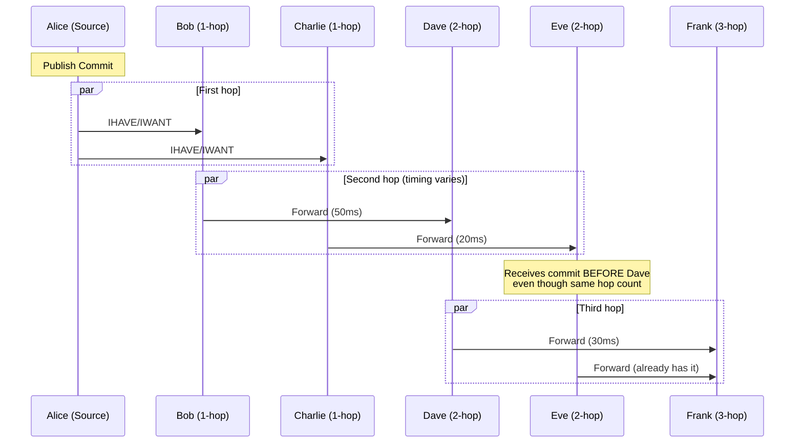

#### Epoch Ordering Risks

| Risk Factor | Description | Severity |
|-------------|-------------|----------|
| **Propagation variance** | Same message reaches peers at different times | High |
| **Mesh churn** | Peer connections change, affecting paths | Medium |
| **IHAVE/IWANT delays** | Gossip protocol adds latency variance | Medium |
| **Opportunistic grafting** | New mesh links may shortcut or lengthen paths | Medium |
| **Score-based pruning** | Low-score peers receive messages later | High |

#### GossipSub-Specific Attack Vectors

**1. Propagation Delay Exploitation**

An attacker controlling multiple mesh positions can:

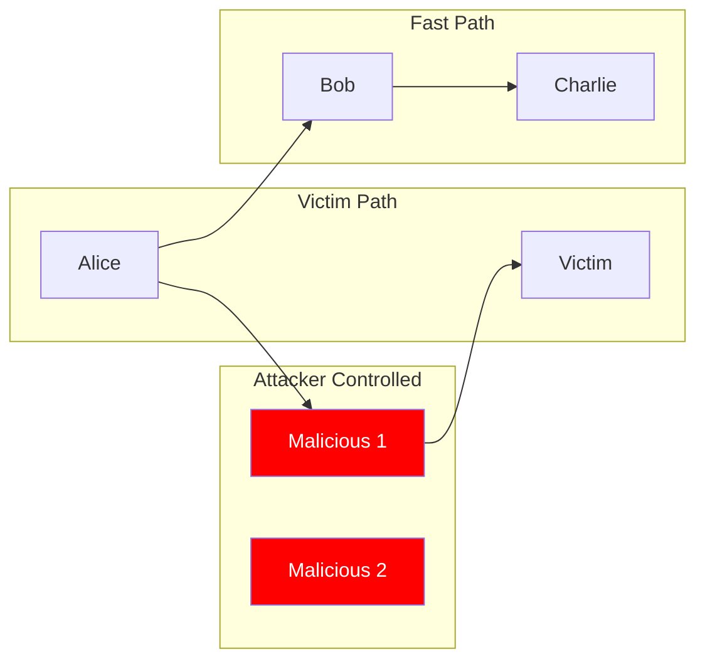

The attacker delays commit propagation to specific victims, causing them to fall behind on epochs while others advance.

**2. Mesh Topology Manipulation**

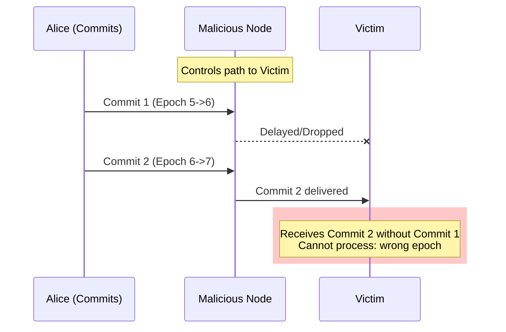

#### libp2p GossipSub Configuration Impact

```rust
// GossipSub parameters affecting epoch ordering
let gossipsub_config = GossipsubConfigBuilder::default()
    .heartbeat_interval(Duration::from_secs(1))
    .validation_mode(ValidationMode::Strict)
    // Higher mesh degree = more paths = more ordering variance
    .mesh_n(6)
    .mesh_n_low(4)
    .mesh_n_high(12)
    // History affects late-joining peers
    .history_length(5)
    .history_gossip(3)
    // Flood publishing bypasses mesh for critical messages
    .flood_publish(true)  // Helps but doesn't guarantee order
    .build()
    .unwrap();
```

**Key insight:** Even with `flood_publish(true)`, messages may be received out of order due to network path differences.

---

## Attack Scenario

### Concrete Attack: Epoch Pinning Attack

An attacker aims to **pin** a victim at an old epoch, causing them to lose the ability to decrypt new messages.

#### Setup

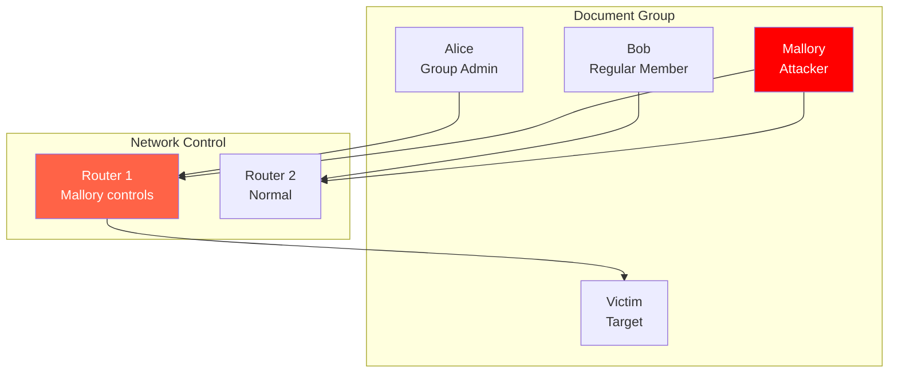

#### Attack Sequence

```mermaid
sequenceDiagram
    participant A as Alice (Admin)
    participant M as Mallory (Attacker)
    participant V as Victim
    participant B as Bob

    Note over A,B: Initial State: All at Epoch 5

    rect rgb(200, 255, 200)
        Note over A,B: Normal Operation
        A->>M: CRDT Update @ Epoch 5
        A->>V: CRDT Update @ Epoch 5
        A->>B: CRDT Update @ Epoch 5
        Note over V: Decrypts successfully
    end

    rect rgb(255, 255, 200)
        Note over A,B: Phase 1: Mallory intercepts commits
        A->>A: Key Update (Epoch 5->6)
        A->>M: Commit (Epoch 5->6)
        A->>B: Commit (Epoch 5->6)
        M--xV: Commit BLOCKED

        Note over M,B: Epoch 6
        Note over V: Still Epoch 5
    end

    rect rgb(255, 200, 200)
        Note over A,B: Phase 2: Victim isolated
        A->>M: CRDT Update @ Epoch 6
        A->>V: CRDT Update @ Epoch 6
        A->>B: CRDT Update @ Epoch 6

        Note over V: DECRYPTION FAILURE<br/>Wrong epoch keys
    end

    rect rgb(255, 150, 150)
        Note over A,B: Phase 3: Compounding desync
        B->>B: Key Update (Epoch 6->7)
        B->>A: Commit
        B->>M: Commit
        B--xV: Commit BLOCKED

        Note over A,M,B: Epoch 7
        Note over V: Still Epoch 5<br/>Now 2 epochs behind!
    end

    rect rgb(200, 200, 255)
        Note over V: Recovery Attempt
        V->>A: Request resync
        Note over V: Must receive ALL missed commits<br/>in correct order:<br/>Commit 5->6<br/>Commit 6->7
    end
```

#### Attack Variations

**1. Selective Epoch Pinning**

Target specific members to create information asymmetry:

```
Attacker Goal: Prevent Victim from seeing Alice's key rotation
Result: Victim uses old (potentially compromised) keys
```

**2. Fork Attack**

Create two groups with different epoch histories:

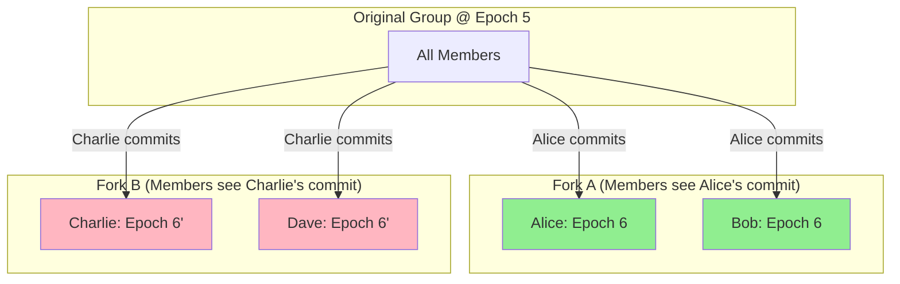

Both forks are at "Epoch 6" but with **incompatible** cryptographic states.

**3. Denial of Service via Epoch Flooding**

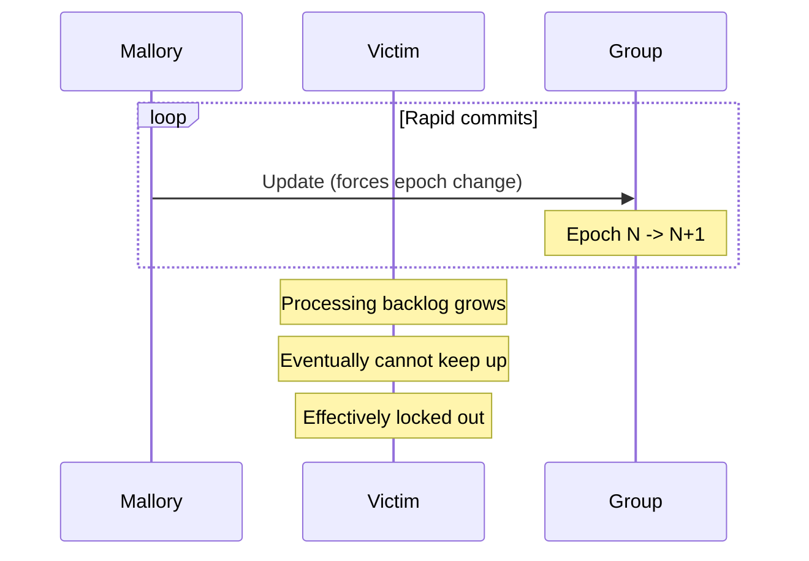

---

## Impact

### Immediate Consequences

| Impact | Description | Severity |
|--------|-------------|----------|
| **Decryption failure** | Messages encrypted at newer epochs cannot be decrypted | Critical |
| **Message loss** | User sees no new content, appears frozen | High |
| **Signature rejection** | Messages signed with wrong epoch keys rejected | High |
| **State corruption** | CRDT may accept unverified updates if fallback enabled | Critical |

### Security Property Violations

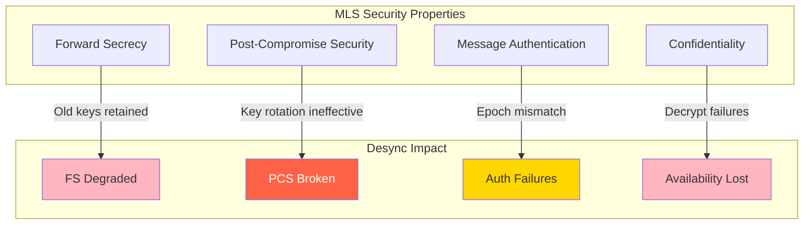

#### Forward Secrecy Degradation

When a member is pinned at an old epoch:
- They retain keys from epoch `N`
- Group has moved to epoch `N+k`
- Compromise of victim reveals keys for epochs `N` through whenever they resync

#### Post-Compromise Security Failure

PCS relies on key rotation invalidating compromised keys:

```
Normal: Compromise at Epoch 5 -> Rotate at Epoch 6 -> Attacker locked out
Desync: Victim stuck at Epoch 5 -> Cannot process Epoch 6 rotation
        -> Attacker maintains access to victim's view
```

### CRDT-Specific Impacts

For collaborative editing with Yrs/Yjs:

| Scenario | CRDT Behavior | Security Impact |
|----------|---------------|-----------------|
| Desync'd peer sends update | Others can't decrypt | Update lost, peer isolated |
| Desync'd peer receives update | Can't decrypt | Local state diverges |
| Desync'd peer rejoins | CRDT merge may conflict | Data integrity risk |
| Long desync period | Many updates missed | Significant content loss |

---

## Mitigations

### 1. Vector Clocks for Causal Ordering

Attach vector clocks to MLS commits to detect and enforce causal ordering:

```rust
/// Vector clock tracking commit ordering
#[derive(Clone, Debug)]
pub struct CommitVectorClock {
    /// Map from member ID to their commit count
    clocks: HashMap<MemberId, u64>,
}

impl CommitVectorClock {
    /// Check if this clock happens-before another
    pub fn happens_before(&self, other: &Self) -> bool {
        self.clocks.iter().all(|(id, &count)| {
            other.clocks.get(id).map_or(false, |&other_count| count <= other_count)
        }) && self.clocks != other.clocks
    }

    /// Check if two clocks are concurrent (neither happens-before)
    pub fn concurrent_with(&self, other: &Self) -> bool {
        !self.happens_before(other) && !other.happens_before(self)
    }

    /// Merge two vector clocks (take max of each component)
    pub fn merge(&mut self, other: &Self) {
        for (id, &count) in &other.clocks {
            let entry = self.clocks.entry(id.clone()).or_insert(0);
            *entry = (*entry).max(count);
        }
    }
}

/// Extended MLS commit with causal metadata
pub struct CausalCommit {
    /// The MLS commit message
    pub commit: MlsMessage,
    /// Vector clock at time of commit
    pub vector_clock: CommitVectorClock,
    /// Hash of parent commit (like git)
    pub parent_hash: [u8; 32],
}
```

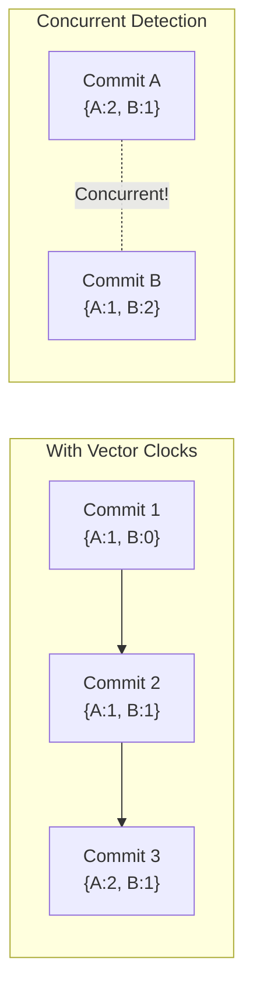

### 2. Commit Buffering and Reordering

Buffer out-of-order commits and process when dependencies arrive:

```rust
pub struct CommitBuffer {
    /// Pending commits waiting for dependencies
    pending: HashMap<EpochId, Vec<BufferedCommit>>,
    /// Current processed epoch
    current_epoch: u64,
    /// Maximum buffer size to prevent DoS
    max_buffer_size: usize,
}

impl CommitBuffer {
    /// Attempt to process a commit, buffering if dependencies missing
    pub fn process(&mut self, commit: CausalCommit) -> Result<Vec<ProcessedCommit>> {
        let commit_epoch = commit.commit.epoch();

        if commit_epoch == self.current_epoch + 1 {
            // Can process immediately
            let processed = self.apply_commit(commit)?;

            // Check if buffered commits can now be processed
            let mut results = vec![processed];
            results.extend(self.drain_ready_commits()?);

            Ok(results)
        } else if commit_epoch > self.current_epoch + 1 {
            // Buffer for later
            self.buffer_commit(commit)?;
            Ok(vec![])
        } else {
            // Old commit, may be duplicate or fork
            Err(Error::StaleCommit {
                received: commit_epoch,
                current: self.current_epoch
            })
        }
    }

    /// Process buffered commits that are now ready
    fn drain_ready_commits(&mut self) -> Result<Vec<ProcessedCommit>> {
        let mut results = vec![];

        while let Some(commits) = self.pending.remove(&(self.current_epoch + 1)) {
            for commit in commits {
                results.push(self.apply_commit(commit.into())?);
            }
        }

        Ok(results)
    }
}
```

### 3. Hybrid Architecture (Recommended)

Separate control plane (MLS) from data plane (CRDT):

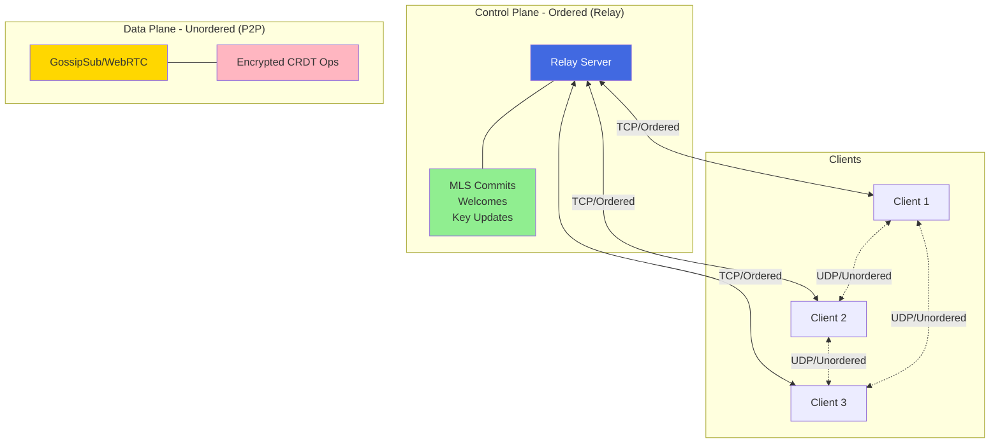

```rust
/// Hybrid transport separating ordered and unordered traffic
pub struct HybridTransport {
    /// Ordered channel for MLS control messages
    control: RelayConnection,
    /// Unordered channel for encrypted CRDT updates
    data: P2PSwarm,
}

impl HybridTransport {
    /// Send MLS commit through ordered channel
    pub async fn send_commit(&mut self, commit: MlsCommit) -> Result<()> {
        // Relay ensures total ordering across all clients
        self.control.send_ordered(ControlMessage::Commit(commit)).await
    }

    /// Broadcast encrypted CRDT update through P2P
    pub async fn broadcast_update(&mut self, update: EncryptedUpdate) -> Result<()> {
        // P2P is fine for CRDT - designed for out-of-order delivery
        self.data.publish(update).await
    }
}
```

### 4. Epoch Catch-Up Protocol

Enable members to recover from desync:

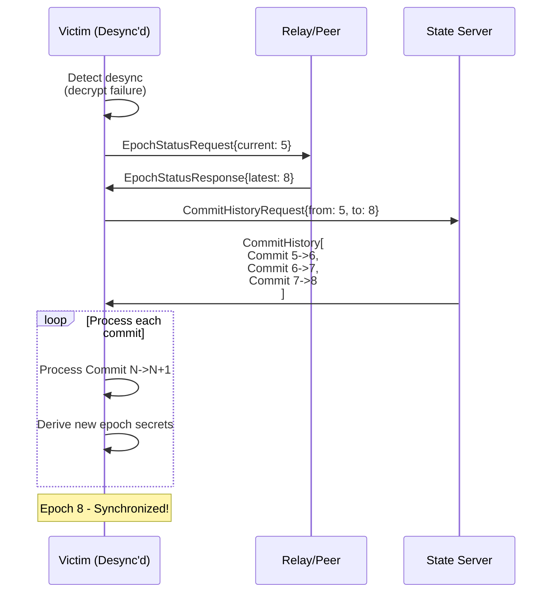

```rust
/// Epoch recovery protocol
pub struct EpochRecovery {
    /// Store of historical commits
    commit_store: CommitStore,
    /// Maximum commits to retain
    history_limit: usize,
}

impl EpochRecovery {
    /// Handle epoch catch-up request
    pub async fn handle_catchup_request(
        &self,
        requester: MemberId,
        from_epoch: u64,
        to_epoch: u64,
    ) -> Result<Vec<StoredCommit>> {
        // Validate request
        if to_epoch - from_epoch > self.history_limit as u64 {
            return Err(Error::CatchupRangeTooLarge);
        }

        // Retrieve and return commits
        let commits = self.commit_store
            .get_range(from_epoch, to_epoch)
            .await?;

        Ok(commits)
    }

    /// Perform catch-up from another peer
    pub async fn catchup(
        &mut self,
        group: &mut MlsDocumentGroup,
        peer: &PeerConnection,
    ) -> Result<()> {
        let current = group.epoch();
        let status = peer.request_epoch_status().await?;

        if status.latest_epoch > current {
            let commits = peer
                .request_commits(current, status.latest_epoch)
                .await?;

            for commit in commits {
                group.process_commit(&commit.bytes)?;
            }
        }

        Ok(())
    }
}
```

### 5. Consensus-Based Commit Ordering

For fully decentralized systems, use lightweight consensus:

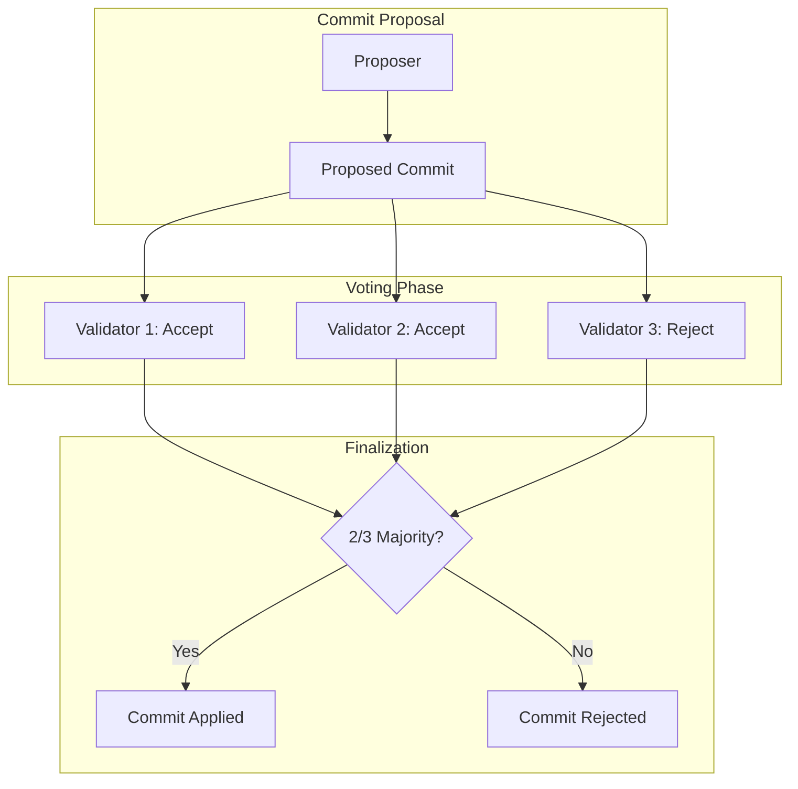

Options include:
- **Raft**: Leader-based, good for small groups (< 10 members)
- **PBFT**: Byzantine fault tolerant, higher overhead
- **HotStuff**: Modern BFT with linear communication
- **Tendermint**: Used by Cosmos, well-tested

### 6. Epoch Pinning Detection

Detect and alert on potential epoch pinning attacks:

```rust
pub struct EpochHealthMonitor {
    /// Expected epoch based on group activity
    expected_epoch: u64,
    /// Time of last successful epoch transition
    last_transition: Instant,
    /// Threshold for alerting
    stale_threshold: Duration,
}

impl EpochHealthMonitor {
    pub fn check_health(&self, current_epoch: u64) -> EpochHealth {
        let epoch_delta = self.expected_epoch.saturating_sub(current_epoch);
        let time_since_transition = self.last_transition.elapsed();

        match (epoch_delta, time_since_transition > self.stale_threshold) {
            (0, false) => EpochHealth::Healthy,
            (1..=2, false) => EpochHealth::SlightlyBehind { epochs: epoch_delta },
            (_, true) => EpochHealth::PossiblePinning {
                epochs_behind: epoch_delta,
                stale_duration: time_since_transition,
            },
            (d, _) if d > 5 => EpochHealth::SevereDesync { epochs: d },
            _ => EpochHealth::Warning { epochs: epoch_delta },
        }
    }
}

pub enum EpochHealth {
    Healthy,
    SlightlyBehind { epochs: u64 },
    Warning { epochs: u64 },
    PossiblePinning { epochs_behind: u64, stale_duration: Duration },
    SevereDesync { epochs: u64 },
}
```

### Mitigation Comparison

| Mitigation | Complexity | Latency Impact | Decentralization | Effectiveness |
|------------|------------|----------------|------------------|---------------|
| Vector clocks | Medium | Low | High | Medium |
| Commit buffering | Low | Medium | High | Medium |
| Hybrid architecture | Medium | Low | Medium | High |
| Epoch catch-up | Low | Variable | High | High (recovery) |
| Consensus | High | High | High | Very High |
| Health monitoring | Low | None | High | Detection only |

### Recommended Approach for obsidian-ee

Based on our architecture goals:

1. **Primary**: Hybrid architecture with relay for MLS control plane
2. **Secondary**: Commit buffering for temporary desync tolerance
3. **Recovery**: Epoch catch-up protocol for rejoining peers
4. **Monitoring**: Health checks to detect attacks early

---

## References

### Standards and RFCs

- [RFC 9420: The Messaging Layer Security (MLS) Protocol](https://datatracker.ietf.org/doc/rfc9420/)
- [RFC 9420 Section 12: Message Processing](https://datatracker.ietf.org/doc/html/rfc9420#section-12)
- [RFC 9420 Section 8: Key Schedule](https://datatracker.ietf.org/doc/html/rfc9420#section-8)

### Academic Papers

- Alwen, J., et al. "Modular Design of Secure Group Messaging Protocols and the Security of MLS." ACM CCS 2021.
- Cremers, C., et al. "Security Analysis of the MLS Key Derivation." IEEE S&P 2024.
- Bhargavan, K., et al. "TreeKEM: Asynchronous Decentralized Key Management for Large Dynamic Groups." 2018.

### Implementation Resources

- [OpenMLS Documentation](https://openmls.tech/book/)
- [OpenMLS Epoch Handling](https://openmls.tech/book/user_manual/epoch.html)
- [libp2p GossipSub Specification](https://github.com/libp2p/specs/tree/master/pubsub/gossipsub)
- [y-webrtc Repository](https://github.com/yjs/y-webrtc)

### Related Documentation

- [obsidian-ee P2P Architecture Analysis](/docs/v2/p2p-architecture.md)
- [MLS Implementation](/crates/collab-core/src/mls.rs)

### Security Analyses

- Trail of Bits. "Security Analysis of MLS." 2022.
- NCC Group. "Cryptographic Review of MLS Protocol." 2023.
- Cremers, C., et al. "The Complexities of Healing in Secure Group Messaging." USENIX Security 2021.
