# Split-Brain Groups in P2P Collaborative Systems

This document provides an in-depth analysis of split-brain scenarios in peer-to-peer collaborative editing systems, with particular focus on MLS (Messaging Layer Security) group management challenges.

## Table of Contents

1. [Overview](#overview)
2. [Technical Background](#technical-background)
3. [Risk by Library](#risk-by-library)
4. [Failure Scenario](#failure-scenario)
5. [Impact](#impact)
6. [Mitigations](#mitigations)
7. [References](#references)

---

## Overview

### What is Split-Brain?

A **split-brain** condition occurs when a distributed system partitions into two or more segments that continue operating independently, each believing itself to be the authoritative source of truth. In the context of P2P collaborative editing with MLS encryption, this manifests as:

- Multiple subgroups evolving their MLS group state independently
- Divergent CRDT document states that may or may not be reconcilable
- Incompatible encryption contexts that prevent future communication

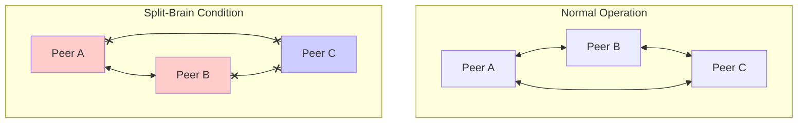
```mermaid
graph TB
    subgraph "Normal Operation"
        N1[Peer A] <--> N2[Peer B]
        N2 <--> N3[Peer C]
        N1 <--> N3
    end

    subgraph "Split-Brain Condition"
        S1[Peer A] <--> S2[Peer B]
        S3[Peer C]
        S1 x--x S3
        S2 x--x S3
    end

    style S1 fill:#ffcccc
    style S2 fill:#ffcccc
    style S3 fill:#ccccff
```

### Why It's Problematic for MLS Groups

MLS (RFC 9420) is designed for **ordered, reliable message delivery** within a group. The protocol maintains critical invariants:

| MLS Invariant | Description | Split-Brain Impact |
|---------------|-------------|-------------------|
| **Epoch Consistency** | All members share the same epoch number | Partitions evolve epochs independently |
| **Group State Agreement** | Single tree structure for all members | Multiple incompatible trees emerge |
| **Commit Ordering** | Commits must be applied sequentially | Concurrent commits create forks |
| **Forward Secrecy** | Keys ratchet forward irreversibly | Partitions have divergent key material |

The fundamental problem: **MLS assumes a linearizable log of group operations**, but P2P networks provide only **eventual consistency** at best.

---

## Technical Background

### Network Partitions in P2P Systems

Network partitions occur when communication failures divide a network into disconnected components. In P2P systems, partitions arise from:

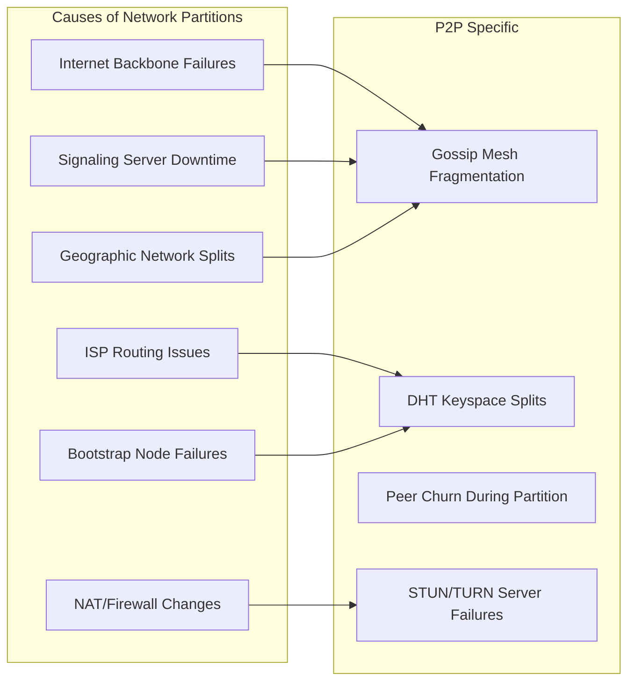
```mermaid
flowchart LR
    subgraph "Causes of Network Partitions"
        direction TB
        C1[Internet Backbone Failures]
        C2[NAT/Firewall Changes]
        C3[ISP Routing Issues]
        C4[Signaling Server Downtime]
        C5[Bootstrap Node Failures]
        C6[Geographic Network Splits]
    end

    subgraph "P2P Specific"
        direction TB
        P1[Gossip Mesh Fragmentation]
        P2[DHT Keyspace Splits]
        P3[Peer Churn During Partition]
        P4[STUN/TURN Server Failures]
    end

    C1 --> P1
    C2 --> P4
    C3 --> P2
    C4 --> P1
    C5 --> P2
    C6 --> P1
```

### Concurrent Membership Changes

MLS group membership changes (Add, Remove, Update) require consensus. In a P2P system without coordination:

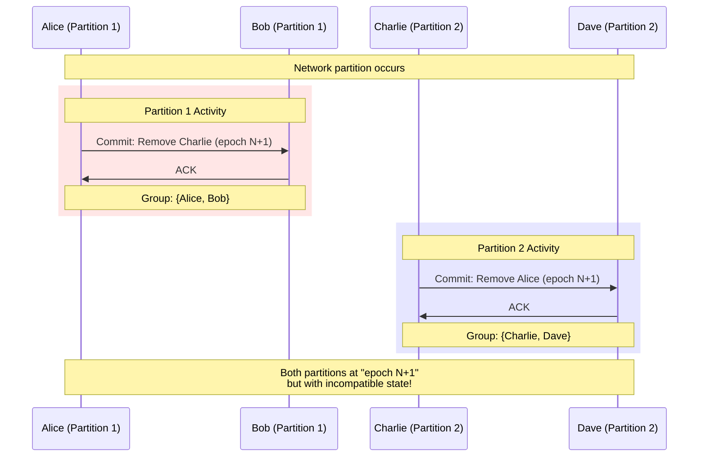
```mermaid
sequenceDiagram
    participant A as Alice (Partition 1)
    participant B as Bob (Partition 1)
    participant C as Charlie (Partition 2)
    participant D as Dave (Partition 2)

    Note over A,D: Network partition occurs

    rect rgb(255, 230, 230)
        Note over A,B: Partition 1 Activity
        A->>B: Commit: Remove Charlie (epoch N+1)
        B->>A: ACK
        Note over A,B: Group: {Alice, Bob}
    end

    rect rgb(230, 230, 255)
        Note over C,D: Partition 2 Activity
        C->>D: Commit: Remove Alice (epoch N+1)
        D->>C: ACK
        Note over C,D: Group: {Charlie, Dave}
    end

    Note over A,D: Both partitions at "epoch N+1"<br/>but with incompatible state!
```

### The CAP Theorem Applied to MLS

MLS groups in P2P networks face the classic CAP theorem tradeoff:

| Property | Description | P2P Reality |
|----------|-------------|-------------|
| **Consistency** | All nodes see the same group state | Impossible during partition |
| **Availability** | Every request receives a response | Prioritized in P2P |
| **Partition Tolerance** | System continues despite network splits | Required in P2P |

**P2P systems choose AP (Availability + Partition Tolerance)**, sacrificing consistency. This is fundamentally at odds with MLS's consistency requirements.

---

## Risk by Library

### y-webrtc

WebRTC-based mesh networking for Yjs synchronization.

#### Architecture

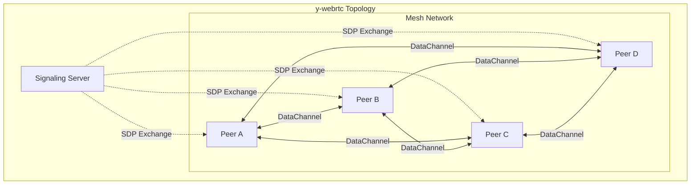
```mermaid
flowchart TB
    subgraph "y-webrtc Topology"
        direction LR
        SIG[Signaling Server]

        subgraph "Mesh Network"
            A[Peer A]
            B[Peer B]
            C[Peer C]
            D[Peer D]
        end

        SIG -.->|SDP Exchange| A
        SIG -.->|SDP Exchange| B
        SIG -.->|SDP Exchange| C
        SIG -.->|SDP Exchange| D

        A <-->|DataChannel| B
        A <-->|DataChannel| C
        A <-->|DataChannel| D
        B <-->|DataChannel| C
        B <-->|DataChannel| D
        C <-->|DataChannel| D
    end
```

#### Split-Brain Risks

| Risk Factor | Severity | Description |
|-------------|----------|-------------|
| **Signaling Server SPOF** | Critical | Single signaling server failure prevents new connections |
| **Mesh Partitions** | High | Full mesh doesn't guarantee connectivity if peers partition |
| **STUN/TURN Failures** | High | NAT traversal failures can isolate peers |
| **Peer Discovery Gaps** | Medium | New peers may only discover one partition |
| **Connection Limits** | Medium | Browser limits (~256 connections) can fragment large groups |

#### Partition Scenario: Signaling Failure

```mermaid
sequenceDiagram
    participant A as Alice
    participant B as Bob
    participant SIG as Signaling Server
    participant C as Charlie
    participant D as Dave

    Note over A,D: Initial fully-connected mesh

    SIG-xSIG: Server crashes

    Note over A,B: Existing connections maintained
    A<-->B: DataChannel OK

    Note over C,D: Existing connections maintained
    C<-->D: DataChannel OK

    Note over A,D: But A-C, A-D, B-C, B-D<br/>connections fail (NAT rebinding)

    rect rgb(255, 230, 230)
        Note over A,B: Partition 1 evolves MLS state
        A->>B: MLS Commit (epoch 5)
    end

    rect rgb(230, 230, 255)
        Note over C,D: Partition 2 evolves MLS state
        C->>D: MLS Commit (epoch 5)
    end
```

### y-libp2p / GossipSub

libp2p-based gossip protocol used in production by Ethereum 2.0, IPFS, and Filecoin.

#### Architecture

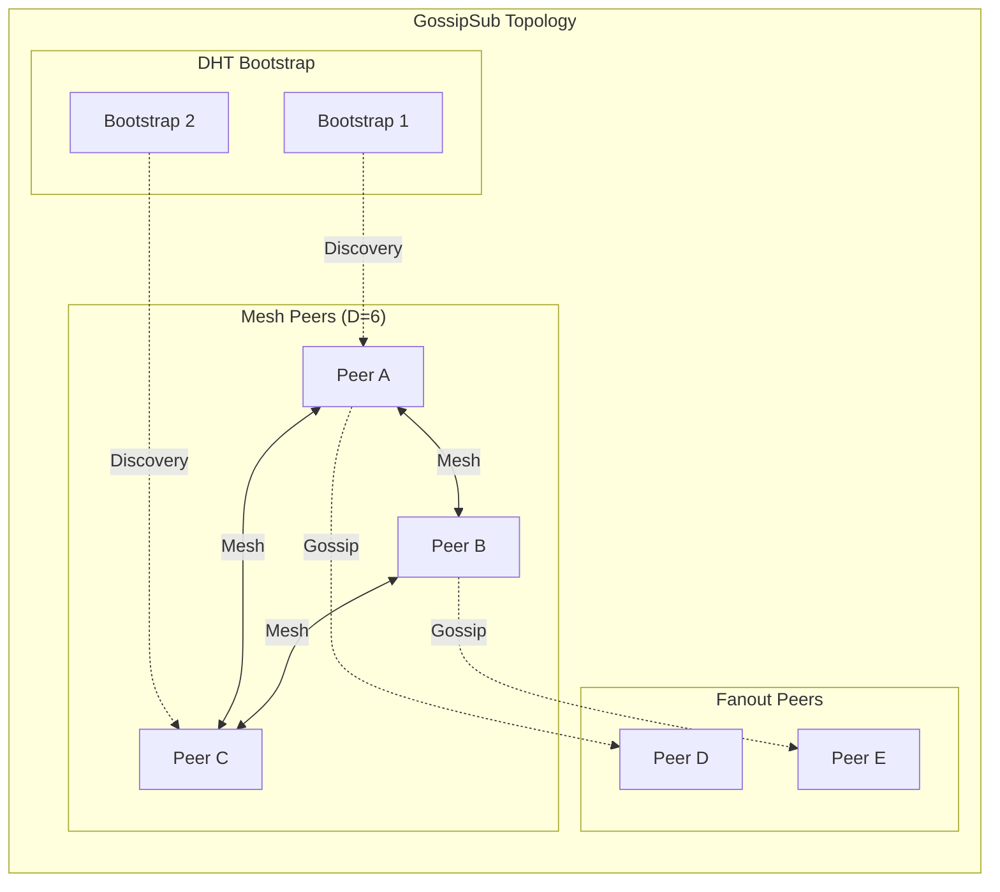
```mermaid
flowchart TB
    subgraph "GossipSub Topology"
        direction TB

        subgraph "Mesh Peers (D=6)"
            A[Peer A]
            B[Peer B]
            C[Peer C]
        end

        subgraph "Fanout Peers"
            D[Peer D]
            E[Peer E]
        end

        subgraph "DHT Bootstrap"
            BN1[Bootstrap 1]
            BN2[Bootstrap 2]
        end

        A <-->|Mesh| B
        B <-->|Mesh| C
        A <-->|Mesh| C

        A -.->|Gossip| D
        B -.->|Gossip| E

        BN1 -.->|Discovery| A
        BN2 -.->|Discovery| C
    end
```

#### Split-Brain Risks

| Risk Factor | Severity | Description |
|-------------|----------|-------------|
| **DHT Keyspace Splits** | High | Kademlia DHT can partition on key ranges |
| **Bootstrap Node Failures** | High | No bootstrap = no peer discovery |
| **Gossip Mesh Fragmentation** | Medium | Mesh degree (D) too low allows splits |
| **Topic Subscription Gaps** | Medium | Peers may not subscribe to same topics |
| **Eclipse Attacks** | Medium | Malicious peers can isolate honest nodes |
| **Peer Scoring Divergence** | Low | Different score views can isolate peers |

#### Partition Scenario: DHT Inconsistency

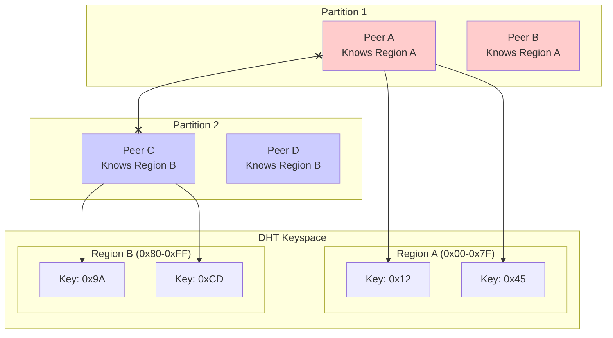
```mermaid
graph TB
    subgraph "DHT Keyspace"
        direction LR

        subgraph "Region A (0x00-0x7F)"
            KA1[Key: 0x12]
            KA2[Key: 0x45]
        end

        subgraph "Region B (0x80-0xFF)"
            KB1[Key: 0x9A]
            KB2[Key: 0xCD]
        end
    end

    subgraph "Partition 1"
        P1A[Peer A<br/>Knows Region A]
        P1B[Peer B<br/>Knows Region A]
    end

    subgraph "Partition 2"
        P2C[Peer C<br/>Knows Region B]
        P2D[Peer D<br/>Knows Region B]
    end

    P1A --> KA1
    P1A --> KA2
    P2C --> KB1
    P2C --> KB2

    P1A x--x P2C

    style P1A fill:#ffcccc
    style P1B fill:#ffcccc
    style P2C fill:#ccccff
    style P2D fill:#ccccff
```

#### GossipSub Mesh Partition

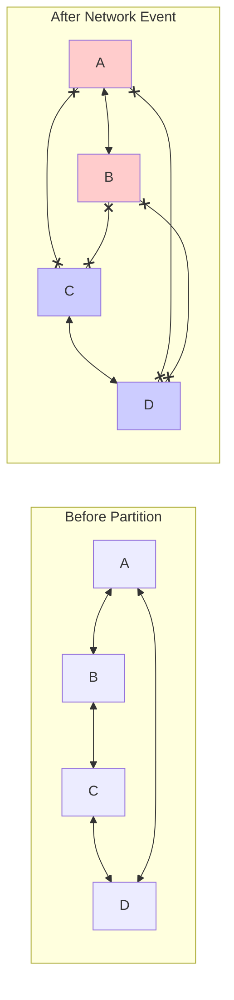
```mermaid
flowchart LR
    subgraph "Before Partition"
        direction TB
        A1[A] <--> B1[B]
        B1 <--> C1[C]
        C1 <--> D1[D]
        A1 <--> D1
    end

    subgraph "After Network Event"
        direction TB
        A2[A] <--> B2[B]
        C2[C] <--> D2[D]

        A2 x--x C2
        A2 x--x D2
        B2 x--x C2
        B2 x--x D2
    end

    style A2 fill:#ffcccc
    style B2 fill:#ffcccc
    style C2 fill:#ccccff
    style D2 fill:#ccccff
```

### Comparison Matrix

| Factor | y-webrtc | y-libp2p/GossipSub |
|--------|----------|-------------------|
| **Primary Partition Cause** | Signaling server failure | DHT/Bootstrap failures |
| **Recovery Mechanism** | Reconnect to signaling | Peer rediscovery via DHT |
| **Partition Detection** | Connection loss events | Heartbeat/IWANT timeouts |
| **Typical Partition Duration** | Minutes to hours | Seconds to minutes |
| **Split-Brain Likelihood** | Medium-High | Medium |
| **Recovery Complexity** | Low (reconnect) | Medium (mesh repair) |

---

## Failure Scenario

### Detailed Example: Document Collaboration Split-Brain

This scenario demonstrates a complete split-brain failure in a collaborative document editing session.

#### Initial State

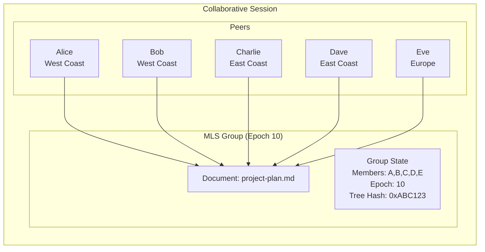
```mermaid
flowchart TB
    subgraph "Collaborative Session"
        direction TB

        subgraph "MLS Group (Epoch 10)"
            DOC[Document: project-plan.md]
            GS[Group State<br/>Members: A,B,C,D,E<br/>Epoch: 10<br/>Tree Hash: 0xABC123]
        end

        subgraph "Peers"
            A[Alice<br/>West Coast]
            B[Bob<br/>West Coast]
            C[Charlie<br/>East Coast]
            D[Dave<br/>East Coast]
            E[Eve<br/>Europe]
        end

        A --> DOC
        B --> DOC
        C --> DOC
        D --> DOC
        E --> DOC
    end
```

#### Timeline of Events

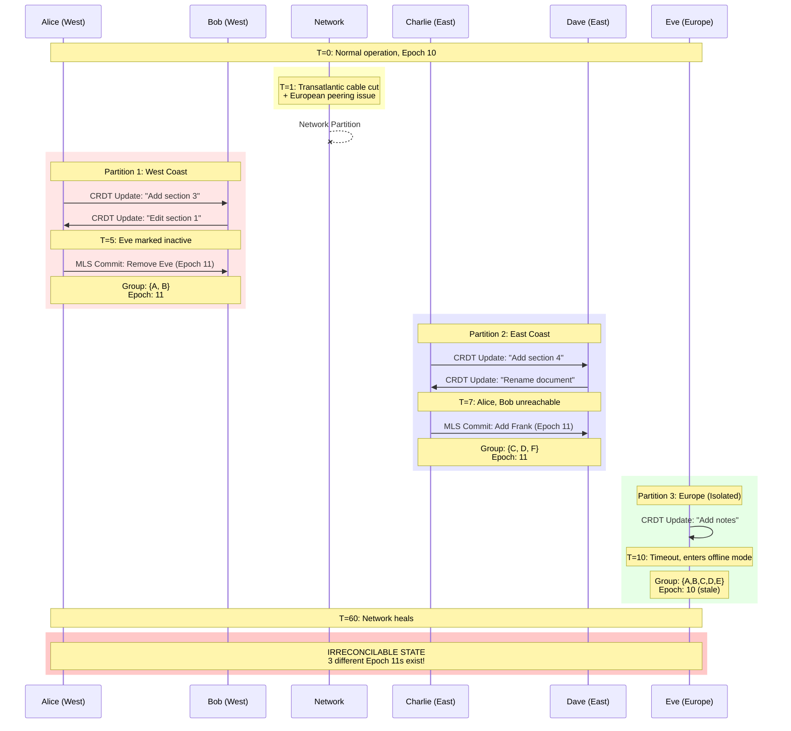
```mermaid
sequenceDiagram
    participant A as Alice (West)
    participant B as Bob (West)
    participant NET as Network
    participant C as Charlie (East)
    participant D as Dave (East)
    participant E as Eve (Europe)

    Note over A,E: T=0: Normal operation, Epoch 10

    rect rgb(255, 255, 200)
        Note over NET: T=1: Transatlantic cable cut<br/>+ European peering issue
    end

    NET--xNET: Network Partition

    rect rgb(255, 230, 230)
        Note over A,B: Partition 1: West Coast
        A->>B: CRDT Update: "Add section 3"
        B->>A: CRDT Update: "Edit section 1"
        Note over A,B: T=5: Eve marked inactive
        A->>B: MLS Commit: Remove Eve (Epoch 11)
        Note over A,B: Group: {A, B}<br/>Epoch: 11
    end

    rect rgb(230, 230, 255)
        Note over C,D: Partition 2: East Coast
        C->>D: CRDT Update: "Add section 4"
        D->>C: CRDT Update: "Rename document"
        Note over C,D: T=7: Alice, Bob unreachable
        C->>D: MLS Commit: Add Frank (Epoch 11)
        Note over C,D: Group: {C, D, F}<br/>Epoch: 11
    end

    rect rgb(230, 255, 230)
        Note over E: Partition 3: Europe (Isolated)
        E->>E: CRDT Update: "Add notes"
        Note over E: T=10: Timeout, enters offline mode
        Note over E: Group: {A,B,C,D,E}<br/>Epoch: 10 (stale)
    end

    Note over A,E: T=60: Network heals

    rect rgb(255, 200, 200)
        Note over A,E: IRRECONCILABLE STATE<br/>3 different Epoch 11s exist!
    end
```

#### State Diagram After Partition

```mermaid
graph TB
    subgraph "Original State (Epoch 10)"
        OS[Members: A,B,C,D,E<br/>Tree Hash: 0xABC123<br/>Document: v1.0]
    end

    OS --> P1
    OS --> P2
    OS --> P3

    subgraph "Partition 1 (West)"
        P1[Epoch 11<br/>Members: A,B<br/>Tree Hash: 0xDEF456<br/>Document: v1.1-west]
        P1 --> P1A[Removed: C,D,E]
        P1 --> P1B[Key Material: K1]
    end

    subgraph "Partition 2 (East)"
        P2[Epoch 11<br/>Members: C,D,F<br/>Tree Hash: 0x789GHI<br/>Document: v1.1-east]
        P2 --> P2A[Added: Frank<br/>Removed: A,B,E]
        P2 --> P2B[Key Material: K2]
    end

    subgraph "Partition 3 (Europe)"
        P3[Epoch 10 (stale)<br/>Members: A,B,C,D,E<br/>Tree Hash: 0xABC123<br/>Document: v1.0-offline]
        P3 --> P3A[No changes]
        P3 --> P3B[Key Material: K0]
    end

    style P1 fill:#ffcccc
    style P2 fill:#ccccff
    style P3 fill:#ccffcc
```

---

## Impact

### Divergent Group States

When split-brain occurs, each partition evolves its MLS group state independently:

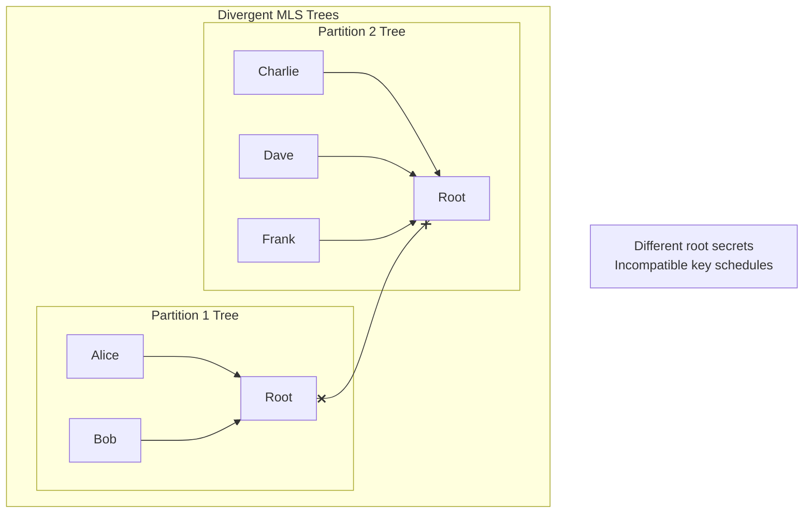
```mermaid
flowchart TB
    subgraph "Divergent MLS Trees"
        direction LR

        subgraph "Partition 1 Tree"
            T1R[Root]
            T1A[Alice] --> T1R
            T1B[Bob] --> T1R
        end

        subgraph "Partition 2 Tree"
            T2R[Root]
            T2C[Charlie] --> T2R
            T2D[Dave] --> T2R
            T2F[Frank] --> T2R
        end
    end

    T1R x--x T2R

    Note1[Different root secrets<br/>Incompatible key schedules]
```

### Irreconcilable Encryption Contexts

The cryptographic impact is severe:

| Aspect | Partition 1 | Partition 2 | Recovery Possibility |
|--------|-------------|-------------|---------------------|
| **Epoch Secret** | Derived from Remove(C,D,E) | Derived from Add(F),Remove(A,B) | None - different derivation |
| **Tree Secret** | Based on 2-node tree | Based on 3-node tree | None - structural difference |
| **Application Secret** | K1_app | K2_app | None |
| **Sender Data Secret** | K1_sender | K2_sender | None |
| **Confirmation Key** | K1_conf | K2_conf | None |

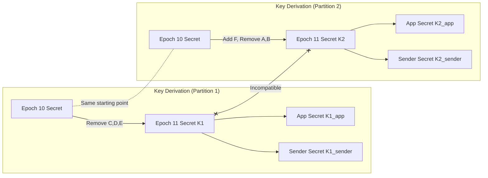
```mermaid
flowchart LR
    subgraph "Key Derivation (Partition 1)"
        E10_1[Epoch 10 Secret] -->|Remove C,D,E| E11_1[Epoch 11 Secret K1]
        E11_1 --> APP1[App Secret K1_app]
        E11_1 --> SEND1[Sender Secret K1_sender]
    end

    subgraph "Key Derivation (Partition 2)"
        E10_2[Epoch 10 Secret] -->|Add F, Remove A,B| E11_2[Epoch 11 Secret K2]
        E11_2 --> APP2[App Secret K2_app]
        E11_2 --> SEND2[Sender Secret K2_sender]
    end

    E10_1 -.-|Same starting point| E10_2
    E11_1 x--x|Incompatible| E11_2
```

### CRDT Reconciliation Challenges

While CRDTs (like Yrs) are designed to merge concurrent changes, the encryption layer complicates this:

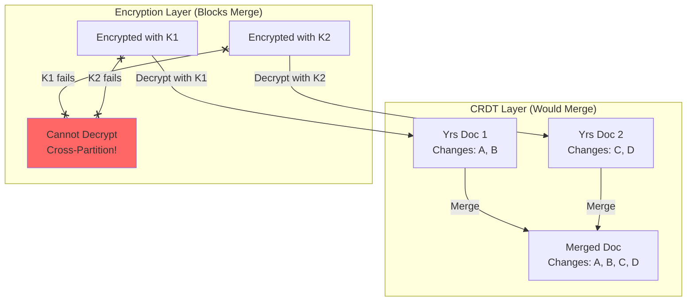
```mermaid
flowchart TB
    subgraph "CRDT Layer (Would Merge)"
        Y1[Yrs Doc 1<br/>Changes: A, B]
        Y2[Yrs Doc 2<br/>Changes: C, D]
        YM[Merged Doc<br/>Changes: A, B, C, D]

        Y1 -->|Merge| YM
        Y2 -->|Merge| YM
    end

    subgraph "Encryption Layer (Blocks Merge)"
        E1[Encrypted with K1]
        E2[Encrypted with K2]
        EX[Cannot Decrypt<br/>Cross-Partition!]

        E1 -->|Decrypt with K1| Y1
        E2 x--x|K1 fails| EX
        E1 x--x|K2 fails| EX
        E2 -->|Decrypt with K2| Y2
    end

    style EX fill:#ff6666
```

### Impact Summary Matrix

| Impact Category | Severity | Description | Recovery Effort |
|-----------------|----------|-------------|-----------------|
| **Message Loss** | Critical | Messages during partition cannot be decrypted by other partitions | Unrecoverable |
| **Epoch Divergence** | Critical | Different epoch N+1 states in each partition | Requires group recreation |
| **Membership Conflicts** | High | Conflicting add/remove operations | Manual resolution |
| **Key Material Split** | Critical | Each partition has unique, incompatible keys | Cannot merge |
| **Document Divergence** | Medium | CRDT changes may be reconcilable if decrypted | Depends on access to both key sets |
| **Trust State** | High | Different views of who is in the group | Requires consensus |

---

## Mitigations

### 1. Leader Election

Designate a single leader responsible for MLS group mutations.

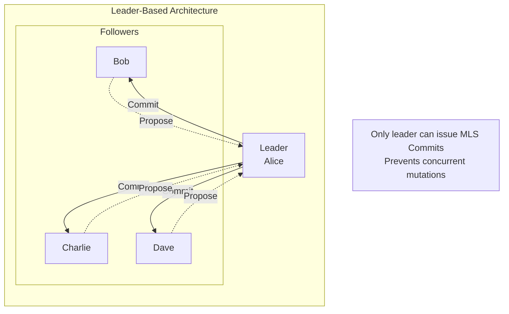
```mermaid
flowchart TB
    subgraph "Leader-Based Architecture"
        direction TB

        L[Leader<br/>Alice]

        subgraph "Followers"
            F1[Bob]
            F2[Charlie]
            F3[Dave]
        end

        L -->|Commit| F1
        L -->|Commit| F2
        L -->|Commit| F3

        F1 -.->|Propose| L
        F2 -.->|Propose| L
        F3 -.->|Propose| L
    end

    Note[Only leader can issue MLS Commits<br/>Prevents concurrent mutations]
```

#### Implementation Considerations

```rust
/// Leader election for MLS group management
pub struct LeaderElection {
    /// Current leader (if known)
    leader: Option<MemberId>,
    /// Election term/epoch
    term: u64,
    /// Heartbeat timeout
    heartbeat_timeout: Duration,
}

impl LeaderElection {
    /// Simple leader election: lowest member ID wins
    pub fn elect_leader(members: &[MemberId]) -> Option<MemberId> {
        members.iter().min().cloned()
    }

    /// Check if this node is the leader
    pub fn is_leader(&self, my_id: &MemberId) -> bool {
        self.leader.as_ref() == Some(my_id)
    }

    /// Handle leader failure (trigger re-election)
    pub fn on_leader_timeout(&mut self) -> LeaderElectionEvent {
        self.term += 1;
        self.leader = None;
        LeaderElectionEvent::ElectionStarted { term: self.term }
    }
}
```

#### Pros and Cons

| Pros | Cons |
|------|------|
| Prevents concurrent commits | Single point of failure |
| Simple to implement | Leader partition = group freeze |
| Clear ordering | Latency for non-leader operations |
| Works with existing MLS | Requires leader election protocol |

### 2. Consensus Protocols

Use a consensus protocol to agree on MLS commits before applying.

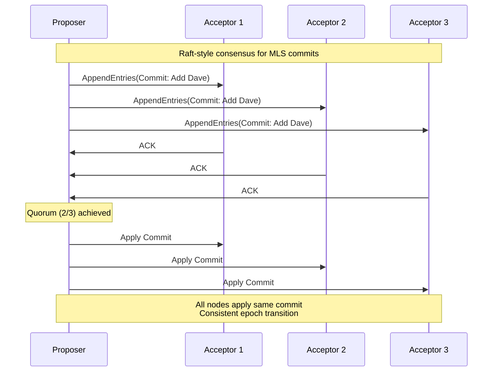
```mermaid
sequenceDiagram
    participant P as Proposer
    participant A as Acceptor 1
    participant B as Acceptor 2
    participant C as Acceptor 3

    Note over P,C: Raft-style consensus for MLS commits

    P->>A: AppendEntries(Commit: Add Dave)
    P->>B: AppendEntries(Commit: Add Dave)
    P->>C: AppendEntries(Commit: Add Dave)

    A->>P: ACK
    B->>P: ACK
    C->>P: ACK

    Note over P: Quorum (2/3) achieved

    P->>A: Apply Commit
    P->>B: Apply Commit
    P->>C: Apply Commit

    Note over P,C: All nodes apply same commit<br/>Consistent epoch transition
```

#### Consensus Protocol Options

| Protocol | Latency | Partition Behavior | Complexity |
|----------|---------|-------------------|------------|
| **Raft** | 2 RTT | Minority partitions freeze | Medium |
| **PBFT** | 3 RTT | Tolerates f < n/3 Byzantine | High |
| **HotStuff** | 3 RTT | Leader-based, pipelined | High |
| **Simple Majority** | 1 RTT | Requires >50% connectivity | Low |

#### Raft Integration Example

```rust
/// Raft-based MLS commit consensus
pub struct RaftMlsConsensus {
    raft: RaftNode,
    pending_commits: HashMap<LogIndex, MlsCommit>,
}

impl RaftMlsConsensus {
    /// Propose an MLS commit through Raft
    pub async fn propose_commit(&mut self, commit: MlsCommit) -> Result<()> {
        // Serialize commit for Raft log
        let entry = RaftEntry::MlsCommit(commit.clone());

        // Wait for consensus
        let index = self.raft.propose(entry).await?;

        // Store pending commit
        self.pending_commits.insert(index, commit);

        Ok(())
    }

    /// Apply committed entries (called by Raft)
    pub fn apply_committed(&mut self, index: LogIndex, entry: RaftEntry) {
        if let RaftEntry::MlsCommit(commit) = entry {
            // Safe to apply - consensus achieved
            self.mls_group.apply_commit(commit);
            self.pending_commits.remove(&index);
        }
    }
}
```

### 3. Partition Detection

Proactively detect partitions and pause MLS mutations.

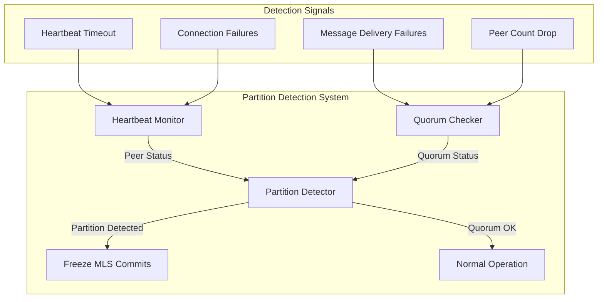
```mermaid
flowchart TB
    subgraph "Partition Detection System"
        direction TB

        HB[Heartbeat Monitor]
        QC[Quorum Checker]
        PD[Partition Detector]

        HB -->|Peer Status| PD
        QC -->|Quorum Status| PD

        PD -->|Partition Detected| FREEZE[Freeze MLS Commits]
        PD -->|Quorum OK| NORMAL[Normal Operation]
    end

    subgraph "Detection Signals"
        S1[Heartbeat Timeout]
        S2[Connection Failures]
        S3[Message Delivery Failures]
        S4[Peer Count Drop]
    end

    S1 --> HB
    S2 --> HB
    S3 --> QC
    S4 --> QC
```

#### Detection Algorithm

```rust
/// Partition detection configuration
pub struct PartitionDetector {
    /// Known group members
    members: HashSet<MemberId>,
    /// Last heartbeat from each member
    last_heartbeat: HashMap<MemberId, Instant>,
    /// Heartbeat timeout threshold
    timeout: Duration,
    /// Minimum members for quorum
    quorum_size: usize,
}

impl PartitionDetector {
    /// Check current partition status
    pub fn check_partition_status(&self) -> PartitionStatus {
        let now = Instant::now();
        let reachable: HashSet<_> = self.last_heartbeat
            .iter()
            .filter(|(_, last)| now.duration_since(**last) < self.timeout)
            .map(|(id, _)| id.clone())
            .collect();

        let reachable_count = reachable.len() + 1; // Include self

        if reachable_count >= self.quorum_size {
            PartitionStatus::Healthy { reachable }
        } else if reachable_count > 1 {
            PartitionStatus::Degraded {
                reachable,
                missing: self.members.difference(&reachable).cloned().collect(),
            }
        } else {
            PartitionStatus::Isolated
        }
    }

    /// Determine if MLS commits should be allowed
    pub fn should_allow_commits(&self) -> bool {
        matches!(self.check_partition_status(), PartitionStatus::Healthy { .. })
    }
}

pub enum PartitionStatus {
    Healthy { reachable: HashSet<MemberId> },
    Degraded { reachable: HashSet<MemberId>, missing: HashSet<MemberId> },
    Isolated,
}
```

### 4. Hybrid Relay Architecture

Use a centralized relay for MLS control messages while allowing P2P for data.

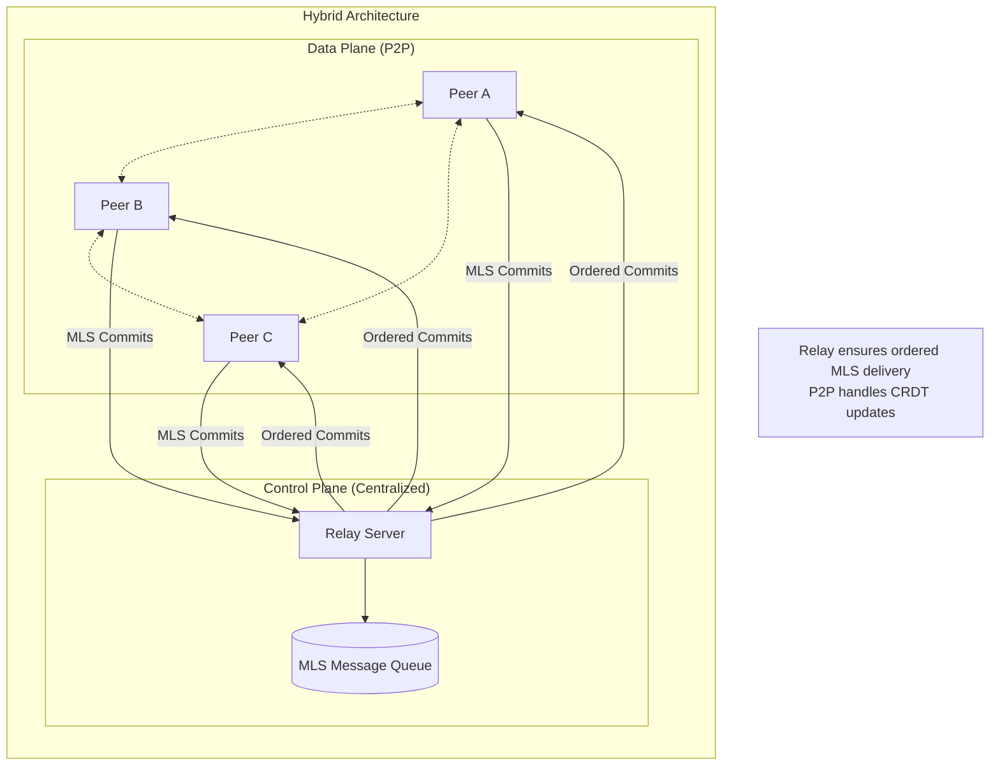
```mermaid
flowchart TB
    subgraph "Hybrid Architecture"
        direction TB

        subgraph "Control Plane (Centralized)"
            RELAY[Relay Server]
            MLS_Q[(MLS Message Queue)]
            RELAY --> MLS_Q
        end

        subgraph "Data Plane (P2P)"
            direction LR
            P2P1[Peer A]
            P2P2[Peer B]
            P2P3[Peer C]
            P2P1 <-.-> P2P2
            P2P2 <-.-> P2P3
            P2P1 <-.-> P2P3
        end

        P2P1 -->|MLS Commits| RELAY
        P2P2 -->|MLS Commits| RELAY
        P2P3 -->|MLS Commits| RELAY

        RELAY -->|Ordered Commits| P2P1
        RELAY -->|Ordered Commits| P2P2
        RELAY -->|Ordered Commits| P2P3
    end

    Note[Relay ensures ordered MLS delivery<br/>P2P handles CRDT updates]
```

**This is the recommended approach for obsidian-ee v2** - see [P2P Architecture](../p2p-architecture.md).

### 5. Epoch Fencing

Prevent commits from stale epochs using fencing tokens.

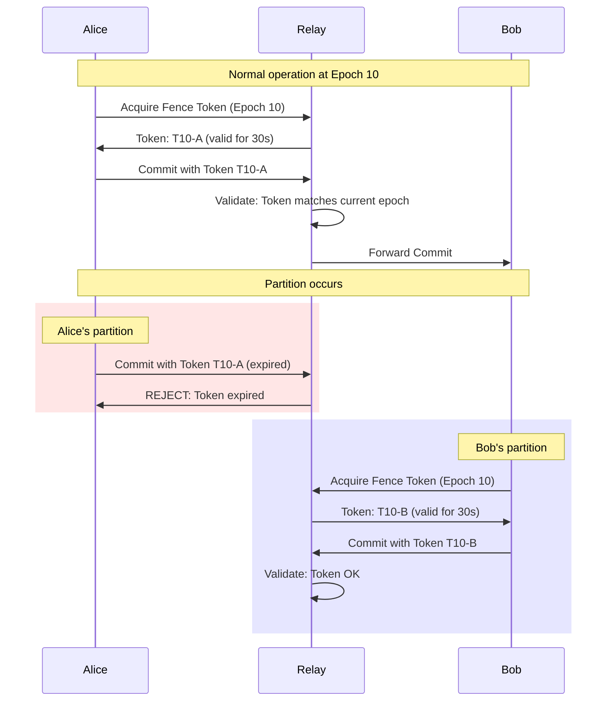
```mermaid
sequenceDiagram
    participant A as Alice
    participant R as Relay
    participant B as Bob

    Note over A,B: Normal operation at Epoch 10

    A->>R: Acquire Fence Token (Epoch 10)
    R->>A: Token: T10-A (valid for 30s)

    A->>R: Commit with Token T10-A
    R->>R: Validate: Token matches current epoch
    R->>B: Forward Commit

    Note over A,B: Partition occurs

    rect rgb(255, 230, 230)
        Note over A: Alice's partition
        A->>R: Commit with Token T10-A (expired)
        R->>A: REJECT: Token expired
    end

    rect rgb(230, 230, 255)
        Note over B: Bob's partition
        B->>R: Acquire Fence Token (Epoch 10)
        R->>B: Token: T10-B (valid for 30s)
        B->>R: Commit with Token T10-B
        R->>R: Validate: Token OK
    end
```

### 6. Graceful Degradation

When partition is detected, gracefully degrade to read-only or local-only mode.

```rust
/// Graceful degradation modes
pub enum OperationMode {
    /// Full functionality - MLS commits allowed
    Normal,
    /// Partition detected - only CRDT updates, no MLS commits
    Degraded,
    /// Isolated - local changes only, queue for sync
    Offline,
}

impl CollaborativeSession {
    pub fn handle_partition_detected(&mut self) {
        self.mode = OperationMode::Degraded;

        // Continue accepting CRDT updates (will merge later)
        self.crdt_updates_enabled = true;

        // Pause MLS operations
        self.mls_commits_enabled = false;

        // Notify user
        self.emit_event(SessionEvent::PartitionDetected {
            message: "Network partition detected. Document edits continue, but membership changes are paused.",
        });
    }
}
```

### Mitigation Comparison

| Mitigation | Split-Brain Prevention | Availability Impact | Implementation Complexity |
|------------|----------------------|---------------------|--------------------------|
| Leader Election | High | Medium (leader failure = freeze) | Low |
| Consensus Protocol | Very High | Low (quorum always available) | High |
| Partition Detection | Medium | Low (graceful degradation) | Medium |
| Hybrid Relay | Very High | Medium (relay = SPOF) | Low |
| Epoch Fencing | High | Low | Medium |
| Graceful Degradation | N/A (accepts split) | None | Low |

### Recommended Strategy for obsidian-ee

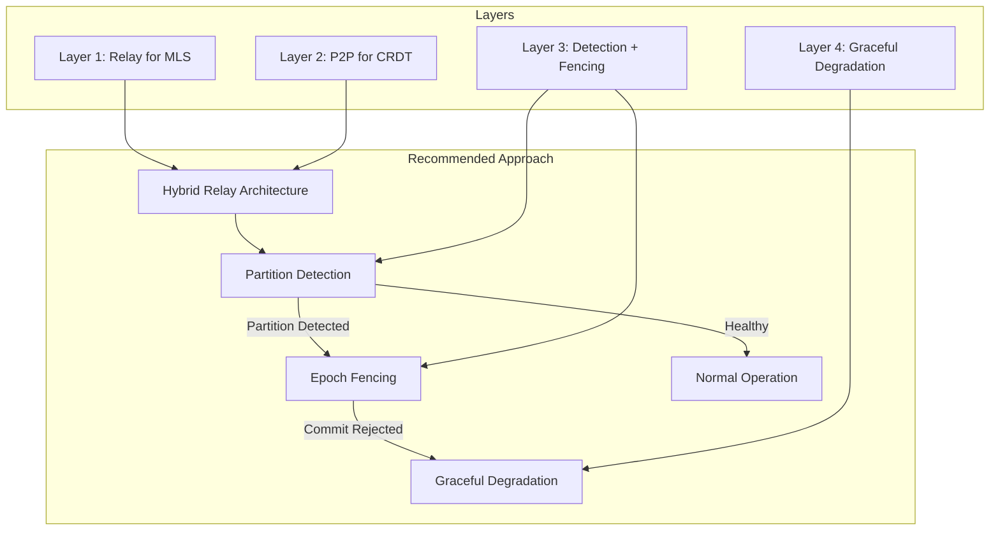
```mermaid
flowchart TB
    subgraph "Recommended Approach"
        direction TB

        HYBRID[Hybrid Relay Architecture]
        DETECT[Partition Detection]
        FENCE[Epoch Fencing]
        DEGRADE[Graceful Degradation]

        HYBRID --> DETECT
        DETECT -->|Partition Detected| FENCE
        FENCE -->|Commit Rejected| DEGRADE
        DETECT -->|Healthy| NORMAL[Normal Operation]
    end

    subgraph "Layers"
        L1[Layer 1: Relay for MLS]
        L2[Layer 2: P2P for CRDT]
        L3[Layer 3: Detection + Fencing]
        L4[Layer 4: Graceful Degradation]
    end

    L1 --> HYBRID
    L2 --> HYBRID
    L3 --> DETECT
    L3 --> FENCE
    L4 --> DEGRADE
```

---

## References

### Standards and Specifications

- [RFC 9420 - Messaging Layer Security (MLS)](https://datatracker.ietf.org/doc/rfc9420/) - The MLS protocol specification
- [RFC 9180 - Hybrid Public Key Encryption (HPKE)](https://datatracker.ietf.org/doc/rfc9180/) - Key encapsulation used by MLS
- [Raft Consensus Algorithm](https://raft.github.io/) - Understandable consensus protocol

### P2P Libraries

- [libp2p Specification](https://github.com/libp2p/specs) - Modular P2P networking stack
- [GossipSub v1.1](https://github.com/libp2p/specs/blob/master/pubsub/gossipsub/gossipsub-v1.1.md) - Gossip-based pubsub
- [y-webrtc](https://github.com/yjs/y-webrtc) - WebRTC provider for Yjs
- [Yjs CRDT](https://docs.yjs.dev/) - CRDT implementation for collaborative editing

### Academic Papers

- [Brewer's CAP Theorem](https://users.ece.cmu.edu/~adrian/731-sp04/readings/GL-cap.pdf) - Consistency, Availability, Partition Tolerance
- [Conflict-free Replicated Data Types](https://hal.inria.fr/inria-00609399/document) - CRDT foundations
- [PBFT: Practical Byzantine Fault Tolerance](http://pmg.csail.mit.edu/papers/osdi99.pdf) - Byzantine consensus
- [The Part-Time Parliament (Paxos)](https://lamport.azurewebsites.net/pubs/lamport-paxos.pdf) - Lamport's consensus

### Related obsidian-ee Documentation

- [P2P Architecture Analysis](../p2p-architecture.md) - Transport layer options for v2
- [MLS Integration Guide](../../plans/2026-02-04-e2e-completion.md) - E2E encryption implementation plan

---

*Last updated: 2026-02-04*
