# Sybil Attacks in P2P Networks

## Overview

A **Sybil attack** is a security threat in peer-to-peer (P2P) networks where a single adversary creates multiple fake identities (pseudonyms) to gain disproportionate influence over the network. Named after the subject of the book "Sybil" (a case study of dissociative identity disorder), this attack exploits the fundamental challenge of P2P systems: **the absence of a central authority to verify identity**.

In traditional client-server architectures, a central authority can enforce "one identity per entity" through verification mechanisms (email, phone, government ID). P2P networks, by design, lack this central point of control, making identity verification inherently difficult.

### Why Sybil Attacks Threaten P2P Systems

| Threat Vector | Impact |
|---------------|--------|
| **Consensus Manipulation** | Fake peers outvote legitimate participants |
| **Routing Corruption** | Malicious nodes intercept or drop messages |
| **Resource Exhaustion** | Network overwhelmed by fake peer connections |
| **Eclipse Attacks** | Target node surrounded by attacker-controlled peers |
| **Reputation Gaming** | Fake identities artificially boost trust scores |

The fundamental problem is that **identity is cheap** in most P2P systems. Creating a new peer typically requires only generating a cryptographic key pair—an operation that takes milliseconds and costs nothing.

---

## Technical Background

### Identity in P2P Networks

P2P networks typically rely on **cryptographic identities**:

```
PeerID = Hash(PublicKey)
```

This provides:
- **Uniqueness**: Each key pair produces a distinct identity
- **Authentication**: Messages can be signed and verified
- **No Central Registry**: Peers self-generate identities

However, this model has a critical weakness: **there is no binding between cryptographic identity and real-world identity**. An attacker with sufficient resources can generate millions of valid identities.

### Cost of Identity Creation

The Sybil vulnerability is directly proportional to the **cost asymmetry** between:
1. Cost for attacker to create fake identities
2. Cost for network to verify/trust identities

| Identity Mechanism | Creation Cost | Sybil Resistance |
|--------------------|---------------|------------------|
| Key pair generation | ~1ms CPU | None |
| Proof-of-Work | Variable (energy) | Moderate |
| Proof-of-Stake | Capital lockup | High |
| Social vouching | Social capital | Moderate |
| Centralized verification | External process | High (but defeats P2P) |

### Identity Generation Attack Economics

```
Attack Cost = N_identities × Cost_per_identity
Defense Cost = N_identities × Verification_cost_per_identity

If Cost_per_identity ≈ 0, attacker wins regardless of N
```

---

## Risk by Library

### y-webrtc: Low Risk

**Risk Level: LOW**

y-webrtc uses WebRTC for peer-to-peer communication, but critically depends on a **signaling server** for peer discovery.

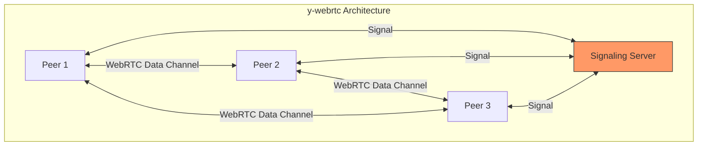

**Why Lower Risk:**

1. **Signaling Bottleneck**: All peer discovery goes through a controlled server
2. **Room-Based Isolation**: Peers only connect within specific document rooms
3. **Connection Limits**: WebRTC has practical limits on simultaneous connections
4. **Signaling Server Control**: Operator can implement rate limiting, authentication

**Residual Risks:**
- Malicious signaling server operator
- Signaling server compromise
- Room flooding if no authentication

**Mitigations in y-webrtc:**
```typescript
// Room-level access control
const provider = new WebrtcProvider('my-document', ydoc, {
  signaling: ['wss://my-signaling-server.com'],
  password: 'room-secret',  // Symmetric encryption
  // Custom authentication can be added at signaling layer
})
```

### y-libp2p / GossipSub: High Risk

**Risk Level: HIGH**

libp2p with GossipSub operates in a fully decentralized manner with DHT-based peer discovery, making it highly susceptible to Sybil attacks.

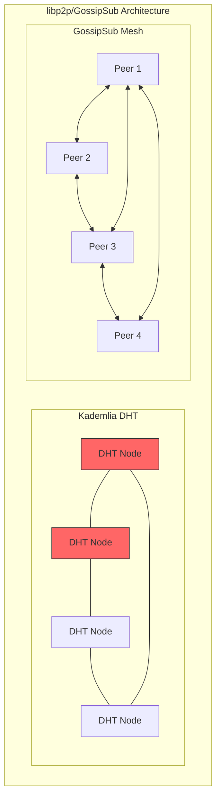

**Why High Risk:**

1. **Open DHT**: Anyone can join and announce peer records
2. **DHT Flooding**: Attacker fills routing tables with malicious peers
3. **GossipSub Mesh Manipulation**: Sybils can dominate topic meshes
4. **No Central Gatekeeper**: Pure P2P means no admission control
5. **Bootstrap Node Attacks**: Compromised bootstrappers direct new peers to Sybils

**Attack Surface Analysis:**

| Component | Vulnerability | Severity |
|-----------|---------------|----------|
| Kademlia DHT | Routing table pollution | Critical |
| GossipSub | Mesh takeover | Critical |
| PubSub Topics | Topic flooding | High |
| Peer Exchange | Sybil propagation | High |
| mDNS Discovery | Local network flooding | Medium |

**GossipSub-Specific Vulnerabilities:**

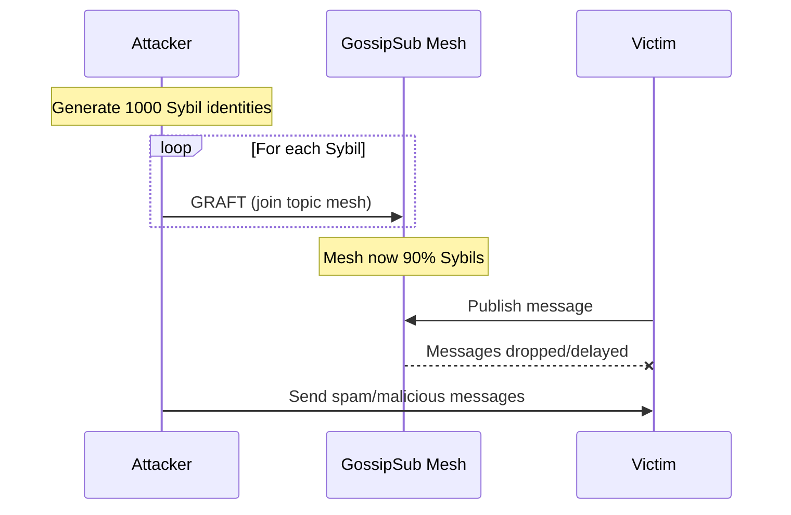

---

## Attack Scenario: Network Flooding

### Phase 1: Identity Generation

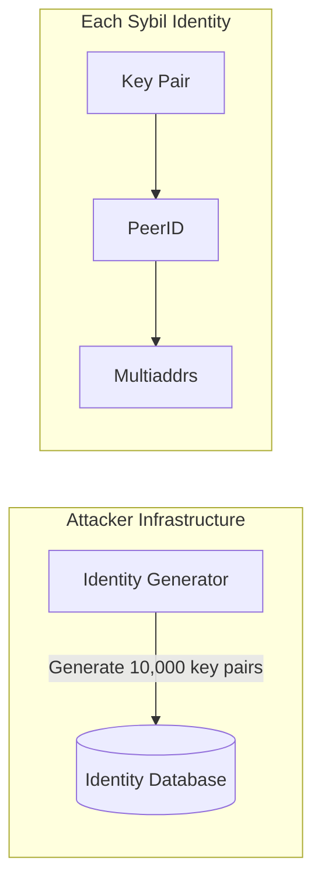

**Identity Generation Code (illustrative):**
```rust
// Attacker can generate identities trivially
fn generate_sybil_identities(count: usize) -> Vec<Keypair> {
    (0..count)
        .map(|_| Keypair::generate_ed25519())
        .collect()
}

// 10,000 identities in ~100ms on commodity hardware
let sybils = generate_sybil_identities(10_000);
```

### Phase 2: Network Infiltration

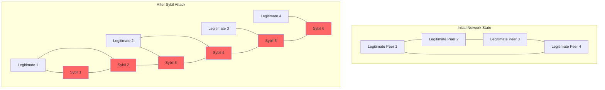

### Phase 3: DHT Poisoning

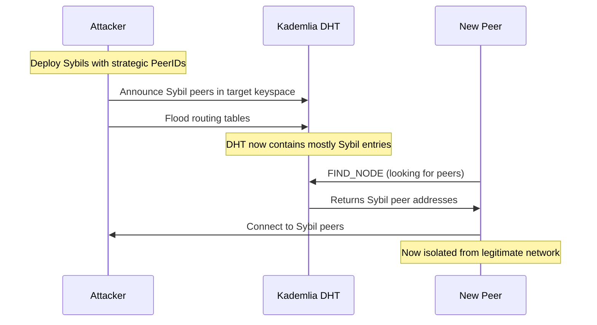

### Full Attack Timeline

```mermaid
gantt
    title Sybil Attack Timeline
    dateFormat  HH:mm

    section Preparation
    Generate 10K identities     :prep1, 00:00, 1m
    Deploy attack infrastructure :prep2, after prep1, 5m

    section Infiltration
    Bootstrap into network      :inf1, after prep2, 10m
    DHT table pollution         :inf2, after inf1, 30m
    GossipSub mesh joining      :inf3, after inf1, 20m

    section Exploitation
    Eclipse target peers        :exp1, after inf2, 60m
    Message interception        :exp2, after inf3, 60m
    Network partition           :exp3, after exp1, 30m
```

---

## Impact

### 1. Network Takeover

When Sybil nodes exceed a threshold (typically >50%), the attacker effectively controls the network:

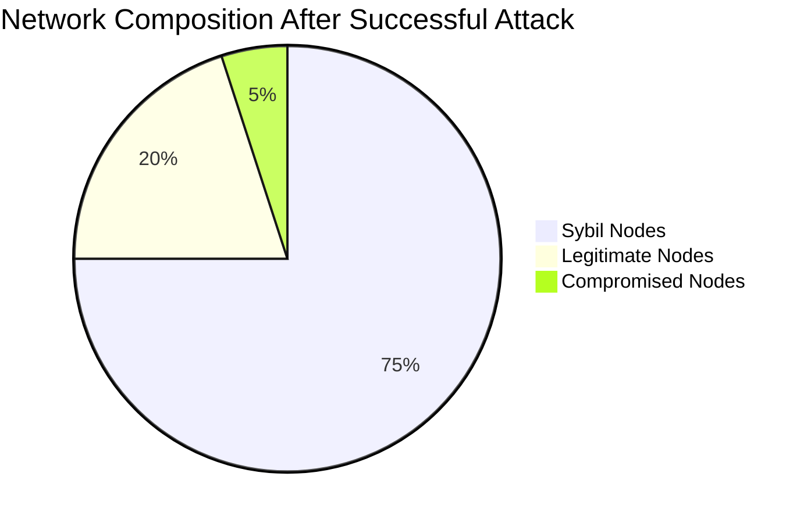

**Consequences:**
- Attacker controls message routing
- Can censor specific peers or content
- Can inject malicious data
- Can manipulate any voting/consensus mechanism

### 2. Eclipse Attacks

An eclipse attack is a targeted Sybil attack where the victim is **completely surrounded** by attacker-controlled nodes:

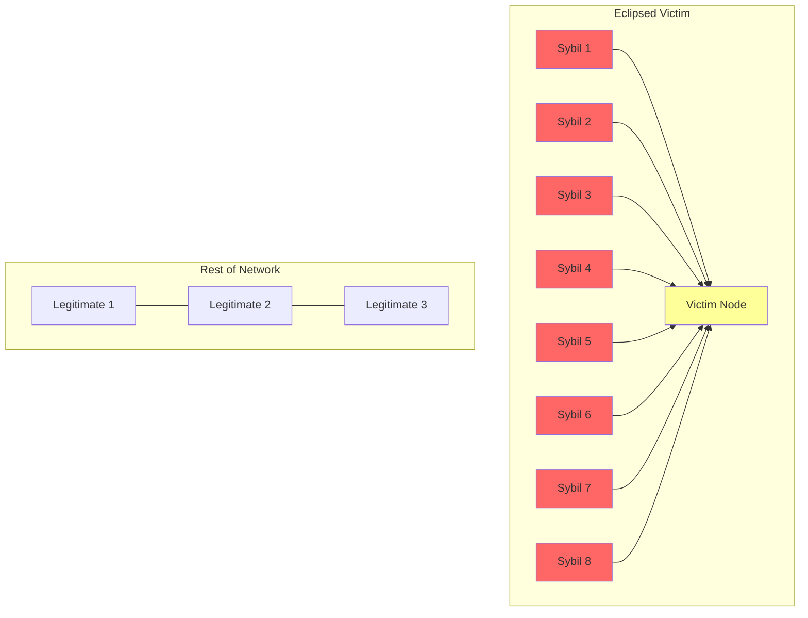

**Eclipse Attack Effects:**
- Victim receives only attacker-curated messages
- Victim's messages never reach legitimate network
- Attacker can perform man-in-the-middle attacks
- Double-spend attacks in cryptocurrency contexts

### 3. Spam and Denial of Service

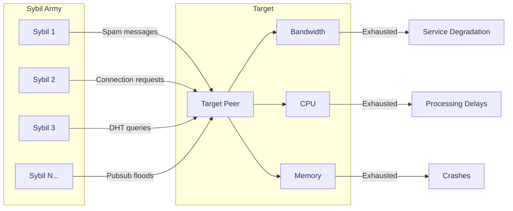

**DoS Amplification:**
- Each Sybil can open multiple connections
- Sybils can coordinate attacks
- Legitimate rate-limiting based on PeerID is ineffective

### 4. Voting and Consensus Manipulation

In systems with peer voting or reputation:

| Metric | Before Attack | After Attack |
|--------|---------------|--------------|
| Total peers | 100 | 10,100 |
| Legitimate peers | 100 | 100 |
| Sybil peers | 0 | 10,000 |
| Attacker vote share | 1% | 99% |

**Affected Mechanisms:**
- Reputation systems (fake positive reviews)
- Peer scoring (GossipSub peer scores manipulated)
- Democratic governance (vote stuffing)
- Random peer selection (Sybils dominate samples)

### 5. CRDT-Specific Impacts

For collaborative editing systems using CRDTs:

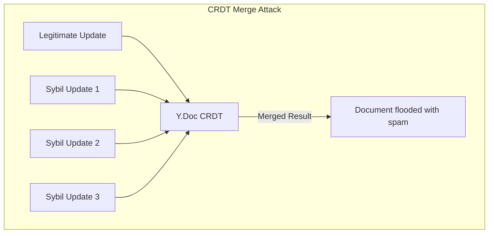

**CRDT-Specific Threats:**
- Document pollution with spam content
- History bloat (CRDT preserves all operations)
- Awareness flooding (fake cursors, selections)
- Undo history manipulation

---

## Mitigations

### 1. Proof-of-Work (PoW)

Require computational work to register identity:

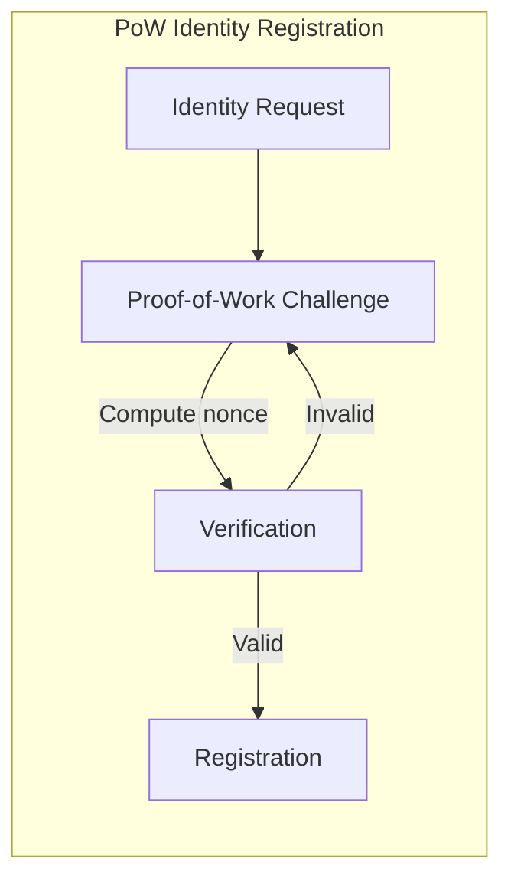

**Implementation:**
```rust
struct IdentityChallenge {
    peer_id: PeerId,
    difficulty: u32,  // Leading zero bits required
    timestamp: u64,
}

fn verify_pow(challenge: &IdentityChallenge, nonce: u64) -> bool {
    let data = format!("{:?}{}", challenge, nonce);
    let hash = sha256(data.as_bytes());

    // Check if hash has required leading zeros
    leading_zeros(&hash) >= challenge.difficulty
}
```

**Trade-offs:**
| Pros | Cons |
|------|------|
| Increases identity cost | Energy wasteful |
| No central authority needed | Unfair to low-powered devices |
| Tunable difficulty | ASICs can defeat |
| Works offline | One-time cost (not ongoing) |

### 2. Invite-Only / Closed Networks

Require existing member vouching:

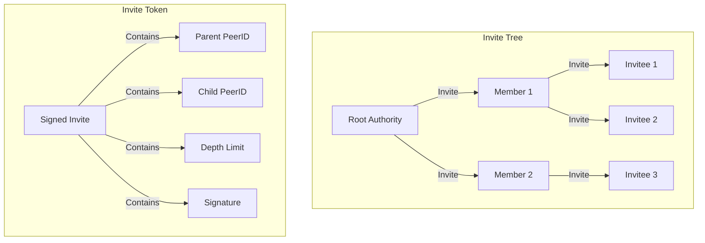

**Implementation:**
```rust
struct InviteToken {
    inviter: PeerId,
    invitee: PeerId,
    max_depth: u8,       // Limit invitation chains
    max_invites: u8,     // Limit invites per member
    expires: Timestamp,
    signature: Signature,
}

fn validate_membership(peer: &PeerId, chain: &[InviteToken]) -> bool {
    // Verify unbroken chain from root to peer
    chain.windows(2).all(|w| {
        w[0].invitee == w[1].inviter &&
        verify_signature(&w[0])
    })
}
```

**Trade-offs:**
| Pros | Cons |
|------|------|
| Strong Sybil resistance | Not open/permissionless |
| Accountability chain | Single point of failure (root) |
| Social cost to vouching | Slower network growth |
| Works with existing trust | Invite farming possible |

### 3. Stake-Based Identity

Require economic stake (deposit) for identity:

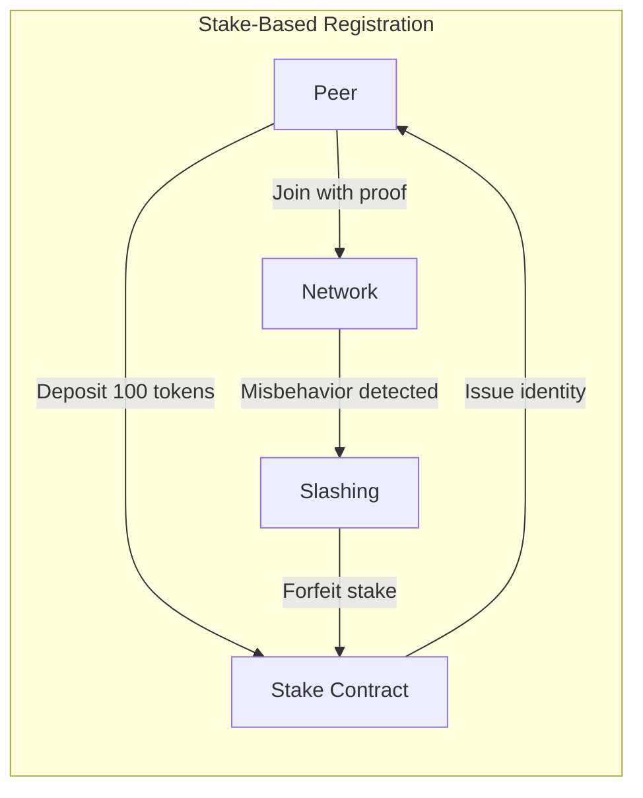

**Stake Economics:**
```
Min_stake = Expected_attack_profit / (1 - Detection_probability)

Example:
- Attack profit: $10,000
- Detection probability: 90%
- Required stake: $10,000 / 0.1 = $100,000 per identity
```

**Trade-offs:**
| Pros | Cons |
|------|------|
| Economic Sybil resistance | Excludes resource-poor participants |
| Slashing punishes bad behavior | Requires token/blockchain |
| Ongoing cost (locked capital) | Complexity increase |
| Scales attack cost linearly | Wealthy attackers unaffected |

### 4. Social Graph / Web of Trust

Leverage existing trust relationships:

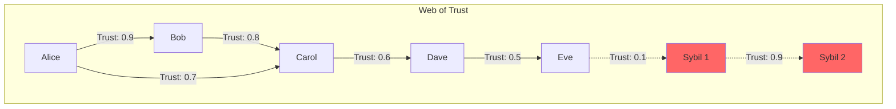

**Trust Propagation:**
```rust
fn compute_trust(from: &PeerId, to: &PeerId, graph: &TrustGraph) -> f64 {
    // Transitive trust with decay
    let paths = graph.all_paths(from, to);

    paths.iter()
        .map(|path| {
            path.edges()
                .map(|e| e.trust_score)
                .product::<f64>()
        })
        .max()
        .unwrap_or(0.0)
}

// Sybil cluster detection
fn is_sybil_cluster(peers: &[PeerId], graph: &TrustGraph) -> bool {
    // High internal trust, low external trust = likely Sybil
    let internal_trust = average_trust_within(peers, graph);
    let external_trust = average_trust_to_outside(peers, graph);

    internal_trust > 0.8 && external_trust < 0.2
}
```

**Trade-offs:**
| Pros | Cons |
|------|------|
| Leverages real relationships | Cold start problem |
| Sybils hard to integrate | Privacy concerns |
| Decentralized | Trust is subjective |
| No tokens needed | Sybil clusters still possible |

### 5. Hybrid Approaches

Real-world systems often combine multiple mitigations:


### Mitigation Comparison Matrix

| Mitigation | Sybil Resistance | Decentralization | Inclusivity | Complexity |
|------------|------------------|------------------|-------------|------------|
| PoW | Medium | High | Medium | Low |
| Invite-only | High | Low | Low | Low |
| Stake-based | High | Medium | Low | High |
| Social graph | Medium | High | Medium | High |
| Hybrid | High | Medium | Medium | Very High |

---

## References

### Academic Papers

1. **Douceur, J.R. (2002)**. "The Sybil Attack." *International Workshop on Peer-to-Peer Systems (IPTPS)*. Microsoft Research.
   - Original paper defining the Sybil attack

2. **Danezis, G., & Mittal, P. (2009)**. "SybilInfer: Detecting Sybil Nodes using Social Networks." *NDSS*.
   - Social graph-based detection

3. **Yu, H., et al. (2006)**. "SybilGuard: Defending Against Sybil Attacks via Social Networks." *ACM SIGCOMM*.
   - Foundational work on social Sybil defense

4. **Heilman, E., et al. (2015)**. "Eclipse Attacks on Bitcoin's Peer-to-Peer Network." *USENIX Security*.
   - Practical eclipse attacks

5. **Viswanath, B., et al. (2010)**. "An Analysis of Social Network-Based Sybil Defenses." *ACM SIGCOMM*.
   - Comprehensive analysis of social defenses

### Protocol Specifications

6. **libp2p Specification**. https://github.com/libp2p/specs
   - GossipSub v1.1 includes peer scoring for Sybil mitigation

7. **Kademlia DHT**. Maymounkov, P., & Mazieres, D. (2002). "Kademlia: A Peer-to-peer Information System Based on the XOR Metric." *IPTPS*.

### Implementation References

8. **GossipSub Peer Scoring**. https://github.com/libp2p/specs/blob/master/pubsub/gossipsub/gossipsub-v1.1.md#peer-scoring
   - Behavior-based scoring to penalize suspicious peers

9. **y-webrtc**. https://github.com/yjs/y-webrtc
   - WebRTC provider with signaling server architecture

10. **rust-libp2p**. https://github.com/libp2p/rust-libp2p
    - Rust implementation of libp2p protocols

### Further Reading

11. **Nakamoto, S. (2008)**. "Bitcoin: A Peer-to-Peer Electronic Cash System."
    - PoW as Sybil resistance mechanism

12. **Buterin, V. (2014)**. "Ethereum White Paper."
    - Stake-based approaches to Sybil resistance

13. **MLS Protocol RFC 9420**. https://www.rfc-editor.org/rfc/rfc9420.html
    - Group key agreement with member authentication
