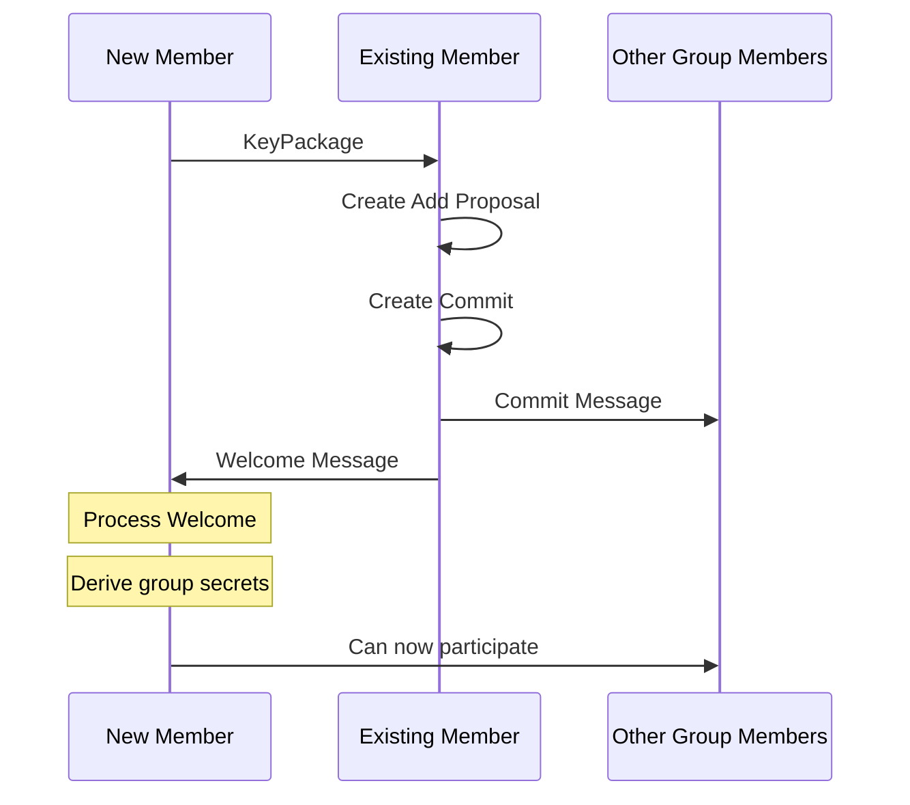
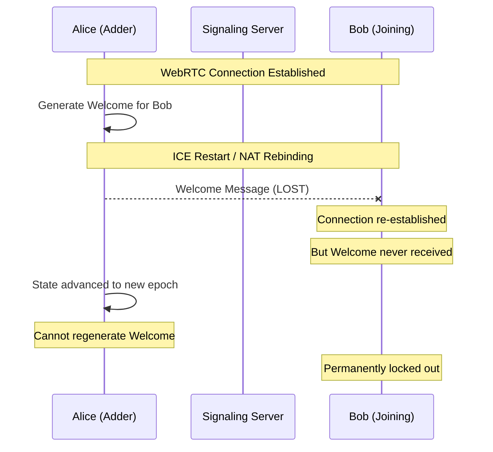
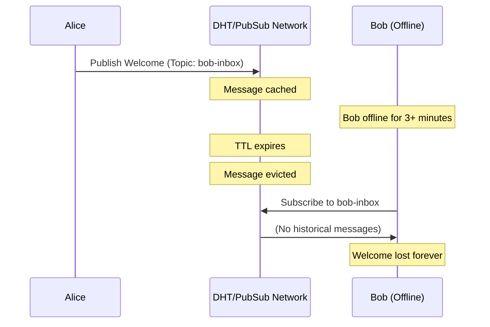
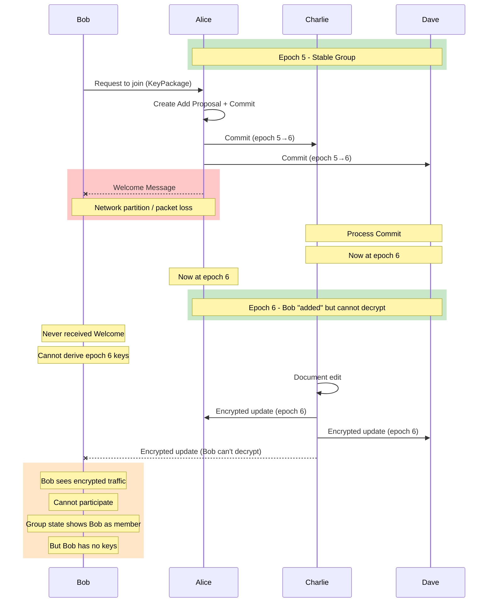
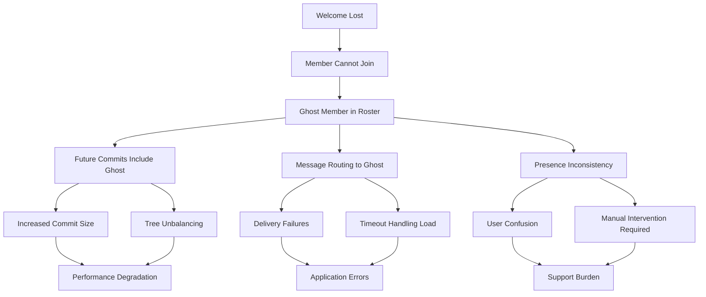
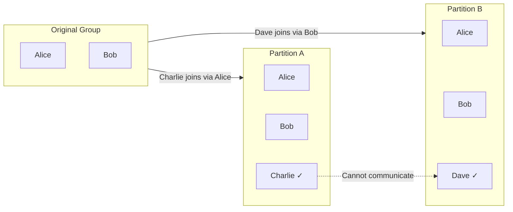
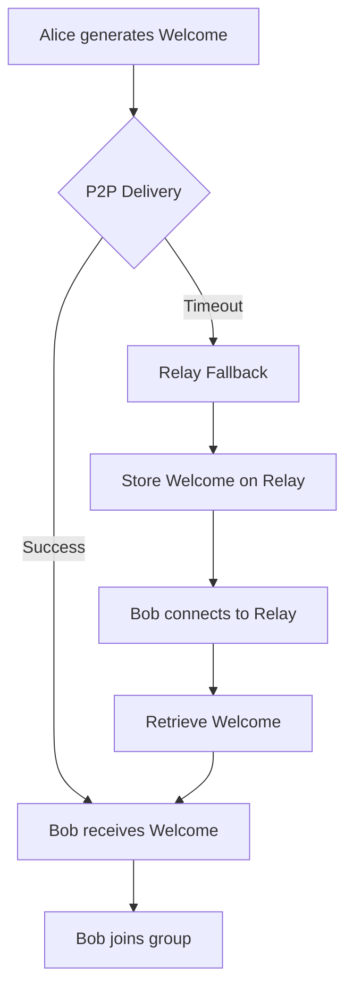
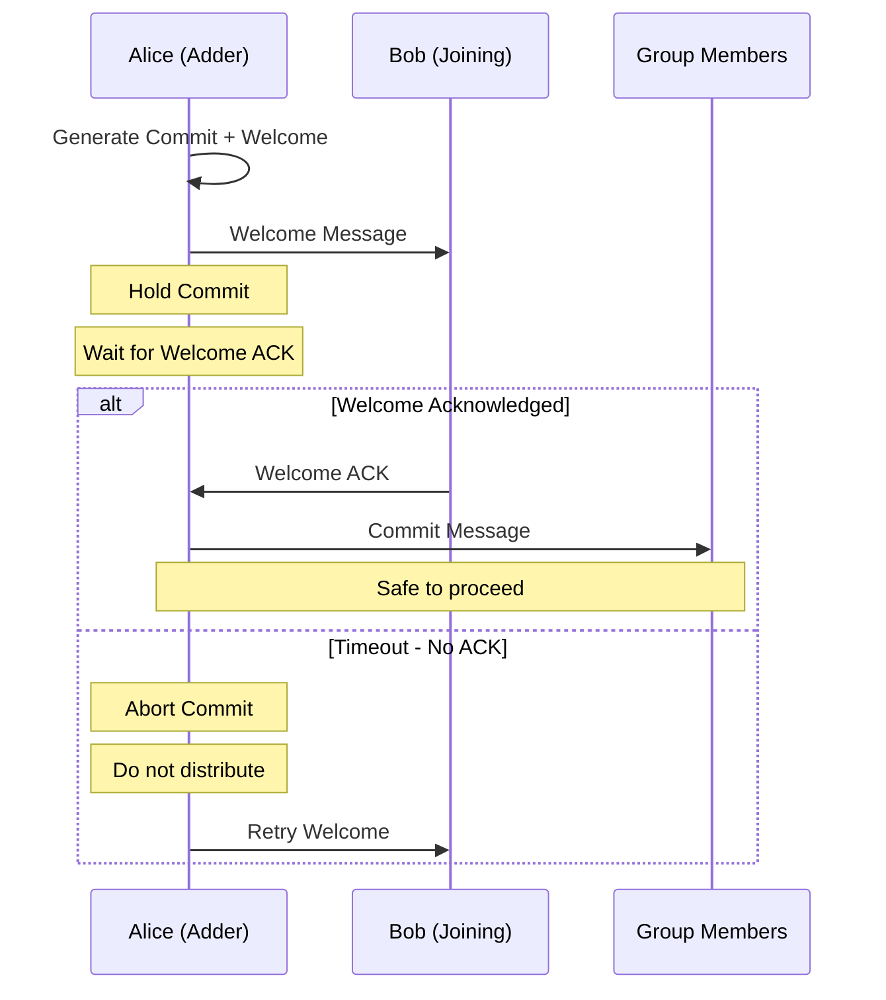

# Welcome Message Loss in P2P MLS Systems

## Overview

MLS (Messaging Layer Security, RFC 9420) Welcome messages are cryptographic artifacts that enable new members to join an existing encrypted group. In peer-to-peer (P2P) systems without reliable message delivery guarantees, the loss of Welcome messages represents a critical failure mode that can permanently prevent group membership changes and lead to group partitioning.

This document examines the technical mechanisms behind Welcome message loss in P2P MLS deployments, particularly when using CRDT-based collaboration libraries like Yjs with WebRTC or libp2p transport layers.

## Technical Background

### MLS Group Join Protocol

When a new member joins an MLS group, the following sequence occurs:

1. **KeyPackage Publication**: The joining client publishes a KeyPackage containing their public keys and capabilities
2. **Add Proposal**: An existing group member creates an Add proposal referencing the KeyPackage
3. **Commit**: The proposing member (or another authorized member) creates a Commit that includes the Add
4. **Welcome Message Generation**: The committer generates a Welcome message encrypted specifically for the new member
5. **Welcome Delivery**: The Welcome message must reach the new member
6. **Group State Initialization**: The new member processes the Welcome to derive the group's encryption secrets



### Welcome Message Contents

A Welcome message contains:

- **GroupInfo**: Encrypted group metadata including the group ID, epoch, and tree hash
- **PathSecrets**: Encrypted path secrets allowing the new member to derive the key schedule
- **KeyPackage Reference**: Identifies which KeyPackage this Welcome corresponds to
- **Encrypted Group Secrets**: The `joiner_secret` needed to compute the epoch's encryption keys

The Welcome is encrypted using HPKE (Hybrid Public Key Encryption) to the new member's init key from their KeyPackage. **Only the intended recipient can decrypt it.**

### Critical Properties

1. **Single Recipient**: Each Welcome is encrypted to exactly one new member
2. **Epoch-Bound**: Valid only for the epoch in which it was created
3. **Non-Reproducible**: Cannot be regenerated without the original commit secrets
4. **Forward Secrecy Implications**: After the committer advances their state, regenerating the Welcome becomes cryptographically impossible

## Risk by Transport Library

### y-webrtc: Unreliable DataChannels and Peer Churn

[y-webrtc](https://github.com/yjs/y-webrtc) uses WebRTC DataChannels for peer-to-peer CRDT synchronization. When layering MLS on top, several reliability issues emerge:

#### Unreliable DataChannel Mode

By default, y-webrtc may use unreliable DataChannels (similar to UDP) for performance:

```javascript
// y-webrtc default configuration
const rtcConfig = {
  ordered: false,        // Messages may arrive out of order
  maxRetransmits: 0      // No automatic retransmission
}
```

**Impact on Welcome Messages:**
- Welcome messages can be silently dropped
- No delivery confirmation mechanism
- Large Welcome messages may be fragmented and partially lost

#### Peer Churn During Join

WebRTC connections are inherently unstable:



#### Signaling Server Limitations

y-webrtc's signaling servers are designed for peer discovery, not reliable message delivery:

- No message persistence
- No delivery receipts
- Designed for ephemeral signaling, not critical cryptographic material

### y-libp2p / GossipSub: Message Expiry and Peer Unavailability

[libp2p](https://libp2p.io/) with GossipSub provides a more robust P2P layer but still has failure modes:

#### GossipSub Message TTL

GossipSub implements message caching with expiration:

```go
// Default GossipSub parameters
const (
    // Messages are cached for limited time
    TimeCacheDuration = 2 * time.Minute

    // History windows for message propagation
    HistoryLength  = 5   // epochs
    HistoryGossip  = 3   // epochs to gossip about
)
```

**Impact:**
- If the new member is offline for > TTL, Welcome is purged from network caches
- Historical message requests (IWANT) fail if message expired

#### Peer Unavailability Window



#### Eclipse Attacks

In pure P2P networks, malicious peers can isolate nodes:

- Attacker surrounds target peer
- Welcome messages routed through attacker
- Attacker drops or delays Welcomes
- New member cannot join group

### Comparison Matrix

| Transport | Delivery Guarantee | Persistence | Offline Support | Welcome Risk |
|-----------|-------------------|-------------|-----------------|--------------|
| y-webrtc (unreliable) | None | None | None | **Critical** |
| y-webrtc (reliable) | Per-connection | None | None | **High** |
| libp2p/GossipSub | Best-effort | TTL-limited | Limited | **Medium-High** |
| libp2p + DHT Store | Best-effort | DHT TTL | Partial | **Medium** |
| Relay Server | Guaranteed | Configurable | Full | **Low** |

## Failure Scenario: Group Partitioning

### Concrete Example

Consider a collaborative document editing session with MLS-encrypted CRDT synchronization:

**Initial State:**
- Group members: Alice, Charlie, Dave
- Current epoch: 5
- Bob wants to join

**Failure Sequence:**



### State Inconsistency

After the failure:

| Member | Epoch | Can Encrypt | Can Decrypt | Sees Bob as Member |
|--------|-------|-------------|-------------|-------------------|
| Alice | 6 | Yes | Yes | Yes |
| Charlie | 6 | Yes | Yes | Yes |
| Dave | 6 | Yes | Yes | Yes |
| Bob | - | No | No | No (has no state) |

**The group believes Bob is a member, but Bob cannot participate.**

### Recovery Attempts and Why They Fail

#### Attempt 1: Resend Welcome

```
FAILS: Alice has advanced to epoch 6
       The Welcome was generated with epoch 5 commit secrets
       Those secrets are deleted (forward secrecy)
       Welcome cannot be regenerated
```

#### Attempt 2: Re-add Bob

```
Requires: Remove Bob first (he's "in" the group)
          But Bob never processed Welcome
          Bob cannot process Remove (no keys)

Result: Must coordinate out-of-band
        All members must agree to remove "ghost" Bob
        Then re-add with fresh KeyPackage
```

#### Attempt 3: Bob Uses Old KeyPackage

```
FAILS: KeyPackage is single-use in MLS
       Already consumed by original Add
       Attempting reuse is a protocol violation
       Bob must generate new KeyPackage
```

## Impact Analysis

### Immediate Impacts

1. **Membership Desynchronization**
   - Group roster shows member who cannot participate
   - Delivery systems may route messages to unreachable member
   - Message delivery confirmations never arrive from "ghost" member

2. **Collaboration Disruption**
   - New member cannot contribute to shared document
   - Other members may wait for acknowledgment that never comes
   - Real-time presence shows member as "joined" but inactive

3. **Key Schedule Inconsistency**
   - Failed member has no epoch secret
   - Cannot derive application keys
   - Cannot process subsequent Commits

### Cascading Failures



### Group Partitioning Scenarios

In severe cases, Welcome loss can partition groups:

**Scenario: Concurrent Joins with Partial Failures**



If Alice adds Charlie while Bob concurrently adds Dave, and cross-Welcomes are lost, the group fragments into incompatible states.

## Mitigations

### 1. Reliable Delivery Layer

Implement a reliability protocol on top of the P2P transport:

```rust
/// Reliable Welcome delivery with acknowledgment
pub struct ReliableWelcome {
    /// The Welcome message
    welcome: MlsMessageOut,
    /// Unique delivery ID
    delivery_id: Uuid,
    /// Recipient identity
    recipient: KeyPackageRef,
    /// Delivery attempts
    attempts: u32,
    /// Last attempt timestamp
    last_attempt: Instant,
    /// Acknowledgment received
    acknowledged: bool,
}

impl ReliableWelcome {
    pub async fn deliver_with_retry(
        &mut self,
        transport: &dyn Transport,
        config: &RetryConfig,
    ) -> Result<(), DeliveryError> {
        while self.attempts < config.max_attempts {
            self.attempts += 1;
            self.last_attempt = Instant::now();

            // Send Welcome with delivery ID
            transport.send_welcome(
                &self.welcome,
                self.delivery_id,
                &self.recipient,
            ).await?;

            // Wait for acknowledgment
            match timeout(config.ack_timeout, self.wait_for_ack()).await {
                Ok(_) => {
                    self.acknowledged = true;
                    return Ok(());
                }
                Err(_) => {
                    // Exponential backoff
                    sleep(config.backoff(self.attempts)).await;
                }
            }
        }

        Err(DeliveryError::MaxAttemptsExceeded)
    }
}
```

### 2. Relay Fallback Architecture

Use a relay server as fallback when P2P delivery fails:



Implementation considerations:

```rust
/// Hybrid delivery strategy
pub enum DeliveryStrategy {
    /// P2P only, fail if unreachable
    P2POnly,
    /// Try P2P first, fallback to relay
    P2PWithRelayFallback {
        p2p_timeout: Duration,
        relay_url: Url,
    },
    /// Parallel delivery via both channels
    ParallelDelivery {
        relay_url: Url,
    },
    /// Relay only (most reliable)
    RelayOnly {
        relay_url: Url,
    },
}

pub async fn deliver_welcome(
    welcome: &MlsMessageOut,
    recipient: &KeyPackageRef,
    strategy: &DeliveryStrategy,
) -> Result<(), DeliveryError> {
    match strategy {
        DeliveryStrategy::P2PWithRelayFallback { p2p_timeout, relay_url } => {
            // Try P2P first
            match timeout(*p2p_timeout, p2p_deliver(welcome, recipient)).await {
                Ok(Ok(_)) => return Ok(()),
                _ => {
                    // Fallback to relay
                    relay_deliver(welcome, recipient, relay_url).await
                }
            }
        }
        DeliveryStrategy::ParallelDelivery { relay_url } => {
            // Send via both channels, first success wins
            tokio::select! {
                result = p2p_deliver(welcome, recipient) => result,
                result = relay_deliver(welcome, recipient, relay_url) => result,
            }
        }
        // ... other strategies
    }
}
```

### 3. Message Persistence Layer

Store Welcomes persistently until acknowledged:

```rust
/// Persistent Welcome storage
#[async_trait]
pub trait WelcomeStore {
    /// Store Welcome for later retrieval
    async fn store_welcome(
        &self,
        welcome_id: &Uuid,
        welcome: &[u8],
        recipient: &KeyPackageRef,
        ttl: Duration,
    ) -> Result<(), StoreError>;

    /// Retrieve pending Welcomes for recipient
    async fn get_pending_welcomes(
        &self,
        recipient: &KeyPackageRef,
    ) -> Result<Vec<StoredWelcome>, StoreError>;

    /// Mark Welcome as delivered
    async fn mark_delivered(
        &self,
        welcome_id: &Uuid,
    ) -> Result<(), StoreError>;

    /// Clean up expired Welcomes
    async fn cleanup_expired(&self) -> Result<u64, StoreError>;
}

/// DynamoDB implementation for Welcome persistence
pub struct DynamoWelcomeStore {
    client: DynamoDbClient,
    table_name: String,
}
```

### 4. Commit Delay Strategy

Delay Commit processing to ensure Welcome delivery:



```rust
/// Commit coordination with Welcome delivery
pub struct CoordinatedCommit {
    commit: MlsMessageOut,
    welcomes: Vec<(KeyPackageRef, MlsMessageOut)>,
    ack_timeout: Duration,
}

impl CoordinatedCommit {
    pub async fn execute(
        &self,
        transport: &dyn Transport,
    ) -> Result<(), CommitError> {
        // Phase 1: Deliver all Welcomes and collect ACKs
        let welcome_results = futures::future::join_all(
            self.welcomes.iter().map(|(recipient, welcome)| {
                deliver_with_ack(transport, welcome, recipient, self.ack_timeout)
            })
        ).await;

        // Check all Welcomes were acknowledged
        let all_acked = welcome_results.iter().all(|r| r.is_ok());

        if !all_acked {
            // Abort: Don't send Commit if any Welcome failed
            return Err(CommitError::WelcomeDeliveryFailed);
        }

        // Phase 2: Only now distribute Commit
        transport.broadcast_commit(&self.commit).await
    }
}
```

### 5. External Commit Support

MLS supports "External Commits" allowing joins without Welcome:

```rust
/// External Commit based join (MLS 12.4)
///
/// Allows joining a group using only public group info,
/// without requiring a Welcome message.
pub struct ExternalJoin {
    /// Public group info (can be fetched from any member)
    group_info: GroupInfo,
    /// Joiner's credentials
    credential: Credential,
    /// Signature key
    signature_key: SignaturePrivateKey,
}

impl ExternalJoin {
    pub fn create_external_commit(
        &self,
        provider: &impl OpenMlsCryptoProvider,
    ) -> Result<(MlsMessageOut, MlsGroup), ExternalCommitError> {
        // Create external commit from public GroupInfo
        // This bypasses the need for Welcome message
        MlsGroup::join_by_external_commit(
            provider,
            &self.group_info,
            &self.credential,
            &self.signature_key,
        )
    }
}
```

**Trade-offs:**
- Requires GroupInfo to be available (another message to lose)
- Less efficient than Welcome-based join
- May have policy restrictions (some groups disable external joins)

### 6. Redundant Welcome Paths

Send Welcome via multiple independent channels:

```rust
/// Multi-path Welcome delivery
pub struct RedundantWelcomeDelivery {
    paths: Vec<DeliveryPath>,
}

pub enum DeliveryPath {
    DirectP2P { peer_id: PeerId },
    RelayServer { url: Url },
    PubSubTopic { topic: String },
    OutOfBand { email: String },  // Last resort
}

impl RedundantWelcomeDelivery {
    pub async fn deliver(&self, welcome: &MlsMessageOut) -> DeliveryReport {
        let results = futures::future::join_all(
            self.paths.iter().map(|path| {
                self.deliver_via_path(welcome, path)
            })
        ).await;

        DeliveryReport {
            success: results.iter().any(|r| r.is_ok()),
            path_results: results,
        }
    }
}
```

## Architectural Recommendations

### For Obsidian E2E Collaborative Editing

Given the critical nature of Welcome messages in MLS-based collaboration:

1. **Never rely solely on P2P for Welcome delivery**
   - WebRTC DataChannels are insufficient for cryptographic material
   - GossipSub TTLs are too aggressive for offline scenarios

2. **Implement relay-backed Welcome storage**
   - Store Welcomes on relay server immediately after generation
   - Allow retrieval by recipient identity/KeyPackage reference
   - Maintain reasonable TTL (24-48 hours minimum)

3. **Use coordinated commit delivery**
   - Don't broadcast Commit until Welcome is acknowledged
   - Implement timeout and retry logic
   - Support manual recovery for edge cases

4. **Design for Welcome recovery**
   - Store Welcome metadata for debugging
   - Implement admin tools for group recovery
   - Consider External Commit as backup mechanism

5. **Monitor and alert**
   - Track Welcome delivery success rates
   - Alert on elevated failure rates
   - Implement delivery confirmation telemetry

## References

1. **RFC 9420 - The Messaging Layer Security (MLS) Protocol**
   - Section 12.4.3: Welcome Message
   - Section 12.4.4: External Commits
   - https://www.rfc-editor.org/rfc/rfc9420.html

2. **OpenMLS Documentation**
   - Welcome message handling: https://openmls.tech/book/user_manual/welcome.html
   - External joins: https://openmls.tech/book/user_manual/external_commits.html

3. **y-webrtc**
   - Repository: https://github.com/yjs/y-webrtc
   - Signaling protocol limitations

4. **libp2p GossipSub**
   - Specification: https://github.com/libp2p/specs/tree/master/pubsub/gossipsub
   - Message caching and TTL behavior

5. **WebRTC DataChannel Reliability**
   - SCTP association modes
   - https://www.w3.org/TR/webrtc/#rtcdatachannel

6. **MLS Architecture Draft**
   - Delivery service requirements
   - https://datatracker.ietf.org/doc/draft-ietf-mls-architecture/
