# Waku Protocol Evaluation for obsidian-ee v2

This document evaluates the Waku protocol as a potential P2P transport layer for obsidian-ee v2, analyzing its compatibility with our MLS-based encryption model and Yrs CRDT synchronization.

## Table of Contents

1. [Overview](#overview)
2. [Technical Architecture](#technical-architecture)
3. [Encryption Model](#encryption-model)
4. [Compatibility with obsidian-ee](#compatibility-with-obsidian-ee)
5. [Pros and Cons](#pros-and-cons)
6. [Risk Analysis](#risk-analysis)
7. [Recommendation](#recommendation)
8. [References](#references)

---

## Overview

### What is Waku?

**Waku** is a privacy-preserving, peer-to-peer messaging protocol designed for censorship-resistant communication. It is the successor to Ethereum's Whisper protocol, rebuilt from the ground up to address Whisper's scalability and efficiency limitations.

### History and Evolution

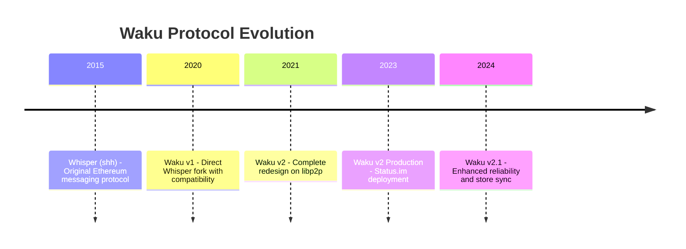

| Version | Architecture | Status | Key Change |
|---------|-------------|--------|------------|
| **Whisper** | devp2p | Deprecated | Original design, poor scalability |
| **Waku v1** | devp2p | Legacy | Whisper-compatible, improved efficiency |
| **Waku v2** | libp2p | Production | Complete redesign, modular protocols |

### Design Philosophy

Waku prioritizes:

1. **Privacy by default** - Metadata minimization, sender anonymity
2. **Censorship resistance** - Decentralized relay network
3. **Resource efficiency** - Lighter than Whisper, suitable for mobile
4. **Modularity** - Choose protocols based on device capabilities
5. **Interoperability** - Built on libp2p standards

### Current Adoption

- **Status.im** - Primary production deployment for messaging
- **Railgun** - Privacy-preserving DeFi communication
- **The Graph** - Subgraph indexer coordination
- **Logos** - Decentralized governance infrastructure

---

## Technical Architecture

### Protocol Stack

Waku v2 is built on libp2p and consists of multiple modular protocols:

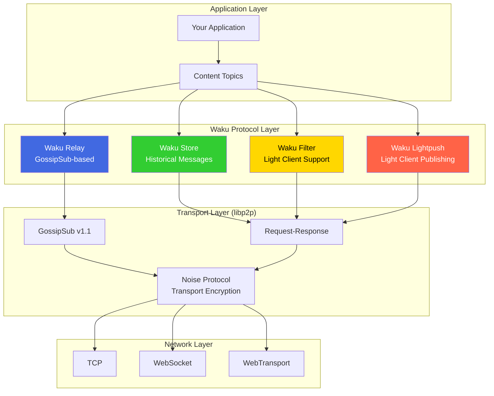

### Core Protocols

#### 1. Waku Relay (Primary Transport)

The relay protocol is the backbone of Waku, providing pub/sub messaging over a GossipSub mesh.

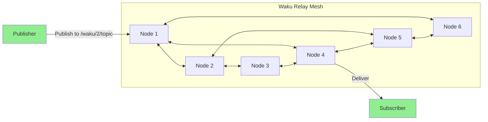

**Key Properties:**
- **Pubsub Semantics**: Many-to-many messaging via topics
- **GossipSub Foundation**: Inherits peer scoring, mesh management
- **Anonymity Set**: Messages mixed across entire topic subscription
- **Default Shard**: `/waku/2/default-waku/proto` (can be customized)

**Message Format:**
```protobuf
message WakuMessage {
  bytes payload = 1;           // Encrypted content
  string content_topic = 2;    // Application-level routing
  uint32 version = 3;          // Encoding version
  sint64 timestamp = 10;       // Message timestamp
  bytes meta = 11;             // Optional metadata
  bool ephemeral = 31;         // Don't store
}
```

#### 2. Waku Store (Offline Message Retrieval)

Enables nodes to query historical messages they missed while offline.

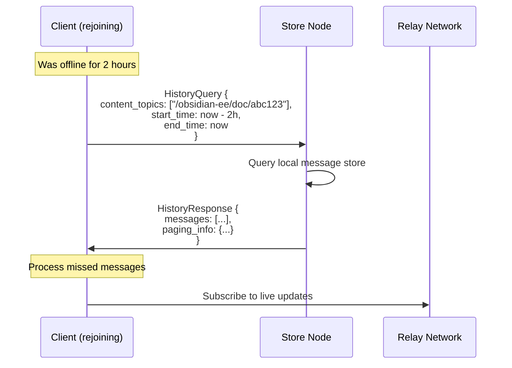

**Store Query Parameters:**
| Parameter | Description | Use Case |
|-----------|-------------|----------|
| `content_topics` | Filter by topic(s) | Document-specific queries |
| `start_time` | Earliest message time | Sync from last seen |
| `end_time` | Latest message time | Bounded queries |
| `page_size` | Messages per response | Pagination |
| `cursor` | Pagination state | Multi-page retrieval |

**Retention Policy:**
- Default: 30 days (configurable)
- Storage: SQLite or PostgreSQL
- Pruning: Time-based or size-based

#### 3. Waku Filter (Light Client Subscription)

Allows resource-constrained clients to receive only relevant messages without participating in full relay.

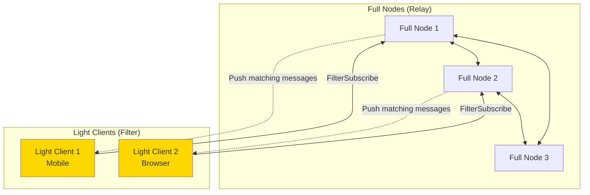

**Protocol Flow:**
1. Light client sends `FilterSubscribeRequest` with desired content topics
2. Full node maintains subscription state
3. Full node pushes matching messages via `MessagePush`
4. Subscription can be renewed or cancelled

**Privacy Considerations:**
- Filter node learns which topics the client subscribes to
- No full relay participation = smaller anonymity set
- Recommended: Use multiple filter nodes

#### 4. Waku Lightpush (Light Client Publishing)

Enables light clients to publish messages without running full relay.

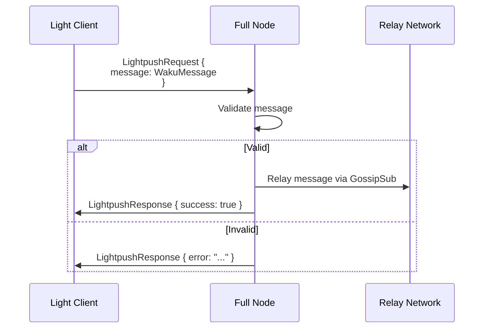

**Use Cases:**
- Mobile apps with limited connectivity
- Browser clients without WebRTC/WebTransport
- IoT devices with constrained resources

### Network Topology

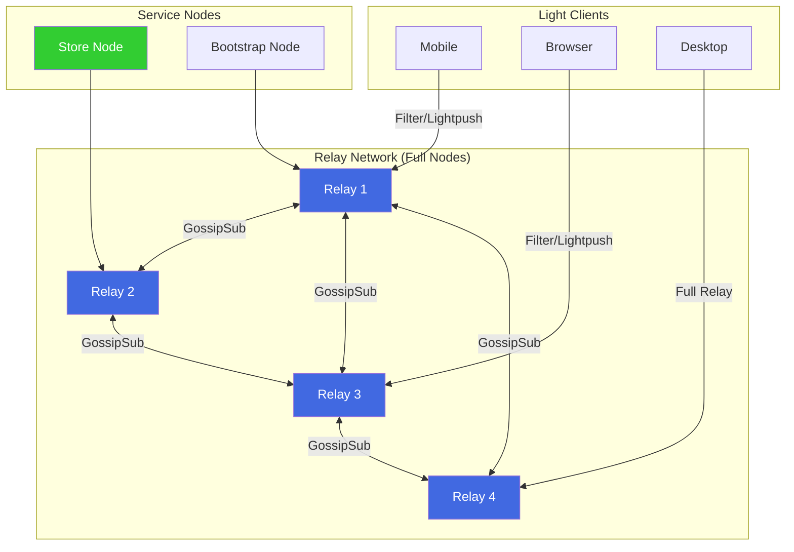

### Content Topics

Waku uses hierarchical content topics for message routing:

```
/application-name/version/content-type/encoding

Examples:
/obsidian-ee/1/doc-abc123-updates/proto
/obsidian-ee/1/doc-abc123-mls/proto
/status/1/public-chat/plain
```

**Topic Design Considerations:**

| Approach | Privacy | Efficiency | Example |
|----------|---------|------------|---------|
| Per-document topic | Lower (reveals document participation) | High | `/obsidian-ee/1/doc-{id}/proto` |
| Shared topic | Higher (mixed traffic) | Lower | `/obsidian-ee/1/all-docs/proto` |
| Sharded topics | Medium | Medium | `/obsidian-ee/1/shard-{hash}/proto` |

---

## Encryption Model

### Waku's Native Encryption Options

Waku provides two encryption schemes at the message level:

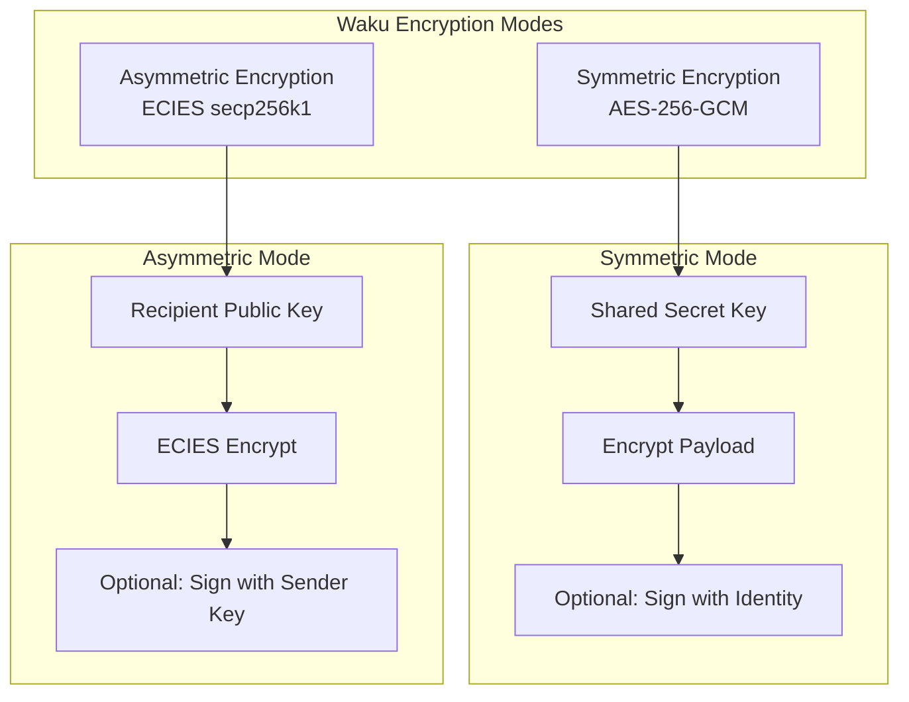

#### Symmetric Encryption

**Best for:** Private groups with shared key

```
Encryption:
  1. Generate random nonce (12 bytes)
  2. AES-256-GCM encrypt payload with shared key
  3. Prepend nonce to ciphertext

Format: [nonce (12)] [ciphertext] [auth_tag (16)]
```

**Properties:**
- All group members share the same key
- No forward secrecy (key compromise reveals all messages)
- No sender authentication (unless signed)
- Efficient for large groups

#### Asymmetric Encryption

**Best for:** One-to-one or small groups

```
Encryption (ECIES):
  1. Generate ephemeral key pair
  2. ECDH with recipient's public key
  3. KDF to derive encryption key
  4. AES-256-GCM encrypt payload
  5. Prepend ephemeral public key

Format: [ephemeral_pubkey (33)] [nonce (12)] [ciphertext] [auth_tag (16)]
```

**Properties:**
- Per-message key derivation
- Forward secrecy for ephemeral keys
- Recipient must know sender's public key for verification
- O(n) encryptions for n recipients

### Comparison with MLS

| Feature | Waku Symmetric | Waku Asymmetric | MLS (obsidian-ee) |
|---------|---------------|-----------------|-------------------|
| **Forward Secrecy** | No | Partial | Yes (per-epoch) |
| **Post-Compromise Security** | No | No | Yes (key rotation) |
| **Sender Authentication** | Optional | Optional | Built-in |
| **Group Key Agreement** | Manual | N/A | TreeKEM |
| **Member Add/Remove** | Manual key redistribution | N/A | Commit protocol |
| **Scalability** | O(1) encryption | O(n) encryption | O(log n) key update |
| **Offline Members** | Works | Works | Welcome messages needed |

### MLS + Waku: Complementary Roles

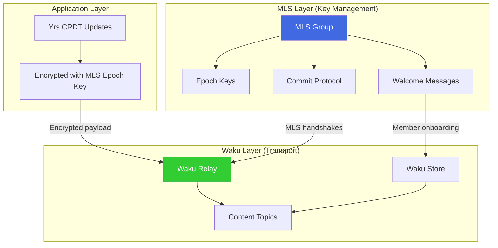

**Key Insight:** Waku provides the **transport layer**, while MLS provides the **key management layer**. They are complementary, not competing.

---

## Compatibility with obsidian-ee

### Current Architecture (v1)

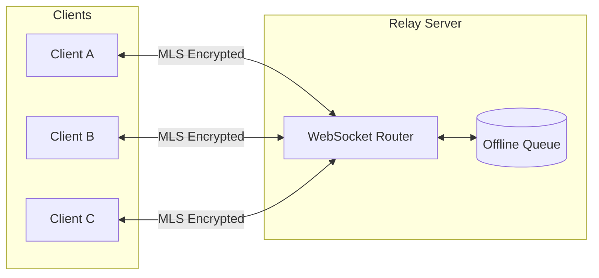

### Proposed Architecture with Waku

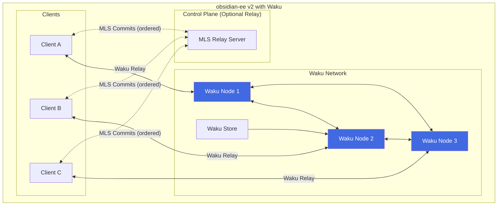

### Integration Strategy

#### Option A: Waku as Pure Data Plane

Use Waku **only for encrypted CRDT updates**, keeping MLS handshakes on a relay server.

```rust
/// Hybrid transport with Waku data plane
pub struct WakuHybridTransport {
    /// Waku for CRDT updates (unordered, best-effort)
    waku_node: WakuNode,
    /// Relay for MLS handshakes (ordered, reliable)
    mls_relay: RelayConnection,
}

#[async_trait]
impl UpdateTransport for WakuHybridTransport {
    async fn broadcast(&self, doc_id: &str, update: EncryptedOp) -> Result<()> {
        let content_topic = format!("/obsidian-ee/1/doc-{}/updates", doc_id);
        let message = WakuMessage {
            payload: update.into_bytes(),
            content_topic,
            timestamp: now(),
            ephemeral: false,  // Enable store retrieval
            ..Default::default()
        };
        self.waku_node.relay_publish(message).await
    }
}

#[async_trait]
impl ControlTransport for WakuHybridTransport {
    async fn send_handshake(&self, doc_id: &str, msg: MlsHandshake) -> Result<()> {
        // MLS commits still go through relay for ordering
        self.mls_relay.send(ControlMessage::Handshake(doc_id, msg)).await
    }
}
```

**Pros:**
- MLS epoch ordering guaranteed
- CRDT updates benefit from P2P
- Gradual migration path

**Cons:**
- Still requires relay infrastructure
- Hybrid complexity

#### Option B: Waku for Everything (Full P2P)

Route **all messages through Waku**, including MLS handshakes.

```rust
/// Full Waku transport
pub struct WakuFullTransport {
    waku_node: WakuNode,
    /// Local MLS commit ordering
    commit_buffer: CommitBuffer,
}

impl WakuFullTransport {
    async fn publish_mls_commit(&self, doc_id: &str, commit: MlsCommit) -> Result<()> {
        let content_topic = format!("/obsidian-ee/1/doc-{}/mls", doc_id);
        let message = WakuMessage {
            payload: commit.into_bytes(),
            content_topic,
            timestamp: now(),
            ephemeral: false,
            ..Default::default()
        };

        // Use store to ensure retrieval
        self.waku_node.relay_publish(message).await
    }
}
```

**Pros:**
- Fully decentralized
- No relay server required
- Maximum censorship resistance

**Cons:**
- **MLS epoch desync risk** (see [Risk Analysis](#risk-analysis))
- Requires commit buffering/reordering
- More complex recovery

#### Option C: Waku with Commit Coordinator

Use Waku for transport but implement a **lightweight commit coordinator** for MLS ordering.

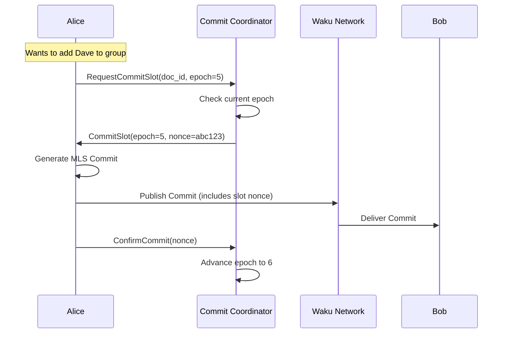

**Pros:**
- Preserves MLS ordering semantics
- Waku handles message transport
- Coordinator is lightweight (no message storage)

**Cons:**
- Coordinator is still centralized
- Extra round-trip for commits

### What Would Need to Change?

| Component | Current (v1) | With Waku | Effort |
|-----------|-------------|-----------|--------|
| `collab-relay` | WebSocket server | Waku node or hybrid | High |
| `collab-core` | WebSocket client | Waku client integration | Medium |
| `collab-cli` | Connects to relay | Connects to Waku | Medium |
| Message format | Custom protobuf | WakuMessage wrapper | Low |
| Offline sync | DynamoDB queue | Waku Store queries | Medium |
| Discovery | Relay URL | Content topics + bootstrap | Medium |

### Content Topic Design for obsidian-ee

```
Document Updates (CRDT ops):
  /obsidian-ee/1/doc-{doc_id}/updates

MLS Control Messages:
  /obsidian-ee/1/doc-{doc_id}/mls-commits
  /obsidian-ee/1/doc-{doc_id}/mls-welcomes

Presence/Awareness:
  /obsidian-ee/1/doc-{doc_id}/presence

Discovery:
  /obsidian-ee/1/invites/{invite_code}
```

---

## Pros and Cons

### Advantages for obsidian-ee

| Advantage | Description | Impact |
|-----------|-------------|--------|
| **Decentralization** | No single relay server required | High availability, censorship resistance |
| **Privacy** | Sender anonymity, minimal metadata | Aligns with E2E encryption goals |
| **Offline Support** | Waku Store for message retrieval | Mobile/unreliable networks |
| **Light Clients** | Filter/Lightpush for browsers | Better web experience |
| **Proven at Scale** | Status.im production deployment | Reduced technical risk |
| **libp2p Foundation** | Interoperable, well-maintained | Long-term viability |
| **Modular** | Use only needed protocols | Resource efficiency |

### Disadvantages for obsidian-ee

| Disadvantage | Description | Impact |
|--------------|-------------|--------|
| **MLS Ordering** | No native total ordering for commits | Critical risk |
| **Complexity** | More moving parts than relay | Development overhead |
| **Bootstrap Dependency** | Need bootstrap nodes | Operational overhead |
| **Store Reliability** | No guaranteed message retention | May miss updates |
| **Latency** | Gossip propagation delay | Real-time collaboration |
| **Topic Privacy** | Document ID visible in topics | Metadata leakage |
| **Maturity** | Waku v2 still evolving | API stability risk |

### Comparison with Alternatives

| Criteria | Waku | y-libp2p (GossipSub) | y-webrtc | Relay (v1) |
|----------|------|---------------------|----------|------------|
| **Decentralization** | High | High | Medium | Low |
| **Privacy** | High | Medium | Low | Medium |
| **MLS Compatibility** | Medium | Medium | Low | High |
| **Offline Support** | Yes (Store) | No | No | Yes (DynamoDB) |
| **Browser Support** | Yes (Filter) | Limited | Yes | Yes |
| **Operational Cost** | Low | Low | Low | Medium |
| **Complexity** | High | High | Medium | Low |

---

## Risk Analysis

### Risk Matrix

| Risk | Waku | y-webrtc | y-libp2p | Relay (v1) | Severity |
|------|------|----------|----------|------------|----------|
| MLS Epoch Desync | **High** | High | High | Low | **Critical** |
| Welcome Message Loss | **Medium** | Medium | Medium | Low | High |
| Split-Brain Groups | **Medium** | Medium | Low | Low | High |
| IP Address Leakage | **Low** | High | Medium | Medium | Medium |
| Eclipse Attacks | **Medium** | Low | Medium | N/A | High |
| Sybil Attacks | **Medium** | Low | High | N/A | High |

### Risk Details

#### MLS Epoch Desync (High Risk)

**How Waku affects this:**

Waku Relay uses GossipSub, which provides **probabilistic delivery** with **no ordering guarantees**. MLS commits sent through Waku may arrive:
- Out of order at different peers
- After subsequent commits
- Not at all (in network partitions)

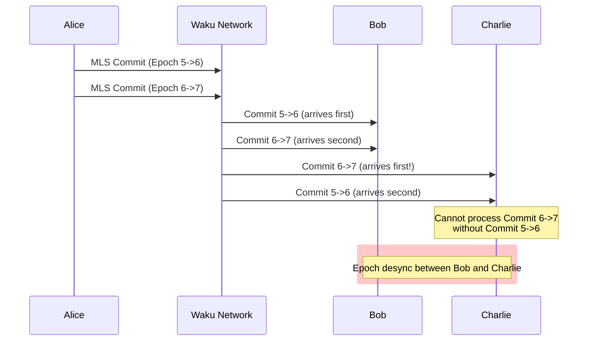

**Mitigations:**

1. **Commit Buffering**: Buffer out-of-order commits locally
2. **Waku Store Retrieval**: Query Store for missed commits
3. **Hybrid Architecture**: Use relay for commits only
4. **Vector Clocks**: Attach causal metadata to commits

#### Welcome Message Loss (Medium Risk)

**How Waku affects this:**

New members need Welcome messages to join the MLS group. If a Welcome is:
- Never stored (ephemeral flag set)
- Pruned from Store before retrieval
- Published when new member is offline

The member cannot decrypt any group messages.

**Mitigations:**

1. **Non-ephemeral Welcomes**: Always set `ephemeral: false`
2. **Longer Retention**: Configure Store for extended Welcome retention
3. **Welcome Retry**: Sender republishes on join failure
4. **Backup Channel**: Secondary delivery via relay

#### IP Address Leakage (Low Risk)

**How Waku mitigates this:**

Unlike direct WebRTC, Waku provides significant IP protection:

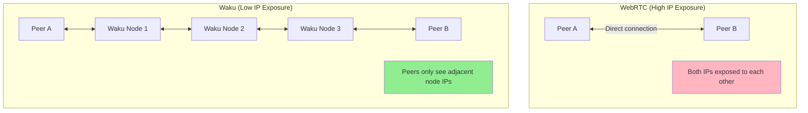

**Waku Privacy Features:**
- No direct peer connections
- Messages relayed through multiple hops
- Content topics provide some anonymity set
- Optional: Tor transport via libp2p

**Residual Risks:**
- Store nodes see client IPs during queries
- Filter nodes see subscribed topics
- Bootstrap nodes see joining peers

#### Eclipse Attacks (Medium Risk)

**How Waku affects this:**

An attacker controlling multiple Waku nodes could attempt to eclipse a target by:
- Controlling all their GossipSub mesh peers
- Dominating their DHT routing table
- Controlling their bootstrap connections

**Waku Defenses:**
- GossipSub peer scoring penalizes malicious behavior
- Mesh fanout limits single-peer influence
- Multiple bootstrap nodes recommended

**obsidian-ee Mitigations:**
- Operate trusted bootstrap nodes
- Monitor mesh diversity
- Fallback to relay for critical messages

#### Sybil Attacks (Medium Risk)

**How Waku affects this:**

Waku networks are open by default, allowing Sybil attacks on:
- GossipSub mesh (flood with fake peers)
- DHT routing (pollute with fake records)
- Content topics (spam with fake messages)

**Waku Defenses:**
- Peer scoring reduces Sybil influence
- Rate limiting per peer
- Content validation before relay

**obsidian-ee Mitigations:**
- Closed content topics (require MLS membership to decrypt)
- Invite-only document groups
- Message authentication via MLS

### Risk Mitigation Summary

| Risk | Primary Mitigation | Secondary Mitigation |
|------|-------------------|---------------------|
| Epoch Desync | Hybrid architecture (relay for commits) | Commit buffering + Store retrieval |
| Welcome Loss | Non-ephemeral messages | Retry mechanism |
| IP Leakage | Default Waku behavior | Tor transport option |
| Eclipse | Multiple bootstrap nodes | Mesh diversity monitoring |
| Sybil | Closed content topics | MLS authentication |

---

## Recommendation

### Summary Decision Matrix

| Factor | Weight | Waku Score | Notes |
|--------|--------|------------|-------|
| Decentralization | High | 9/10 | Excellent P2P architecture |
| Privacy | High | 8/10 | Strong metadata protection |
| MLS Compatibility | Critical | 5/10 | Requires significant work |
| Offline Support | High | 8/10 | Store protocol addresses this |
| Browser Support | Medium | 7/10 | Filter/Lightpush work |
| Operational Cost | Medium | 8/10 | No servers required |
| Development Effort | High | 4/10 | Substantial integration work |
| Risk Profile | Critical | 5/10 | Epoch desync is concerning |

### Recommendation: Conditional Adoption

**Verdict: Adopt Waku for v2 with Hybrid Architecture**

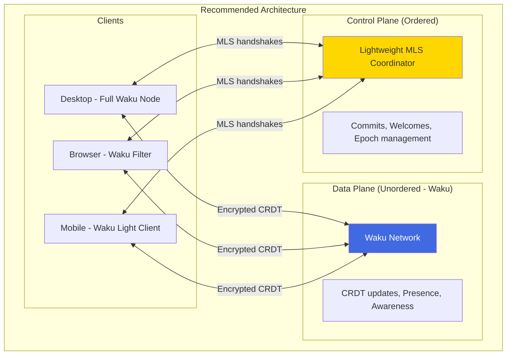

### Rationale

1. **Waku excels at what CRDTs need**: Best-effort, unordered delivery of encrypted updates is exactly what Waku provides.

2. **MLS requires ordering**: The fundamental tension is that MLS commits must be ordered, which Waku cannot guarantee. A lightweight coordinator solves this.

3. **Privacy benefits are significant**: Waku's metadata protection aligns with obsidian-ee's E2E encryption philosophy.

4. **Operational simplicity**: Eliminating DynamoDB and reducing relay server load reduces costs.

5. **Future-proof**: Waku is actively developed with strong backing (Status.im, Ethereum ecosystem).

### Implementation Phases

| Phase | Scope | Duration |
|-------|-------|----------|
| **Phase 1** | Waku integration for CRDT updates only | 4-6 weeks |
| **Phase 2** | Light client support (Filter/Lightpush) | 2-4 weeks |
| **Phase 3** | MLS coordinator simplification | 2-4 weeks |
| **Phase 4** | Full P2P option (experimental) | 4-8 weeks |

### Prerequisites

1. **Rust Waku bindings**: Use `waku-rs` or nwaku via FFI
2. **Content topic design**: Finalize topic hierarchy
3. **Store node deployment**: Self-hosted or community nodes
4. **Bootstrap node setup**: At least 3 geographically distributed

### Alternatives Considered

| Alternative | Reason Not Chosen |
|-------------|------------------|
| **Pure relay (stay on v1)** | Centralization, single point of failure |
| **Pure y-webrtc** | IP exposure, limited scalability |
| **Pure y-libp2p** | Same MLS ordering issues, less privacy |
| **Matrix protocol** | Server-heavy, different threat model |
| **Nostr** | Relay-dependent, simpler encryption |

---

## References

### Waku Documentation

- [Waku v2 Specification](https://rfc.vac.dev/waku/standards/core/)
- [Waku Relay (RFC 11)](https://rfc.vac.dev/waku/standards/core/11/relay/)
- [Waku Store (RFC 13)](https://rfc.vac.dev/waku/standards/core/13/store/)
- [Waku Filter (RFC 12)](https://rfc.vac.dev/waku/standards/core/12/filter/)
- [Waku Lightpush (RFC 19)](https://rfc.vac.dev/waku/standards/core/19/lightpush/)

### Implementation Resources

- [nwaku (Nim implementation)](https://github.com/waku-org/nwaku)
- [go-waku (Go implementation)](https://github.com/waku-org/go-waku)
- [js-waku (JavaScript/TypeScript)](https://github.com/waku-org/js-waku)
- [waku-rs (Rust bindings)](https://github.com/AchalaSB/waku-rust-bindings)

### Related Standards

- [libp2p GossipSub](https://github.com/libp2p/specs/tree/master/pubsub/gossipsub)
- [MLS RFC 9420](https://datatracker.ietf.org/doc/rfc9420/)
- [ECIES Encryption](https://en.wikipedia.org/wiki/Integrated_Encryption_Scheme)

### obsidian-ee Documentation

- [P2P Architecture Analysis](./p2p-architecture.md)
- [MLS Epoch Desync Risk](./sota/mls-epoch-desync.md)
- [IP Address Leakage Risk](./sota/ip-address-leakage.md)
- [Security Threat Analysis](./sota/README.md)

### Academic Papers

- Danezis, G., & Diaz, C. (2008). "A Survey of Anonymous Communication Channels."
- Corrigan-Gibbs, H., & Ford, B. (2010). "Dissent: Accountable Anonymous Group Messaging."
- Vuvuzela (2015). "Scalable Private Messaging Resistant to Traffic Analysis."
